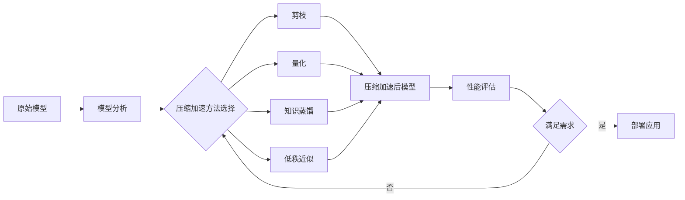

# 模型压缩与加速原理与代码实战案例讲解

## 1. 背景介绍

### 1.1 深度学习模型面临的挑战
深度学习模型在各个领域取得了巨大的成功,如计算机视觉、自然语言处理等。但是,随着模型规模和复杂度的不断增加,深度学习模型面临着计算资源消耗大、推理速度慢等问题,这限制了它们在资源受限的场景下(如移动设备、嵌入式系统)的应用。

### 1.2 模型压缩与加速的意义
模型压缩与加速技术旨在在保持模型性能的同时,降低模型的计算复杂度和存储开销,加快推理速度。这使得大型复杂模型能够部署到资源受限的环境中,极大拓展了深度学习的应用范围。同时,模型压缩与加速也能降低能耗,更环保。

### 1.3 本文的主要内容
本文将系统介绍模型压缩与加速的主流方法,包括剪枝、量化、知识蒸馏、低秩近似等,阐述它们的基本原理、数学模型、实现细节。并通过代码实战案例,演示如何使用这些技术对实际的深度学习模型进行压缩加速。最后,展望模型压缩与加速技术的未来发展趋势与面临的挑战。

## 2. 核心概念与联系

### 2.1 模型压缩的核心概念
- 参数稀疏化:通过剪枝等方法移除冗余和不重要的模型参数,使参数变得稀疏。
- 低精度表示:将模型参数和中间激活从高精度浮点数转换为低精度格式如INT8,减少存储和计算量。
- 紧凑的模型结构:设计更加简洁高效的网络架构,用更少的参数和计算量达到同等性能。

### 2.2 模型加速的核心概念 
- 计算复杂度:衡量模型计算量的指标,与模型层数、特征图尺寸等因素相关。
- 推理延迟:模型处理一个输入样本所需的时间,取决于计算复杂度和硬件效率。
- 内存带宽:数据在内存和处理器间传输的速率,访存是推理延迟的主要瓶颈之一。

### 2.3 压缩和加速技术之间的联系
模型压缩和加速并不是割裂的,很多压缩技术如剪枝、量化不仅能减小模型体积,也能降低计算量提升速度。而一些加速方法如低秩近似也能通过参数分解实现模型压缩。因此将二者有机结合,协同设计,才能达到最佳的压缩加速效果。

### 2.4 压缩加速流程概览
下图展示了模型压缩加速的一般流程:


## 3. 核心算法原理具体操作步骤

### 3.1 剪枝 Pruning
剪枝通过移除冗余和不重要的模型参数、神经元或通道,在减小模型体积的同时降低计算复杂度。根据粒度可分为非结构化和结构化剪枝。

#### 3.1.1 非结构化剪枝
非结构化剪枝以单个参数为粒度,移除绝对值小于阈值的权重:
1. 训练原始模型到收敛
2. 计算每个权重的重要性评分(如绝对值大小、一阶导数等) 
3. 根据评分和剪枝率设定阈值,将小于阈值的权重置零
4. 微调剪枝后的稀疏模型
5. 重复步骤3-4直到达到预设的稀疏度

#### 3.1.2 结构化剪枝
结构化剪枝以神经元、通道为单位进行剪枝,能达到规整的稀疏模式:
1. 训练原始模型
2. 评估每个神经元/通道的重要性(如L1范数、基于熵的评分等)
3. 根据评分移除不重要的神经元/通道,并调整相邻层的连接
4. 微调剪枝后模型
5. 迭代步骤2-4至满足要求

### 3.2 量化 Quantization 
量化将模型权重和激活从 FP32 格式转换为低精度的定点数如 INT8,显著降低存储和计算开销。

#### 3.2.1 后训练量化 PTQ
1. 训练原始 FP32 模型
2. 统计激活的数值范围,确定量化比例因子
3. 利用比例因子将权重和激活量化到低精度
4. 调整计算图,用定点运算替代浮点
5. 评估量化后模型性能,必要时调整超参数

#### 3.2.2 量化感知训练 QAT
1. 构建支持仿真量化操作的训练图
2. 初始化量化比例因子
3. 在前向传播时,对权重和激活应用伪量化操作
4. 反向传播时,利用 STE 估计梯度
5. 梯度下降更新原始 FP32 权重
6. 重复步骤3-5,jointly训练权重参数和量化比例因子
7. 训练完成后,导出为真实的低精度模型

### 3.3 知识蒸馏 Knowledge Distillation
知识蒸馏利用大型教师模型的知识来指导小型学生模型的训练,使其达到与教师模型相近的性能。

1. 训练一个大型复杂的教师模型
2. 利用教师模型对训练集做推理,得到软目标
3. 构建小型学生模型
4. 学生模型在训练集上计算输出,并与教师模型软目标做 KL 散度
5. 反向传播,最小化学生模型输出与软目标间的 KL 散度,从而将知识从教师蒸馏到学生
6. 评估学生模型性能

### 3.4 低秩近似 Low-rank Approximation
低秩近似通过矩阵或张量分解,将复杂的权重矩阵近似为若干个低秩矩阵的乘积,减小参数量和计算量。

1. 对预训练模型的权重矩阵做 SVD 分解: $W=USV^T$
2. 取前 r 个奇异值对应的左右奇异向量,得到秩 r 的近似: $W \approx U_rS_rV_r^T$
3. 用 $U_r$, $S_rV_r^T$ 两个低秩矩阵替换原始的权重矩阵
4. 微调低秩近似后的模型
5. 评估模型性能,必要时调整秩 r 的选择

## 4. 数学模型和公式详细讲解举例说明

### 4.1 剪枝

#### 4.1.1 L1 范数剪枝
L1 范数是非结构化剪枝常用的评价指标,对于第 $l$ 层第 $i$ 个神经元的权重 $w^{(l)}_i$,其 L1 范数为:

$$L_1(w^{(l)}_i) = \sum_j |w^{(l)}_{ij}|$$

L1 范数越小,说明权重向量越稀疏,该神经元的重要性越低,越应当被剪枝。

#### 4.1.2 基于熵的通道剪枝
对于卷积网络,设第 $l$ 层某个卷积核的输出特征图为 $a^{(l)}_i$,定义其重要性为输出激活的熵:

$$H(a^{(l)}_i) = -\sum_j p(a^{(l)}_{ij}) \log p(a^{(l)}_{ij})$$

其中 $p(a^{(l)}_{ij})$ 是 $a^{(l)}_i$ 的值的概率分布。直观地,熵越小,特征图包含的信息越少,对应通道的重要性越低。

### 4.2 量化

#### 4.2.1 均匀量化
设定数值范围为 $[x_{min}, x_{max}]$,量化级别为 $2^b$,均匀量化将该范围等分为 $2^b$ 个区间。量化比例因子 $s$ 和零点 $z$ 为:

$$s = \frac{x_{max} - x_{min}}{2^b - 1}, \quad z = \text{round}(\frac{-x_{min}}{s})$$

量化后的低精度值 $x_q$ 与原始值 $x$ 的关系为:

$$x_q = \text{round}(\frac{x}{s}) + z$$

#### 4.2.2 对数量化
对数量化对数值取对数后再做均匀量化,量化后值 $x_q$ 与原始值 $x$ 的关系为:

$$x_q = \text{round}(\frac{\log x - \log x_{min}}{\log s}) + z$$

其中比例因子 $s$ 和零点 $z$ 的计算与均匀量化类似,只是将 $x$ 替换为 $\log x$。对数量化能更好地保留小数值的精度。

### 4.3 知识蒸馏

设教师模型和学生模型在某个样本 $x$ 上的输出 logits 分别为 $t$ 和 $s$,知识蒸馏的目标是最小化二者的 KL 散度:

$$\mathcal{L}_{KD} = \sum_x \text{KL}(\sigma(\frac{t}{\tau}), \sigma(\frac{s}{\tau}))$$

其中 $\sigma$ 是 softmax 函数,$\tau$ 是温度超参数,控制软化程度。这使得学生模型不仅学习教师的硬分类标签,也学习软目标背后的知识。

### 4.4 低秩近似

对于权重矩阵 $W \in \mathbb{R}^{m \times n}$,其截断 SVD 分解为:

$$W \approx U_rS_rV_r^T$$

其中 $U_r \in \mathbb{R}^{m \times r}, S_r \in \mathbb{R}^{r \times r}, V_r \in \mathbb{R}^{n \times r}$,秩 $r \ll \min(m,n)$。原始矩阵用 $U_r$ 和 $S_rV_r^T$ 两个低秩矩阵替代,参数量从 $mn$ 降为 $(m+n)r$。

## 5. 项目实践:代码实例和详细解释说明

下面以 PyTorch 为例,展示几种压缩加速技术的代码实现。

### 5.1 非结构化剪枝示例

```python
import torch
import torch.nn as nn

# 定义简单的三层全连接网络
class MLP(nn.Module):
    def __init__(self):
        super().__init__()
        self.fc1 = nn.Linear(784, 256) 
        self.fc2 = nn.Linear(256, 64)
        self.fc3 = nn.Linear(64, 10)
        
    def forward(self, x):
        x = torch.relu(self.fc1(x))
        x = torch.relu(self.fc2(x))
        x = self.fc3(x)
        return x

# 初始化模型    
model = MLP()

# 设定剪枝比例
pruning_perc = 0.75

# 根据权重绝对值大小剪枝
def prune_weights(model, pruning_perc):
    for name, module in model.named_modules():
        if isinstance(module, torch.nn.Linear):
            weights = module.weight.data.abs().clone()
            cutoff_score = torch.kthvalue(weights.flatten(), int(weights.numel() * pruning_perc))[0] 
            module.weight.data[weights < cutoff_score] = 0

# 对模型进行剪枝            
prune_weights(model, pruning_perc)

# 计算剪枝后模型的稀疏度
def sparsity(model): 
    total_zeros = 0
    total_params = 0
    for name, weight in model.state_dict().items():
        total_zeros += (weight == 0).sum().item()
        total_params += weight.numel()
    return total_zeros / total_params

print(f'Sparsity after pruning: {sparsity(model):.3f}')
```

这个例子展示了如何对一个简单的三层MLP模型进行非结构化剪枝。首先根据预设的剪枝比例对模型的权重矩阵进行剪枝,将小于给定阈值的权重置零。然后计算剪枝后模型的稀