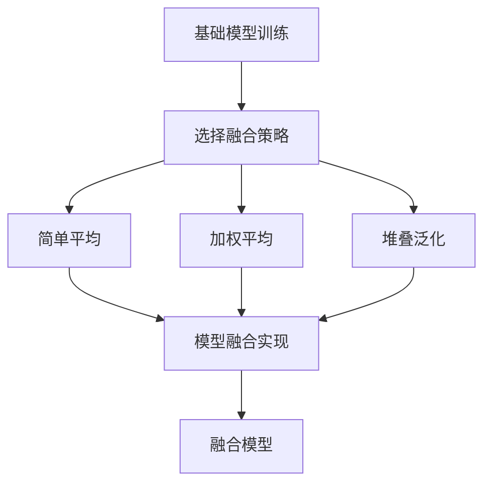

# 模型融合实战案例：自然语言推理

## 1.背景介绍

### 1.1 自然语言处理的重要性

在当今的数字时代,自然语言处理(Natural Language Processing,NLP)已经成为人工智能领域中最重要和最具挑战性的研究方向之一。它旨在使计算机能够理解和生成人类语言,从而实现人机自然交互。随着大数据和计算能力的不断提高,NLP技术已广泛应用于机器翻译、智能问答、情感分析、文本摘要等诸多领域,极大地提高了人类的工作效率。

### 1.2 自然语言推理的重要性

自然语言推理(Natural Language Inference,NLI)是NLP的一个核心任务,旨在判断一个前提(premise)和一个假设(hypothesis)之间的逻辑关系。它是实现自然语言理解的关键,对于构建智能对话系统、自动问答系统等具有重要意义。

### 1.3 模型融合的必要性

尽管深度学习模型在NLP任务中取得了巨大成功,但单一模型的性能往往会受到数据分布、任务类型等因素的限制。为了提高模型的泛化能力和鲁棒性,模型融合(Model Ensemble)技术应运而生。它通过将多个模型的预测结果进行集成,从而获得比单一模型更优的性能表现。

## 2.核心概念与联系  

### 2.1 自然语言推理任务

自然语言推理旨在判断一个前提(premise)和一个假设(hypothesis)之间的逻辑关系,通常分为三种情况:

- Entailment(蕴含): 前提可以蕴含假设
- Contradiction(矛盾): 前提和假设矛盾
- Neutral(中性): 前提和假设之间没有足够的信息判断它们是否相关

例如:

- 前提: 一只狗在追逐一只猫。
    - 假设1: 有一只动物在追逐另一只动物。(Entailment)  
    - 假设2: 一只猫在追逐一只狗。(Contradiction)
    - 假设3: 一只鸟在飞。(Neutral)

### 2.2 模型融合概念

模型融合是将多个基础模型的预测结果进行集成,以获得比单一模型更优的性能表现。常见的模型融合方法包括:

- 简单平均(Simple Averaging)
- 加权平均(Weighted Averaging) 
- 堆叠泛化(Stacking)
- Boosting集成

其中,加权平均和堆叠泛化通常可以获得更好的效果。

### 2.3 模型融合在NLI中的应用

由于单一模型在NLI任务中存在一定的局限性,因此将多个模型进行融合可以提高模型的泛化能力和鲁棒性。例如,一些模型可能擅长处理简单的语义推理,而另一些模型可能更擅长处理复杂的逻辑推理。将这些模型进行融合,可以充分利用各个模型的优势,从而获得更好的性能表现。

## 3.核心算法原理具体操作步骤

在自然语言推理任务中,模型融合的核心算法原理和具体操作步骤如下:

### 3.1 基础模型训练

首先,我们需要训练多个基础模型,这些模型可以是不同的模型架构(如BERT、RoBERTa、XLNet等),也可以是相同架构但使用不同的预训练数据或超参数。每个基础模型都会在NLI数据集上进行fine-tuning,以获得对应的预测结果。

### 3.2 模型融合策略选择

接下来,我们需要选择合适的模型融合策略,常见的策略包括:

1. **简单平均(Simple Averaging)**: 对所有基础模型的预测结果进行平均。
2. **加权平均(Weighted Averaging)**: 为每个基础模型分配不同的权重,然后对加权后的预测结果进行平均。权重可以根据模型在验证集上的表现来确定。
3. **堆叠泛化(Stacking)**: 将基础模型的预测结果作为新的特征,输入到一个元模型(meta-model)中进行训练,元模型的预测结果即为最终的融合结果。

不同的融合策略适用于不同的场景,需要根据具体任务和数据集进行选择和调优。

### 3.3 模型融合实现

根据选择的融合策略,我们可以实现相应的模型融合算法。以加权平均为例,具体步骤如下:

1. 在验证集上评估每个基础模型的性能,计算相应的评估指标(如准确率、F1分数等)。
2. 根据评估指标,为每个基础模型分配一个权重。权重可以是简单的线性函数,也可以是更复杂的非线性函数。
3. 对每个样本,将基础模型的预测结果乘以相应的权重,然后求和并归一化,得到最终的融合预测结果。

此外,我们还需要处理一些实践中的细节问题,如如何处理基础模型的不确定性、如何避免过拟合等。

### 3.4 算法流程图

下面是模型融合算法的流程图:



## 4.数学模型和公式详细讲解举例说明

在模型融合过程中,我们需要使用一些数学模型和公式来量化基础模型的预测结果,并根据一定的规则对它们进行融合。下面将详细讲解一些常用的数学模型和公式。

### 4.1 加权平均公式

加权平均是一种常用的模型融合策略,它为每个基础模型分配不同的权重,然后对加权后的预测结果进行平均。具体公式如下:

$$\hat{y} = \sum_{i=1}^{N}w_i \cdot f_i(x)$$

其中:
- $\hat{y}$是融合后的预测结果
- $N$是基础模型的数量
- $w_i$是第$i$个基础模型的权重,满足$\sum_{i=1}^{N}w_i=1$
- $f_i(x)$是第$i$个基础模型对输入$x$的预测结果

权重$w_i$可以根据基础模型在验证集上的表现来确定,例如准确率或F1分数。一种常见的做法是将评估指标归一化,然后作为权重。

### 4.2 Logistic回归融合

除了简单的加权平均,我们还可以使用更复杂的模型来融合基础模型的预测结果,例如Logistic回归。在二分类问题中,Logistic回归模型可以表示为:

$$P(y=1|x) = \sigma\left(\sum_{i=1}^{N}w_i \cdot f_i(x) + b\right)$$

其中:
- $y$是二元标签(0或1)
- $x$是输入特征
- $f_i(x)$是第$i$个基础模型对$x$的预测结果
- $w_i$是第$i$个基础模型的权重
- $b$是偏置项
- $\sigma(z) = \frac{1}{1+e^{-z}}$是Sigmoid函数

在训练过程中,我们可以通过最小化负对数似然损失函数来学习权重$w_i$和偏置$b$:

$$\mathcal{L}(w,b) = -\frac{1}{m}\sum_{j=1}^{m}\left[y^{(j)}\log P(y=1|x^{(j)}) + (1-y^{(j)})\log(1-P(y=1|x^{(j)}))\right]$$

其中$m$是训练样本的数量。

通过Logistic回归融合,我们可以自动学习每个基础模型的权重,而不需要人工指定。这种方法往往可以获得比简单加权平均更好的性能。

### 4.3 示例说明

假设我们有三个基础模型$f_1(x)$、$f_2(x)$和$f_3(x)$,它们在验证集上的准确率分别为0.75、0.80和0.72。我们可以将准确率归一化,作为加权平均的权重:

$$w_1 = \frac{0.75}{0.75+0.80+0.72} \approx 0.32$$
$$w_2 = \frac{0.80}{0.75+0.80+0.72} \approx 0.35$$
$$w_3 = \frac{0.72}{0.75+0.80+0.72} \approx 0.31$$

对于一个新的输入样本$x$,融合后的预测结果为:

$$\hat{y} = 0.32 \cdot f_1(x) + 0.35 \cdot f_2(x) + 0.31 \cdot f_3(x)$$

如果我们使用Logistic回归融合,则需要在训练数据上学习权重$w_i$和偏置$b$,以最小化负对数似然损失函数。

通过合理的数学模型和公式,我们可以有效地融合多个基础模型的预测结果,从而获得比单一模型更优的性能表现。

## 5.项目实践:代码实例和详细解释说明

为了更好地理解模型融合在自然语言推理任务中的应用,我们将通过一个实际的代码示例来说明。在这个示例中,我们将使用PyTorch框架,并基于BERT模型进行实现。

### 5.1 数据准备

首先,我们需要准备NLI数据集,这里我们使用广为人知的SNLI(Stanford Natural Language Inference)数据集。SNLI数据集包含570K个带标签的前提-假设对,标签分为entailment、contradiction和neutral三类。

我们将数据集划分为训练集、验证集和测试集,并使用PyTorch的`DataLoader`来方便地加载和预处理数据。

```python
from datasets import load_dataset

# 加载SNLI数据集
dataset = load_dataset("snli")

# 划分数据集
train_dataset = dataset["train"]
val_dataset = dataset["validation"]
test_dataset = dataset["test"]
```

### 5.2 基础模型训练

接下来,我们将训练三个基础模型,分别是BERT、RoBERTa和XLNet。我们使用PyTorch的`Trainer`API来简化训练过程。

```python
from transformers import AutoTokenizer, AutoModelForSequenceClassification, Trainer, TrainingArguments

# 定义模型和tokenizer
model_names = ["bert-base-uncased", "roberta-base", "xlnet-base-cased"]
models = []
tokenizers = []
for name in model_names:
    tokenizer = AutoTokenizer.from_pretrained(name)
    model = AutoModelForSequenceClassification.from_pretrained(name, num_labels=3)
    models.append(model)
    tokenizers.append(tokenizer)

# 训练模型
for i, (model, tokenizer) in enumerate(zip(models, tokenizers)):
    training_args = TrainingArguments(output_dir=f"model_{i}", num_train_epochs=3, per_device_train_batch_size=16)
    trainer = Trainer(model=model, args=training_args, tokenizer=tokenizer, train_dataset=train_dataset, eval_dataset=val_dataset)
    trainer.train()
```

在训练过程中,我们将模型在验证集上的性能作为基准,用于后续的模型融合。

### 5.3 模型融合实现

完成基础模型的训练后,我们将实现加权平均和Logistic回归两种模型融合策略。

#### 5.3.1 加权平均融合

```python
import torch
from tqdm import tqdm

# 在验证集上评估基础模型的性能
val_metrics = []
for i, (model, tokenizer) in enumerate(zip(models, tokenizers)):
    trainer = Trainer(model=model, tokenizer=tokenizer, eval_dataset=val_dataset)
    val_metrics.append(trainer.evaluate()["eval_accuracy"])

# 计算加权平均权重
weights = [val_metric / sum(val_metrics) for val_metric in val_metrics]

# 模型融合预测
preds = []
for batch in tqdm(test_dataset):
    inputs = tokenizer(batch["premise"], batch["hypothesis"], return_tensors="pt", padding=True, truncation=True)
    logits = [model(**inputs).logits for model in models]
    logits = torch.stack(logits, dim=0)
    weighted_logits = (logits * torch.tensor(weights).unsqueeze(-1).unsqueeze(-1)).sum(dim=0)
    preds.extend(weighted_logits.argmax(dim=-1).tolist())
```

在上述代码中,我们首先在验证集上评估每个基础模型的准确率,然后根据准确率计算加权平均的权重。接下来,我们对测试集进行预测,将每个基础模型的预测结果乘以相应的权重,然后求和并归一化