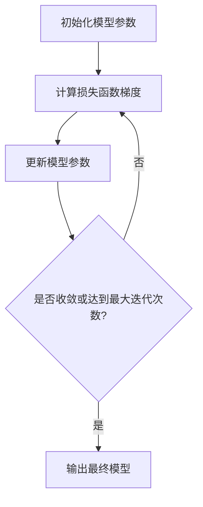
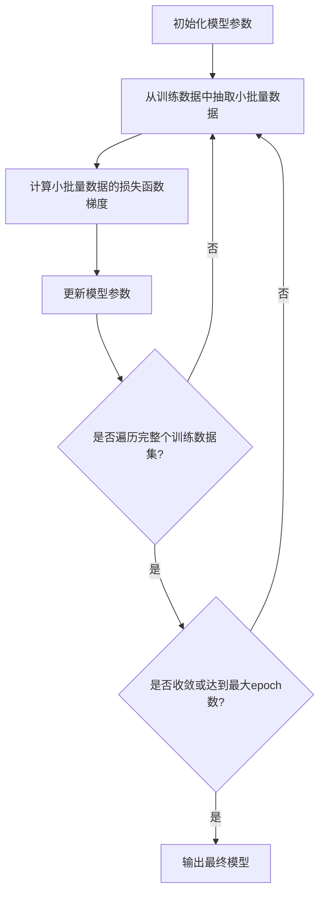
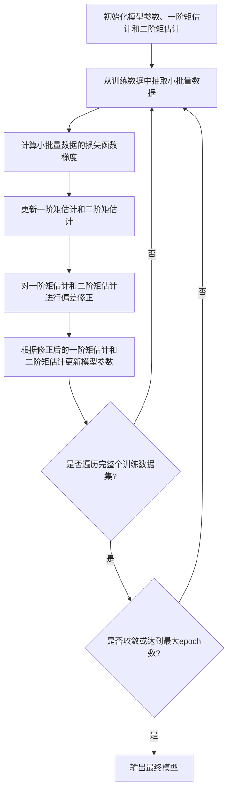

# 模型训练的艺术：探索AI的无限可能

## 1.背景介绍

在当今时代,人工智能(AI)已经渗透到我们生活的方方面面。从语音助手到自动驾驶汽车,从医疗诊断到金融分析,AI无处不在。然而,AI系统的核心是机器学习模型,而模型训练则是确保这些模型表现出卓越性能的关键。

模型训练是一个复杂的过程,需要精心设计和优化。它涉及选择合适的算法、调整超参数、处理大量数据,并在模型性能和训练时间之间寻求平衡。本文将探讨模型训练的艺术,揭示其背后的原理和最佳实践,帮助读者掌握训练高性能AI模型的技巧。

### 1.1 AI模型的重要性

AI模型是驱动现代智能系统的核心引擎。它们能够从大量数据中学习模式和规律,并对新数据做出智能预测和决策。无论是计算机视觉、自然语言处理还是推荐系统,高质量的AI模型都扮演着至关重要的角色。

### 1.2 训练挑战

尽管AI模型的潜力巨大,但训练出高性能模型并非易事。以下是一些常见的挑战:

- **数据质量**:训练数据的质量直接影响模型的性能。噪声数据、不平衡数据和缺失数据都可能导致模型偏差。
- **计算资源**:训练复杂的深度学习模型需要大量的计算资源,包括GPU、TPU等专用硬件。
- **超参数调优**:寻找最佳超参数组合(如学习率、正则化强度等)是一个耗时的试错过程。
- **过拟合与欠拟合**:避免模型过度拟合训练数据或欠拟合是一个棘手的问题。
- **可解释性**:许多AI模型被视为"黑箱",缺乏可解释性,这可能会阻碍它们在一些关键领域的应用。

通过掌握模型训练的艺术,我们可以有效应对这些挑战,提高模型的性能和可靠性。

## 2.核心概念与联系

在深入探讨模型训练的细节之前,让我们先了解一些核心概念及它们之间的联系。

### 2.1 机器学习范式

机器学习可分为三大范式:监督学习、无监督学习和强化学习。

- **监督学习**:从标记数据中学习,例如图像分类和语音识别。
- **无监督学习**:从未标记数据中发现隐藏模式,例如聚类和降维。
- **强化学习**:通过与环境交互并获得反馈来学习,例如游戏AI和机器人控制。

不同的学习范式需要不同的训练策略和算法。本文将重点关注监督学习,因为它是当前最广泛应用的范式。

### 2.2 损失函数

损失函数是衡量模型预测与真实标签之间差异的指标。它在训练过程中起着至关重要的作用,因为优化算法的目标就是最小化损失函数。常见的损失函数包括均方误差(MSE)、交叉熵损失等。

### 2.3 优化算法

优化算法是调整模型参数以最小化损失函数的过程。传统的优化算法包括梯度下降法、牛顿法等。而对于深度学习模型,常用的优化算法有随机梯度下降(SGD)、Adam、RMSProp等。

### 2.4 正则化

正则化是一种防止过拟合的技术,它通过在损失函数中引入惩罚项来限制模型复杂度。常见的正则化方法包括L1/L2正则化、dropout、早停等。

### 2.5 模型评估

模型评估是衡量模型性能的关键步骤。常用的评估指标包括准确率、精确率、召回率、F1分数等。另外,交叉验证和holdout验证集也是评估模型泛化能力的重要手段。

### 2.6 迁移学习

迁移学习是一种利用在源领域学习到的知识来帮助目标领域的学习的技术。它可以显著减少训练时间和数据需求,在计算机视觉、自然语言处理等领域得到了广泛应用。

以上概念相互关联,共同构建了模型训练的理论基础。掌握这些概念有助于我们更好地理解和优化训练过程。

## 3.核心算法原理具体操作步骤

在上一节中,我们介绍了一些核心概念。现在,让我们深入探讨一些广泛使用的训练算法的原理和具体操作步骤。

### 3.1 梯度下降法

梯度下降法是一种基于梯度信息更新模型参数的优化算法。它的基本思想是沿着梯度的反方向移动,以最小化损失函数。

梯度下降法的具体操作步骤如下:

1. 初始化模型参数。
2. 计算损失函数相对于模型参数的梯度。
3. 根据梯度和学习率更新模型参数:

$$
\theta_{t+1} = \theta_t - \eta \nabla_\theta J(\theta_t)
$$

其中,$\theta$表示模型参数,$J(\theta)$是损失函数,$\eta$是学习率。

4. 重复步骤2和3,直到收敛或达到最大迭代次数。

梯度下降法虽然简单有效,但对于大规模数据集可能收敛速度较慢。为了加快收敛,我们可以使用一些变体算法,如随机梯度下降(SGD)、动量SGD和Adam优化器。



### 3.2 随机梯度下降(SGD)

SGD是梯度下降法的一种变体,它在每次迭代中只使用一个或一小批数据样本来计算梯度和更新参数。这种方法可以加快收敛速度,并且对于大型数据集更加高效。

SGD的具体操作步骤如下:

1. 初始化模型参数。
2. 从训练数据中随机抽取一个小批量数据。
3. 计算小批量数据的损失函数梯度。
4. 根据梯度和学习率更新模型参数:

$$
\theta_{t+1} = \theta_t - \eta \nabla_\theta J(\theta_t; x^{(i:i+n)})
$$

其中,$x^{(i:i+n)}$表示小批量数据。

5. 重复步骤2到4,直到遍历完整个训练数据集(称为一个epoch)。
6. 重复步骤5,直到收敛或达到最大epoch数。

SGD通常需要一些技巧来确保收敛,例如学习率衰减、动量等。此外,小批量大小的选择也是一个需要权衡的问题,太小可能导致收敛慢,太大可能无法充分利用硬件加速。



### 3.3 Adam优化器

Adam是一种自适应学习率的优化算法,它结合了动量和RMSProp的优点,可以更好地处理稀疏梯度和非平稳目标函数。

Adam优化器的具体操作步骤如下:

1. 初始化模型参数,初始化一阶矩估计和二阶矩估计为0。
2. 从训练数据中随机抽取一个小批量数据。
3. 计算小批量数据的损失函数梯度。
4. 更新一阶矩估计和二阶矩估计:

$$
m_t = \beta_1 m_{t-1} + (1 - \beta_1) g_t \\
v_t = \beta_2 v_{t-1} + (1 - \beta_2) g_t^2
$$

其中,$g_t$是当前梯度,$\beta_1$和$\beta_2$是指数衰减率。

5. 对一阶矩估计和二阶矩估计进行偏差修正:

$$
\hat{m}_t = \frac{m_t}{1 - \beta_1^t} \\
\hat{v}_t = \frac{v_t}{1 - \beta_2^t}
$$

6. 根据修正后的一阶矩估计和二阶矩估计更新模型参数:

$$
\theta_{t+1} = \theta_t - \frac{\eta}{\sqrt{\hat{v}_t} + \epsilon} \hat{m}_t
$$

其中,$\eta$是学习率,$\epsilon$是一个很小的常数,用于避免除以0。

7. 重复步骤2到6,直到遍历完整个训练数据集(一个epoch)。
8. 重复步骤7,直到收敛或达到最大epoch数。

Adam优化器通常可以获得较快的收敛速度,并且对于高维或者稀疏梯度的问题表现良好。但是,它也存在一些缺陷,例如对于某些问题可能无法收敛到最优解。



以上只是介绍了几种常见的优化算法,在实际应用中,我们还可以根据具体问题选择其他算法,如L-BFGS、共轭梯度法等。同时,也可以尝试一些新兴的优化技术,如超梯度和元学习等。

## 4.数学模型和公式详细讲解举例说明

在上一节中,我们介绍了一些核心训练算法的原理和操作步骤。现在,让我们深入探讨一些常见的数学模型和公式,并通过具体示例来加深理解。

### 4.1 线性回归

线性回归是一种简单但广泛使用的监督学习算法,它试图找到一条最佳拟合直线来描述输入特征和目标变量之间的线性关系。

对于给定的输入特征$\mathbf{x} = (x_1, x_2, \dots, x_n)$和目标变量$y$,线性回归模型可以表示为:

$$
\hat{y} = \mathbf{w}^\top \mathbf{x} + b
$$

其中,$\mathbf{w}$是权重向量,$b$是偏置项。

在训练过程中,我们需要找到最优的$\mathbf{w}$和$b$,使得预测值$\hat{y}$尽可能接近真实值$y$。通常采用最小二乘法来最小化均方误差(MSE)损失函数:

$$
J(\mathbf{w}, b) = \frac{1}{2m} \sum_{i=1}^m (\hat{y}^{(i)} - y^{(i)})^2
$$

其中,$m$是训练样本数量。

我们可以使用梯度下降法或其他优化算法来最小化损失函数,从而获得最优的$\mathbf{w}$和$b$。

**示例**:假设我们有一个简单的线性回归问题,试图根据房屋面积($x$)来预测房价($y$)。给定以下训练数据:

| 房屋面积($x$) | 房价($y$) |
|----------------|------------|
| 1000           | 200        |
| 1500           | 300        |
| 2000           | 400        |
| 2500           | 500        |

我们可以使用梯度下降法来训练线性回归模型。初始化$\mathbf{w} = 0$,$b = 0$,学习率$\eta = 0.01$,迭代10次:

```python
import numpy