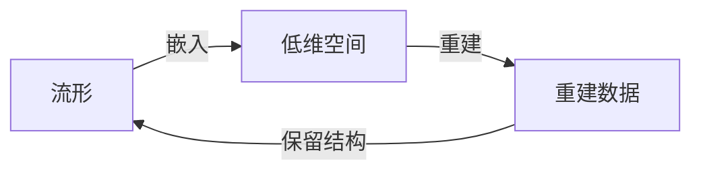

## 1.背景介绍
流形学习是一种无监督的学习技术，它试图在高维数据中找到低维结构。这种技术的灵感来源于拓扑学中的流形概念。流形是一个局部看起来像欧几里得空间的空间，例如，地球表面就是一个二维流形，因为任何一个小的区域都可以被平面近似。流形学习的目标是找到数据的这种内在结构，以便在不丢失重要信息的情况下降低数据的维数。

## 2.核心概念与联系
流形学习的主要概念包括流形、嵌入和重建。流形是数据的低维结构，嵌入是将高维数据映射到低维空间的过程，重建是在低维空间中重建数据的过程。这些概念之间的联系在于，流形学习试图找到一个嵌入，使得在低维空间中重建的数据尽可能地保留了原始数据的结构。



## 3.核心算法原理具体操作步骤
流形学习的算法主要有局部线性嵌入（Locally Linear Embedding，LLE）、等度量映射（Isomap）和拉普拉斯特征映射（Laplacian Eigenmaps）等。这些算法的主要步骤包括：

1. 构建邻域图：首先，每个数据点的邻域被确定，通常是通过计算点之间的距离来完成的。
2. 计算权重：然后，对于每个数据点，计算其邻域中的其他点的权重，以便最好地重建该点。
3. 降维：最后，使用这些权重在低维空间中重建数据。

## 4.数学模型和公式详细讲解举例说明
以LLE算法为例，其数学模型可以表示为以下优化问题：

$$
\min_{W} \sum_{i=1}^{n} \|x_i - \sum_{j=1}^{n} W_{ij}x_j\|^2
$$

其中，$x_i$是数据点，$W_{ij}$是数据点$x_j$对数据点$x_i$的权重，$n$是数据点的总数。这个优化问题的目标是找到一组权重，使得每个数据点尽可能地被其邻域中的其他点线性重建。

## 5.项目实践：代码实例和详细解释说明
下面是使用Python和scikit-learn库进行流形学习的一个简单例子。这个例子中，我们将使用LLE算法对一个简单的二维数据集进行降维。

```python
from sklearn import datasets, manifold
import matplotlib.pyplot as plt

# Load the dataset
X, y = datasets.make_circles(n_samples=1000, noise=0.05, factor=0.5)

# Apply LLE
lle = manifold.LocallyLinearEmbedding(n_neighbors=10, n_components=2)
X_lle = lle.fit_transform(X)

# Plot the results
plt.scatter(X_lle[:, 0], X_lle[:, 1], c=y)
plt.show()
```

在这个例子中，我们首先加载了一个简单的二维数据集，然后应用了LLE算法进行降维，最后将结果绘制出来。

## 6.实际应用场景
流形学习在许多领域都有应用，例如图像识别、语音识别和生物信息学等。在图像识别中，流形学习可以用于提取图像的低维特征；在语音识别中，流形学习可以用于提取语音信号的低维特征；在生物信息学中，流形学习可以用于提取基因表达数据的低维特征。

## 7.工具和资源推荐
推荐使用Python的scikit-learn库进行流形学习，它提供了多种流形学习算法，包括LLE、Isomap和Laplacian Eigenmaps等。

## 8.总结：未来发展趋势与挑战
流形学习是一个非常有潜力的研究领域，它有可能在未来的大数据和人工智能应用中发挥重要的作用。然而，流形学习也面临着一些挑战，例如如何选择合适的邻域大小、如何处理噪声数据、如何处理非线性和高维数据等。

## 9.附录：常见问题与解答
1. 问题：流形学习和主成分分析（PCA）有什么区别？
   答：流形学习和PCA都是降维技术，但它们的目标不同。PCA试图找到一个线性变换，使得变换后的数据的方差最大，而流形学习试图找到一个非线性变换，使得变换后的数据保留了原始数据的拓扑结构。

2. 问题：流形学习适用于哪些类型的数据？
   答：流形学习适用于那些在高维空间中有低维结构的数据，例如图像、语音和基因表达数据等。

3. 问题：流形学习有哪些局限性？
   答：流形学习的一个主要局限性是，它假设数据在低维空间中有一个连续的结构，这在一些情况下可能不成立。另一个局限性是，流形学习通常需要大量的计算资源。

作者：禅与计算机程序设计艺术 / Zen and the Art of Computer Programming