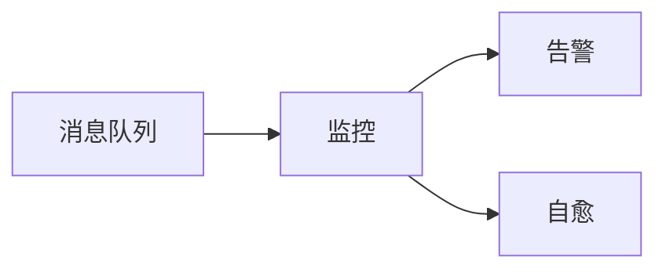

## 1.背景介绍

在现代互联网技术中，消息队列作为一种重要的异步处理方式，广泛应用于各种业务场景中，如订单处理、日志收集、数据分析等。然而，随着业务规模的不断扩大，消息队列的监控告警工作也变得越来越复杂。如何有效地进行消息队列的监控告警，并实现从监控到自愈的过程，是我们需要深入思考和探讨的问题。

## 2.核心概念与联系

在讨论消息队列监控告警的最佳实践之前，我们需要先了解一些核心的概念和联系。

- **消息队列**：消息队列是一种应用程序之间的通信方法，它允许应用程序与异步处理方式进行交互。消息队列提供了一个先进先出（FIFO）的数据结构，用于存储待处理的消息。

- **监控**：监控是指对系统的运行状态进行实时、动态的观察和检查。在消息队列中，监控主要包括队列长度、处理速度、处理失败率等指标。

- **告警**：告警是指当监控的指标超过预设的阈值时，系统会自动发送通知，以便及时发现和处理问题。

- **自愈**：自愈是指系统在发生故障时，能够自动检测并修复故障，恢复系统的正常运行。

这些概念之间的联系是，通过监控系统的运行状态，当发现问题时，可以通过告警通知相关人员，同时系统可以尝试自动修复问题，实现自愈。



## 3.核心算法原理具体操作步骤

消息队列的监控告警主要包括以下几个步骤：

1. **定义监控指标**：首先，我们需要定义消息队列的监控指标，这些指标应该能够全面反映消息队列的运行状态。常见的监控指标包括队列长度、处理速度、处理失败率等。

2. **收集监控数据**：然后，我们需要收集这些监控指标的数据。这可以通过在消息队列的生产者和消费者中添加监控代码，或者使用消息队列提供的监控接口来实现。

3. **分析监控数据**：收集到监控数据后，我们需要对数据进行分析，找出可能的问题。这通常需要使用一些数据分析工具，如时序数据库、数据可视化工具等。

4. **设置告警阈值**：在分析监控数据的基础上，我们需要设置告警阈值。当监控指标超过这些阈值时，系统会自动发送告警通知。

5. **处理告警**：收到告警通知后，我们需要及时处理，找出问题的原因，并尝试修复问题。

6. **实现自愈**：在处理告警的同时，我们还可以尝试实现系统的自愈。这可以通过添加错误处理代码，或者使用一些自愈工具来实现。


## 4.数学模型和公式详细讲解举例说明

在消息队列的监控告警中，我们通常会使用一些数学模型和公式来描述和分析系统的运行状态。这些模型和公式可以帮助我们更准确地理解和预测系统的行为。

例如，我们可以使用队列论中的M/M/1模型来描述消息队列的行为。在M/M/1模型中，我们假设到达率（λ）和服务率（μ）都是泊松过程，且有一个服务设备。

队列的平均长度（L）可以用以下公式计算：

$$L = \frac{\lambda}{\mu - \lambda}$$

队列的平均等待时间（W）可以用以下公式计算：

$$W = \frac{1}{\mu - \lambda}$$

通过这些公式，我们可以预测在不同的到达率和服务率下，队列的平均长度和平均等待时间，从而为设置告警阈值提供依据。

## 5.项目实践：代码实例和详细解释说明

在实际项目中，我们可以使用一些开源工具来实现消息队列的监控告警。例如，我们可以使用Prometheus和Grafana来收集和分析监控数据，使用Alertmanager来处理告警。

以下是一个简单的示例，展示如何使用这些工具来监控RabbitMQ消息队列：

1. **安装和配置Prometheus**：首先，我们需要安装Prometheus，并配置它来收集RabbitMQ的监控数据。这可以通过添加以下配置到`prometheus.yml`文件实现：

```yaml
scrape_configs:
  - job_name: 'rabbitmq'
    static_configs:
      - targets: ['<rabbitmq_host>:<rabbitmq_exporter_port>']
```

2. **安装和配置Grafana**：然后，我们需要安装Grafana，并配置它来展示Prometheus收集的监控数据。这可以通过在Grafana中添加Prometheus数据源，并创建相应的仪表盘来实现。

3. **安装和配置Alertmanager**：最后，我们需要安装Alertmanager，并配置它来处理告警。这可以通过添加以下配置到`alertmanager.yml`文件实现：

```yaml
route:
  group_by: ['alertname', 'job']
  group_wait: 30s
  group_interval: 5m
  repeat_interval: 12h
  receiver: 'email'
receivers:
- name: 'email'
  email_configs:
  - to: '<your_email>'
    send_resolved: true
```

通过这些步骤，我们就可以实现对RabbitMQ消息队列的监控告警。

## 6.实际应用场景

消息队列的监控告警在很多实际应用场景中都非常重要。例如：

- **电商订单处理**：在电商平台中，订单处理通常会使用消息队列来实现。通过监控消息队列，我们可以及时发现和处理订单处理的问题，如处理速度慢、处理失败等。

- **日志收集**：在大规模分布式系统中，日志收集通常会使用消息队列来实现。通过监控消息队列，我们可以及时发现和处理日志收集的问题，如日志丢失、收集延迟等。

- **数据分析**：在数据分析中，数据的处理和传输通常会使用消息队列来实现。通过监控消息队列，我们可以及时发现和处理数据处理的问题，如数据丢失、处理错误等。

## 7.工具和资源推荐

以下是一些推荐的工具和资源，可以帮助你更好地进行消息队列的监控告警：

- **Prometheus**：一个开源的监控和告警工具，可以收集和存储大量的时序数据。

- **Grafana**：一个开源的数据可视化工具，可以展示Prometheus收集的监控数据。

- **Alertmanager**：一个开源的告警处理工具，可以处理Prometheus产生的告警。

- **RabbitMQ Management Plugin**：一个RabbitMQ的插件，可以提供RabbitMQ的监控数据。

- **Kafka Manager**：一个开源的Kafka管理工具，可以提供Kafka的监控数据。

## 8.总结：未来发展趋势与挑战

随着业务规模的不断扩大，消息队列的监控告警工作将面临更多的挑战。例如，如何处理海量的监控数据，如何准确地预测和发现问题，如何实现更智能的自愈等。

同时，随着AI和机器学习技术的发展，我们有望实现更智能的监控告警。例如，我们可以使用机器学习模型来预测系统的行为，提前发现可能的问题。我们也可以使用AI技术来自动处理告警，实现更智能的自愈。

然而，这些都需要我们进行更深入的研究和探讨。

## 9.附录：常见问题与解答

1. **Q: 如何选择监控指标？**
   A: 监控指标的选择应该根据业务需求和系统特性来确定。常见的监控指标包括队列长度、处理速度、处理失败率等。

2. **Q: 如何设置告警阈值？**
   A: 告警阈值的设置应该根据业务需求和系统容忍度来确定。一般来说，我们应该尽量避免过于频繁的告警，同时也要确保能够及时发现和处理问题。

3. **Q: 如何实现自愈？**
   A: 自愈的实现需要结合系统的特性和错误处理机制。一般来说，我们可以通过添加错误处理代码，或者使用一些自愈工具来实现。

作者：禅与计算机程序设计艺术 / Zen and the Art of Computer Programming