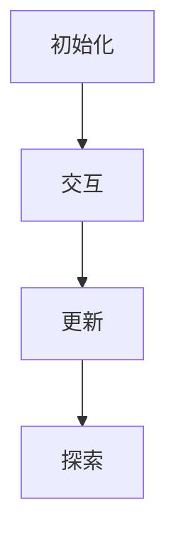

## 背景介绍

深度 Q-learning（DQN）是一种基于强化学习的方法，用于解决复杂环境下的决策问题。它通过学习状态-动作对的价值函数来实现智能体与环境之间的交互，从而达到最优的行为策略。

## 核心概念与联系

在深度 Q-learning 中，我们关注于一个智能体如何通过与环境的交互来学习最佳的行为策略。为了实现这一目标，我们需要定义以下几个关键概念：

1. **状态**（State）：表示智能体所处的当前环境。
2. **动作**（Action）：表示智能体可以采取的一系列可能的操作。
3. **奖励**（Reward）：表示智能体在执行某个动作后获得的反馈值。
4. **价值函数**（Value Function）：表示从当前状态出发，执行一系列动作后所期望得到的累积奖励的期望值。

深度 Q-learning 的核心思想是利用神经网络来 Approximate（逼近）价值函数，以便更好地捕捉复杂环境中的状态-动作关系。

## 核心算法原理具体操作步骤

深度 Q-learning 算法主要包括以下几个步骤：

1. **初始化**：选择一个初始神经网络参数，并设置学习率、折扣因子等超参数。
2. **交互**：智能体与环境进行交互，收集数据。
3. **更新**：根据收集到的数据更新神经网络参数，以使其更好地逼近价值函数。
4. **探索**：在更新过程中，智能体会探索新的状态-动作组合，以提高学习效率。

## 数学模型和公式详细讲解举例说明

为了理解深度 Q-learning，我们需要了解其数学模型。以下是一个简化的 DQN 算法流程图：



DQN 的目标是找到一个适当的神经网络来 Approximate 价值函数。我们可以使用以下公式来表示 Q-learning 更新规则：

$$Q(s, a) \\leftarrow Q(s, a) + \\alpha [r + \\gamma \\max_{a'} Q(s', a') - Q(s, a)]$$

其中：

* $$s$$ 表示当前状态
* $$a$$ 表示当前动作
* $$r$$ 表示奖励
* $$\\gamma$$ 表示折扣因子
* $$\\alpha$$ 表示学习率
* $$s'$$ 表示下一个状态
* $$a'$$ 表示下一个动作

## 项目实践：代码实例和详细解释说明

在本节中，我们将通过一个简单的示例来展示如何实现深度 Q-learning。在这个例子中，我们将使用 Python 和 TensorFlow 来构建一个简单的 DQN 模型。

```python
import tensorflow as tf
import numpy as np

# 定义神经网络结构
class DQN(tf.keras.Model):
    def __init__(self, num_actions):
        super(DQN, self).__init__()
        self.dense1 = tf.keras.layers.Dense(128, activation='relu')
        self.dense2 = tf.keras.layers.Dense(64, activation='relu')
        self.output = tf.keras.layers.Dense(num_actions)

    def call(self, inputs):
        x = self.dense1(inputs)
        x = self.dense2(x)
        return self.output(x)

# 创建模型实例
num_actions = 4
model = DQN(num_actions)

# 定义优化器和损失函数
optimizer = tf.optimizers.Adam(learning_rate=0.001)
loss_fn = tf.losses.MeanSquaredError()

# 训练循环
for episode in range(1000):
    # 与环境交互，收集数据
    state, done = env.reset(), False
    while not done:
        action = np.argmax(model(state))
        next_state, reward, done, _ = env.step(action)
        with tf.GradientTape() as tape:
            q_values = model(state)
            q_values = tf.one_hot(action, num_actions)
            loss = loss_fn(q_values, reward)
        grads = tape.gradient(loss, model.trainable_variables)
        optimizer.apply_gradients(zip(grads, model.trainable_variables))
        state = next_state
```

## 实际应用场景

深度 Q-learning 可以在许多实际应用中找到用武之地，例如：

1. **游戏 AI**：通过学习玩家策略，提高游戏AI的表现。
2. **自动驾驶**：训练智能车辆如何在复杂环境下进行安全驾驶。
3. **金融投资**：为投资决策提供价值预测，从而实现更好的投资收益。

## 工具和资源推荐

以下是一些建议的工具和资源，可以帮助您更好地了解和使用深度 Q-learning：

1. **TensorFlow**：一个流行的机器学习框架，可以用于构建和训练神经网络。
2. **OpenAI Gym**：一个广泛使用的强化学习实验平台，提供了许多现成的环境来测试和评估算法。
3. **Deep Reinforcement Learning Hands-On**：一本关于深度强化学习的实践指南，涵盖了 DQN 和其他相关技术。

## 总结：未来发展趋势与挑战

深度 Q-learning 是一种非常有前景的强化学习方法，它已经成功应用于多个领域。然而，这种方法仍然面临一些挑战，如计算资源需求、探索-利用平衡等。在未来的发展趋势中，我们可以期待更多的研究和创新，使得深度 Q-learning 更加高效、可扩展和易于实现。

## 附录：常见问题与解答

在本篇博客文章中，我们讨论了深度 Q-learning 的核心概念、原理和实际应用场景。如果您对此主题还有其他疑问，请随时提问，我们将竭诚为您提供帮助。

作者：禅与计算机程序设计艺术 / Zen and the Art of Computer Programming
