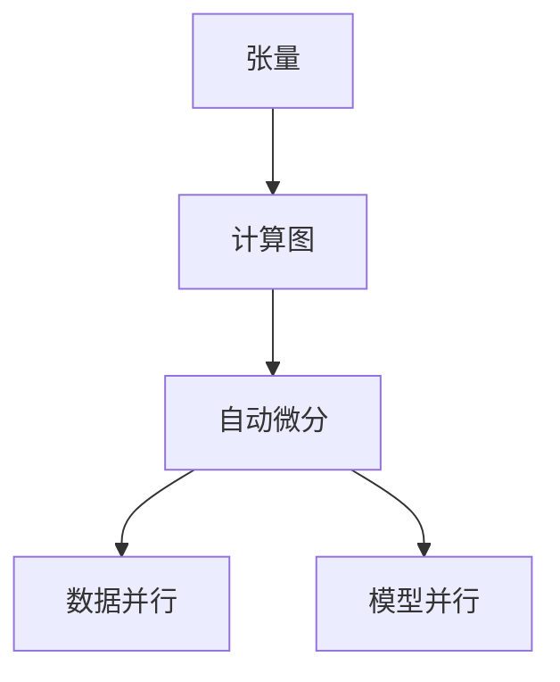

# 深度学习框架原理与代码实战案例讲解

## 1.背景介绍

近年来，深度学习在计算机视觉、自然语言处理、语音识别等多个领域展现出了卓越的性能表现，成为了人工智能领域最为活跃和前沿的研究方向之一。随着深度学习模型的复杂度不断增加，高效的深度学习框架成为了加速模型训练和部署的关键工具。本文将深入探讨三大主流深度学习框架 TensorFlow、PyTorch 和 MXNet 的原理和实战案例，帮助读者更好地理解和应用这些强大的工具。

## 2.核心概念与联系

### 2.1 张量 (Tensor)

张量是深度学习框架中的核心数据结构，它是一个多维数组，可以表示标量、向量、矩阵和高维数据。张量在深度学习中用于表示输入数据、模型权重和输出结果。

### 2.2 计算图 (Computational Graph)

计算图是深度学习框架的核心概念之一。它将模型的计算过程表示为一系列的节点和边,其中节点表示数学运算,边表示数据依赖关系。计算图使得模型的构建和优化变得更加灵活和高效。

### 2.3 自动微分 (Automatic Differentiation)

自动微分是深度学习框架中一个关键技术,它可以自动计算模型参数的梯度,从而支持基于梯度的优化算法。自动微分通过计算图的反向传播实现,大大简化了手工求导的复杂性。

### 2.4 数据并行和模型并行

为了充分利用现代硬件(如GPU和TPU)的计算能力,深度学习框架通常支持数据并行和模型并行。数据并行将训练数据分发到多个设备上进行并行计算,而模型并行则将模型的不同部分分配到不同的设备上进行并行计算。



## 3.核心算法原理具体操作步骤

### 3.1 TensorFlow

TensorFlow是Google开发的开源深度学习框架,它采用数据流图(DataFlow Graph)的编程模型,将计算过程表示为一个有向图。

1. 构建计算图:使用 TensorFlow 提供的各种操作(Operation)和张量(Tensor)来定义模型的计算过程。
2. 初始化变量:使用 `tf.global_variables_initializer()` 初始化模型的可训练变量。
3. 运行计算图:使用 `tf.Session` 对象来执行计算图,进行模型训练或推理。
4. 优化模型:使用优化器(如 `tf.train.GradientDescentOptimizer`)和自动微分机制来更新模型参数。

### 3.2 PyTorch

PyTorch是一个基于Python的深度学习框架,它采用动态计算图的方式,可以更加灵活地构建和修改模型。

1. 定义模型:继承 `nn.Module` 类,在 `__init__` 方法中定义网络层,在 `forward` 方法中定义前向传播过程。
2. 初始化模型和优化器:实例化模型对象和优化器对象(如 `torch.optim.SGD`)。
3. 训练循环:遍历训练数据,计算损失函数,调用优化器的 `zero_grad()` 方法清除梯度,调用 `loss.backward()` 计算梯度,调用优化器的 `step()` 方法更新模型参数。
4. 推理:调用模型对象的 `eval()` 方法切换到评估模式,对测试数据进行预测。

### 3.3 MXNet

MXNet是一个灵活高效的深度学习框架,它同时支持imperative和symbolic两种编程模式。

1. 定义网络:使用 `nn.Sequential` 或 `nn.HybridSequential` 模块定义网络结构。
2. 初始化:实例化网络对象,初始化模型参数。
3. 数据准备:使用 `gluon.data` 模块加载和预处理数据。
4. 训练:调用 `Trainer` 对象的 `step` 方法进行模型训练,使用 `loss` 模块计算损失函数。
5. 预测:调用网络对象的 `forward` 方法对新数据进行预测。

## 4.数学模型和公式详细讲解举例说明

深度学习模型通常由多个层级的非线性变换组成,每一层的输出作为下一层的输入。我们以多层感知机(Multilayer Perceptron, MLP)为例,详细解释其数学原理。

### 4.1 线性变换

给定输入向量 $\boldsymbol{x} = (x_1, x_2, \ldots, x_n)^\top$,线性变换可以表示为:

$$\boldsymbol{y} = \boldsymbol{W}\boldsymbol{x} + \boldsymbol{b}$$

其中 $\boldsymbol{W}$ 是权重矩阵,每一行对应一个输出维度,每一列对应一个输入维度;$\boldsymbol{b}$ 是偏置向量。

### 4.2 激活函数

为了引入非线性,我们对线性变换的输出应用一个非线性激活函数 $\phi$,如 ReLU 函数:

$$\boldsymbol{z} = \phi(\boldsymbol{y}) = \phi(\boldsymbol{W}\boldsymbol{x} + \boldsymbol{b})$$

### 4.3 多层感知机

多层感知机由多个线性变换和激活函数层级组成,每一层的输出作为下一层的输入:

$$
\begin{aligned}
\boldsymbol{y}^{(1)} &= \boldsymbol{W}^{(1)}\boldsymbol{x} + \boldsymbol{b}^{(1)} \\
\boldsymbol{z}^{(1)} &= \phi^{(1)}(\boldsymbol{y}^{(1)}) \\
\boldsymbol{y}^{(2)} &= \boldsymbol{W}^{(2)}\boldsymbol{z}^{(1)} + \boldsymbol{b}^{(2)} \\
\boldsymbol{z}^{(2)} &= \phi^{(2)}(\boldsymbol{y}^{(2)}) \\
&\vdots \\
\boldsymbol{y}^{(L)} &= \boldsymbol{W}^{(L)}\boldsymbol{z}^{(L-1)} + \boldsymbol{b}^{(L)} \\
\boldsymbol{\hat{y}} &= \phi^{(L)}(\boldsymbol{y}^{(L)})
\end{aligned}
$$

其中 $L$ 是层数,最后一层的输出 $\boldsymbol{\hat{y}}$ 即为模型的预测结果。

通过反向传播算法,我们可以计算每一层的梯度,并使用优化算法(如随机梯度下降)更新模型参数,从而最小化损失函数。

## 5.项目实践:代码实例和详细解释说明

### 5.1 TensorFlow 示例:手写数字识别

```python
import tensorflow as tf

# 加载 MNIST 数据集
mnist = tf.keras.datasets.mnist
(x_train, y_train), (x_test, y_test) = mnist.load_data()

# 数据预处理
x_train, x_test = x_train / 255.0, x_test / 255.0

# 构建模型
model = tf.keras.models.Sequential([
    tf.keras.layers.Flatten(input_shape=(28, 28)),
    tf.keras.layers.Dense(128, activation='relu'),
    tf.keras.layers.Dropout(0.2),
    tf.keras.layers.Dense(10, activation='softmax')
])

# 编译模型
model.compile(optimizer='adam',
              loss='sparse_categorical_crossentropy',
              metrics=['accuracy'])

# 训练模型
model.fit(x_train, y_train, epochs=5)

# 评估模型
model.evaluate(x_test, y_test)
```

在这个示例中,我们使用 TensorFlow 构建了一个简单的多层感知机模型,用于识别手写数字。首先,我们加载 MNIST 数据集并进行预处理。然后,我们使用 `tf.keras.models.Sequential` 定义了一个顺序模型,包含一个扁平化层、一个全连接层、一个dropout层和一个输出层。接着,我们使用 `model.compile` 方法编译模型,指定优化器、损失函数和评估指标。最后,我们调用 `model.fit` 方法训练模型,并使用 `model.evaluate` 评估模型在测试集上的性能。

### 5.2 PyTorch 示例:图像分类

```python
import torch
import torchvision
import torchvision.transforms as transforms

# 加载数据集
transform = transforms.Compose([transforms.ToTensor(),
                                transforms.Normalize((0.5, 0.5, 0.5), (0.5, 0.5, 0.5))])

trainset = torchvision.datasets.CIFAR10(root='./data', train=True,
                                        download=True, transform=transform)
trainloader = torch.utils.data.DataLoader(trainset, batch_size=4,
                                          shuffle=True, num_workers=2)

# 定义模型
import torch.nn as nn
import torch.nn.functional as F

class Net(nn.Module):
    def __init__(self):
        super().__init__()
        self.conv1 = nn.Conv2d(3, 6, 5)
        self.pool = nn.MaxPool2d(2, 2)
        self.conv2 = nn.Conv2d(6, 16, 5)
        self.fc1 = nn.Linear(16 * 5 * 5, 120)
        self.fc2 = nn.Linear(120, 84)
        self.fc3 = nn.Linear(84, 10)

    def forward(self, x):
        x = self.pool(F.relu(self.conv1(x)))
        x = self.pool(F.relu(self.conv2(x)))
        x = torch.flatten(x, 1) # flatten all dimensions except batch
        x = F.relu(self.fc1(x))
        x = F.relu(self.fc2(x))
        x = self.fc3(x)
        return x

net = Net()

# 训练模型
import torch.optim as optim

criterion = nn.CrossEntropyLoss()
optimizer = optim.SGD(net.parameters(), lr=0.001, momentum=0.9)

for epoch in range(2):  # loop over the dataset multiple times

    running_loss = 0.0
    for i, data in enumerate(trainloader, 0):
        # get the inputs; data is a list of [inputs, labels]
        inputs, labels = data

        # zero the parameter gradients
        optimizer.zero_grad()

        # forward + backward + optimize
        outputs = net(inputs)
        loss = criterion(outputs, labels)
        loss.backward()
        optimizer.step()

        # print statistics
        running_loss += loss.item()
        if i % 2000 == 1999:    # print every 2000 mini-batches
            print(f'[{epoch + 1}, {i + 1:5d}] loss: {running_loss / 2000:.3f}')
            running_loss = 0.0

print('Finished Training')
```

在这个示例中,我们使用 PyTorch 构建了一个卷积神经网络模型,用于对 CIFAR-10 数据集进行图像分类。首先,我们加载数据集并进行预处理。然后,我们定义了一个继承自 `nn.Module` 的网络模型,包含两个卷积层、两个池化层和三个全连接层。接着,我们实例化模型、损失函数和优化器,并进入训练循环。在每个epoch中,我们遍历训练数据,计算损失函数、反向传播梯度,并使用优化器更新模型参数。最后,我们打印训练过程中的损失值。

### 5.3 MXNet 示例:文本分类

```python
import mxnet as mx
from mxnet import gluon, nd
from mxnet.gluon import nn

# 加载数据集
dataset = gluon.data.vision.MNIST(train=True)
data_loader = gluon.data.DataLoader(dataset, batch_size=32, shuffle=True)

# 定义模型
net = nn.HybridSequential()
net.add(nn.Dense(128, activation='relu'))
net.add(nn.Dense(64, activation='relu'))
net.add(nn.Dense(10))

# 初始化模型参数
net.initialize(mx.init.Xavier())

# 定义损失函数和优化器
loss_fn = gluon.loss.SoftmaxCrossEntropyLoss()
trainer = gluon.Trainer(net.collect_params(), 'sgd', {'learning_rate': 0.1})

# 训练模型
epochs = 10
for e in range(epochs):
    cumulative_loss = 0
    for data, label in data_loader:
        with mx.autograd.record():
            output = net(data)
            loss = loss_fn(output, label)
        loss.backward()
        trainer.step(data.shape[0])
        cumulative_loss += loss.sum().asscalar()

    print(f"Epoch {e+1}, Loss: {cumulative_loss / len(dataset)}")
```

在这个示例中,我们使用 MXNet 构建了一个多层感知机模型,用于对 MNIST 手写数字数据集