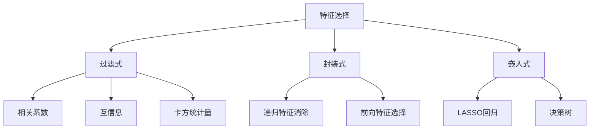

# 特征选择 (Feature Selection) 原理与代码实例讲解

## 1.背景介绍

在现代机器学习和数据科学领域,数据集通常包含大量的特征(features)。然而,并非所有特征对于构建准确的模型都是必需的。事实上,一些特征可能是冗余的或者与目标变量无关。包含这些无关特征不仅会增加模型的复杂性,还可能导致过拟合(overfitting)和降低模型的泛化能力。

特征选择(Feature Selection)就是从原始特征集中选择出对预测目标最有价值的一个子集的过程。通过移除无关或冗余的特征,特征选择可以简化模型,提高模型的准确性、可解释性和计算效率。

## 2.核心概念与联系

### 2.1 特征选择的重要性

特征选择在机器学习中扮演着关键角色,主要原因如下:

1. **降低维度(Dimensionality Reduction)**: 通过移除无关特征,可以降低数据的维度,从而减少模型的复杂性和计算开销。
2. **提高模型性能**: 去除无关特征可以提高模型的准确性,减少过拟合的风险。
3. **提高可解释性**: 选择出与目标变量最相关的特征,可以帮助我们更好地理解模型的决策过程。
4. **节省资源**: 在有限的计算资源和存储空间下,特征选择可以帮助我们专注于最重要的特征,从而节省资源。

### 2.2 特征选择与特征提取的区别

特征选择(Feature Selection)和特征提取(Feature Extraction)都是降维技术,但它们有着本质的区别:

- **特征选择**: 从原始特征集中选择出一个子集,保留原始特征的语义。
- **特征提取**: 通过某些函数转换,从原始特征集中构造出一组新的特征,新特征可能失去原始语义。

常见的特征提取方法包括主成分分析(PCA)、线性判别分析(LDA)等。与特征选择相比,特征提取通常会保留更多的原始信息,但可解释性较差。

### 2.3 特征选择的三种基本方法

根据特征选择的策略,可以将特征选择方法分为三大类:

1. **过滤式(Filter)**: 根据特征与目标变量的相关性评分,选择得分最高的特征。常见的过滤式方法包括相关系数、互信息、卡方统计量等。
2. **封装式(Wrapper)**: 将特征选择过程封装到机器学习模型的训练过程中,根据模型在验证集上的表现来评估特征子集的优劣。
3. **嵌入式(Embedded)**: 在模型训练的同时自动进行特征选择,如LASSO回归、决策树等。

每种方法都有自己的优缺点,在实践中需要根据具体问题选择合适的方法。



## 3.核心算法原理具体操作步骤

### 3.1 过滤式特征选择

过滤式特征选择方法通过计算每个特征与目标变量之间的相关性评分,选择评分最高的特征。这种方法的优点是计算效率高、易于并行化,缺点是无法考虑特征之间的相互影响。

以相关系数作为评分标准的过滤式特征选择步骤如下:

1. 计算每个特征与目标变量之间的相关系数(如皮尔逊相关系数、斯皮尔曼相关系数等)。
2. 根据设定的阈值或选择特征数量,选择相关系数最高的特征。
3. 使用选择出的特征子集训练机器学习模型。

### 3.2 封装式特征选择

封装式特征选择方法将特征选择过程封装到机器学习模型的训练过程中,通过评估模型在验证集上的表现来选择最优特征子集。这种方法的优点是能够考虑特征之间的相互影响,缺点是计算开销较大。

以递归特征消除(Recursive Feature Elimination, RFE)为例,其步骤如下:

1. 使用所有特征训练一个初始模型。
2. 根据模型对每个特征的重要性评分,移除重要性最低的一个或多个特征。
3. 使用剩余的特征子集重新训练模型,并在验证集上评估模型性能。
4. 重复步骤2和3,直到达到预设的停止条件(如特征数量或模型性能)。
5. 选择性能最佳的特征子集,并使用该子集训练最终模型。

### 3.3 嵌入式特征选择

嵌入式特征选择方法在模型训练的同时自动进行特征选择,如LASSO回归、决策树等。这种方法的优点是计算效率较高,能够考虑特征之间的相互影响,缺点是受模型假设的限制。

以LASSO回归为例,其特征选择步骤如下:

1. 构建LASSO回归模型,其目标函数包括损失函数和L1正则化项。
2. 在模型训练过程中,L1正则化项会使一些特征的系数变为0,从而实现自动特征选择。
3. 选择系数非零的特征作为最终特征子集。

## 4.数学模型和公式详细讲解举例说明

### 4.1 相关系数

相关系数是一种常用的过滤式特征选择评分标准,用于衡量两个变量之间的线性相关程度。常见的相关系数包括皮尔逊相关系数和斯皮尔曼相关系数。

#### 4.1.1 皮尔逊相关系数

皮尔逊相关系数衡量两个变量之间的线性相关程度,取值范围为[-1, 1]。相关系数越接近1,表示两个变量呈正相关;越接近-1,表示两个变量呈负相关;等于0,表示两个变量不相关。

对于特征向量 $\boldsymbol{x} = (x_1, x_2, \ldots, x_n)$ 和目标变量向量 $\boldsymbol{y} = (y_1, y_2, \ldots, y_n)$,皮尔逊相关系数的计算公式为:

$$r_{xy} = \frac{\sum_{i=1}^{n}(x_i - \bar{x})(y_i - \bar{y})}{\sqrt{\sum_{i=1}^{n}(x_i - \bar{x})^2}\sqrt{\sum_{i=1}^{n}(y_i - \bar{y})^2}}$$

其中 $\bar{x}$ 和 $\bar{y}$ 分别表示 $\boldsymbol{x}$ 和 $\boldsymbol{y}$ 的均值。

#### 4.1.2 斯皮尔曼相关系数

斯皮尔曼相关系数是基于变量的排名来计算的,因此它是一种非参数相关性测量方法,适用于非线性和非正态分布的数据。

对于特征向量 $\boldsymbol{x} = (x_1, x_2, \ldots, x_n)$ 和目标变量向量 $\boldsymbol{y} = (y_1, y_2, \ldots, y_n)$,首先将它们分别排序,得到排名向量 $\boldsymbol{r_x}$ 和 $\boldsymbol{r_y}$。然后,斯皮尔曼相关系数可以通过以下公式计算:

$$\rho_{xy} = 1 - \frac{6\sum_{i=1}^{n}(r_{x_i} - r_{y_i})^2}{n(n^2 - 1)}$$

其中 $r_{x_i}$ 和 $r_{y_i}$ 分别表示 $x_i$ 和 $y_i$ 在排序后的排名。

### 4.2 互信息

互信息(Mutual Information)是一种常用的过滤式特征选择评分标准,它衡量两个随机变量之间的相互依赖程度。互信息越高,表示两个变量之间的相关性越强。

对于离散随机变量 $X$ 和 $Y$,它们的互信息定义为:

$$I(X; Y) = \sum_{x \in \mathcal{X}}\sum_{y \in \mathcal{Y}}p(x, y)\log\left(\frac{p(x, y)}{p(x)p(y)}\right)$$

其中 $p(x, y)$ 是 $X$ 和 $Y$ 的联合概率分布,而 $p(x)$ 和 $p(y)$ 分别是 $X$ 和 $Y$ 的边缘概率分布。

对于连续随机变量,互信息可以通过估计概率密度函数来计算。常用的估计方法包括直方图估计、核密度估计等。

互信息具有以下性质:

1. 非负性: $I(X; Y) \geq 0$,当且仅当 $X$ 和 $Y$ 相互独立时,互信息等于0。
2. 对称性: $I(X; Y) = I(Y; X)$。
3. 互信息越高,表示 $X$ 和 $Y$ 之间的相关性越强。

### 4.3 LASSO回归

LASSO回归(Least Absolute Shrinkage and Selection Operator)是一种嵌入式特征选择方法,它在回归模型中引入了L1正则化项,从而实现自动特征选择。

对于线性回归模型 $\boldsymbol{y} = \boldsymbol{X}\boldsymbol{\beta} + \boldsymbol{\epsilon}$,其目标函数为:

$$\min_{\boldsymbol{\beta}} \frac{1}{2n}\|\boldsymbol{y} - \boldsymbol{X}\boldsymbol{\beta}\|_2^2 + \lambda\|\boldsymbol{\beta}\|_1$$

其中 $\|\boldsymbol{\beta}\|_1 = \sum_{j=1}^{p}|\beta_j|$ 是L1正则化项,而 $\lambda \geq 0$ 是一个超参数,用于控制正则化强度。

在优化过程中,L1正则化项会使一些特征的系数 $\beta_j$ 变为0,从而实现自动特征选择。最终,只有系数非零的特征会被选择出来,用于构建最终的模型。

LASSO回归的优点是能够同时实现参数估计和特征选择,而且具有一定的稀疏性,即只有少数特征的系数非零。但是,LASSO也存在一些缺陷,如当特征之间存在高度相关时,它倾向于任意选择其中一个特征。

## 5.项目实践: 代码实例和详细解释说明

在这一部分,我们将使用Python中的scikit-learn库,通过一个实际案例来演示特征选择的过程。我们将使用著名的"鸢尾花卉数据集"(Iris Dataset)作为示例数据集。

### 5.1 数据准备

首先,我们导入所需的库和数据集:

```python
from sklearn.datasets import load_iris
from sklearn.model_selection import train_test_split
import pandas as pd

# 加载鸢尾花数据集
iris = load_iris()
X, y = iris.data, iris.target

# 将数据分为训练集和测试集
X_train, X_test, y_train, y_test = train_test_split(X, y, test_size=0.2, random_state=42)

# 将特征数据转换为DataFrame,方便查看
feature_names = iris.feature_names
X_train_df = pd.DataFrame(X_train, columns=feature_names)
X_test_df = pd.DataFrame(X_test, columns=feature_names)
```

### 5.2 过滤式特征选择: 相关系数

我们将使用皮尔逊相关系数作为评分标准,选择与目标变量相关性最高的特征。

```python
from sklearn.feature_selection import SelectKBest
from sklearn.feature_selection import f_regression

# 使用相关系数作为评分标准
selector = SelectKBest(f_regression, k=2)
X_train_selected = selector.fit_transform(X_train, y_train)

# 查看选择出的特征
selected_features = X_train_df.columns[selector.get_support()]
print("Selected features:", selected_features)
```

输出结果:

```
Selected features: Index(['petal length (cm)', 'petal width (cm)'], dtype='object')
```

可以看到,相关系数方法选择出了"花瓣长度"和"花瓣宽度"这两个特征,这与鸢尾花数据集的实际情况相符。

### 5.3 封装式特征选择: 递归特征