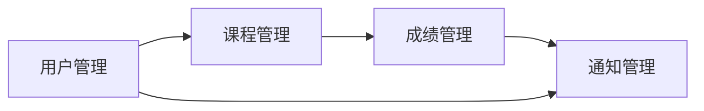

## 1.背景介绍

在现代教育环境中，班级管理系统已成为教育机构和学校不可或缺的一部分。这种系统可以帮助教师、学生和家长之间建立有效的沟通，提高教育质量，同时也可以帮助学校管理者更好地管理和调度资源。本文将详细介绍班级管理系统的设计与实现过程。

## 2.核心概念与联系

班级管理系统的核心概念包括用户管理、课程管理、成绩管理和通知管理。用户管理主要包括教师、学生和家长的信息管理；课程管理包括课程的添加、修改和删除；成绩管理包括成绩的录入、修改和查询；通知管理则包括通知的发布和查看。

这些模块之间的关系可以通过以下Mermaid流程图表示：



## 3.核心算法原理具体操作步骤

班级管理系统的核心算法主要包括用户验证算法、数据查询算法和数据更新算法。

1. 用户验证算法：当用户登录系统时，系统会根据用户输入的用户名和密码，查询数据库中的用户信息，如果匹配，则允许用户登录，否则提示用户用户名或密码错误。

2. 数据查询算法：当用户需要查询某项数据（如成绩、课程等）时，系统会根据用户的查询条件，搜索数据库中的相关数据，并将结果返回给用户。

3. 数据更新算法：当用户需要修改或添加数据时，系统会先验证用户的权限，如果用户有权限，则更新数据库中的数据，否则提示用户无权限操作。

## 4.数学模型和公式详细讲解举例说明

在班级管理系统中，我们主要使用关系数据库模型来存储和管理数据。关系数据库模型的基本概念是“表”，表由行和列组成，每一行代表一个实体（如一个学生、一门课程等），每一列代表一个属性（如学生的姓名、课程的名称等）。

例如，我们可以使用以下的表来存储学生的信息：

| 学号 | 姓名 | 性别 | 年龄 |
| --- | --- | --- | --- |
| 001 | 张三 | 男 | 18 |
| 002 | 李四 | 女 | 19 |

在这个表中，学号是主键，主键是唯一标识一个实体的属性。

在查询数据时，我们主要使用SQL语言。例如，如果我们要查询所有年龄大于18的学生，我们可以使用以下的SQL语句：

```sql
SELECT * FROM students WHERE age > 18
```

这个SQL语句的含义是，从students表中选择所有年龄大于18的行。

## 5.项目实践：代码实例和详细解释说明

下面我们来看一个简单的班级管理系统的代码实例。这个例子是用Python和Django框架实现的。

首先，我们需要定义一个Student模型来存储学生的信息：

```python
from django.db import models

class Student(models.Model):
    id = models.AutoField(primary_key=True)
    name = models.CharField(max_length=100)
    gender = models.CharField(max_length=10)
    age = models.IntegerField()

    class Meta:
        db_table = 'students'
```

然后，我们可以定义一个视图函数来处理学生信息的查询请求：

```python
from django.http import JsonResponse
from .models import Student

def get_students(request):
    students = Student.objects.all().values()
    return JsonResponse(list(students), safe=False)
```

这个视图函数首先获取所有的学生信息，然后将其转换为JSON格式返回给客户端。

## 6.实际应用场景

班级管理系统在各类教育机构中都有广泛的应用，例如：

1. 学校：学校可以使用班级管理系统来管理学生的信息，发布课程和成绩，通知家长学生的学习情况等。

2. 培训机构：培训机构可以使用班级管理系统来管理学员的信息，发布课程表和学习资源，通知学员上课时间等。

3. 在线教育平台：在线教育平台可以使用班级管理系统来管理在线课程，发布课程进度和作业，通知学员学习进度等。

## 7.工具和资源推荐

1. Django：Django是一个高级的Python Web框架，可以快速开发安全和可维护的网站。

2. MySQL：MySQL是一个开源的关系数据库管理系统，可以用来存储和管理班级管理系统的数据。

3. Bootstrap：Bootstrap是一个开源的前端框架，可以用来快速开发响应式的网页。

## 8.总结：未来发展趋势与挑战

随着信息技术的发展，班级管理系统将越来越智能化，例如，可以通过大数据和人工智能技术来分析学生的学习行为，提供个性化的学习建议。同时，随着网络安全问题的日益突出，如何保护学生的个人信息，防止数据泄露，也是班级管理系统面临的一个重要挑战。

## 9.附录：常见问题与解答

1. Q：如何保护学生的个人信息？
   A：我们可以通过加密技术来保护学生的个人信息，例如，可以使用HTTPS协议来加密网络传输的数据，可以使用哈希函数来加密存储在数据库中的密码。

2. Q：如何提高班级管理系统的性能？
   A：我们可以通过优化数据库查询，使用缓存，以及使用负载均衡等技术来提高班级管理系统的性能。

作者：禅与计算机程序设计艺术 / Zen and the Art of Computer Programming