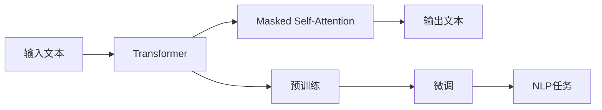

## 1.背景介绍

在自然语言处理（NLP）领域，生成式预训练模型（GPT）已经成为了一种主流的深度学习模型。自2018年OpenAI首次发布GPT以来，这种模型的性能和规模不断提升，尤其是最新的GPT-3，其规模达到了惊人的1750亿参数。这种大规模的预训练模型在各种NLP任务上都取得了显著的效果，包括机器翻译、问答系统、文本生成等。

## 2.核心概念与联系

GPT系列模型基于Transformer架构，是一种自回归语言模型。它使用了一种称为Masked Self-Attention的技术，可以捕捉到输入文本中长距离的依赖关系。GPT模型的训练过程是无监督的，只需要大量的文本数据，而不需要人工标注。通过预训练和微调两个阶段，GPT模型可以适应各种NLP任务。



## 3.核心算法原理具体操作步骤

GPT模型的训练过程主要包括预训练和微调两个阶段。

在预训练阶段，模型使用大量的无标注文本数据进行训练。模型的目标是预测每个词的下一个词，这被称为语言建模任务。通过这种方式，模型可以学习到文本数据中的语法规则和语义信息。

在微调阶段，模型使用具有特定任务标签的少量数据进行训练。例如，在情感分类任务中，模型需要预测文本的情感标签。通过微调，模型可以适应特定的NLP任务。

## 4.数学模型和公式详细讲解举例说明

GPT模型的核心是Transformer架构，其关键部分是Self-Attention机制。Self-Attention的数学表达如下：

设输入序列为$x_1, x_2, ..., x_n$，对于每个位置$i$，其对应的查询（query）、键（key）和值（value）分别为$q_i, k_i, v_i$，则Self-Attention的输出为：

$$
\text{Attention}(Q, K, V) = \text{softmax}\left(\frac{QK^T}{\sqrt{d_k}}\right)V
$$

其中，$Q, K, V$分别为查询、键和值的矩阵表示，$d_k$为键的维度。

## 5.项目实践：代码实例和详细解释说明

在Python环境下，我们可以使用Hugging Face的Transformers库来使用GPT模型。以下是一个简单的示例：

```python
from transformers import GPT2LMHeadModel, GPT2Tokenizer

tokenizer = GPT2Tokenizer.from_pretrained('gpt2')
model = GPT2LMHeadModel.from_pretrained('gpt2')

inputs = tokenizer.encode("Hello, how are you?", return_tensors='pt')
outputs = model.generate(inputs, max_length=50, num_return_sequences=5)

for i, output in enumerate(outputs):
    print(f'Sample {i + 1}: {tokenizer.decode(output)}')
```

这段代码首先加载了GPT-2模型和对应的分词器。然后，我们对一段输入文本进行编码，并使用模型生成新的文本。最后，我们打印出生成的文本。

## 6.实际应用场景

GPT模型在许多NLP任务中都有广泛的应用，包括：

- 文本生成：如自动写作、诗歌创作、新闻报道等。
- 机器翻译：将一种语言的文本翻译成另一种语言。
- 情感分析：预测文本的情感倾向，如积极或消极。
- 问答系统：根据问题生成答案。

## 7.工具和资源推荐

- Hugging Face的Transformers库：提供了各种预训练模型，包括GPT系列模型。
- OpenAI的GPT-3 API：提供了GPT-3模型的在线服务。
- PyTorch和TensorFlow：两种主流的深度学习框架，可以用来训练和使用GPT模型。

## 8.总结：未来发展趋势与挑战

生成式预训练模型，如GPT，已经在NLP领域取得了显著的成果。然而，这种模型也面临着一些挑战，包括计算资源的需求、模型的解释性和安全性等问题。随着技术的发展，我们期待这些问题能够得到解决，使得GPT模型能够在更多场景中发挥作用。

## 9.附录：常见问题与解答

- 问：GPT模型如何处理不同长度的输入？
- 答：GPT模型使用了位置编码（Positional Encoding）来处理不同长度的输入。位置编码为每个位置添加了一个唯一的向量，使得模型可以区分不同位置的词。

- 问：GPT模型如何生成新的文本？
- 答：GPT模型生成新的文本是通过预测每个词的下一个词来实现的。模型首先接收一个或多个初始词，然后反复预测下一个词，直到达到指定的长度或者生成了结束符。

作者：禅与计算机程序设计艺术 / Zen and the Art of Computer Programming