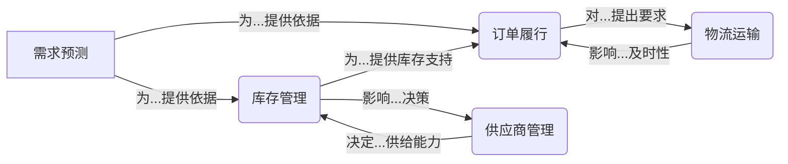

# 电商供应链管理：优化库存，降低成本，提高效率

## 1. 背景介绍

### 1.1 电商行业的快速发展

随着互联网技术的不断进步和消费者购物习惯的改变,电子商务(电商)行业在过去几年里经历了爆炸式的增长。根据统计数据,2022年全球电商销售额达到5.7万亿美元,预计到2025年将进一步增长至7.4万亿美元。这种快速发展为企业带来了巨大的机遇,同时也带来了供应链管理方面的挑战。

### 1.2 供应链管理的重要性

供应链管理是电商企业的核心竞争力之一。高效的供应链管理可以确保产品及时送达消费者手中,提高客户满意度;同时还能降低运营成本,提高利润率。反之,供应链管理不善会导致库存积压、订单延误、物流成本高企等问题,严重影响企业的盈利能力和市场竞争力。

### 1.3 传统供应链管理面临的挑战

传统的供应链管理模式主要依赖人工经验和历史数据进行决策,难以适应电商行业多变的市场需求和复杂的物流网络。此外,由于缺乏先进的优化算法和大数据分析能力,企业往往无法实现精细化的库存管控和高效的物流调度,导致资源浪费和效率低下。

## 2. 核心概念与联系

### 2.1 供应链管理的核心概念

电商供应链管理涉及多个核心概念,包括:

1. **库存管理**:合理规划和控制各个库存节点的库存水平,避免库存过剩或断货。
2. **需求预测**:准确预测未来一段时间内的产品需求量,为生产和采购决策提供依据。
3. **订单履行**:高效处理订单,确保按时将正确的产品送达消费者手中。
4. **物流运输**:优化运输路线和车辆调度,降低物流成本并提高配送效率。
5. **供应商管理**:与上游供应商建立良好的合作关系,保证原材料和产品的及时供应。

### 2.2 核心概念之间的联系

上述核心概念相互关联、相互影响,构成了电商供应链管理的完整闭环:

1. 需求预测为库存管理和订单履行提供决策依据。
2. 库存管理为订单履行提供库存支持,并影响供应商管理决策。
3. 订单履行对物流运输提出时间和数量要求。
4. 物流运输的效率影响订单履行的及时性。
5. 供应商管理决定了原材料和产品的供给能力,影响库存管理。

只有将这些核心概念有机结合,才能构建高效、协调的电商供应链管理体系。

## 3. 核心算法原理具体操作步骤

优化电商供应链管理的核心在于应用先进的算法和模型,实现对各环节的精细化控制和决策优化。以下是几种常用算法的原理和操作步骤:

### 3.1 时间序列分析算法

时间序列分析算法通过分析历史数据,发现数据中的周期性、趋势性和季节性规律,从而对未来需求进行准确预测。常用的时间序列分析算法包括:

1. **移动平均法**:计算最近几个时间点的平均值作为预测值。
2. **指数平滑法**:对最新数据赋予更大权重,逐步修正预测值。
3. **ARIMA模型**:结合自回归(AR)、移动平均(MA)和差分(I),捕捉数据的长期趋势和周期性。

操作步骤:

1) 收集并清洗历史销售数据;
2) 确定合适的时间序列模型,拟合模型参数;
3) 使用模型对未来一段时间的需求进行预测;
4) 持续监控模型性能,根据新数据调整模型参数。

### 3.2 库存优化算法

库存优化算法旨在确定最佳的库存水平,在满足服务水平的同时最小化库存成本。常用的库存优化算法有:

1. **经济订货量(EOQ)模型**:在已知需求率、订货成本等条件下,计算出最优订货批量。
2. **安全库存模型**:根据需求的不确定性,确定安全库存水平,避免断货。
3. **多层级库存优化**:考虑供应链网络结构,在各层级库存节点间实现库存再分配。

操作步骤:

1) 收集需求数据、成本数据等相关参数;
2) 建立库存优化模型,设定目标函数(如最小化总成本)和约束条件;
3) 使用算法求解最优库存决策;
4) 实施库存决策,并持续监控库存绩效,根据需要重新优化。

### 3.3 车辆路径优化算法

对于电商企业而言,高效的配送路线规划对于降低物流成本至关重要。常用的车辆路径优化算法包括:

1. **蚁群算法**:模拟蚂蚁觅食行为,通过信息素机制逐步找到最优路径。
2. **遗传算法**:借鉴生物进化理论,通过基因交叉和变异产生新的路径方案。
3. **禁忌搜索算法**:通过记录已搜索过的路径,避免重复搜索,提高算法效率。

操作步骤:

1) 收集配送地点坐标、路径距离等输入数据;
2) 构建优化模型,设定目标函数(如最短路径)和约束条件(如车辆载重量);
3) 选择合适的算法,求解最优配送方案;
4) 实施配送方案,并根据实际路况和交通情况进行动态调整。

### 3.4 供应商选择优化算法

合理选择供应商对于控制采购成本、保证供应链稳定性至关重要。常用的供应商选择优化算法有:

1. **analyitic层次分析法(AHP)**:建立多层级决策框架,通过专家打分确定各因素权重。
2. **数据包络分析(DEA)**:评估供应商的相对效率,剔除低效供应商。
3. **多目标决策**:同时考虑多个目标(如成本、质量、交期等),寻找最优解。

操作步骤:

1) 确定供应商选择的评价指标体系,包括定量和定性指标;
2) 收集各供应商的历史数据,计算相应的指标值;
3) 选择合适的算法模型,求解最优供应商组合;
4) 持续跟踪供应商绩效,根据需要调整供应商名单。

以上算法为电商供应链管理的核心算法,在实际应用中还可以根据具体情况进行算法组合和优化,以获得更好的效果。

## 4. 数学模型和公式详细讲解举例说明

### 4.1 时间序列分析模型

时间序列分析模型旨在从历史数据中发现规律,对未来需求进行预测。以下是一些常用的时间序列分析模型:

#### 4.1.1 移动平均法

移动平均法使用最近 $n$ 个时间点的平均值作为下一个时间点的预测值,公式如下:

$$\hat{y}_{t+1} = \frac{1}{n}\sum_{i=t-n+1}^{t}y_i$$

其中, $\hat{y}_{t+1}$ 为时间点 $t+1$ 的预测值, $y_i$ 为时间点 $i$ 的实际值, $n$ 为平均周期。

例如,对于一个月度销量数据,如果取 $n=3$,则下月的预测销量为最近三个月的平均销量。

#### 4.1.2 指数平滑法

指数平滑法赋予最新数据更大的权重,通过递归公式不断修正预测值:

$$\hat{y}_{t+1} = \alpha y_t + (1-\alpha)\hat{y}_t$$

其中, $\alpha$ 为平滑系数 $(0<\alpha<1)$,决定了新数据对预测值的影响程度。$\alpha$ 值越大,模型对最新数据的反应越敏感。

#### 4.1.3 ARIMA 模型

ARIMA(自回归移动平均)模型是一种较为复杂的时间序列模型,可以很好地捕捉数据的长期趋势和周期性。ARIMA模型的一般形式为 ARIMA(p,d,q),其中:

- p 为自回归(AR)项的阶数
- d 为差分(I)的阶数
- q 为移动平均(MA)项的阶数

对于给定的时间序列数据 $\{y_t\}$,ARIMA(p,d,q)模型可表示为:

$$y_t' = c + \phi_1y_{t-1}' + \phi_2y_{t-2}' + ... + \phi_py_{t-p}' + \theta_1\epsilon_{t-1} + \theta_2\epsilon_{t-2} + ... + \theta_q\epsilon_{t-q} + \epsilon_t$$

其中, $y_t' = \nabla^d y_t$ 为 $d$ 阶差分序列, $\{\phi_i\}$ 为自回归参数, $\{\theta_i\}$ 为移动平均参数, $\epsilon_t$ 为白噪声项。

通过对模型参数的估计和诊断,ARIMA模型可以很好地描述和预测具有一定趋势和周期性的时间序列数据。

### 4.2 库存优化模型

#### 4.2.1 经济订货量(EOQ)模型

EOQ模型旨在确定每次订货的最优批量,使得订货成本和库存持有成本的总和最小。EOQ模型的数学表达式为:

$$EOQ = \sqrt{\frac{2DC_o}{C_h}}$$

其中, $D$ 为年度需求量, $C_o$ 为每次订货的固定成本, $C_h$ 为每单位产品的年库存持有成本。

例如,某产品年度需求量为10000件,每次订货固定成本为100元,每件产品的年库存持有成本为2元,则最优订货批量为:

$$EOQ = \sqrt{\frac{2\times10000\times100}{2}} = 1000 (件)$$

#### 4.2.2 安全库存模型

由于需求的不确定性,企业需要保持一定的安全库存,以避免断货。安全库存水平可以根据服务水平要求来确定:

$$SS = z\sqrt{L}\sigma_L$$

其中, $SS$ 为安全库存水平, $z$ 为标准正态分布的分位数(对应所需的服务水平), $L$ 为补货周期长度, $\sigma_L$ 为补货周期内需求的标准差。

例如,如果要求95%的服务水平,补货周期为2周,该周期内需求标准差为50,则:

$$SS = 1.645\sqrt{2}\times50 \approx 115 (件)$$

### 4.3 车辆路径优化模型

对于车辆路径优化问题,可以构建如下数学模型:

**决策变量**:
- $x_{ijk}$: 如果车辆 $k$ 从节点 $i$ 行驶到节点 $j$,则为1,否则为0。

**目标函数**:
最小化总行驶距离
$$\min \sum_{i=0}^{n}\sum_{j=0}^{n}\sum_{k=1}^{K}c_{ij}x_{ijk}$$

**约束条件**:
1) 每个节点只能被访问一次
$$\sum_{i=0}^{n}\sum_{k=1}^{K}x_{ijk} = 1, \quad \forall j=1,...,n$$
$$\sum_{j=0}^{n}\sum_{k=1}^{K}x_{ijk} = 1, \quad \forall i=1,...,n$$

2) 车辆的出发点和终点必须相同
$$\sum_{i=0}^{n}x_{i0k} = \sum_{j=0}^{n}x_{0jk} = 1, \quad \forall k$$

3) 车辆的流量守恒
$$\sum_{i=0}^{n}x_{ijk} = \sum_{l=0}^{n}x_{jlk}, \quad \forall j=1,...,n, \forall k$$

4) 车辆载