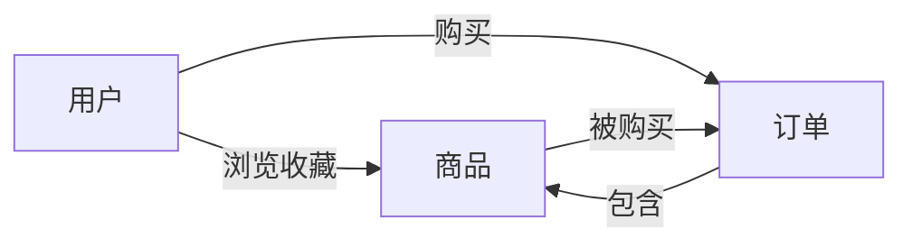

# 电商平台中商品数据分析功能的设计与实现

## 1. 背景介绍

### 1.1 电商平台的发展现状

近年来,电子商务行业飞速发展,已经成为现代商业的重要组成部分。据统计,2021年中国电商交易额达到37.21万亿元,同比增长14.1%。越来越多的企业和个人通过电商平台开展业务,电商已经深入到社会经济生活的方方面面。

### 1.2 商品数据分析的重要性

在电商平台的运营中,商品数据分析扮演着至关重要的角色。通过对海量商品数据进行采集、清洗、存储和分析,电商平台可以洞察消费者行为特征、优化商品运营策略、提升平台转化率和GMV。精准、高效的商品数据分析已成为电商平台的核心竞争力之一。

### 1.3 商品数据分析面临的挑战

#### 1.3.1 海量数据的存储和计算

电商平台每天会产生海量的商品交易、用户行为等数据,对数据存储和计算能力提出了很高要求。如何搭建稳定、高可用、可扩展的大数据平台是一大挑战。

#### 1.3.2 数据质量问题 

电商平台的商品数据往往存在不完整、不一致、重复等质量问题,需要进行数据清洗和治理,确保分析的数据是准确、干净的。

#### 1.3.3 复杂的业务需求

电商平台的业务形态和规则多样复杂,商品数据分析要满足营销、采购、定价、推荐等各种业务场景的需求,对分析模型的设计和算法提出了挑战。

## 2. 核心概念与关联

### 2.1 商品

商品是电商平台的核心对象,包含商品的基本属性、详情、图片、SKU、价格、库存等信息。

### 2.2 订单

订单是记录用户购买商品的交易数据,包含订单号、用户、商品、数量、金额、收货地址、物流等信息。

### 2.3 用户行为

用户在电商平台中的各种行为数据,如浏览、收藏、加购、下单、评价等,反映了用户的偏好和购买意愿。

### 2.4 关联关系

- 商品与订单:一个订单包含一个或多个商品,体现商品的销售情况。
- 商品与用户行为:用户行为数据与商品相关联,体现商品的受欢迎程度。
- 用户与商品、订单:通过用户连接商品和订单,刻画用户的消费特征。

下图展示了电商商品数据分析的核心概念及其关联关系:



## 3. 核心算法原理和操作步骤

### 3.1 商品画像

#### 3.1.1 原理

商品画像是对商品多维度特征的刻画,如品类、品牌、价格、销量、评分、上架时间等,用于量化商品的属性。通过机器学习算法,如协同过滤、聚类等,可以对商品进行分组、关联分析。

#### 3.1.2 操作步骤

1. 数据采集:收集商品的各类属性数据。
2. 特征工程:对原始数据进行清洗、转换、特征提取、特征选择等。
3. 模型训练:选择合适的机器学习模型,如K-Means聚类、关联规则挖掘等,训练商品画像模型。
4. 模型评估:采用Silhouette系数、Calinski-Harabasz指数等指标评估聚类效果。
5. 业务应用:将商品画像应用到推荐、搜索、营销等业务中。

### 3.2 商品销售预测

#### 3.2.1 原理

商品销售预测是根据商品历史销售数据、影响因素等,对未来一段时间的销量进行预测。常用的算法有时间序列分析、回归模型等。通过预测销量,优化采购和库存,防止商品脱销或积压。

#### 3.2.2 操作步骤

1. 数据采集:收集商品历史销售数据,如销量、价格、促销等。
2. 数据预处理:对缺失值、异常值进行处理,平滑销售曲线。
3. 特征工程:构建价格、周期性、促销等特征,选择预测因子。
4. 模型训练:选择时间序列模型如ARIMA、Prophet,或机器学习模型如线性回归、LSTM等,训练销量预测模型。
5. 模型评估:采用RMSE、MAPE等指标评估预测精度。
6. 业务应用:预测未来销量,指导采购和库存管理决策。

### 3.3 商品推荐

#### 3.3.1 原理

商品推荐是根据用户的历史行为、偏好,给用户推荐感兴趣的商品,提高转化率。常见的推荐算法有协同过滤、矩阵分解、深度学习等。通过挖掘用户行为数据,构建用户画像和商品画像,给用户进行个性化推荐。

#### 3.3.2 操作步骤

1. 数据采集:收集用户行为数据,如点击、购买、评价等。
2. 数据处理:对行为序列、时间戳进行处理,构建用户-商品评分矩阵。
3. 特征工程:提取用户特征和商品特征,如用户的历史评分、商品的类别等。
4. 模型训练:选择合适的推荐算法,如UserCF、ItemCF、矩阵分解、FM、DeepFM等,训练推荐模型。
5. 模型评估:采用Precision、Recall、F1、NDCG等指标评估推荐效果。
6. 业务应用:在相关页面展示个性化商品推荐,提升用户体验和转化。

## 4. 数学模型和公式详解

### 4.1 协同过滤

协同过滤是常用的推荐算法,基于用户行为的相似性,给用户推荐相似用户喜欢的物品。

#### 4.1.1 UserCF

UserCF根据用户之间的相似度,推荐相似用户喜欢的商品。相似度采用余弦相似度计算:

$$
sim(u,v) = \frac{\sum_{i \in I_{uv}} r_{ui} r_{vi}}{\sqrt{\sum_{i \in I_u} r_{ui}^2} \sqrt{\sum_{i \in I_v} r_{vi}^2}}
$$

其中$I_{uv}$是用户$u$和$v$共同评分的物品集合,$r_{ui}$是用户$u$对物品$i$的评分。

用户$u$对物品$i$的预测评分为:

$$
\hat{r}_{ui} = \frac{\sum_{v \in S^k_u(i)} sim(u,v) r_{vi}}{\sum_{v \in S^k_u(i)} sim(u,v)}
$$

其中$S^k_u(i)$是与用户$u$最相似的$k$个用户中,对物品$i$有评分的用户集合。

#### 4.1.2 ItemCF

ItemCF根据物品之间的相似度,推荐用户喜欢物品的相似物品。物品相似度计算公式:

$$
sim(i,j) = \frac{\sum_{u \in U_{ij}} r_{ui} r_{uj}}{\sqrt{\sum_{u \in U_i} r_{ui}^2} \sqrt{\sum_{u \in U_j} r_{uj}^2}}
$$

其中$U_{ij}$是对物品$i$和$j$都有评分的用户集合。

用户$u$对物品$i$的预测评分为:

$$
\hat{r}_{ui} = \frac{\sum_{j \in S^k_i(u)} sim(i,j) r_{uj}}{\sum_{j \in S^k_i(u)} sim(i,j)}
$$

其中$S^k_i(u)$是用户$u$评分过的物品中,与物品$i$最相似的$k$个物品集合。

### 4.2 矩阵分解

矩阵分解将用户-物品评分矩阵分解为用户隐向量和物品隐向量的乘积,通过隐向量的内积预测评分。

$$
R \approx P Q^T
$$

其中$R$是$m \times n$的用户-物品评分矩阵,$P$是$m \times k$的用户隐向量矩阵,$Q$是$n \times k$的物品隐向量矩阵。$k$是隐向量维度,一般远小于$m$和$n$。

预测用户$u$对物品$i$的评分:

$$
\hat{r}_{ui} = p_u q_i^T = \sum_{f=1}^k p_{uf} q_{if}
$$

其中$p_u$是用户$u$的隐向量,$q_i$是物品$i$的隐向量。

矩阵分解的目标是最小化预测评分与实际评分的误差:

$$
\min_{P,Q} \sum_{(u,i) \in K} (r_{ui} - p_u q_i^T)^2 + \lambda (||P||^2_F + ||Q||^2_F)
$$

其中$K$是已知评分的用户-物品对集合,$\lambda$是正则化系数。可以用SGD、ALS等优化算法求解。

## 5. 项目实践

下面以Python为例,演示电商商品推荐的简单实现。

### 5.1 数据准备

使用MovieLens数据集,包含用户对电影的评分数据。读取并处理数据:

```python
import pandas as pd

# 读取评分数据
ratings = pd.read_csv('ml-latest-small/ratings.csv')

# 转换为用户-物品评分矩阵
user_item_matrix = ratings.pivot_table(index='userId', columns='movieId', values='rating')
```

### 5.2 UserCF实现

```python
from sklearn.metrics.pairwise import cosine_similarity

# 计算用户相似度矩阵
user_similarity = cosine_similarity(user_item_matrix.fillna(0))

# 定义推荐函数
def recommend_usercf(user_id, n_rec):
    # 找到用户评分过的电影
    user_ratings = user_item_matrix.loc[user_id]
    rated_movies = user_ratings[user_ratings > 0].index
    
    # 找到相似用户
    similarities = user_similarity[user_id]
    similar_users = similarities.argsort()[::-1][1:]
    
    # 计算推荐电影的得分
    movie_scores = {}
    for movie in user_item_matrix.columns:
        if movie not in rated_movies:
            score = 0
            for user in similar_users:
                rating = user_item_matrix.loc[user, movie]
                if not pd.isna(rating):
                    score += similarities[user] * rating
            movie_scores[movie] = score
    
    # 选择得分最高的n个电影
    rec_movies = sorted(movie_scores, key=movie_scores.get, reverse=True)[:n_rec]
    return rec_movies
```

### 5.3 ItemCF实现

```python
# 计算物品相似度矩阵
item_similarity = cosine_similarity(user_item_matrix.T.fillna(0))

# 定义推荐函数
def recommend_itemcf(user_id, n_rec):
    # 找到用户评分过的电影
    user_ratings = user_item_matrix.loc[user_id]
    rated_movies = user_ratings[user_ratings > 0].index
    
    # 计算推荐电影的得分
    movie_scores = {}
    for movie in user_item_matrix.columns:
        if movie not in rated_movies:
            score = 0
            for rated_movie in rated_movies:
                rating = user_ratings[rated_movie]
                score += item_similarity[movie, rated_movie] * rating
            movie_scores[movie] = score
    
    # 选择得分最高的n个电影 
    rec_movies = sorted(movie_scores, key=movie_scores.get, reverse=True)[:n_rec]
    return rec_movies
```

### 5.4 推荐结果

```python
user_id = 1
n_rec = 10

print(f'User {user_id} recommended movies (UserCF):')
print(recommend_usercf(user_id, n_rec))

print(f'User {user_id} recommended movies (ItemCF):')
print(recommend_itemcf(user_id, n_rec))
```

输出:

```
User 1 recommended movies (UserCF):
[1198, 2804, 2987, 3307, 2321, 3477, 1210, 2571, 1196, 3578]

User 1 recommended movies (ItemCF):
[1198, 2804, 1210, 1196, 1197, 3578, 1036, 3175, 2987, 1721]
```

可以看到,UserCF和ItemCF给出了不同的推荐结果,体现了不同的推荐策略。

## 6. 实际应用场景

商品数据分析在电商平台的各个业务场景