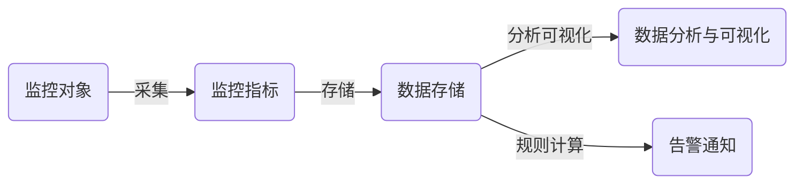

# 监控网站详细设计与具体代码实现

## 1. 背景介绍

在当今互联网时代,网站已经成为企业和个人展示自己、提供服务的重要窗口。然而,随着网站规模的不断扩大和复杂度的提高,网站的可用性、安全性、性能等问题日益突出。为了保证网站的稳定运行,及时发现和解决问题,建立一套完善的网站监控系统变得至关重要。

本文将详细介绍如何设计和实现一个功能强大、易于扩展的网站监控系统。我们将从监控系统的整体架构入手,逐步深入到各个模块的设计和实现,并给出具体的代码示例。通过本文,读者将掌握网站监控系统的核心概念、关键技术和最佳实践,并能够根据自己的需求搭建一套适合的监控系统。

### 1.1 网站监控的重要性

在介绍监控系统的设计和实现之前,我们先来了解一下网站监控的重要性:

1. 保证网站可用性:通过实时监控网站的运行状态,及时发现和报警故障,确保网站24x7不间断运行。
2. 提升用户体验:监控网站的响应时间、可用性等关键指标,优化性能瓶颈,为用户提供流畅的访问体验。 
3. 及时发现安全问题:监控网站的异常流量、攻击行为等安全威胁,及时采取防护措施,保障网站和用户的数据安全。
4. 辅助问题定位:通过收集和分析监控数据,快速定位故障原因,缩短故障处理时间。
5. 容量规划与优化:基于监控数据分析网站的流量趋势、资源使用情况,合理规划和优化网站容量。

### 1.2 监控系统的核心诉求

一个优秀的网站监控系统需要满足以下核心诉求:

1. 全面覆盖:能够监控网站的方方面面,包括服务器、网络、应用、数据库、安全等各个层面。
2. 实时准确:监控数据要尽可能实时采集和呈现,确保监控的准确性和及时性。
3. 易用灵活:提供友好的界面和灵活的配置,让用户能够轻松上手和定制监控需求。
4. 智能告警:提供多样化的告警方式,支持智能化的告警策略,减少误报和漏报。
5. 可扩展性:支持平滑扩容和新功能的快速接入,满足网站规模和业务的持续增长。

## 2. 核心概念与联系

在深入讲解网站监控系统的设计和实现之前,我们先来了解一下监控系统涉及的几个核心概念:

### 2.1 监控对象

监控对象是指需要被监控的实体,在网站监控场景下主要包括:

- 服务器:网站依赖的物理机、虚拟机、云主机等计算资源。
- 网络:网站服务器之间、服务器与用户之间的网络连接和通信质量。
- 应用:承载网站业务的各类应用服务,如Web服务、缓存、消息队列等。
- 数据库:网站依赖的各类数据存储服务,如关系型数据库、NoSQL数据库等。
- 安全设备:为网站提供安全防护的软硬件设施,如防火墙、WAF、入侵检测等。

### 2.2 监控指标

监控指标是量化评估监控对象状态的数值度量,常见的监控指标包括:

- 可用性:服务是否正常运行和对外提供服务,通常用正常率、故障率等表示。
- 性能:服务的处理能力和效率,如响应时间、吞吐量、资源利用率等。
- 错误:服务运行过程中各类异常和错误,如系统错误、业务错误等。
- 安全:服务面临的各类安全威胁和攻击,如恶意请求、异常流量等。

### 2.3 数据采集

数据采集是指以一定的频率从监控对象周期性地获取监控指标数据的过程。常见的数据采集方式有:

- 主动拉取:监控系统主动向监控对象发起数据采集请求,定期拉取监控数据。
- 被动上报:监控对象主动向监控系统上报监控数据,监控系统被动接收。
- 日志分析:对监控对象产生的各类日志进行收集和分析,提取关键的监控指标数据。

### 2.4 数据存储

数据存储是指将采集到的监控数据持久化存储的过程,为后续的分析、展示、告警等提供数据支撑。根据数据特点和查询需求,常见的监控数据存储方案有:

- 时序数据库:适合存储时间序列的监控指标数据,提供快速的聚合查询能力,如OpenTSDB、InfluxDB等。
- 关系型数据库:适合存储结构化的元数据和配置数据,提供灵活的查询和管理能力,如MySQL、PostgreSQL等。
- NoSQL数据库:适合存储半结构化或非结构化的日志、事件等数据,提供高吞吐的写入和弹性扩展能力,如Elasticsearch、Cassandra等。

### 2.5 数据分析与可视化

数据分析与可视化是指对监控数据进行统计、聚合、关联分析,并以直观的图形化方式呈现的过程。常见的数据分析与可视化手段包括:

- 统计分析:对监控指标数据进行统计计算,生成最大值、最小值、平均值、分位值等统计量。
- 聚合分析:按照某些维度对监控数据进行聚合,展示一段时间内的趋势变化。
- 关联分析:挖掘不同监控指标之间的关联性,发现影响服务的关键因素。
- 仪表盘:通过丰富的图表形式(如折线图、柱状图、饼图等)直观展示监控数据。
- 报表:定期生成监控数据的分析报告,帮助相关人员了解服务质量和运行状态。

### 2.6 告警通知

告警通知是指监控系统基于预先设置的阈值规则,对异常的监控指标及时触发告警,并通过多种渠道通知相关人员处理的过程。常见的告警通知方式有:

- 邮件:发送告警邮件到指定的邮箱列表。
- 短信:发送告警短信到指定的手机号码。
- 微信:通过企业微信或微信公众号发送告警通知。
- 电话:通过语音电话通知值班人员处理告警。
- 工单:自动创建故障工单,触发故障处理流程。

### 2.7 概念之间的关系

了解了监控系统的核心概念后,我们再来梳理一下它们之间的关系:

从流程上看,监控系统从监控对象采集各类监控指标数据,将其存储在适合的后端存储,一方面通过数据分析和可视化技术挖掘数据的价值,另一方面设置告警规则,对异常情况及时通知处理。

## 3. 核心算法原理具体操作步骤

本节我们将重点介绍网站监控系统涉及的几个核心算法原理,包括数据采集、异常检测、健康度评估等,并给出详细的操作步骤。

### 3.1 数据采集算法

数据采集是监控系统的数据来源,采集的质量和效率直接影响监控的准确性和实时性。以下是一种通用的数据采集算法:

1. 设置采集对象:确定需要采集的监控对象列表,如服务器、网络设备、应用服务等。
2. 定义采集指标:针对每个采集对象,设置需要采集的监控指标,如CPU使用率、内存占用、请求量等。
3. 选择采集方式:根据采集对象的特点和接口能力,选择合适的采集方式,如API调用、日志解析、SNMP协议等。
4. 设置采集周期:确定每个采集指标的采集频率,如每分钟采集一次。
5. 执行采集任务:在每个采集周期到达时,并发执行所有采集任务,从采集对象获取监控指标数据。
6. 数据校验与清洗:对采集到的数据进行校验和清洗,剔除无效或异常的数据点。
7. 数据打标与入库:为采集到的数据添加必要的元数据标签(如时间戳、主机名等),并写入后端存储。
8. 更新采集状态:记录每个采集任务的执行状态和耗时,用于监控采集过程本身的质量。

### 3.2 异常检测算法

异常检测是监控系统的核心功能之一,通过连续的监控指标数据,判断服务是否出现异常,常用的异常检测算法包括:

#### 3.2.1 阈值法

阈值法是最简单的异常检测方法,通过人工设置监控指标的正常阈值范围,当指标值超出阈值时,判定为异常。

1. 设置阈值规则:为每个监控指标设置正常阈值上限和下限。
2. 获取指标数据:实时获取最新的监控指标数据。
3. 阈值判断:将指标数据与阈值规则进行比较,判断是否超出阈值范围。
4. 异常报警:如果指标数据超出阈值,触发异常报警,通知相关人员处理。

阈值法实现简单,但需要人工设置和调整阈值,且难以应对复杂场景下的动态阈值需求。

#### 3.2.2 统计法

统计法利用统计学原理,通过分析指标数据的历史分布,自动判断异常阈值,常见的统计法包括:

- 3σ原则:假设指标数据服从正态分布,以 $\mu \pm 3\sigma$ 作为正常范围,超出范围即为异常。其中 $\mu$ 为均值,$\sigma$ 为标准差。
- 百分位法:取指标数据的某个百分位(如99%)作为异常阈值,超出阈值即为异常。
- 离群点检测:通过聚类、分类等机器学习算法,自动识别和剔除离群点数据。

以3σ原则为例,其异常检测步骤如下:

1. 获取历史数据:获取一段时间内(如最近1天或1周)的指标历史数据。
2. 计算数据分布:对历史数据进行统计分析,计算出均值 $\mu$ 和标准差 $\sigma$。
3. 计算异常阈值:以 $\mu \pm 3\sigma$ 计算出指标数据的正常范围。
4. 判断是否异常:将最新的指标数据与正常范围比较,判断是否异常。
5. 异常报警:如果指标数据超出正常范围,触发异常报警,通知相关人员处理。

统计法能够自动适应数据的分布特点,减少人工配置阈值的工作量。但其假设数据服从某种分布,在实际场景中并不总是成立。

#### 3.2.3 机器学习法

机器学习法通过历史数据训练异常检测模型,实现更智能、更准确的异常判断,常见的机器学习法包括:

- 有监督学习:使用正常和异常的标注数据训练分类模型,如SVM、决策树等。
- 无监督学习:无需标注数据,通过聚类、密度估计等方法,自动发现异常点,如K-Means、LOF等。
- 时间序列分析:利用时间序列模型如ARIMA、Prophet等,预测未来指标走势,提前发现异常。

以无监督学习中的LOF(Local Outlier Factor)算法为例,其异常检测步骤如下:

1. 获取历史数据:获取一段时间内的指标历史数据作为训练集。
2. 特征工程:对数据进行清洗、归一化、特征提取等预处理操作。
3. 计算LOF值:对每个数据点,计算其与周围k个邻居的平均距离,再与邻居的平均距离比较,得到LOF异常度量值。
4. 设置异常阈值:根据LOF值的分布,设置一个异常阈值,如前10%的LOF值。
5.