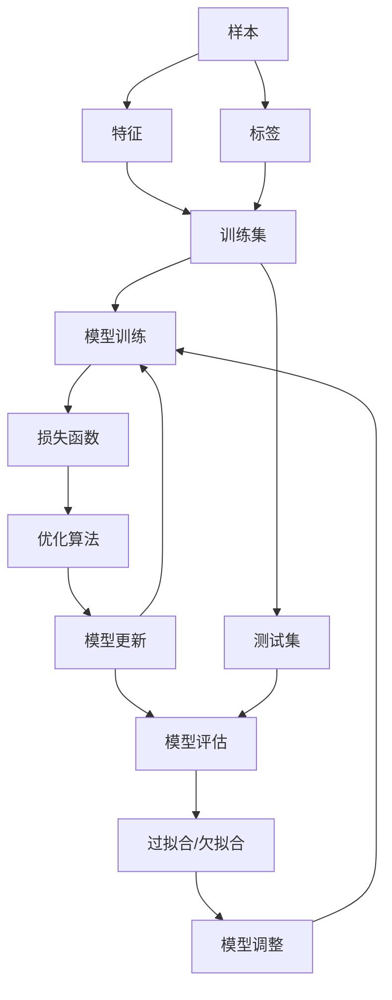

# 监督学习(Supervised Learning) - 原理与代码实例讲解

## 1.背景介绍

在机器学习领域中,监督学习是一种基本且广泛应用的技术。它是通过从标注的训练数据中学习出一个函数映射,使得当新的输入数据传入时,可以根据已学习的映射关系对其进行预测或分类。监督学习在各个领域都有广泛的应用,如图像识别、自然语言处理、推荐系统等。

监督学习的任务可以分为两大类:回归(Regression)和分类(Classification)。回归任务是预测一个连续值的输出,如房价预测;而分类任务则是预测一个离散值的输出,如垃圾邮件分类。无论是回归还是分类,监督学习的核心思想都是基于大量的训练数据来学习出一个映射模型。

## 2.核心概念与联系

监督学习涉及以下几个核心概念:

1. **样本(Sample)**: 由特征(Features)和标签(Label)组成的数据实例。

2. **特征(Features)**: 描述样本实例的属性,通常以向量形式表示。

3. **标签(Label)**: 样本实例对应的监督信息,即我们希望学习和预测的目标值。

4. **训练集(Training Set)**: 包含已标注样本的数据集,用于训练模型。

5. **测试集(Test Set)**: 包含未标注样本的数据集,用于评估模型性能。

6. **损失函数(Loss Function)**: 衡量模型预测值与真实值之间差异的函数。

7. **优化算法(Optimization Algorithm)**: 通过最小化损失函数来更新模型参数的算法。

8. **过拟合(Overfitting)**: 模型过于复杂,导致在训练集上表现良好但在新数据上表现差的情况。

9. **欠拟合(Underfitting)**: 模型过于简单,无法很好地捕捉数据的潜在规律。

这些概念相互关联,构成了监督学习的基本框架。我们通过优化算法来最小化损失函数,从而学习出一个能够很好地拟合训练数据并具有良好泛化能力的模型。

## 3.核心算法原理具体操作步骤

监督学习算法的核心步骤如下:

1. **数据预处理**: 对原始数据进行清洗、标准化、特征工程等预处理,以提高数据质量。

2. **数据分割**: 将数据集分为训练集和测试集,通常采用留出法(Hold-Out)或交叉验证(Cross-Validation)的方式。

3. **模型选择**: 根据问题的性质选择合适的监督学习算法,如线性回归、逻辑回归、决策树、支持向量机等。

4. **模型训练**: 使用优化算法(如梯度下降)在训练集上训练模型,目标是最小化损失函数。

5. **模型评估**: 在测试集上评估模型的性能,常用指标如准确率、精确率、召回率、F1分数等。

6. **模型调优**: 根据评估结果,通过调整模型超参数、特征工程或集成学习等方式来提高模型性能。

7. **模型部署**: 将调优后的模型应用于实际场景,对新的输入数据进行预测或分类。

这些步骤通常需要反复迭代,直到获得满意的模型性能。下面以线性回归为例,详细介绍监督学习算法的原理和实现。

### 3.1 线性回归

线性回归是一种常用的监督学习算法,用于解决回归问题。它假设目标值 $y$ 和特征向量 $\boldsymbol{x}$ 之间存在线性关系,即:

$$y = \boldsymbol{w}^T\boldsymbol{x} + b$$

其中, $\boldsymbol{w}$ 是权重向量, $b$ 是偏置项。线性回归的目标是找到最优的 $\boldsymbol{w}$ 和 $b$,使得模型在训练数据上的预测值与真实值之间的差异最小。

常用的损失函数是均方误差(Mean Squared Error, MSE):

$$\text{MSE}(\boldsymbol{w}, b) = \frac{1}{n}\sum_{i=1}^{n}(y_i - \boldsymbol{w}^T\boldsymbol{x}_i - b)^2$$

其中, $n$ 是训练样本的数量。我们需要通过优化算法来最小化 MSE,从而找到最优的 $\boldsymbol{w}$ 和 $b$。

#### 3.1.1 梯度下降法

梯度下降(Gradient Descent)是一种常用的优化算法,它通过迭代的方式不断更新模型参数,使损失函数值不断减小。具体步骤如下:

1. 初始化模型参数 $\boldsymbol{w}$ 和 $b$,通常使用小的随机值。
2. 计算损失函数 $\text{MSE}(\boldsymbol{w}, b)$ 对 $\boldsymbol{w}$ 和 $b$ 的偏导数(梯度)。
3. 根据梯度的方向,更新 $\boldsymbol{w}$ 和 $b$:

$$\boldsymbol{w} \leftarrow \boldsymbol{w} - \alpha \frac{\partial \text{MSE}}{\partial \boldsymbol{w}}$$
$$b \leftarrow b - \alpha \frac{\partial \text{MSE}}{\partial b}$$

其中, $\alpha$ 是学习率(Learning Rate),控制每次更新的步长。
4. 重复步骤2和3,直到损失函数收敛或达到最大迭代次数。

梯度下降法的关键在于计算梯度。对于线性回归的 MSE 损失函数,梯度如下:

$$\frac{\partial \text{MSE}}{\partial \boldsymbol{w}} = \frac{2}{n}\sum_{i=1}^{n}(\boldsymbol{w}^T\boldsymbol{x}_i + b - y_i)\boldsymbol{x}_i$$
$$\frac{\partial \text{MSE}}{\partial b} = \frac{2}{n}\sum_{i=1}^{n}(\boldsymbol{w}^T\boldsymbol{x}_i + b - y_i)$$

通过不断迭代更新 $\boldsymbol{w}$ 和 $b$,我们可以找到使 MSE 最小的参数值,从而得到最优的线性回归模型。

#### 3.1.2 正规方程

除了梯度下降法,我们还可以使用正规方程(Normal Equation)来直接求解线性回归的最优解。正规方程的推导过程如下:

首先,我们定义向量 $\boldsymbol{y}$ 和矩阵 $\boldsymbol{X}$:

$$\boldsymbol{y} = \begin{bmatrix}
y_1\\
y_2\\
\vdots\\
y_n
\end{bmatrix}, \quad
\boldsymbol{X} = \begin{bmatrix}
\boldsymbol{x}_1^T & 1\\
\boldsymbol{x}_2^T & 1\\
\vdots & \vdots\\
\boldsymbol{x}_n^T & 1
\end{bmatrix}$$

则线性回归模型可以表示为:

$$\boldsymbol{y} = \boldsymbol{X}\begin{bmatrix}
\boldsymbol{w}\\
b
\end{bmatrix}$$

我们将模型参数 $\boldsymbol{w}$ 和 $b$ 合并为一个向量 $\boldsymbol{\theta} = \begin{bmatrix}
\boldsymbol{w}\\
b
\end{bmatrix}$,则目标是找到使 MSE 最小的 $\boldsymbol{\theta}$:

$$\min_{\boldsymbol{\theta}} \frac{1}{2}\|\boldsymbol{X}\boldsymbol{\theta} - \boldsymbol{y}\|_2^2$$

对上式求导并令其等于零,可以得到:

$$\boldsymbol{X}^T\boldsymbol{X}\boldsymbol{\theta} = \boldsymbol{X}^T\boldsymbol{y}$$

由此,我们可以直接解出最优的 $\boldsymbol{\theta}$:

$$\boldsymbol{\theta} = (\boldsymbol{X}^T\boldsymbol{X})^{-1}\boldsymbol{X}^T\boldsymbol{y}$$

其中, $(\boldsymbol{X}^T\boldsymbol{X})^{-1}\boldsymbol{X}^T$ 被称为矩阵的伪逆(Pseudo-Inverse)。

正规方程直接给出了线性回归的解析解,不需要迭代。但是,当特征数量很大时,计算矩阵的逆会非常耗时,因此通常只在小规模数据集上使用正规方程。

### 3.2 逻辑回归

逻辑回归(Logistic Regression)是一种用于解决分类问题的监督学习算法。它的原理是通过sigmoid函数将线性回归的输出值映射到(0,1)区间,从而可以将其解释为概率值,进行二分类。

对于二分类问题,我们定义 $y \in \{0, 1\}$ 为样本的标签。逻辑回归模型如下:

$$h_{\boldsymbol{\theta}}(\boldsymbol{x}) = \frac{1}{1 + e^{-\boldsymbol{\theta}^T\boldsymbol{x}}}$$

其中, $\boldsymbol{\theta}$ 是模型参数向量。我们的目标是找到使得 $h_{\boldsymbol{\theta}}(\boldsymbol{x})$ 尽可能接近 $y$ 的 $\boldsymbol{\theta}$ 值。

#### 3.2.1 损失函数

对于逻辑回归,我们使用对数似然损失函数(Log-Likelihood Loss):

$$J(\boldsymbol{\theta}) = \frac{1}{m}\sum_{i=1}^{m}\Big[-y^{(i)}\log(h_{\boldsymbol{\theta}}(\boldsymbol{x}^{(i)})) - (1 - y^{(i)})\log(1 - h_{\boldsymbol{\theta}}(\boldsymbol{x}^{(i)}))\Big]$$

其中, $m$ 是训练样本的数量。我们需要最小化这个损失函数,从而得到最优的 $\boldsymbol{\theta}$。

#### 3.2.2 梯度下降法

与线性回归类似,我们可以使用梯度下降法来优化逻辑回归的损失函数。梯度计算如下:

$$\frac{\partial J(\boldsymbol{\theta})}{\partial \boldsymbol{\theta}} = \frac{1}{m}\sum_{i=1}^{m}(h_{\boldsymbol{\theta}}(\boldsymbol{x}^{(i)}) - y^{(i)})\boldsymbol{x}^{(i)}$$

根据梯度的方向,我们可以不断更新 $\boldsymbol{\theta}$,直到损失函数收敛。

#### 3.2.3 决策边界

在二分类问题中,逻辑回归模型会将样本划分到0类或1类。决策边界由以下公式确定:

$$\boldsymbol{\theta}^T\boldsymbol{x} = 0$$

当 $\boldsymbol{\theta}^T\boldsymbol{x} \geq 0$ 时,样本被划分到1类;否则划分到0类。决策边界是一个超平面,将特征空间划分为两个区域。

逻辑回归可以扩展到多分类问题,通过One-vs-Rest或Softmax等策略将其转化为多个二分类问题。

### 3.3 决策树

决策树(Decision Tree)是一种常用的监督学习算法,可以用于回归和分类问题。它通过递归地构建决策树模型,将特征空间划分为互不相交的区域,并为每个区域预测一个值。

#### 3.3.1 决策树构建

决策树的构建过程如下:

1. 从根节点开始,选择一个最优特征及其分割点,将训练数据划分为两个子集。
2. 对每个子集重复步骤1,构建决策树的子节点,直到满足停止条件。
3. 生成叶节点,为每个区域预测一个值(回归问题预测值,分类问题预测类别)。

选择最优特征及其分割点的标准是信息增益(Information Gain)或基尼系数(Gini Impurity)。对于分类问题,信息增益定义为:

$$\text{Gain}(D, a) = \text{Entropy}(D) - \sum_{v=1