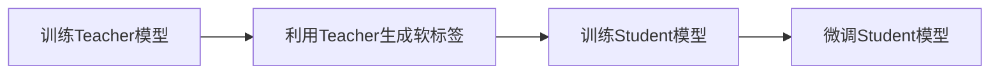

# 知识蒸馏原理与代码实战案例讲解

## 1. 背景介绍
### 1.1 知识蒸馏的起源与发展
知识蒸馏(Knowledge Distillation)是一种将大型复杂模型的知识迁移到小型简单模型的技术。这一概念最早由Hinton等人在2015年的论文《Distilling the Knowledge in a Neural Network》中提出。随后,知识蒸馏技术在深度学习领域得到了广泛的应用和发展,成为模型压缩和加速的重要方法之一。

### 1.2 知识蒸馏的意义
深度神经网络在各种任务上取得了瞩目的成绩,但随之而来的问题是模型越来越大、计算开销越来越高,难以在资源受限的场景下部署。知识蒸馏为解决这一问题提供了新的思路:通过蒸馏,我们可以在保持模型性能的同时大幅降低模型的体积和计算量,使之更容易在边缘设备上运行。此外,蒸馏还能起到正则化的作用,有助于提高模型的泛化能力。

### 1.3 知识蒸馏的应用场景
知识蒸馏在工业界有着广泛的应用,主要场景包括:
- 移动端部署:将大型模型蒸馏成适合在手机、IoT设备等资源受限平台上运行的小模型
- 推理加速:通过蒸馏降低模型计算量,提高推理速度
- 联邦学习:利用蒸馏在不共享原始数据的情况下进行分布式训练
- 增量学习:用蒸馏的方式将新增类别的知识融入已有模型,避免灾难性遗忘

## 2. 核心概念与联系
### 2.1 Teacher 模型与 Student 模型
Teacher模型通常是一个大型的、训练充分的网络,具有很高的性能但计算开销也很大。我们希望Student模型能够继承Teacher的"知识",在更小的网络规模下达到相近的性能水平。Student模型一般采用更加轻量化的架构,如MobileNet、ShuffleNet等。

### 2.2 软标签与硬标签
硬标签(Hard Label)是指普通的one-hot标签,而软标签(Soft Label)则是模型输出的概率分布。软标签蕴含了更多的信息,Teacher模型学到的知识很大一部分就体现在软标签上。因此在蒸馏过程中,Student模型不仅要去匹配硬标签,更要去拟合Teacher模型产生的软标签。

### 2.3 温度系数
温度(Temperature)是一个超参数,在计算软标签时用于平滑概率分布。具体而言,模型原始的logits输出会除以一个温度系数T,然后再进行softmax归一化。温度越高,软标签的分布就越"软",不同类别之间的差异性降低;温度越低,分布越"硬",接近于one-hot形式。合适的温度系数能够在知识蒸馏中起到关键作用。

### 2.4 蒸馏损失与学生损失
蒸馏的目标是最小化Student模型和Teacher模型输出的差异,通常采用KL散度(Kullback–Leibler divergence)来度量这种差异,称为蒸馏损失(Distillation Loss)。同时,Student模型还要最小化自身输出与真实标签之间的交叉熵损失,称为学生损失(Student Loss)。二者一般采用加权平均的形式联合优化。

## 3. 核心算法原理与具体步骤
### 3.1 算法流程概览
知识蒸馏的主要步骤如下:
1. 训练一个大型且性能优异的Teacher模型
2. 利用Teacher模型的输出产生软标签
3. 使用软标签作为额外的监督信号,训练一个轻量级的Student模型
4. 微调Student模型,进一步提升其性能



### 3.2 损失函数设计
蒸馏过程的核心在于损失函数的设计。假设Teacher模型输出的软标签为 $q_i$,Student模型的输出为 $p_i$,真实标签为 $y_i$,蒸馏损失和学生损失分别定义为:

$$
\mathcal{L}_{distill} = \sum_i{q_i \log\frac{q_i}{p_i}} \\
\mathcal{L}_{student} = \sum_i{y_i \log{p_i}}
$$

二者结合得到最终的损失函数:

$$
\mathcal{L} = \alpha \mathcal{L}_{distill} + (1-\alpha) \mathcal{L}_{student}
$$

其中 $\alpha$ 为蒸馏损失的权重系数,通过交叉验证确定。

### 3.3 蒸馏策略与技巧
- 软标签温度: 一般取较高的温度(如T=20),使得软标签的分布更加平滑,便于Student模型学习
- 数据增强: 在蒸馏过程中对输入数据进行增强,可以提高Student模型的鲁棒性
- 渐进蒸馏: 先用Hard Label训练Student模型,再逐渐增大蒸馏损失的权重,平滑过渡
- 层级蒸馏: 不仅在输出层做蒸馏,也可以在中间层引入蒸馏损失,传递更多的信息

## 4. 数学模型和公式详解
### 4.1 KL散度的直观理解
KL散度衡量了两个概率分布之间的差异性,公式为:

$$
D_{KL}(p||q) = \sum_i{p_i \log\frac{p_i}{q_i}}
$$

当 $p_i$ 和 $q_i$ 完全一致时,KL散度为0;当二者差异很大时,KL散度的值就会很高。因此,最小化KL散度就是在拉近两个分布的距离。

在知识蒸馏中,我们让Student模型的输出分布去拟合Teacher模型的输出分布,本质上就是最小化二者的KL散度。

### 4.2 软标签的生成过程
软标签是Teacher模型基于原始logits输出生成的概率分布。设logits为 $z_i$,温度系数为 $T$,则软标签 $q_i$ 的计算公式为:

$$
q_i = \frac{\exp(z_i/T)}{\sum_j{\exp(z_j/T)}}
$$

可以看出,温度系数 $T$ 起到了平滑分布的作用。当 $T=1$ 时,软标签退化为普通的概率输出;当 $T$ 趋于无穷大时,软标签趋近于均匀分布。

### 4.3 蒸馏过程的优化目标
结合KL散度和交叉熵损失,Student模型的优化目标可以表示为:

$$
\min_{W_s} \alpha \sum_i{q_i \log\frac{q_i}{p_i}} + (1-\alpha) \sum_i{y_i \log{p_i}}
$$

其中 $W_s$ 为Student模型的参数, $\alpha$ 为蒸馏损失的权重系数。

通过反向传播和梯度下降,Student模型不断更新参数,最终在结构更加简单的情况下接近Teacher模型的性能。

## 5. 代码实例与讲解
下面以PyTorch为例,给出知识蒸馏的简要代码实现:

```python
import torch
import torch.nn as nn
import torch.nn.functional as F

# 定义Teacher和Student模型
class TeacherModel(nn.Module):
    def __init__(self):
        super().__init__()
        self.fc1 = nn.Linear(784, 1200)
        self.fc2 = nn.Linear(1200, 1200)  
        self.fc3 = nn.Linear(1200, 10)
        
    def forward(self, x):
        x = F.relu(self.fc1(x))
        x = F.dropout(x, p=0.8, training=self.training)
        x = F.relu(self.fc2(x))
        x = F.dropout(x, p=0.8, training=self.training)
        return self.fc3(x)

class StudentModel(nn.Module):
    def __init__(self):
        super().__init__()
        self.fc1 = nn.Linear(784, 20) 
        self.fc2 = nn.Linear(20, 20)
        self.fc3 = nn.Linear(20, 10)
        
    def forward(self, x):
        x = F.relu(self.fc1(x))
        x = F.relu(self.fc2(x))
        return self.fc3(x)

# 定义蒸馏损失函数
def distillation_loss(y, labels, teacher_scores, T, alpha):
    hard_loss = F.cross_entropy(y, labels) * (1. - alpha) 
    soft_loss = nn.KLDivLoss(reduction='batchmean')(F.log_softmax(y/T, dim=1), 
                             F.softmax(teacher_scores/T, dim=1)) * (alpha * T * T)
    return hard_loss + soft_loss

# 蒸馏训练
def train_student(student_model, teacher_model, dataloader, T=20, alpha=0.7):
    teacher_model.eval() 
    student_model.train()
    
    optimizer = optim.Adam(student_model.parameters(), lr=1e-3)
    
    for batch in dataloader:
        images, labels = batch
        images, labels = images.cuda(), labels.cuda()
        
        with torch.no_grad():
            teacher_scores = teacher_model(images)
            
        student_scores = student_model(images)
        loss = distillation_loss(student_scores, labels, teacher_scores, T, alpha)
        
        optimizer.zero_grad()
        loss.backward()
        optimizer.step()
```

代码解读:
1. 首先定义Teacher模型和Student模型,其中Student模型采用更小的网络结构
2. 定义蒸馏损失函数`distillation_loss`,由硬标签损失和软标签损失组成,可以通过`alpha`参数调节二者的权重
3. 在`train_student`函数中进行蒸馏训练,主要步骤为:
   - 将Teacher模型设为eval模式,Student模型设为train模式
   - 从数据集中加载一个batch,分别输入Teacher和Student模型
   - 计算蒸馏损失,反向传播更新Student模型的参数
4. 温度系数`T`和权重系数`alpha`可作为超参数进行调节

以上就是知识蒸馏算法的PyTorch实现,通过这个简单的例子,相信你对蒸馏的原理和细节有了更直观的理解。在实践中,你还可以探索更多的蒸馏策略,如对不同层应用蒸馏、渐进式蒸馏等,进一步提升Student模型的性能。

## 6. 实际应用场景
知识蒸馏在工业界有广泛的应用,下面列举几个典型的场景:

### 6.1 移动端部署
如今越来越多的AI应用需要在手机、IoT等边缘设备上运行,受限于设备的内存和算力,往往难以直接部署大型模型。通过知识蒸馏,我们可以将云端训练好的大模型蒸馏成适合边缘设备的小模型,在资源受限的情况下仍能提供良好的用户体验。比如,可以将BERT-Large蒸馏成BERT-Tiny,大幅降低模型体积,便于在手机上进行文本分类、问答等任务。

### 6.2 推理加速
对于一些实时性要求较高的应用,如自动驾驶、语音助手等,模型的推理速度至关重要。知识蒸馏可以在保持模型性能的同时,大幅降低计算开销,加快推理速度。例如,谷歌的MobileBERT就是利用蒸馏技术,将BERT模型压缩到适合移动设备的规模,在推理速度上取得了显著的提升。

### 6.3 联邦学习
在金融、医疗等领域,往往存在数据隐私保护的需求,不同机构之间难以直接共享原始数据。知识蒸馏为这一问题提供了新的解决思路:不同机构在本地用自己的数据训练Teacher模型,然后通过蒸馏的方式将知识迁移到一个共享的Student模型中,从而实现了在保护数据隐私的同时进行联合建模。

### 6.4 增量学习
在现实应用中,我们经常会遇到需要扩展已有模型的情况,比如在人脸识别系统中加入新的人脸类别。如果直接用新类别的数据去Fine-tune原模型,很容易发生"灾难性遗忘",导致模型在原有类别上的性能急剧下降。利用知识蒸馏,我们可以将原模型作为Teacher,在蒸馏的过程中同时学习新类别和