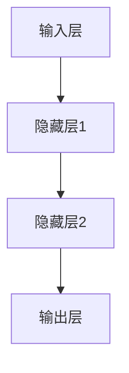
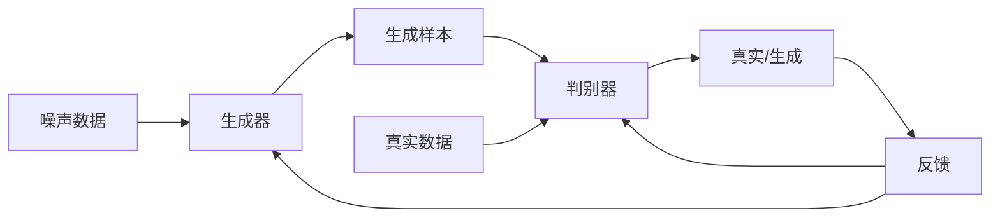

# 第一部分：深度学习基础

## 1. 背景介绍

深度学习是机器学习的一个新兴热门领域,近年来在计算机视觉、自然语言处理、语音识别等领域取得了令人瞩目的成就。深度学习的核心思想是通过对数据的特征进行自动学习,从而构建出更加精确和强大的模型。与传统的机器学习算法相比,深度学习模型具有更强的泛化能力,能够从海量数据中自动提取特征并进行建模,无需人工设计特征。

深度学习的发展可以追溯到20世纪80年代,当时的神经网络理论为深度学习奠定了基础。然而,由于计算能力的限制和训练算法的不完善,神经网络在当时并未获得广泛应用。直到近年来,大数据时代的到来、计算硬件的飞速发展以及一些突破性算法的提出,深度学习才得以重新焕发生机,并在各个领域展现出了强大的能力。

## 2. 核心概念与联系

### 2.1 神经网络

神经网络是深度学习的核心模型,它的设计灵感来源于生物神经系统。神经网络由多层神经元组成,每个神经元接收来自前一层的输入,经过激活函数的非线性转换后,将输出传递给下一层。通过这种层层传递和转换,神经网络能够学习到数据的内在规律和特征。

### 2.2 前向传播和反向传播

前向传播是神经网络的正向计算过程,将输入数据通过各层神经元进行传递,最终得到输出结果。反向传播则是根据输出结果和期望目标之间的误差,反向调整每层神经元的权重和偏置,使得模型的预测结果不断逼近期望目标。这种基于梯度下降的优化方法是训练深度学习模型的关键。

### 2.3 卷积神经网络

卷积神经网络(Convolutional Neural Network, CNN)是深度学习在计算机视觉领域的杰出代表。CNN通过卷积层和池化层对图像数据进行特征提取,具有很强的空间不变性,能够有效地捕捉图像的局部特征。CNN在图像分类、目标检测、语义分割等任务中表现出色。

### 2.4 循环神经网络

循环神经网络(Recurrent Neural Network, RNN)是处理序列数据的有力工具,在自然语言处理和语音识别等领域有广泛应用。RNN通过内部的循环连接,能够捕捉序列数据中的长期依赖关系,并根据当前输入和历史信息进行预测。长短期记忆网络(Long Short-Term Memory, LSTM)和门控循环单元(Gated Recurrent Unit, GRU)是RNN的两种常用变体,能够有效缓解梯度消失和梯度爆炸问题。

### 2.5 生成对抗网络

生成对抗网络(Generative Adversarial Network, GAN)是一种全新的深度学习模型,由生成器和判别器两个对抗网络组成。生成器的目标是生成逼真的样本数据,而判别器则需要区分生成的样本和真实数据。通过这种对抗训练,生成器和判别器相互竞争、相互促进,最终能够生成出高质量的数据。GAN在图像生成、语音合成、数据增广等领域有广泛应用。

## 3. 核心算法原理具体操作步骤

### 3.1 前向传播

前向传播是神经网络的正向计算过程,将输入数据通过各层神经元进行传递,最终得到输出结果。具体步骤如下:

1. 初始化网络权重和偏置
2. 输入层接收输入数据
3. 隐藏层计算:
   - 计算加权输入: $z = \sum_{i} w_i x_i + b$
   - 通过激活函数计算输出: $a = f(z)$
4. 输出层计算:
   - 计算加权输入: $z = \sum_{i} w_i a_i + b$
   - 通过激活函数计算输出: $y = f(z)$
5. 得到最终输出结果 $y$

### 3.2 反向传播

反向传播是根据输出结果和期望目标之间的误差,反向调整每层神经元的权重和偏置,使得模型的预测结果不断逼近期望目标。具体步骤如下:

1. 计算输出层误差: $\delta^L = \nabla_a C \odot f'(z^L)$
2. 反向传播误差:
   - 对于第 $l$ 层: $\delta^l = ((w^{l+1})^T \delta^{l+1}) \odot f'(z^l)$
3. 计算梯度:
   - 输出层权重梯度: $\nabla_W C = \delta^L (a^{L-1})^T$
   - 隐藏层权重梯度: $\nabla_W C = \delta^l (a^{l-1})^T$
   - 偏置梯度: $\nabla_b C = \delta^l$
4. 使用优化算法(如梯度下降)更新权重和偏置

其中:
- $C$ 为损失函数
- $\delta$ 为误差项
- $w$ 为权重
- $b$ 为偏置
- $f'(z)$ 为激活函数的导数

### 3.3 卷积神经网络

卷积神经网络通过卷积层和池化层对图像数据进行特征提取,具体步骤如下:

1. 卷积层:
   - 使用多个滤波器(kernel)在输入图像上滑动
   - 每个滤波器计算输入区域与权重的卷积,得到一个特征映射
   - 通过激活函数对特征映射进行非线性转换
2. 池化层:
   - 对特征映射进行下采样,减小数据量
   - 常用的池化操作有最大池化和平均池化
3. 全连接层:
   - 将卷积层和池化层提取的特征展平
   - 通过全连接层进行分类或回归任务

### 3.4 循环神经网络

循环神经网络通过内部的循环连接,能够捕捉序列数据中的长期依赖关系。具体步骤如下:

1. 初始化隐藏状态 $h_0$
2. 对于序列中的每个时间步 $t$:
   - 计算当前时间步的隐藏状态: $h_t = f(x_t, h_{t-1})$
   - 计算当前时间步的输出: $y_t = g(h_t)$
3. 根据输出序列 $y$ 和期望目标计算损失函数
4. 使用反向传播算法更新网络权重

其中:
- $x_t$ 为当前时间步的输入
- $h_t$ 为当前时间步的隐藏状态
- $y_t$ 为当前时间步的输出
- $f$ 为隐藏状态转换函数
- $g$ 为输出函数

### 3.5 生成对抗网络

生成对抗网络由生成器和判别器两个对抗网络组成,通过对抗训练来生成逼真的样本数据。具体步骤如下:

1. 初始化生成器 $G$ 和判别器 $D$ 的权重
2. 对于每个训练批次:
   - 从噪声分布 $p_z(z)$ 中采样噪声数据 $z$
   - 生成器生成样本: $\tilde{x} = G(z)$
   - 从真实数据分布 $p_{data}(x)$ 中采样真实数据 $x$
   - 训练判别器:
     - 最大化判别器对真实数据的概率: $\log D(x)$
     - 最小化判别器对生成样本的概率: $\log (1 - D(\tilde{x}))$
   - 训练生成器:
     - 最大化判别器对生成样本的概率: $\log D(\tilde{x})$
3. 重复训练直至收敛

通过这种对抗训练,生成器和判别器相互竞争、相互促进,最终能够生成出高质量的数据。

## 4. 数学模型和公式详细讲解举例说明

### 4.1 损失函数

损失函数是衡量模型预测结果与真实值之间差异的指标,是训练深度学习模型的关键。常用的损失函数包括:

1. 均方误差(Mean Squared Error, MSE):

$$
\text{MSE} = \frac{1}{n} \sum_{i=1}^{n} (y_i - \hat{y}_i)^2
$$

其中 $y_i$ 为真实值, $\hat{y}_i$ 为预测值, $n$ 为样本数量。MSE常用于回归任务。

2. 交叉熵(Cross Entropy):

$$
\text{CrossEntropy} = -\frac{1}{n} \sum_{i=1}^{n} \left[ y_i \log(\hat{y}_i) + (1 - y_i) \log(1 - \hat{y}_i) \right]
$$

其中 $y_i$ 为真实标签, $\hat{y}_i$ 为预测概率。交叉熵常用于分类任务。

3. focal loss:

$$
\text{FocalLoss}(p_t) = -\alpha_t (1 - p_t)^\gamma \log(p_t)
$$

其中 $p_t$ 为预测概率, $\alpha_t$ 为平衡因子, $\gamma$ 为调节因子。focal loss旨在解决类别不平衡问题。

### 4.2 优化算法

优化算法用于更新神经网络的权重和偏置,以最小化损失函数。常用的优化算法包括:

1. 梯度下降(Gradient Descent):

$$
\theta_{t+1} = \theta_t - \eta \nabla_\theta J(\theta_t)
$$

其中 $\theta$ 为权重参数, $\eta$ 为学习率, $J(\theta)$ 为损失函数。梯度下降根据损失函数的梯度方向更新参数。

2. 动量优化(Momentum):

$$
v_{t+1} = \gamma v_t + \eta \nabla_\theta J(\theta_t) \\
\theta_{t+1} = \theta_t - v_{t+1}
$$

其中 $v$ 为动量项, $\gamma$ 为动量系数。动量优化可以加速收敛并避免陷入局部最优。

3. Adam优化(Adaptive Moment Estimation):

$$
m_{t+1} = \beta_1 m_t + (1 - \beta_1) \nabla_\theta J(\theta_t) \\
v_{t+1} = \beta_2 v_t + (1 - \beta_2) (\nabla_\theta J(\theta_t))^2 \\
\hat{m}_t = \frac{m_t}{1 - \beta_1^t} \\
\hat{v}_t = \frac{v_t}{1 - \beta_2^t} \\
\theta_{t+1} = \theta_t - \frac{\eta}{\sqrt{\hat{v}_t} + \epsilon} \hat{m}_t
$$

其中 $m$ 为一阶矩估计, $v$ 为二阶矩估计, $\beta_1$, $\beta_2$ 为衰减率, $\epsilon$ 为平滑项。Adam结合了动量和自适应学习率的优点,是目前最常用的优化算法之一。

### 4.3 正则化

正则化是防止过拟合的重要手段,常用的正则化方法包括:

1. $L_1$ 正则化:

$$
\Omega(\theta) = \lambda \sum_{i=1}^{n} |\theta_i|
$$

其中 $\lambda$ 为正则化系数, $\theta_i$ 为权重参数。$L_1$ 正则化可以产生稀疏解,即部分权重为零。

2. $L_