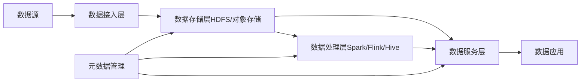

# 第四十八章：数据湖技术开源项目推荐

## 1. 背景介绍
### 1.1 数据湖的兴起
在大数据时代,企业需要处理和分析海量的异构数据。传统的数据仓库架构难以应对快速增长的数据量和多样性。数据湖(Data Lake)作为一种新兴的大数据存储和分析架构应运而生。
### 1.2 数据湖的优势
与数据仓库相比,数据湖具有以下优势:
- 支持存储结构化、半结构化和非结构化数据
- 数据存储成本低,可以存储原始数据
- 数据处理灵活,支持多种分析方式
- 易于扩展,可以线性扩展存储和计算能力
### 1.3 开源生态系统的重要性  
开源软件在大数据领域扮演着重要角色。企业可以利用成熟的开源项目构建数据湖,降低开发成本,提高项目成功率。本章将重点介绍几个优秀的数据湖开源项目。

## 2. 核心概念与联系
### 2.1 数据湖的核心概念
- 数据存储:将各种来源的原始数据存储在分布式文件系统或对象存储中
- 元数据管理:采集和管理数据的元数据信息,方便数据检索和治理  
- 数据处理:对原始数据进行清洗、转换和分析,生成结构化的数据集
- 数据服务:为数据分析和应用提供统一的数据访问接口
### 2.2 开源项目之间的联系
数据湖涉及存储、计算、元数据、数据集成等多个方面。一个完整的数据湖解决方案需要多个开源项目协同工作:
- 存储层:Hadoop HDFS、Apache Kudu、Alluxio等  
- 计算层:Apache Spark、Flink、Hive等
- 元数据管理:Apache Atlas、Hive Metastore等
- 数据集成:Apache Sqoop、Flume、Kafka等

## 3. 核心算法原理具体操作步骤
### 3.1 数据接入与存储
1. 通过Flume、Kafka等工具采集实时数据,写入HDFS或对象存储
2. 使用Sqoop等工具定期从关系型数据库、NoSQL数据库中导入数据 
3. 对于非结构化数据如图片、视频等,直接存储在HDFS或对象存储中
### 3.2 数据处理与分析
1. 使用Spark、Hive等工具对原始数据进行清洗、转换,生成结构化的数据集
2. 针对不同的分析场景,选择合适的计算引擎进行分析,如Spark SQL、Hive SQL 
3. 分析结果可以写回HDFS或导出到外部系统
### 3.3 元数据管理
1. 在数据接入时,采集数据的元数据信息,包括数据源、Schema、权限等
2. 将元数据信息存储在统一的元数据管理系统中,如Atlas、Hive Metastore
3. 分析师和应用可以通过元数据检索数据,元数据变更可以自动同步到数据

## 4. 数学模型和公式详细讲解举例说明
数据湖中的数据处理和分析涉及统计学、线性代数等数学理论。以下是几个常见的数学模型:  
### 4.1 TF-IDF
TF-IDF(Term Frequency–Inverse Document Frequency)是一种用于评估词语在文档中重要性的统计方法。TF表示词频,IDF表示逆文档频率。TF-IDF值越高,说明词语在文档中越重要。
- TF(t,d) = 词语t在文档d中出现的次数 / 文档d中的总词数
- IDF(t,D) = log(文档总数 / 包含词语t的文档数)
- TF-IDF(t,d,D) = TF(t,d) * IDF(t,D)
### 4.2 协同过滤
协同过滤(Collaborative Filtering)是一种常用的推荐算法,通过分析用户或物品之间的相似性,给用户推荐感兴趣的物品。以基于用户的协同过滤为例,核心公式如下:
$$ P_{u,i} = \overline{r_u} + \frac{\sum_{v \in S^k_u(i)} sim(u,v) \cdot (r_{v,i} - \overline{r_v})}{\sum_{v \in S^k_u(i)} sim(u,v)} $$
- $P_{u,i}$表示预测用户u对物品i的评分
- $\overline{r_u}$表示用户u的平均评分 
- $S^k_u(i)$表示与用户u最相似的k个用户中,对物品i有评分的用户集合
- $sim(u,v)$表示用户u和用户v的相似度,常用皮尔逊相关系数计算

## 5. 项目实践：代码实例和详细解释说明
下面以Spark和Hive为例,演示如何在数据湖中进行数据处理和分析。
### 5.1 Spark示例
使用Spark SQL对数据进行清洗和转换,生成结构化的数据集:
```scala
val spark = SparkSession.builder().appName("DataLakeExample").getOrCreate()

// 读取原始JSON数据
val rawData = spark.read.json("hdfs://path/to/raw/data")

// 数据清洗和转换
val cleanData = rawData
  .filter(_.getString("event_type") == "click")
  .select(
    col("user_id"),
    col("item_id"),
    col("timestamp")
  )
  
// 保存结果到Parquet文件
cleanData.write.parquet("hdfs://path/to/clean/data")
```
### 5.2 Hive示例
使用Hive SQL对结构化数据进行分析,统计每个用户的点击次数:
```sql
-- 创建Hive表
CREATE TABLE user_clicks (
  user_id STRING,
  item_id STRING, 
  timestamp BIGINT
) STORED AS PARQUET LOCATION 'hdfs://path/to/clean/data';

-- 统计每个用户的点击次数
SELECT 
  user_id,
  COUNT(*) AS click_count
FROM user_clicks
GROUP BY user_id
ORDER BY click_count DESC;
```

## 6. 实际应用场景
数据湖可以应用于多个行业和业务场景,包括:
### 6.1 电商推荐
- 将用户行为数据(如点击、购买、评论)接入数据湖
- 使用协同过滤、基于内容的推荐等算法,给用户推荐商品
### 6.2 金融风控
- 将交易数据、用户信息、外部数据接入数据湖
- 使用机器学习算法建立风险模型,评估用户的信用风险
### 6.3 物联网数据分析
- 将传感器数据接入数据湖,如温度、湿度、振动等  
- 使用时序分析、异常检测等算法,分析设备的运行状态,预测故障

## 7. 工具和资源推荐
以下是几个优秀的数据湖开源项目:
- **Apache Hadoop**:提供HDFS分布式文件系统和MapReduce计算框架,是数据湖的基础设施
- **Apache Spark**:基于内存的分布式计算引擎,提供SQL、机器学习、图计算等多种分析功能
- **Apache Hive**:基于Hadoop的数据仓库工具,提供类SQL的查询语言HiveQL,方便数据分析
- **Apache Atlas**:元数据管理和数据治理平台,支持对Hadoop、Hive等组件的元数据采集和管理
- **Apache Ranger**:为Hadoop体系提供统一的权限管理,支持细粒度的访问控制
- **Alluxio**:开源的分布式内存存储系统,可以加速数据湖中的数据访问 
- **Delta Lake**:Databricks开源的存储层,在HDFS或对象存储之上提供ACID事务、Schema演进等特性

## 8. 总结：未来发展趋势与挑战
### 8.1 发展趋势
- 数据湖与数据仓库融合:未来数据湖和数据仓库可能会融合发展,形成统一的数据管理平台
- AI/ML的广泛应用:数据湖为机器学习提供了海量的训练数据,使得AI在各行各业得到广泛应用
- 云原生数据湖:云计算的发展使得构建数据湖更加简单,各大云厂商提供了完善的数据湖解决方案
### 8.2 面临的挑战
- 数据治理:如何对数据湖中的海量数据进行有效的组织、管理和质量控制是一大挑战  
- 数据安全与隐私:如何保护数据湖中的敏感数据,防止数据泄露和非法访问
- 元数据管理:如何采集和管理多源异构数据的元数据,实现数据资产的全面盘点

## 9. 附录：常见问题与解答
### Q1:数据湖和数据仓库有什么区别?
A1:数据湖侧重于存储原始数据,数据仓库侧重于存储结构化数据。数据湖支持多种数据处理方式,数据仓库主要支持SQL分析。
### Q2:数据湖如何保证数据质量? 
A2:可以在数据接入时对数据进行校验,建立数据质量监控体系,对数据质量问题及时告警和修复。
### Q3:数据湖如何进行元数据管理?
A3:通过采集Hive、Spark等组件的元数据并统一存储,对元数据进行版本化管理,实现元数据的血缘分析和影响分析。
### Q4:数据湖如何保证数据安全?
A4:采用Kerberos、Ranger等安全组件,对敏感数据进行脱敏,实现细粒度的权限访问控制,并对数据访问行为进行审计。




作者：禅与计算机程序设计艺术 / Zen and the Art of Computer Programming