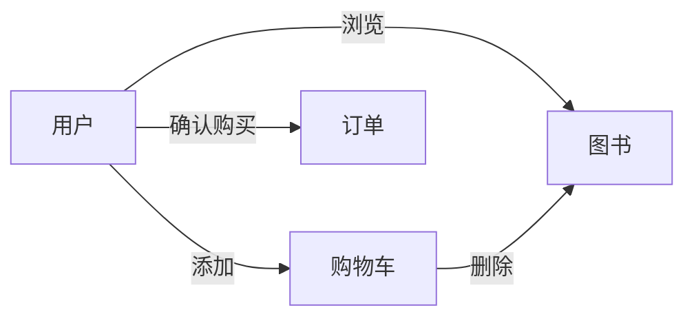

## 1.背景介绍

随着互联网的发展，网上购物已经成为了我们生活中不可或缺的一部分。特别是在图书销售领域，网上图书销售系统的出现，不仅为消费者提供了更为方便快捷的购书方式，也为图书销售商提供了更为广阔的市场空间。本文将详细介绍网上图书销售系统的设计与具体代码实现。

## 2.核心概念与联系

网上图书销售系统主要涉及到以下几个核心概念：

- 用户：包括注册用户和游客，注册用户可以进行购书、评价等操作，游客只能进行浏览。
- 图书：包括图书的基本信息，如书名、作者、出版社、价格等。
- 购物车：用户选购的图书暂时存放的地方，用户可以在购物车中进行图书的增删改查。
- 订单：用户确认购买后，系统会生成订单，包括订单编号、购买图书、总价等信息。

这些核心概念之间的联系如下：

用户可以浏览图书，将图书加入购物车，也可以从购物车中移除图书。当用户确认购买后，系统会生成订单。



## 3.核心算法原理具体操作步骤

在网上图书销售系统中，主要涉及到以下几个操作步骤：

1. 用户注册：用户输入用户名、密码等信息，系统进行验证后，创建新的用户账户。
2. 用户登录：用户输入用户名和密码，系统进行验证，如果验证成功，用户进入系统。
3. 浏览图书：用户可以浏览所有图书，也可以通过搜索关键词查找图书。
4. 添加购物车：用户选择图书，点击添加到购物车，系统将图书添加到用户的购物车中。
5. 管理购物车：用户可以查看购物车中的图书，可以增加或减少图书数量，也可以将图书从购物车中移除。
6. 生成订单：用户确认购买后，系统会生成订单，包括订单编号、购买图书、总价等信息。

## 4.数学模型和公式详细讲解举例说明

在网上图书销售系统中，我们需要对图书的价格进行计算。如果用户购买的图书数量为$n$，每本图书的价格为$p$，则总价$T$可以通过以下公式计算：

$$
T = n \times p
$$

例如，如果用户购买了3本价格为20元的图书，那么总价为：

$$
T = 3 \times 20 = 60
$$

所以，用户需要支付60元。

## 5.项目实践：代码实例和详细解释说明

下面我们来看一个简单的用户注册功能的代码实现。

```java
public class User {
    private String username;
    private String password;

    public User(String username, String password) {
        this.username = username;
        this.password = password;
    }

    // getters and setters ...
}
```

在这个简单的用户类中，我们定义了用户名和密码两个属性，以及一个构造方法，用于创建新的用户对象。

## 6.实际应用场景

网上图书销售系统广泛应用于各大电商平台，如亚马逊、当当网等。用户可以在家中轻松购买自己喜欢的图书，极大地方便了用户的生活。

## 7.工具和资源推荐

在开发网上图书销售系统时，我们可以使用以下工具和资源：

- 开发语言：Java、Python等
- 数据库：MySQL、Oracle等
- 开发工具：Eclipse、PyCharm等
- 版本控制：Git
- 服务器：Tomcat、Nginx等

## 8.总结：未来发展趋势与挑战

随着互联网技术的发展，网上图书销售系统将会有更多的发展空间，如通过人工智能技术推荐用户可能感兴趣的图书，通过大数据技术分析用户的购买行为等。同时，也将面临一些挑战，如如何保护用户的隐私，如何提高系统的安全性等。

## 9.附录：常见问题与解答

1. 问题：我忘记了密码，怎么办？
   答：你可以通过找回密码功能，输入你注册时的邮箱，系统会向你的邮箱发送重置密码的链接。

2. 问题：我添加的图书为什么不在购物车里？
   答：请检查你是否已经登录，只有登录后，系统才能保存你的购物车信息。

3. 问题：我可以在哪里查看我的订单？
   答：你可以在“我的订单”页面查看你的所有订单。

作者：禅与计算机程序设计艺术 / Zen and the Art of Computer Programming