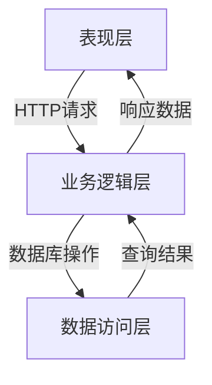
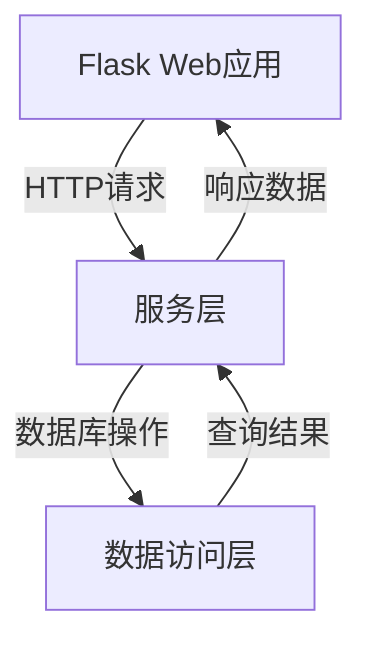

# 网上图书预约系统详细设计与具体代码实现

## 1.背景介绍

在当今信息时代,图书馆作为知识宝库和学习殿堂,其重要性不言而喻。然而,传统的图书借阅方式存在诸多不便,例如读者需要亲自前往图书馆查找所需图书、排队办理借阅手续等,这不仅耗时耗力,也容易导致图书资源分配不均。为了提高图书借阅效率,优化读者体验,网上图书预约系统(Online Book Reservation System,OBRS)应运而生。

OBRS通过将图书馆的藏书信息数字化,并提供在线查询、预约等功能,使读者能够远程便捷地查找和预约所需图书,极大地提高了图书借阅的效率和便利性。同时,OBRS还能够对图书资源进行合理调度,避免图书资源的浪费,提高利用率。此外,OBRS还可以收集读者的借阅数据,为图书馆的采购决策提供依据,优化图书资源的配置。

## 2.核心概念与联系

### 2.1 系统架构
网上图书预约系统通常采用经典的三层架构,包括表现层(Presentation Layer)、业务逻辑层(Business Logic Layer)和数据访问层(Data Access Layer)。



- **表现层**:负责与用户交互,接收用户请求并显示处理结果。通常采用Web界面或移动应用程序实现。
- **业务逻辑层**:处理用户请求,执行业务逻辑操作,并与数据访问层交互获取或存储数据。
- **数据访问层**:负责与数据库进行交互,执行数据查询、插入、更新和删除操作。

### 2.2 核心实体
OBRS的核心实体包括读者(Reader)、图书(Book)和预约记录(Reservation)。

- **读者(Reader)**:代表系统的用户,通常包括姓名、联系方式、借阅记录等信息。
- **图书(Book)**:代表图书馆的藏书,包括书名、作者、出版社、ISBN号等信息。
- **预约记录(Reservation)**:记录读者对某本图书的预约信息,包括预约时间、取书时间等。

### 2.3 关键功能
OBRS的关键功能包括:

- **图书查询**:读者可以根据书名、作者、主题等条件查询所需图书的详细信息和库存情况。
- **图书预约**:读者可以在线预约所需图书,系统会记录预约信息并保留图书。
- **预约管理**:读者可以查看和管理自己的预约记录,包括取消预约或延长预约时间。
- **图书归还**:读者可以在线续借或归还已借阅的图书。
- **管理员功能**:系统管理员可以管理图书信息、读者信息,并处理预约请求。

## 3.核心算法原理具体操作步骤

### 3.1 图书查询算法

图书查询功能是OBRS的基础,它允许读者根据多种条件(如书名、作者、主题等)查找所需图书。常见的图书查询算法包括:

1. **前缀树(Trie)搜索**:适用于根据书名或作者名进行模糊查询。前缀树是一种高效的数据结构,可以快速匹配字符串前缀。

```python
class TrieNode:
    def __init__(self):
        self.children = {}
        self.is_end = False
        self.data = None

class Trie:
    def __init__(self):
        self.root = TrieNode()

    def insert(self, word, data):
        node = self.root
        for char in word:
            if char not in node.children:
                node.children[char] = TrieNode()
            node = node.children[char]
        node.is_end = True
        node.data = data

    def search_prefix(self, prefix):
        node = self.root
        for char in prefix:
            if char not in node.children:
                return []
            node = node.children[char]
        return self._get_all_words(node)

    def _get_all_words(self, node, prefix="", words=[]):
        if node.is_end:
            words.append((prefix, node.data))
        for char, child in node.children.items():
            self._get_all_words(child, prefix + char, words)
        return words
```

2. **倒排索引搜索**:适用于根据主题、关键词等条件查询。倒排索引是一种常见的全文搜索技术,它将文档中的每个词与其出现的文档建立映射关系,从而加快搜索速度。

3. **综合查询**:将上述算法结合使用,根据查询条件的不同选择合适的算法,以提高查询效率和准确性。

### 3.2 图书预约算法

图书预约功能需要考虑图书库存情况、读者借阅权限等因素。常见的预约算法包括:

1. **库存检查**:在接受预约请求前,需要检查图书的库存情况,确保有足够的馆藏可供借阅。

2. **读者权限检查**:检查读者是否有借阅权限,例如是否有欠款、是否被禁止借阅等。

3. **预约排队**:如果某本热门图书暂时无库存,读者可以选择预约。系统需要维护一个预约队列,按照先后顺序分配图书。

4. **预约到期处理**:对于长期未被提取的预约,系统需要自动取消预约,释放图书库存。

以下是一个简单的预约算法示例:

```python
def reserve_book(reader, book):
    # 检查读者权限
    if not reader.can_borrow():
        return "读者无借阅权限"

    # 检查图书库存
    if book.available_copies > 0:
        book.available_copies -= 1
        return create_reservation(reader, book)
    else:
        # 加入预约队列
        reservation_queue.append((reader, book))
        return "已加入预约队列"

def create_reservation(reader, book):
    reservation = Reservation(reader, book, due_date)
    reader.reservations.append(reservation)
    book.reservations.append(reservation)
    return "预约成功"
```

### 3.3 预约管理算法

预约管理功能允许读者查看和管理自己的预约记录,包括取消预约、延长预约时间等操作。常见的预约管理算法包括:

1. **预约查询**:根据读者ID查询该读者的所有预约记录。

2. **预约取消**:读者可以取消某个预约记录,系统需要更新图书库存和预约队列。

3. **预约延期**:如果读者暂时无法取书,可以申请延长预约时间。系统需要检查是否符合延期条件(如未逾期、未达到延期上限等)。

4. **预约提醒**:系统可以在预约到期前通过短信、邮件等方式提醒读者,避免预约过期。

以下是一个简单的预约管理算法示例:

```python
def cancel_reservation(reader, reservation):
    reader.reservations.remove(reservation)
    book = reservation.book
    book.reservations.remove(reservation)
    book.available_copies += 1

    # 处理预约队列
    if reservation_queue:
        next_reader, next_book = reservation_queue.pop(0)
        create_reservation(next_reader, next_book)

def extend_reservation(reservation, new_due_date):
    if can_extend(reservation):
        reservation.due_date = new_due_date
        return "预约延期成功"
    else:
        return "无法延期"

def can_extend(reservation):
    # 检查是否符合延期条件
    return (not reservation.is_overdue() and
            reservation.extensions_count < MAX_EXTENSIONS)
```

## 4.数学模型和公式详细讲解举例说明

在图书预约系统中,数学模型和公式主要用于优化图书资源分配、预测读者需求等场景。

### 4.1 图书资源分配优化

图书资源分配是图书馆管理的一个重要问题,旨在最大化图书资源的利用率,满足读者的借阅需求。这可以通过数学建模和优化算法来实现。

假设有$n$种图书,每种图书有$c_i$本馆藏,读者对每种图书的需求量为$d_i$。我们需要确定每种图书的采购数量$x_i$,使得总成本最小,同时满足读者需求。

该问题可以formulize为一个整数线性规划(Integer Linear Programming, ILP)模型:

$$
\begin{aligned}
\min \quad & \sum_{i=1}^n p_i x_i \\
\text{s.t.} \quad & c_i + x_i \geq d_i, \quad i = 1, 2, \ldots, n \\
& x_i \geq 0 \text{ and integer}, \quad i = 1, 2, \ldots, n
\end{aligned}
$$

其中$p_i$是第$i$种图书的单价。目标函数是最小化总采购成本,约束条件保证每种图书的总馆藏量不小于需求量。

该ILP模型可以使用整数线性规划求解器(如CPLEX、Gurobi等)来求解。

### 4.2 读者需求预测

预测读者对不同图书的需求量,有助于图书馆合理安排采购计划。这可以通过机器学习算法来实现。

假设我们有历史数据$\{(x_i, y_i)\}_{i=1}^N$,其中$x_i$是第$i$个数据样本的特征向量(如图书主题、作者、出版年份等),而$y_i$是对应的需求量。我们可以使用回归算法来拟合一个函数$f(x)$,预测给定特征$x$对应的需求量$y = f(x)$。

常见的回归算法包括线性回归、决策树回归、支持向量回归等。以线性回归为例,我们需要找到一个权重向量$\boldsymbol{w}$和偏置项$b$,使得以下损失函数最小化:

$$
L(\boldsymbol{w}, b) = \frac{1}{2N} \sum_{i=1}^N \left(y_i - \boldsymbol{w}^\top x_i - b\right)^2
$$

该优化问题可以使用梯度下降法或最小二乘法等方法求解。

## 5.项目实践:代码实例和详细解释说明

在这一部分,我们将通过一个基于Python的OBRS项目实例,展示如何将上述算法和模型应用于实际系统开发中。

### 5.1 系统架构

我们采用经典的三层架构设计,包括表现层(Flask Web应用)、业务逻辑层(服务层)和数据访问层(数据库交互)。



### 5.2 核心模块

1. **Book模块**:定义`Book`类,表示图书实体。

```python
class Book:
    def __init__(self, id, title, author, publisher, isbn, copies):
        self.id = id
        self.title = title
        self.author = author
        self.publisher = publisher
        self.isbn = isbn
        self.copies = copies
        self.available_copies = copies
        self.reservations = []
```

2. **Reader模块**:定义`Reader`类,表示读者实体。

```python
class Reader:
    def __init__(self, id, name, email, phone):
        self.id = id
        self.name = name
        self.email = email
        self.phone = phone
        self.reservations = []
        self.borrowed_books = []

    def can_borrow(self):
        # 检查读者是否有借阅权限
        return len(self.borrowed_books) < MAX_BORROWED_BOOKS
```

3. **Reservation模块**:定义`Reservation`类,表示预约记录。

```python
class Reservation:
    def __init__(self, reader, book, due_date):
        self.reader = reader
        self.book = book
        self.due_date = due_date
        self.extensions_count = 0

    def is_overdue(self):
        return datetime.now() > self.due_date
```

4. **BookService模块**:提供图书相关的业务逻辑服务,如查询、预约等。

```python
class BookService:
    def search_books(self, query):
        # 使用Trie树或倒排索引进行图书查询
        ...

    def reserve_book(self, reader, book):
        # 实现图书预约算法
        ...

    def cancel_reservation(self, reader, reservation):
        # 实现预约取消算法
        ...
```

5. **ReservationService模块**:提供预约管理相关的业务逻辑服务。

```python
class ReservationService:
    def get_reservations(self, reader):
        # 查询读者的所有预约记录
        ...

    