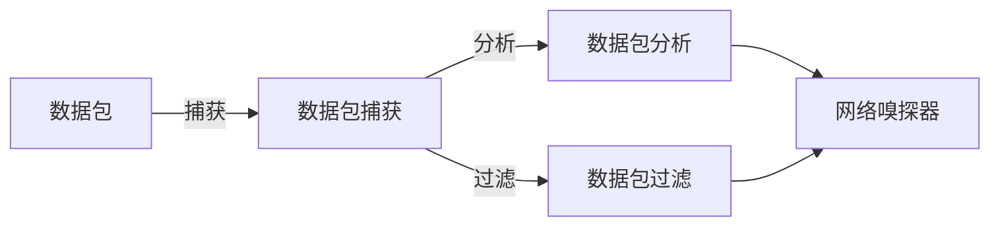

## 1. 背景介绍

网络嗅探器，也被称为网络监听器或者网络分析器，是一种强大的网络工具，它可以捕获、分析网络中的数据包。这种工具对于网络管理员来说，是必不可少的，因为它可以帮助他们监控网络流量，识别网络问题，甚至防止网络攻击。近年来，随着网络技术的发展，网络嗅探器的功能也在不断扩展和升级，使得它在网络安全、网络优化等领域发挥了重要作用。

## 2. 核心概念与联系

网络嗅探器主要包括以下几个核心概念：

- 数据包：数据包是网络中传输信息的基本单位。一个数据包通常包括源地址、目的地址、数据内容等信息。

- 数据包捕获：数据包捕获是网络嗅探器的基本功能，它可以捕获经过网络接口的所有数据包。

- 数据包分析：数据包分析是对捕获的数据包进行解析，提取有用的信息。

- 数据包过滤：数据包过滤是根据一定的规则，只捕获和分析满足条件的数据包。

这四个核心概念相互联系，构成了网络嗅探器的基本框架。



## 3. 核心算法原理具体操作步骤

网络嗅探器的核心算法主要包括数据包捕获算法和数据包分析算法。

### 3.1 数据包捕获算法

数据包捕获算法主要是通过网络接口捕获所有经过的数据包。这个过程通常由操作系统的网络驱动程序完成。一般来说，网络驱动程序会将所有经过的数据包都复制一份，然后传递给网络嗅探器。因此，网络嗅探器可以捕获到所有的数据包，而不会影响网络的正常通信。

### 3.2 数据包分析算法

数据包分析算法是对捕获的数据包进行解析的过程。这个过程通常包括以下几个步骤：

1. 首先，对数据包的头部进行解析，提取出源地址、目的地址、协议类型等信息。

2. 然后，根据协议类型，对数据包的数据部分进行解析。例如，如果协议类型是HTTP，那么就需要对HTTP的请求和响应进行解析。

3. 最后，将解析的结果以一种易于理解的方式展示出来。例如，可以将结果以表格的形式显示，也可以将结果以图形的形式显示。

## 4. 数学模型和公式详细讲解举例说明

在网络嗅探器中，有一个重要的概念就是过滤规则。过滤规则是一种表达式，用来描述哪些数据包应该被捕获和分析。过滤规则的形式通常是这样的：

```
源地址 = A and 目的地址 = B and 协议类型 = C
```

其中，A、B和C是具体的值。例如，A可以是一个IP地址，B也可以是一个IP地址，C可以是一个协议类型，如HTTP。

这个过滤规则可以用数学的集合论来表示。假设我们有一个数据包的集合P，那么过滤规则就相当于在P中选择满足条件的元素，形成一个新的集合F。用数学公式表示就是：

$$
F = \{ p \in P | p.源地址 = A and p.目的地址 = B and p.协议类型 = C \}
$$

这个公式表示的是，F是P中所有满足条件的元素的集合。

## 5. 项目实践：代码实例和详细解释说明

下面，我们来看一个简单的网络嗅探器的实现。这个网络嗅探器使用Python语言编写，使用了pcapy库来捕获数据包，使用dpkt库来解析数据包。

```python
import pcapy
import dpkt

# 打开网络接口
cap = pcapy.open_live("eth0", 65536, 1, 0)

# 设置过滤规则
cap.setfilter("tcp")

while True:
    # 捕获数据包
    (header, packet) = cap.next()

    # 解析数据包
    eth = dpkt.ethernet.Ethernet(packet)

    # 如果是IP数据包
    if isinstance(eth.data, dpkt.ip.IP):
        ip = eth.data

        # 如果是TCP数据包
        if isinstance(ip.data, dpkt.tcp.TCP):
            tcp = ip.data

            # 打印源地址和目的地址
            print("源地址:", ip.src)
            print("目的地址:", ip.dst)

            # 打印数据内容
            print("数据内容:", tcp.data)
```

这个代码首先打开了一个网络接口，然后设置了一个过滤规则，只捕获TCP数据包。然后，它进入一个无限循环，不断的捕获和解析数据包。对于每一个捕获到的数据包，它首先判断是否是IP数据包，如果是，再判断是否是TCP数据包，如果是，就打印出源地址、目的地址和数据内容。

## 6. 实际应用场景

网络嗅探器在很多场景中都有应用。例如：

- 网络管理员可以使用网络嗅探器来监控网络流量，识别网络问题。

- 网络安全专家可以使用网络嗅探器来检测网络攻击，例如DDoS攻击、ARP欺骗等。

- 网络开发者可以使用网络嗅探器来调试网络程序，例如查看HTTP请求和响应的详细信息。

## 7. 工具和资源推荐

如果你对网络嗅探器感兴趣，下面的工具和资源可能会对你有所帮助：

- Wireshark：这是一个非常强大的网络嗅探器，它可以捕获和分析几乎所有类型的数据包。

- tcpdump：这是一个命令行的网络嗅探器，它非常轻量级，适合在服务器上使用。

- pcapy和dpkt：这是两个Python库，可以用来编写网络嗅探器。

## 8. 总结：未来发展趋势与挑战

随着网络技术的发展，网络嗅探器的功能也在不断扩展和升级。例如，现在的网络嗅探器不仅可以捕获和分析数据包，还可以重放数据包，甚至生成数据包。此外，网络嗅探器也开始集成更多的网络安全功能，例如入侵检测、防火墙等。

然而，网络嗅探器也面临着一些挑战。例如，随着网络流量的增加，如何快速有效地捕获和分析数据包成为一个问题。此外，随着网络协议的复杂性增加，如何准确地解析数据包也成为一个问题。这些都是网络嗅探器未来需要解决的问题。

## 9. 附录：常见问题与解答

Q：网络嗅探器会不会影响网络的正常通信？

A：一般来说，网络嗅探器不会影响网络的正常通信。因为网络嗅探器只是复制了经过网络接口的数据包，而不会修改数据包。

Q：网络嗅探器是否合法？

A：这取决于你在哪个国家，以及你如何使用网络嗅探器。在一些国家，使用网络嗅探器可能需要特殊的许可。此外，如果你使用网络嗅探器来侵犯他人的隐私，那么这是违法的。

Q：如何防止网络嗅探？

A：有很多方法可以防止网络嗅探。例如，你可以使用加密的网络协议，如HTTPS。你也可以使用VPN来保护你的网络通信。

作者：禅与计算机程序设计艺术 / Zen and the Art of Computer Programming