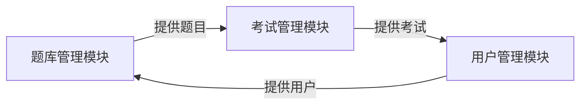

## 1.背景介绍

网络考试系统是近年来随着互联网技术的发展，越来越受到各大学校和企业的青睐。它以其便捷的操作性，高效的管理能力，强大的功能性，正在逐渐取代传统的纸质考试方式。然而，如何设计并实现一个高效、稳定、易用的网络考试系统，却是一项挑战。本文将详细介绍网络考试系统的设计与实现过程。

## 2.核心概念与联系

网络考试系统主要包括三个核心模块：题库管理模块、考试管理模块和用户管理模块。题库管理模块负责题目的新增、修改、删除和查询；考试管理模块负责考试的创建、修改、删除和查询，以及考试的监控和成绩统计；用户管理模块负责用户的注册、登录、修改信息和权限管理。

这三个模块相互联系，共同构成了网络考试系统的整体框架。题库管理模块为考试提供题目，考试管理模块为用户提供考试，用户管理模块为系统提供用户。



## 3.核心算法原理具体操作步骤

网络考试系统的核心算法主要包括题目的随机抽取算法和成绩的计算算法。

题目的随机抽取算法，主要是在用户开始考试时，根据考试的题目类型和数量，从题库中随机抽取相应数量的题目。这种算法可以保证每次考试的题目都是随机的，增加了考试的公平性。

成绩的计算算法，主要是在用户提交考试后，根据用户的答案和题目的答案，计算出用户的成绩。这种算法可以快速准确地计算出用户的考试成绩，提高了考试的效率。

## 4.数学模型和公式详细讲解举例说明

题目的随机抽取算法可以用概率论中的无放回抽样模型来描述。假设题库中有 $N$ 道题目，需要抽取 $n$ 道题目，那么第一道题目被抽中的概率为 $\frac{n}{N}$，第二道题目被抽中的概率为 $\frac{n-1}{N-1}$，以此类推，最后一道题目被抽中的概率为 $\frac{1}{N-n+1}$。

成绩的计算算法可以用加权求和模型来描述。假设考试有 $n$ 道题目，每道题目的分值为 $w_i$，用户的答案正确则得到该题的分值，否则得分为零。那么用户的总成绩为 $\sum_{i=1}^n w_i x_i$，其中 $x_i$ 为用户第 $i$ 道题目的得分，正确为1，错误为0。

## 5.项目实践：代码实例和详细解释说明

这里我们以题库管理模块的题目新增功能为例，给出其代码实例并进行详细解释。

```python
# 题库管理模块
class QuestionBank:
    def __init__(self):
        self.questions = []

    # 题目新增
    def add_question(self, question):
        self.questions.append(question)
        return "Question added successfully!"
```

在这段代码中，我们首先定义了一个题库管理类 `QuestionBank`，并在其初始化函数中创建了一个空的题目列表 `self.questions`。然后我们定义了一个题目新增函数 `add_question`，它接受一个题目 `question` 作为参数，并将其添加到题目列表中，最后返回一个成功添加的信息。

## 6.实际应用场景

网络考试系统在许多场景中都有应用，例如在线教育平台的考试系统、企业的内部培训考试系统、政府的公务员考试系统等。它可以方便地管理题库、组织考试、统计成绩，大大提高了考试的效率和管理的便利性。

## 7.工具和资源推荐

在设计和实现网络考试系统时，推荐使用以下工具和资源：

- 开发语言：推荐使用 Python，因为它简洁明了，易于学习，且有丰富的库和框架，可以快速开发出高效的网络应用。
- 开发工具：推荐使用 PyCharm，它是一个强大的 Python IDE，提供了诸如代码自动完成、错误检查、版本控制等许多便利的功能。
- 数据库：推荐使用 MySQL，它是一个开源的关系型数据库，稳定性和性能都非常优秀，且有丰富的文档和社区支持。

## 8.总结：未来发展趋势与挑战

随着互联网技术和人工智能技术的发展，网络考试系统将面临新的发展趋势和挑战。一方面，网络考试系统将更加智能化，例如通过人工智能技术实现自动出题、智能防作弊等功能。另一方面，网络考试系统将更加个性化，例如通过大数据分析和机器学习技术，提供针对个人的定制化考试和学习建议。

## 9.附录：常见问题与解答

1. 问题：如何保证网络考试的公平性？
   答：通过题目的随机抽取和成绩的自动计算，可以大大减少人为因素的影响，提高考试的公平性。此外，还可以通过技术手段防止作弊，例如监控用户的操作行为、限制用户的网络访问等。

2. 问题：如何保证网络考试的安全性？
   答：可以通过多种方式保证网络考试的安全性，例如使用HTTPS协议保护数据的传输安全，使用密码和权限管理保护用户的信息安全，使用数据库的备份和恢复功能保护数据的安全。

作者：禅与计算机程序设计艺术 / Zen and the Art of Computer Programming