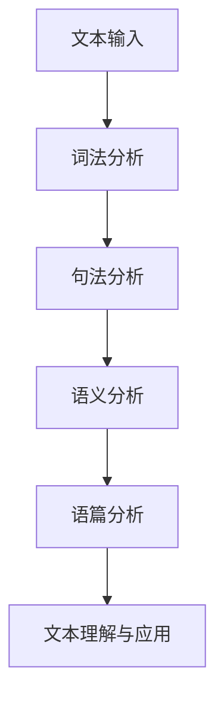

# 自然语言处理(Natural Language Processing) - 原理与代码实例讲解

## 1. 背景介绍
### 1.1 自然语言处理的定义与发展历程
自然语言处理(Natural Language Processing,简称NLP)是人工智能(Artificial Intelligence,简称AI)的一个重要分支,旨在赋予计算机理解、生成和处理人类语言的能力。NLP技术的发展可以追溯到20世纪50年代,经历了基于规则、统计学习和深度学习三个主要阶段。

### 1.2 NLP的研究意义与应用领域
NLP在现实生活中有着广泛的应用,如机器翻译、情感分析、智能客服、语音助手等。随着大数据和人工智能技术的不断进步,NLP将在更多领域发挥重要作用,极大地改善人机交互体验,提高工作效率。

### 1.3 NLP面临的主要挑战
尽管NLP取得了长足进步,但仍面临着语义理解、语境理解、知识表示等诸多挑战。人类语言的复杂性、歧义性和多样性,使得NLP任务的实现难度很大。

## 2. 核心概念与联系
### 2.1 词法分析
词法分析是NLP的基础任务之一,主要包括分词、词性标注和命名实体识别等子任务。分词即将连续的字符序列切分成有意义的词汇单元;词性标注是为每个词汇单元赋予词性标签;命名实体识别则是识别出文本中的人名、地名、机构名等特定类型的实体。

### 2.2 句法分析
句法分析是研究句子结构及其组成成分之间关系的过程。常见的句法分析任务包括短语结构分析和依存结构分析。短语结构分析将句子划分为嵌套的短语结构;依存结构分析则揭示句子中词与词之间的依存关系。

### 2.3 语义分析
语义分析是理解词语、短语和句子含义的过程。词义消歧是语义分析的重要任务,旨在根据上下文确定一个词的具体含义。另一个任务是语义角色标注,即识别句子中的论元结构,如施事、受事、时间、地点等语义角色。

### 2.4 语篇分析
语篇分析研究超越句子层面的语言现象,如指代消解、篇章结构分析和篇章关系识别等。指代消解是确定代词或其他指示语所指代的对象;篇章结构分析揭示语篇的组织结构;篇章关系识别则判断语篇单元之间的逻辑关系,如因果、转折等。

### 2.5 核心概念之间的关系
下图展示了NLP各个核心概念之间的关系:



从词到句再到篇,NLP的分析粒度逐步扩大,层层递进,最终实现对整个文本的理解。词法、句法、语义和语篇分析环环相扣,共同构成了NLP的基本框架。

## 3. 核心算法原理具体操作步骤
### 3.1 基于规则的方法
早期的NLP系统主要采用基于规则的方法,即人工总结语言知识,设计规则,用于文本分析和处理。以分词为例,其基本步骤如下:

1. 构建词典,收录常见词汇;
2. 设计切分规则,如正向最大匹配、逆向最大匹配等;
3. 遍历待分词文本,用切分规则将文本切分成词序列;
4. 消除歧义,对于切分结果中的歧义部分,设计启发式规则予以解决。

### 3.2 统计学习方法
统计学习方法通过机器学习算法,从大规模语料中自动习得语言知识,是当前NLP的主流范式。以词性标注为例,其基本步骤如下:

1. 标注语料,即对大量文本进行词性标注;  
2. 特征提取,一般特征包括词本身、前后词、前后词性等;
3. 选择机器学习模型,如隐马尔可夫模型、条件随机场等;
4. 模型训练,即用标注语料训练机器学习模型;
5. 模型应用,用训练好的模型对新文本进行词性标注。

### 3.3 深度学习方法 
近年来,以深度学习为代表的表示学习方法在NLP领域取得了突破性进展。以命名实体识别为例,其基本步骤如下:

1. 构建字向量或词向量,将离散的字或词映射为连续的低维向量;
2. 选择深度学习模型,如循环神经网络(RNN)、长短期记忆网络(LSTM)、条件随机场(CRF)等;  
3. 模型训练,即用带标签数据训练命名实体识别模型;
4. 模型应用,用训练好的模型识别新文本中的命名实体。

## 4. 数学模型和公式详细讲解举例说明
### 4.1 隐马尔可夫模型(HMM)
隐马尔可夫模型是一种广泛用于序列标注任务(如词性标注、命名实体识别等)的统计学习模型。HMM由状态序列和观测序列组成,状态序列是隐藏的,观测序列是可见的。HMM的三要素为:

- 初始状态概率向量 $\pi$, $\pi_i=P(i_1=q_i),i=1,2,\dots,N$ 
- 状态转移概率矩阵 $A$, $a_{ij}=P(i_{t+1}=q_j|i_t=q_i),i,j=1,2,\dots,N$
- 观测概率矩阵 $B$, $b_j(k)=P(o_t=v_k|i_t=q_j),j=1,2,\dots,N;k=1,2,\dots,M$ 

其中,$i_t$表示时刻$t$的隐藏状态,$o_t$表示时刻$t$的观测,$q_i$表示第$i$个隐藏状态,$v_k$表示第$k$个观测。

HMM的三个基本问题及其解决算法如下:

1. 评估观察序列概率:前向-后向算法
2. 已知观察序列,求最优状态序列:维特比算法
3. 参数估计:前向-后向算法和Baum-Welch算法

以词性标注任务为例,状态序列对应词性标签序列,观测序列对应词序列。通过HMM可以对给定词序列求解最优词性标签序列。

### 4.2 条件随机场(CRF) 
条件随机场是一种判别式无向图模型,常用于序列标注任务。相比HMM,CRF可以引入更多的特征,因而标注精度更高。CRF的数学形式为:

$$P(Y|X)=\frac{1}{Z(X)}\exp\left(\sum_{i,k}\lambda_k t_k(y_{i-1},y_i,X,i)+\sum_{i,l} \mu_l s_l(y_i,X,i)\right)$$

其中,$X$表示观测序列,$Y$表示对应的标记序列,$Z(X)$为归一化因子,$t_k$和$s_l$为特征函数,$\lambda_k$和$\mu_l$为对应的权值。通过训练确定特征函数的权值,再用动态规划算法(如维特比算法)求解最优标记序列。

### 4.3 词嵌入(Word Embedding)
词嵌入是将词映射为实数向量的技术,是深度学习方法的基础。word2vec是常用的词嵌入模型,包括CBOW和Skip-gram两种架构。以CBOW为例,其目标是根据中心词的上下文预测中心词,数学形式为:

$$\mathbf{v}_{\textrm{context}}=\frac{1}{2n}\sum_{i=1}^{2n}\mathbf{u}_{w_i}$$
$$p(w_c|\textrm{context})=\textrm{softmax}(\mathbf{v}_{\textrm{context}}^\top \mathbf{v}_{w_c})=\frac{\exp(\mathbf{v}_{\textrm{context}}^\top \mathbf{v}_{w_c})}{\sum_{w\in V}\exp(\mathbf{v}_{\textrm{context}}^\top \mathbf{v}_w)}$$

其中,$\mathbf{u}_w$和$\mathbf{v}_w$分别表示词$w$作为上下文词和中心词时的向量表示,$V$为词表。通过极大似然估计求解词向量,再应用于下游NLP任务。

## 5. 项目实践：代码实例和详细解释说明
下面以jieba分词和NLTK词性标注为例,展示NLP项目实践的代码实例。

### 5.1 jieba分词
jieba是优秀的中文分词工具库,代码示例如下:

```python
import jieba

text = "自然语言处理是人工智能的一个重要分支。"

words = jieba.cut(text)
print("/".join(words))

# 输出
# 自然语言/处理/是/人工智能/的/一个/重要/分支/。
```

`jieba.cut`方法接受字符串输入,返回分词结果的迭代器。jieba采用了基于前缀词典实现高效词图扫描,同时使用了动态规划查找最大概率路径,是基于统计学习方法的分词工具。

### 5.2 NLTK词性标注
NLTK是著名的Python自然语言处理工具包,代码示例如下:

```python
import nltk

text = "NLTK is a leading platform for building Python programs to work with human language data."

tokens = nltk.word_tokenize(text)
tags = nltk.pos_tag(tokens)

print(tags)

# 输出
# [('NLTK', 'NNP'), ('is', 'VBZ'), ('a', 'DT'), ('leading', 'VBG'), ('platform', 'NN'), ('for', 'IN'), ('building', 'VBG'), ('Python', 'NNP'), ('programs', 'NNS'), ('to', 'TO'), ('work', 'VB'), ('with', 'IN'), ('human', 'JJ'), ('language', 'NN'), ('data', 'NNS'), ('.', '.')]
```

`nltk.word_tokenize`将文本切分成单词和标点符号,`nltk.pos_tag`为每个词汇单元赋予一个词性标签。NLTK使用了最大熵模型实现词性标注,并提供了预训练的标注模型,可以开箱即用。

## 6. 实际应用场景
NLP在现实生活中有着广泛的应用,下面列举几个典型场景:

### 6.1 机器翻译
机器翻译是利用计算机将一种自然语言转换为另一种自然语言,如谷歌翻译、百度翻译等。主流机器翻译系统基于编码器-解码器框架和注意力机制,通过端到端的神经网络实现。

### 6.2 情感分析
情感分析是判断文本所表达的情感倾向(积极、消极或中性)。情感分析可以应用于舆情监控、产品评论分析等场景。主要方法包括基于词典、机器学习和深度学习的方法。

### 6.3 智能客服
智能客服是用人工智能技术实现的自动应答系统,能够解答用户的常见问题。其核心是意图识别和槽填充技术,即识别用户询问的意图,并提取关键信息,再调用知识库给出回答。

### 6.4 语音助手
语音助手如苹果的Siri、微软的Cortana等,可以通过语音与用户进行交互,执行打电话、设置闹钟等任务。其关键技术包括语音识别、自然语言理解和语音合成。

## 7. 工具和资源推荐
### 7.1 工具库
- NLTK:Python自然语言处理工具包,http://www.nltk.org/
- Stanford CoreNLP:Java实现的NLP工具包,https://stanfordnlp.github.io/CoreNLP/ 
- spaCy:工业级自然语言处理库,https://spacy.io/
- HanLP:多语种NLP工具包,https://github.com/hankcs/HanLP

### 7.2 语料库
- 人民日报语料库:1946年至今的人民日报标注语料库
- 微博情感分析评测数据:新浪微博情感分析评测数据
- Douban Conversation Corpus:开放域多轮对话数据集
- 百度DuReader:基于真实应用场景的大规模阅读理解数据集

### 7.3 竞赛平台
- SemEval:语义评测国际研讨会,每