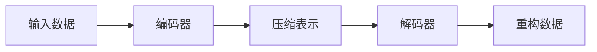

## 1.背景介绍

自编码器（Autoencoders）是一种有效的无监督学习模型，主要应用于数据降维、特征学习和生成模型等领域。自编码器的基本思想是通过学习输入数据的压缩表示，然后再通过这种压缩表示重构原始数据，从而实现对数据特征的自我学习。

## 2.核心概念与联系

自编码器主要由两部分组成：编码器（Encoder）和解码器（Decoder）。编码器负责将输入数据编码为压缩表示，解码器则负责从这种压缩表示中恢复出原始数据。



## 3.核心算法原理具体操作步骤

自编码器的训练过程主要包括以下步骤：

1. 初始化：随机初始化编码器和解码器的参数。
2. 前向传播：将输入数据通过编码器得到压缩表示，然后通过解码器得到重构数据。
3. 计算损失：使用某种形式的重构损失（如均方误差）来衡量原始数据和重构数据之间的差异。
4. 反向传播：根据损失函数的梯度，更新编码器和解码器的参数。
5. 重复上述步骤，直到达到某种停止准则。

## 4.数学模型和公式详细讲解举例说明

假设我们的输入数据为$x \in \mathbb{R}^d$，编码器和解码器分别为函数$f$和$g$，则压缩表示为$h=f(x)$，重构数据为$\hat{x}=g(h)$。

我们的目标是最小化原始数据和重构数据之间的差异，这可以通过最小化以下损失函数来实现：

$$
L(x, \hat{x}) = \|x - \hat{x}\|^2 = \|x - g(f(x))\|^2
$$

## 5.项目实践：代码实例和详细解释说明

下面我们来看一个简单的自编码器的实现，这里我们使用Python的深度学习框架PyTorch：

```python
import torch
import torch.nn as nn

class Autoencoder(nn.Module):
    def __init__(self, input_dim, hidden_dim):
        super(Autoencoder, self).__init__()
        self.encoder = nn.Linear(input_dim, hidden_dim)
        self.decoder = nn.Linear(hidden_dim, input_dim)

    def forward(self, x):
        h = self.encoder(x)
        x_hat = self.decoder(h)
        return x_hat

# 模型训练
model = Autoencoder(input_dim=784, hidden_dim=64)
criterion = nn.MSELoss()
optimizer = torch.optim.Adam(model.parameters())

for epoch in range(100):
    for x in dataloader:
        x_hat = model(x)
        loss = criterion(x, x_hat)
        optimizer.zero_grad()
        loss.backward()
        optimizer.step()
```

## 6.实际应用场景

自编码器在许多实际应用中都发挥了重要作用，例如：

- 数据降维：自编码器可以学习到输入数据的低维度表示，从而实现数据的降维。
- 异常检测：自编码器可以通过学习正常数据的表示，然后用来检测与正常数据表示差异较大的异常数据。
- 图像去噪：自编码器可以通过学习无噪声图像的表示，然后用来去除噪声图像中的噪声。

## 7.工具和资源推荐

- PyTorch：一个强大的深度学习框架，支持动态计算图，易于调试和理解。
- TensorFlow：Google开源的深度学习框架，支持静态计算图，拥有丰富的API和工具。
- Keras：一个高级深度学习框架，可以用来快速搭建和训练神经网络。

## 8.总结：未来发展趋势与挑战

自编码器作为一种无监督学习模型，有着广阔的应用前景。但是，自编码器也面临着一些挑战，例如如何设计更好的损失函数来捕捉数据的复杂结构，如何处理大规模高维度数据等。

## 9.附录：常见问题与解答

1. **问：自编码器和PCA有什么区别？**
   
   答：自编码器和PCA都可以用来进行数据降维，但是自编码器是一种非线性模型，而PCA是一种线性模型。因此，自编码器可以捕捉到数据的非线性结构，而PCA只能捕捉到数据的线性结构。

2. **问：自编码器能否用于分类任务？**

   答：虽然自编码器主要用于无监督学习，但是它学习到的压缩表示可以作为其他有监督学习模型的输入，从而用于分类任务。

作者：禅与计算机程序设计艺术 / Zen and the Art of Computer Programming