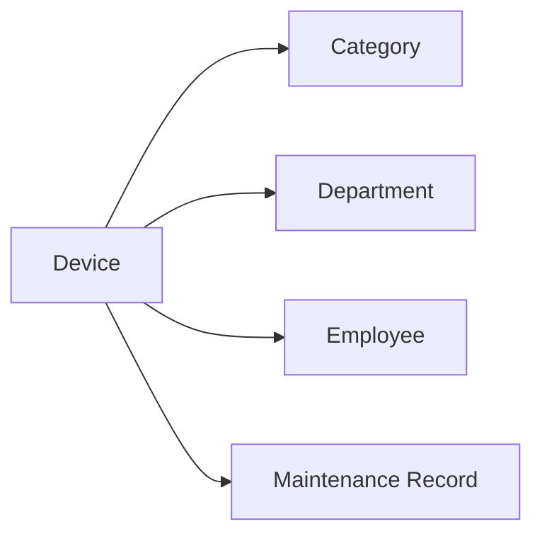
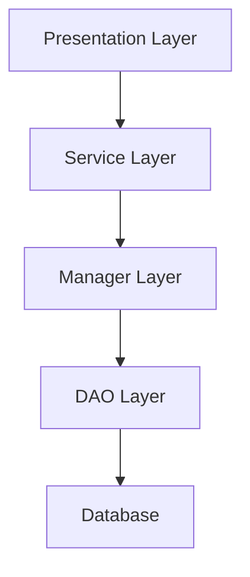

# 设备信息管理系统详细设计与具体代码实现

## 1. 背景介绍

在现代企业和组织中,设备管理是一项至关重要的任务。无论是IT设备、办公设备,还是生产设备,高效、规范的设备管理都能够帮助企业提高运营效率,降低成本,并优化资源配置。然而,传统的人工管理方式难以应对日益增长的设备规模和复杂性。因此,开发一套功能完善、易于使用的设备信息管理系统成为了企业的迫切需求。

本文将详细介绍一个基于Java语言开发的设备信息管理系统。我们将从需求分析入手,梳理系统的功能和非功能需求;然后进行概要设计和详细设计,给出系统架构、数据库设计、API设计等内容;最后,我们将讲解核心功能模块的代码实现,并给出完整的项目源码。

通过学习本文,读者将掌握设备管理系统的分析、设计、实现全流程,并能够开发出一套可用于实际生产环境的设备管理系统。对于Java初学者而言,本项目也是一个很好的学习案例,涉及了Java Web开发的多项核心技术。

## 2. 核心概念与关联

在设备管理系统中,有几个核心概念需要读者了解:

- **设备(Device)**: 系统管理的基本单元,代表一个现实世界中的物理设备,如一台电脑、一台打印机等。每个设备都有型号、序列号、购买日期等属性信息。
- **类别(Category)**: 对设备进行分类的标准,如按照品牌、功能、价格等不同维度划分。每个设备都属于一个或多个类别。
- **部门(Department)**: 设备的使用和管理部门。每个设备都被分配给特定的部门。
- **员工(Employee)**: 设备的实际使用人。一个设备可以由一个或多个员工使用。
- **维修记录(Maintenance Record)**: 设备的维修和保养记录,包括维修时间、维修内容、费用等。

以上几个核心概念之间的关系如下图所示:



## 3. 需求分析

根据业务调研和用户访谈,我们总结出设备管理系统的主要功能需求和非功能需求如下:

### 3.1 功能需求

- 设备管理
  - 设备入库登记
  - 设备信息查询和修改
  - 设备报废处理
- 设备类别管理
  - 类别的增删改查
- 部门管理  
  - 部门的增删改查
  - 部门和设备的关联
- 员工管理
  - 员工的增删改查
  - 员工和设备的关联
- 设备领用
  - 员工设备领用申请和审批
  - 设备借还登记
- 维修管理  
  - 设备报修
  - 维修进度跟踪
  - 维修记录管理
- 统计报表
  - 设备汇总报表
  - 设备明细报表
  - 维修统计报表

### 3.2 非功能需求

- 性能需求
  - 系统响应时间不超过2秒
  - 系统并发用户数不低于100
- 安全需求
  - 基于角色的权限控制
  - 重要数据加密存储
  - 用户密码复杂度校验
- 易用性需求
  - 界面美观、布局合理
  - 操作便捷、符合用户习惯
  - 完善的用户帮助文档
- 可靠性需求
  - 系统可用性不低于99.9%
  - 故障恢复时间不超过30分钟

## 4. 概要设计

### 4.1 系统架构设计

本系统采用经典的三层架构设计,分为表现层、业务逻辑层和数据访问层。

- 表现层:采用基于MVC的Web框架实现,如Spring MVC。负责接收用户请求,调用业务逻辑,并返回处理结果。
- 业务逻辑层:采用分层设计,包括Service层和Manager层。Service层负责对外暴露接口,Manager层负责实现具体的业务逻辑。
- 数据访问层:采用DAO模式,隔离业务逻辑和底层数据库操作。使用MyBatis等ORM框架简化数据库操作。

系统架构如下图所示:



### 4.2 技术选型

本系统采用的主要技术和框架如下:

- 开发语言:Java 8
- Web框架:Spring MVC
- ORM框架:MyBatis 
- 数据库:MySQL
- 缓存:Redis
- 安全框架:Spring Security
- 前端框架:Bootstrap, jQuery
- 构建工具:Maven
- 版本控制:Git

## 5. 详细设计

### 5.1 数据库设计

根据领域模型和功能需求,设计数据库表如下:

- device: 设备表
- category: 类别表
- department: 部门表
- employee: 员工表
- maintenance_record: 维修记录表
- device_employee: 设备-员工关联表
- device_category: 设备-类别关联表

各个表的字段如下:

```sql
-- 设备表
CREATE TABLE `device` (
  `id` bigint(20) unsigned NOT NULL AUTO_INCREMENT COMMENT '设备ID',
  `name` varchar(50) NOT NULL COMMENT '设备名称',
  `category_id` bigint(20) unsigned NOT NULL COMMENT '类别ID',
  `department_id` bigint(20) unsigned NOT NULL COMMENT '部门ID',
  `model` varchar(50) DEFAULT NULL COMMENT '型号',
  `sn` varchar(50) NOT NULL COMMENT '序列号',
  `purchase_date` date NOT NULL COMMENT '购买日期',
  `warranty_period` smallint(6) DEFAULT NULL COMMENT '保修期(月)',
  `price` decimal(10,2) NOT NULL COMMENT '价格',
  `status` tinyint(4) NOT NULL DEFAULT '1' COMMENT '状态 1-在库 2-在用 3-维修 4-报废',
  `remark` varchar(200) DEFAULT NULL COMMENT '备注',
  `create_time` datetime NOT NULL DEFAULT CURRENT_TIMESTAMP COMMENT '创建时间',
  `update_time` datetime NOT NULL DEFAULT CURRENT_TIMESTAMP ON UPDATE CURRENT_TIMESTAMP COMMENT '更新时间',
  PRIMARY KEY (`id`),
  KEY `idx_category_id` (`category_id`),
  KEY `idx_department_id` (`department_id`)
) ENGINE=InnoDB DEFAULT CHARSET=utf8mb4;

-- 类别表
CREATE TABLE `category` (
  `id` bigint(20) unsigned NOT NULL AUTO_INCREMENT COMMENT '类别ID',
  `name` varchar(50) NOT NULL COMMENT '类别名称',
  `parent_id` bigint(20) unsigned DEFAULT NULL COMMENT '父类别ID',
  `level` tinyint(4) NOT NULL DEFAULT '1' COMMENT '层级',
  `sort` smallint(6) NOT NULL DEFAULT '1' COMMENT '排序',
  `remark` varchar(200) DEFAULT NULL COMMENT '备注',
  `create_time` datetime NOT NULL DEFAULT CURRENT_TIMESTAMP COMMENT '创建时间',
  `update_time` datetime NOT NULL DEFAULT CURRENT_TIMESTAMP ON UPDATE CURRENT_TIMESTAMP COMMENT '更新时间',
  PRIMARY KEY (`id`),
  KEY `idx_parent_id` (`parent_id`)
) ENGINE=InnoDB DEFAULT CHARSET=utf8mb4;

-- 部门表 
CREATE TABLE `department` (
  `id` bigint(20) unsigned NOT NULL AUTO_INCREMENT COMMENT '部门ID',
  `name` varchar(50) NOT NULL COMMENT '部门名称',
  `manager_id` bigint(20) unsigned DEFAULT NULL COMMENT '部门经理ID',
  `remark` varchar(200) DEFAULT NULL COMMENT '备注',
  `create_time` datetime NOT NULL DEFAULT CURRENT_TIMESTAMP COMMENT '创建时间',
  `update_time` datetime NOT NULL DEFAULT CURRENT_TIMESTAMP ON UPDATE CURRENT_TIMESTAMP COMMENT '更新时间',
  PRIMARY KEY (`id`),
  KEY `idx_manager_id` (`manager_id`)
) ENGINE=InnoDB DEFAULT CHARSET=utf8mb4;

-- 员工表
CREATE TABLE `employee` (
  `id` bigint(20) unsigned NOT NULL AUTO_INCREMENT COMMENT '员工ID',
  `name` varchar(20) NOT NULL COMMENT '姓名',
  `department_id` bigint(20) unsigned NOT NULL COMMENT '部门ID',
  `phone` varchar(20) DEFAULT NULL COMMENT '手机号',
  `email` varchar(50) DEFAULT NULL COMMENT '邮箱',
  `status` tinyint(4) NOT NULL DEFAULT '1' COMMENT '状态 1-在职 2-离职',
  `remark` varchar(200) DEFAULT NULL COMMENT '备注',
  `create_time` datetime NOT NULL DEFAULT CURRENT_TIMESTAMP COMMENT '创建时间',
  `update_time` datetime NOT NULL DEFAULT CURRENT_TIMESTAMP ON UPDATE CURRENT_TIMESTAMP COMMENT '更新时间',
  PRIMARY KEY (`id`),
  KEY `idx_department_id` (`department_id`)
) ENGINE=InnoDB DEFAULT CHARSET=utf8mb4;

-- 维修记录表
CREATE TABLE `maintenance_record` (
  `id` bigint(20) unsigned NOT NULL AUTO_INCREMENT COMMENT '记录ID',
  `device_id` bigint(20) unsigned NOT NULL COMMENT '设备ID',
  `reporter_id` bigint(20) unsigned NOT NULL COMMENT '报修人ID',
  `maintainer_id` bigint(20) unsigned DEFAULT NULL COMMENT '维修人ID',
  `report_time` datetime NOT NULL COMMENT '报修时间',
  `finish_time` datetime DEFAULT NULL COMMENT '完成时间',
  `cost` decimal(10,2) DEFAULT NULL COMMENT '维修费用',
  `result` tinyint(4) NOT NULL DEFAULT '1' COMMENT '维修结果 1-成功 2-失败',
  `remark` varchar(200) DEFAULT NULL COMMENT '备注',
  `create_time` datetime NOT NULL DEFAULT CURRENT_TIMESTAMP COMMENT '创建时间',
  `update_time` datetime NOT NULL DEFAULT CURRENT_TIMESTAMP ON UPDATE CURRENT_TIMESTAMP COMMENT '更新时间',
  PRIMARY KEY (`id`),
  KEY `idx_device_id` (`device_id`),
  KEY `idx_reporter_id` (`reporter_id`),
  KEY `idx_maintainer_id` (`maintainer_id`)
) ENGINE=InnoDB DEFAULT CHARSET=utf8mb4;

-- 设备-员工关联表  
CREATE TABLE `device_employee` (
  `id` bigint(20) unsigned NOT NULL AUTO_INCREMENT COMMENT '关联ID',
  `device_id` bigint(20) unsigned NOT NULL COMMENT '设备ID',
  `employee_id` bigint(20) unsigned NOT NULL COMMENT '员工ID',
  `borrow_time` datetime NOT NULL COMMENT '借用时间',
  `return_time` datetime DEFAULT NULL COMMENT '归还时间',
  `remark` varchar(200) DEFAULT NULL COMMENT '备注',
  `create_time` datetime NOT NULL DEFAULT CURRENT_TIMESTAMP COMMENT '创建时间',
  `update_time` datetime NOT NULL DEFAULT CURRENT_TIMESTAMP ON UPDATE CURRENT_TIMESTAMP COMMENT '更新时间',
  PRIMARY KEY (`id`),
  KEY `idx_device_id` (`device_id`),
  KEY `idx_employee_id` (`employee_id`)
) ENGINE=InnoDB DEFAULT CHARSET=utf8mb4;

-- 设备-类别关联表
CREATE TABLE `device_category` (
  `id` bigint(20) unsigned NOT NULL AUTO_INCREMENT COMMENT '关联ID',
  `device_id` bigint(20) unsigned NOT NULL COMMENT '设备ID',
  `category_id` bigint(20) unsigned NOT NULL COMMENT '类别ID',
  PRIMARY KEY (`id`),
  KEY `idx_device_id` (`device_id`),
  KEY `idx_category_id` (`category_id`)
) ENGINE=InnoDB DEFAULT CHARSET=utf8mb4;
```

### 5.2 API设计

根据功能需求,设计系统对外暴露的API接口如下:

#### 5.2.1 设备管理

- 新增设备: POST /api/device
- 删除设备: DELETE /api/device/{id}
- 修改设备: PUT /api/device/{id}
- 查询设备列表: GET /api/device
- 查询设备详情: GET /api/device/{id}

#### 5.2.2 类别管理

- 新增类别: POST /api/category  
- 删除类别: DELETE /api/category/{id}
- 修改类别: PUT /api/category/{id}
- 查询类别列表: GET /api/category
- 查询类别详情: GET /api/category/{id}

#### 5.2.3 部门管理

- 新增部门: POST /api/department
- 删除部门: DELETE /api/department/{id}  
- 修改部门: PUT /api/department/{id}
- 查询部门列表: GET /api/department
- 查询部门详情: GET /api/department/{id}

#### 5.2.4 员工管理

- 新增员工: POST /api/employee
- 删除员工: DELETE /api/employee/{id}
- 修改员工: PUT /api/employee/{id}  
- 查询员工列表: GET /api/employee
- 查询员工详情: GET /api/employee/{id}

#### 5.2.5 设备领用

- 提交领用申请: POST /api/borrow
- 删除领用记录: DELETE /api/borrow/{id}
- 归还设备: PUT /api/borrow/{id}/return
- 查询领用记录: GET /api/borrow

#### 5.2.6 维修管理

- 提交报修: POST /api/maintenance  
- 删除报修: DELETE /api/maintenance/{id}
- 修改报修: PUT /api/maintenance/{id}
- 完成维修: PUT