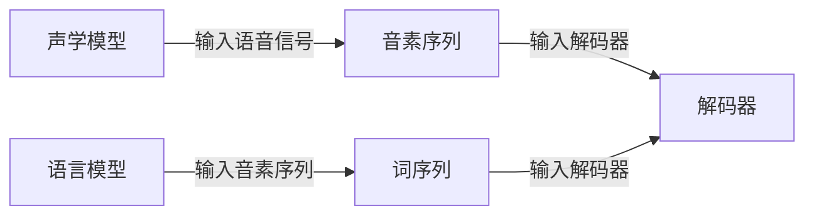

## 1.背景介绍

语音识别是人工智能领域的一个重要研究方向，它是指通过机器自动将人类的语音信号转换成文字的技术。随着科技的发展，语音识别技术已经广泛应用于各个领域，如智能家居、客服机器人、语音助手等，极大地改变了人们的生活方式。

## 2.核心概念与联系

语音识别主要涉及到以下几个核心概念：声学模型、语言模型、解码器。声学模型是用来描述语音信号和音素之间关系的模型，通常使用深度学习方法进行训练。语言模型是用来描述词序列出现概率的模型，通常使用n-gram或者神经网络进行训练。解码器是用来将声学模型和语言模型结合起来，输出最可能的词序列。



## 3.核心算法原理具体操作步骤

语音识别的核心算法主要包括：特征提取、声学模型训练、语言模型训练、解码。

1. 特征提取：将语音信号转换成一系列的特征向量，常用的特征包括MFCC、PLP等。
2. 声学模型训练：使用深度学习方法，如RNN、CNN、Transformer等，训练声学模型。
3. 语言模型训练：使用n-gram或者神经网络，训练语言模型。
4. 解码：使用解码算法，如Viterbi、Beam Search等，结合声学模型和语言模型，输出最可能的词序列。

## 4.数学模型和公式详细讲解举例说明

语音识别中常用的数学模型包括隐马尔科夫模型（HMM）和深度神经网络（DNN）。HMM是一种统计模型，它用来描述一个含有未知参数的马尔科夫过程。其状态转移过程可以用以下公式表示：

$$
P(q_{i+1}|q_{i}) = a_{ij}
$$

其中，$q_{i}$和$q_{i+1}$表示连续的两个状态，$a_{ij}$表示从状态$i$转移到状态$j$的概率。

DNN是一种人工神经网络，它由多个隐藏层组成。每个隐藏层都是一个非线性变换，可以用以下公式表示：

$$
h_{i} = f(W_{i}x + b_{i})
$$

其中，$h_{i}$表示第$i$层的输出，$f$表示激活函数，$W_{i}$和$b_{i}$表示第$i$层的权重和偏置。

## 5.项目实践：代码实例和详细解释说明

接下来，我们将使用Python的librosa库进行语音特征提取，使用Keras库进行深度学习模型训练。以下是代码实例和详细解释。

```python
# 导入库
import librosa
import keras

# 加载语音信号
y, sr = librosa.load('example.wav')

# 提取MFCC特征
mfcc = librosa.feature.mfcc(y=y, sr=sr, n_mfcc=13)

# 构建模型
model = keras.models.Sequential()
model.add(keras.layers.LSTM(128, input_shape=(None, 13)))
model.add(keras.layers.Dense(128, activation='relu'))
model.add(keras.layers.Dense(num_classes, activation='softmax'))

# 训练模型
model.compile(loss='categorical_crossentropy', optimizer='adam', metrics=['accuracy'])
model.fit(mfcc, labels, epochs=10, batch_size=32)
```

## 6.实际应用场景

语音识别技术已经广泛应用于各个领域，以下是几个典型的应用场景：

1. 智能家居：如Google Home、Amazon Echo等设备，可以通过语音识别技术控制家电。
2. 客服机器人：如电话客服、在线客服等，可以通过语音识别技术自动处理客户咨询。
3. 语音助手：如Siri、Cortana、Google Assistant等，可以通过语音识别技术提供各种服务。

## 7.工具和资源推荐

以下是一些常用的语音识别工具和资源：

1. Kaldi：开源的语音识别工具包，提供了完整的语音识别系统和大量的例子。
2. HTK：开源的语音识别工具包，主要用于研究和教学。
3. LibriSpeech：开源的英文语音识别数据集，包含了1000小时的音频数据。

## 8.总结：未来发展趋势与挑战

语音识别技术在过去几年取得了显著的进步，但仍然面临一些挑战，如噪声环境下的识别、多人交谈的识别、方言和口音的识别等。随着深度学习和大数据技术的发展，我们相信这些问题会得到解决。未来，语音识别技术将更加普及，成为我们日常生活的一部分。

## 9.附录：常见问题与解答

1. 问：为什么语音识别需要用到深度学习？
答：深度学习是一种强大的机器学习方法，它可以自动学习出数据的复杂模式，对于语音识别这种涉及到大量数据和复杂模式的任务，深度学习非常适合。

2. 问：语音识别和语音合成有什么区别？
答：语音识别是将语音信号转换成文字，而语音合成是将文字转换成语音信号，两者是相反的过程。

作者：禅与计算机程序设计艺术 / Zen and the Art of Computer Programming