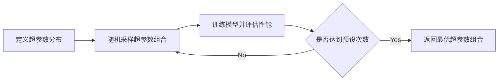
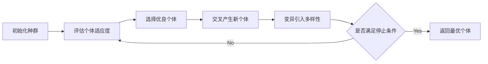

# 超参数调优与模型选择原理与代码实战案例讲解

## 1.背景介绍

在机器学习和深度学习中,超参数调优和模型选择是两个至关重要的环节。超参数是指在模型训练之前设置的参数,例如学习率、正则化系数、网络层数等。这些参数对模型的性能有显著影响,但无法通过训练来学习得到。因此,选择合适的超参数对于获得高性能的模型至关重要。

另一方面,模型选择是指从候选模型集合中选择最优模型的过程。不同的模型具有不同的特性和适用场景。例如,线性模型简单高效但无法拟合复杂的非线性关系;决策树模型可解释性强但容易过拟合;深度神经网络强大灵活但需要大量数据和计算资源。因此,根据具体任务和数据特点选择合适的模型架构也十分关键。

本文将深入探讨超参数调优和模型选择的原理,介绍主流的算法和工具,并通过代码实战案例演示如何进行超参数优化和模型选择,帮助读者掌握这两个重要技能,提升机器学习和深度学习的建模效果。

## 2.核心概念与联系

### 2.1 超参数与模型参数

在机器学习中,参数可分为两类:

- 模型参数:通过训练数据学习得到的参数,例如线性回归的权重系数、神经网络的连接权重等。
- 超参数:在训练之前设置的参数,控制模型的结构和学习过程,例如学习率、正则化系数、树的深度、隐藏层数等。

模型参数通过训练优化来求解,而超参数需要人为设定或通过搜索算法来优化选择。

### 2.2 超参数调优

超参数调优(Hyperparameter Optimization)是指搜索超参数空间,找到使模型性能最优的超参数组合的过程。常见的超参数调优方法有:

- 网格搜索(Grid Search):穷举搜索所有超参数组合。
- 随机搜索(Random Search):随机采样超参数组合。
- 贝叶斯优化(Bayesian Optimization):建立超参数与性能的概率模型,引导搜索方向。
- 启发式搜索:遗传算法、粒子群优化等启发式搜索算法。

选择合适的超参数能显著提升模型性能,减少训练时间和资源消耗。

### 2.3 模型选择

模型选择(Model Selection)是指基于性能评估指标,从候选模型集合中选择最优模型的过程。常见的性能评估指标有:

- 分类任务:准确率、精确率、召回率、F1分数、ROC曲线、AUC值等。  
- 回归任务:均方误差、平均绝对误差、R平方等。

模型选择的主要方法有:

- 留出法(Hold-out):将数据划分为训练集和测试集,在训练集上训练模型,在测试集上评估性能。
- 交叉验证(Cross Validation):将数据划分为k个子集,轮流将每个子集作为测试集,其余作为训练集,对k次结果取平均。
- 自助法(Bootstrap):重复从数据中有放回地采样,生成多个训练集和测试集。

通过模型选择,我们可以比较不同模型的性能,选出最适合当前任务的模型。

### 2.4 超参数调优与模型选择的关系

超参数调优和模型选择是紧密相关的两个过程:

- 模型选择依赖超参数调优:每个候选模型都有自己的超参数,需要通过超参数调优找到最优配置,才能比较不同模型的真实性能。
- 超参数调优依赖模型选择:不同模型对应不同的超参数空间,需要先确定模型类别,再进行超参数搜索。

在实践中,通常采用嵌套交叉验证的方式,外层循环进行模型选择,内层循环进行超参数调优,最终得到性能最优的模型及其超参数配置。

## 3.核心算法原理具体操作步骤

### 3.1 网格搜索(Grid Search)

网格搜索是一种穷举式搜索,对每个超参数定义一个离散的取值集合,形成超参数网格,然后遍历所有可能的超参数组合。


网格搜索的优点是简单直观,缺点是计算量随超参数数量指数增长。适合超参数数量较少的情况。

### 3.2 随机搜索(Random Search)

随机搜索是一种随机采样式搜索,对每个超参数定义一个分布(如均匀分布、对数均匀分布),然后从分布中随机采样得到超参数组合。



随机搜索通过随机采样避免网格搜索的维度灾难,但需要设置合理的分布和采样次数。

### 3.3 贝叶斯优化(Bayesian Optimization)

贝叶斯优化建立超参数与模型性能的概率模型(如高斯过程),根据已评估的超参数点,选择下一个最有可能提升性能的超参数点进行评估,不断更新概率模型,直到找到最优点或达到预算。


贝叶斯优化利用了先验知识,通过建模引导搜索方向,是一种高效的超参数搜索方法。

### 3.4 遗传算法(Genetic Algorithm)

遗传算法借鉴了生物进化的思想,将超参数组合看作个体,迭代进行选择、交叉、变异操作,不断优化超参数组合的性能。



遗传算法通过模拟进化机制探索超参数空间,是一种全局优化算法,但计算量较大。

## 4.数学模型和公式详细讲解举例说明

### 4.1 超参数空间定义

假设有 $n$ 个超参数 $\lambda_1, \lambda_2, ..., \lambda_n$,每个超参数 $\lambda_i$ 的取值范围为 $[\alpha_i, \beta_i]$,则超参数空间可表示为:

$$
\Lambda = [\alpha_1, \beta_1] \times [\alpha_2, \beta_2] \times ... \times [\alpha_n, \beta_n]
$$

对于离散超参数,可直接列出其所有可能取值。例如:

- 学习率 $\lambda_1 \in \{0.001, 0.01, 0.1\}$
- 正则化系数 $\lambda_2 \in \{0.01, 0.1, 1.0\}$
- 隐藏层数 $\lambda_3 \in \{1, 2, 3\}$

对于连续超参数,可指定一个分布。例如:

- 学习率 $\lambda_1 \sim U(0.001, 0.1)$
- 正则化系数 $\lambda_2 \sim LogUniform(0.001, 1.0)$

其中 $U(a,b)$ 表示 $[a,b]$ 上的均匀分布,$LogUniform(a,b)$ 表示 $[log(a),log(b)]$ 上的均匀分布。

### 4.2 高斯过程(Gaussian Process)

高斯过程是贝叶斯优化常用的概率模型,可以看作是无限维高斯分布在函数空间上的推广。它由均值函数 $m(x)$ 和协方差函数 $k(x,x')$ 定义:

$$
f(x) \sim GP(m(x), k(x,x'))
$$

其中,均值函数 $m(x)$ 通常设为0,协方差函数 $k(x,x')$ 度量了任意两点 $x$ 和 $x'$ 之间的相关性,常用的有平方指数核(Squared Exponential Kernel):

$$
k(x,x') = \sigma^2 exp(-\frac{||x-x'||^2}{2l^2})
$$

其中 $\sigma$ 和 $l$ 是核函数的超参数,控制了函数的方差和平滑度。

给定观测数据 $D=\{(x_i,y_i)\}_{i=1}^n$,我们可以得到任意点 $x_*$ 处的后验分布:

$$
p(f_*|x_*,D) = N(f_*|\mu_*, \sigma_*^2)
$$

其中:

$$
\mu_* = k_*^T(K+\sigma_n^2I)^{-1}y
$$

$$
\sigma_*^2 = k(x_*,x_*) - k_*^T(K+\sigma_n^2I)^{-1}k_*
$$

$k_*$ 是 $x_*$ 与所有观测点的协方差,$K$ 是所有观测点之间的协方差矩阵,$\sigma_n^2$ 是观测噪声方差。

后验均值 $\mu_*$ 给出了对 $f_*$ 的预测,后验方差 $\sigma_*^2$ 给出了预测的不确定性。贝叶斯优化根据后验分布,选择使采集函数(Acquisition Function)最大化的点作为下一个评估点:

$$
x_{next} = \arg\max_x \alpha(x|D)
$$

常用的采集函数有改进期望(Expected Improvement)、概率提升(Probability of Improvement)、上置信界(Upper Confidence Bound)等。

### 4.3 交叉验证(Cross Validation)

k折交叉验证将数据集 $D$ 划分为k个大小相似的互斥子集 $\{D_1,D_2,...,D_k\}$,每次选择一个子集 $D_i$ 作为验证集,其余子集 $D \backslash D_i$ 作为训练集,重复k次,对k次结果取平均作为最终性能估计:

$$
CV(f,D) = \frac{1}{k} \sum_{i=1}^k L(f(D \backslash D_i), D_i)
$$

其中 $L$ 是性能评估指标,如准确率、均方误差等。

留一交叉验证(Leave-One-Out Cross Validation)是k折交叉验证的特例,即k等于数据集大小 $|D|$。

$$
LOOCV(f,D) = \frac{1}{|D|} \sum_{i=1}^{|D|} L(f(D \backslash \{x_i\}), \{x_i\})
$$

留p交叉验证(Leave-p-Out Cross Validation)每次选择p个样本作为验证集,其余作为训练集,重复 $C_{|D|}^p$ 次。

$$
LPOCV(f,D) = \frac{1}{C_{|D|}^p} \sum_{i=1}^{C_{|D|}^p} L(f(D \backslash D_i^p), D_i^p)
$$

其中 $D_i^p$ 表示第i次划分时的验证集,包含p个样本。

## 5.项目实践：代码实例和详细解释说明

下面以Python和scikit-learn库为例,演示超参数调优和模型选择的代码实现。

### 5.1 网格搜索

```python
from sklearn.datasets import load_iris
from sklearn.svm import SVC
from sklearn.model_selection import GridSearchCV

# 加载数据集
iris = load_iris()
X, y = iris.data, iris.target

# 定义超参数空间
param_grid = {'C': [0.1, 1, 10], 'gamma': [0.01, 0.1, 1]}

# 定义模型
svc = SVC()

# 定义网格搜索
grid_search = GridSearchCV(svc, param_grid, cv=5, scoring='accuracy')

# 执行网格搜索
grid_search.fit(X, y)

# 输出最优超参数和性能
print("Best parameters: ", grid_search.best_params_)
print("Best score: ", grid_search.