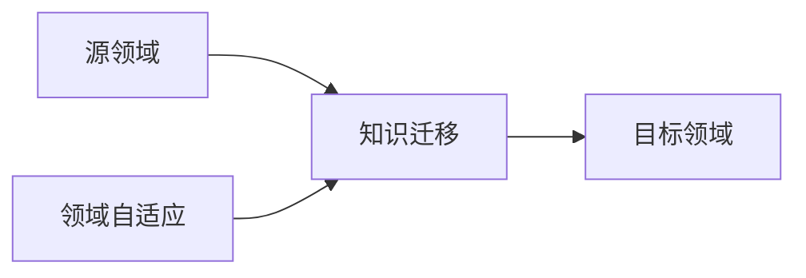

## 1.背景介绍

迁移学习是机器学习的一个重要分支，它的核心思想是将已经在一个领域（源领域）中学习到的知识，应用到另一个领域（目标领域）中去。这种学习方式在人类学习过程中非常常见，例如我们学习骑自行车的技巧后，可以很快地学会骑电动车。然而，对于机器来说，这种迁移能力并不是那么容易实现。因此，如何有效地进行迁移学习，成为了机器学习研究的一个重要课题。

## 2.核心概念与联系

迁移学习的核心概念主要包括源领域、目标领域、知识迁移和领域自适应。源领域指的是我们已经获取到知识的领域，而目标领域则是我们希望应用这些知识的领域。知识迁移就是将源领域的知识应用到目标领域的过程。领域自适应是迁移学习的一个重要技术，它的目标是使得源领域和目标领域的数据分布尽可能接近，以便于进行知识迁移。



## 3.核心算法原理具体操作步骤

迁移学习的核心算法原理可以分为三个步骤：特征选择、模型训练和知识迁移。

1. 特征选择：在源领域和目标领域中选择适合进行知识迁移的特征。这些特征应该能够很好地反映出源领域和目标领域的共性，同时也应该能够区分出它们的差异。

2. 模型训练：在源领域中使用选择的特征训练模型。这个模型将包含源领域的知识，我们希望这些知识能够在目标领域中得到应用。

3. 知识迁移：将训练好的模型应用到目标领域中，进行预测或分类。如果源领域和目标领域的数据分布相近，那么这个模型在目标领域中的表现应该也会很好。

## 4.数学模型和公式详细讲解举例说明

在迁移学习中，我们通常假设源领域和目标领域的数据分布是不同的。我们用 $P_S(X)$ 和 $P_T(X)$ 分别表示源领域和目标领域的数据分布，那么我们的目标就是找到一个映射函数 $f$，使得 $f$ 在源领域和目标领域的性能差异最小，即：

$$
\min_f || P_S(f(X)) - P_T(f(X)) ||^2
$$

其中 $||\cdot||^2$ 表示平方损失。

## 5.项目实践：代码实例和详细解释说明

下面我们来看一个使用 Python 和 scikit-learn 库进行迁移学习的简单示例。我们的任务是使用源领域的数据（例如 MNIST 数据集）训练一个手写数字识别的模型，然后将这个模型应用到目标领域（例如 USPS 数据集）上去。

```python
from sklearn import datasets
from sklearn import svm
from sklearn import metrics

# 加载源领域数据
source_data = datasets.load_digits()

# 训练模型
clf = svm.SVC(gamma=0.001, C=100.)
clf.fit(source_data.data[:-1], source_data.target[:-1])

# 加载目标领域数据
target_data = datasets.load_digits()

# 应用模型
predicted = clf.predict(target_data.data[-1:])

# 输出预测结果
print(predicted)
```

## 6.实际应用场景

迁移学习在许多实际应用场景中都有广泛的应用，例如在自然语言处理、计算机视觉和推荐系统等领域。其中，最具代表性的应用可能就是预训练模型了。预训练模型是在一个大型数据集（例如 ImageNet）上训练好的模型，我们可以直接将这个模型应用到我们的任务中，或者在此基础上进行微调，从而大大节省了训练时间和计算资源。

## 7.工具和资源推荐

在进行迁移学习研究和开发时，有一些工具和资源是非常有用的。例如，TensorFlow 和 PyTorch 是两个非常强大的深度学习框架，它们都提供了丰富的迁移学习功能。此外，Hugging Face 的 Transformers 库提供了大量的预训练模型，可以直接用于迁移学习。

## 8.总结：未来发展趋势与挑战

迁移学习是一个非常有前景的研究领域，它有着广泛的应用前景和巨大的研究潜力。然而，迁移学习也面临着一些挑战，例如如何有效地进行领域自适应，如何选择适合迁移的特征，以及如何评估迁移学习的效果等。这些问题都需要我们在未来的研究中进行深入探讨。

## 9.附录：常见问题与解答

1. Q: 迁移学习和传统的机器学习有什么区别？
   A: 传统的机器学习通常需要大量的标注数据进行训练，而迁移学习则可以利用源领域的知识，减少在目标领域的标注数据需求。

2. Q: 迁移学习适用于所有的机器学习任务吗？
   A: 不一定。迁移学习主要适用于源领域和目标领域有一定相关性的任务。如果两个领域完全无关，那么迁移学习可能效果并不好。

作者：禅与计算机程序设计艺术 / Zen and the Art of Computer Programming