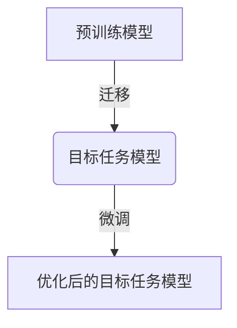
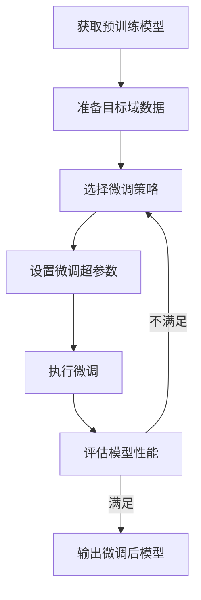

# 迁移学习的微调策略：如何有效地微调模型

## 1. 背景介绍

在深度学习时代,训练一个高质量的模型需要大量的数据和计算资源。然而,在许多实际应用场景中,我们往往难以获取足够的数据来从头训练一个模型。这时,迁移学习(Transfer Learning)就显得尤为重要。

迁移学习的核心思想是利用在源域(source domain)上训练好的模型,并将其迁移到目标域(target domain)上,从而减少在目标域上从头开始训练的数据需求。这种方法不仅能够节省大量的计算资源,而且可以提高模型在目标域上的性能表现。

在迁移学习中,微调(fine-tuning)是一种常用的策略,它通过在目标域上进行少量训练来调整预训练模型的参数,使其更好地适应目标任务。然而,微调策略的有效性取决于多个因素,如何选择合适的微调策略对于获得良好的模型性能至关重要。



## 2. 核心概念与联系

### 2.1 迁移学习的核心概念

- **域(Domain)**:由数据及其标注组成的特征空间和边缘概率分布的总和。
- **任务(Task)**:给定一个特征空间和学习模型,需要学习的目标预测函数。
- **源域(Source Domain)**:预训练模型所训练的初始域。
- **目标域(Target Domain)**:我们希望将模型迁移和应用的目标域。
- **域差异(Domain Shift)**:源域和目标域之间的数据分布差异。

### 2.2 迁移学习的类型

根据源域数据和目标域数据的标注情况,迁移学习可以分为以下几种类型:

- **监督迁移学习(Inductive Transfer Learning)**:源域和目标域都有标注数据。
- **无监督迁移学习(Unsupervised Transfer Learning)**:源域有标注数据,目标域无标注数据。
- **半监督迁移学习(Semi-Supervised Transfer Learning)**:源域有标注数据,目标域只有少量标注数据。

### 2.3 微调策略

微调策略是指在迁移学习中,如何利用目标域数据对预训练模型进行调整的方法。常见的微调策略包括:

- **全模型微调(Full Model Fine-tuning)**:对预训练模型的所有层进行微调。
- **部分微调(Partial Fine-tuning)**:只对预训练模型的部分层进行微调。
- **层级微调(Layer-wise Fine-tuning)**:按照层次结构逐层微调预训练模型。
- **discriminative微调(Discriminative Fine-tuning)**:根据每一层对模型性能的影响程度,选择性地微调不同层。

## 3. 核心算法原理具体操作步骤

微调策略的核心算法原理可以概括为以下几个步骤:

### 3.1 获取预训练模型

首先,我们需要获取一个在源域上训练好的预训练模型。这个预训练模型可以是公开的模型,也可以是我们自己在源域上训练的模型。

### 3.2 准备目标域数据

接下来,我们需要准备好目标域的数据集,包括训练集、验证集和测试集。如果目标域数据没有标注,我们可以考虑使用无监督或半监督的迁移学习方法。

### 3.3 选择微调策略

根据预训练模型的结构、目标任务的特点以及目标域数据的情况,选择合适的微调策略。常见的微调策略包括全模型微调、部分微调、层级微调和discriminative微调等。

### 3.4 设置微调超参数

在进行微调之前,我们需要设置一些超参数,如学习率、正则化系数、批大小等。合理设置这些超参数对于微调的效果至关重要。

### 3.5 执行微调

根据选择的微调策略,在目标域数据上对预训练模型进行微调。微调过程通常采用梯度下降等优化算法,不断更新模型参数,使其在目标任务上的性能不断提高。

### 3.6 评估模型性能

在微调过程中,我们需要使用验证集来评估模型的性能,并根据评估结果调整微调策略或超参数。最终,我们可以在测试集上评估微调后模型的泛化能力。



## 4. 数学模型和公式详细讲解举例说明

在微调过程中,我们通常采用梯度下降等优化算法来更新模型参数。以下是一些常用的数学模型和公式:

### 4.1 损失函数

在监督学习任务中,我们需要定义一个损失函数(Loss Function)来衡量模型预测值与真实值之间的差异。常用的损失函数包括:

- 均方误差(Mean Squared Error, MSE):

$$\text{MSE}(y, \hat{y}) = \frac{1}{n} \sum_{i=1}^{n} (y_i - \hat{y}_i)^2$$

- 交叉熵损失(Cross-Entropy Loss):

$$\text{CE}(y, \hat{y}) = - \sum_{i=1}^{n} y_i \log(\hat{y}_i)$$

其中,$y$表示真实标签,$\hat{y}$表示模型预测值。

### 4.2 正则化

为了防止模型过拟合,我们通常会在损失函数中加入正则化项(Regularization Term)。常用的正则化方法包括:

- L1正则化(Lasso Regularization):

$$\Omega(\mathbf{w}) = \lambda \sum_{i=1}^{d} |w_i|$$

- L2正则化(Ridge Regularization):

$$\Omega(\mathbf{w}) = \lambda \sum_{i=1}^{d} w_i^2$$

其中,$\mathbf{w}$表示模型参数向量,$\lambda$是正则化系数,用于控制正则化强度。

### 4.3 优化算法

在微调过程中,我们需要使用优化算法来最小化损失函数,从而更新模型参数。常用的优化算法包括:

- 随机梯度下降(Stochastic Gradient Descent, SGD):

$$\mathbf{w}_{t+1} = \mathbf{w}_t - \eta \nabla_{\mathbf{w}} \mathcal{L}(\mathbf{w}_t)$$

- 动量优化(Momentum Optimization):

$$\begin{aligned}
\mathbf{v}_{t+1} &= \gamma \mathbf{v}_t + \eta \nabla_{\mathbf{w}} \mathcal{L}(\mathbf{w}_t) \\
\mathbf{w}_{t+1} &= \mathbf{w}_t - \mathbf{v}_{t+1}
\end{aligned}$$

- 自适应优化算法(Adaptive Optimization Algorithms),如AdaGrad、RMSProp、Adam等。

其中,$\eta$表示学习率,$\gamma$表示动量系数,$\mathbf{v}_t$表示动量向量。

通过合理设置这些超参数,我们可以加速模型收敛,提高微调效果。

## 5. 项目实践:代码实例和详细解释说明

以下是一个使用PyTorch进行图像分类任务微调的代码示例,我们将在ImageNet数据集上预训练的ResNet模型迁移到CIFAR-10数据集上进行微调。

### 5.1 导入必要的库

```python
import torch
import torchvision
import torchvision.transforms as transforms
```

### 5.2 准备数据集

```python
# 定义数据预处理
transform = transforms.Compose([
    transforms.Resize(256),
    transforms.CenterCrop(224),
    transforms.ToTensor(),
    transforms.Normalize(mean=[0.485, 0.456, 0.406], std=[0.229, 0.224, 0.225])
])

# 加载CIFAR-10数据集
trainset = torchvision.datasets.CIFAR10(root='./data', train=True, download=True, transform=transform)
trainloader = torch.utils.data.DataLoader(trainset, batch_size=32, shuffle=True, num_workers=2)

testset = torchvision.datasets.CIFAR10(root='./data', train=False, download=True, transform=transform)
testloader = torch.utils.data.DataLoader(testset, batch_size=32, shuffle=False, num_workers=2)
```

### 5.3 加载预训练模型

```python
# 加载预训练的ResNet模型
model = torchvision.models.resnet18(pretrained=True)

# 修改最后一层的输出维度
num_ftrs = model.fc.in_features
model.fc = torch.nn.Linear(num_ftrs, 10)  # 10个类别
```

### 5.4 定义损失函数和优化器

```python
criterion = torch.nn.CrossEntropyLoss()
optimizer = torch.optim.SGD(model.parameters(), lr=0.001, momentum=0.9)
```

### 5.5 执行微调

```python
# 设置训练epochs
num_epochs = 10

# 开始训练
for epoch in range(num_epochs):
    running_loss = 0.0
    for i, data in enumerate(trainloader, 0):
        inputs, labels = data
        
        # 前向传播
        outputs = model(inputs)
        loss = criterion(outputs, labels)
        
        # 反向传播和优化
        optimizer.zero_grad()
        loss.backward()
        optimizer.step()
        
        # 打印统计信息
        running_loss += loss.item()
        if i % 100 == 99:    # 每100个batch打印一次
            print('[%d, %5d] loss: %.3f' % (epoch + 1, i + 1, running_loss / 100))
            running_loss = 0.0
            
    # 在测试集上评估模型
    correct = 0
    total = 0
    with torch.no_grad():
        for data in testloader:
            images, labels = data
            outputs = model(images)
            _, predicted = torch.max(outputs.data, 1)
            total += labels.size(0)
            correct += (predicted == labels).sum().item()
    
    print('Accuracy of the network on the 10000 test images: %d %%' % (100 * correct / total))
```

在这个示例中,我们首先加载了预训练的ResNet模型,并修改了最后一层的输出维度以适应CIFAR-10数据集的10个类别。然后,我们定义了损失函数和优化器,并在CIFAR-10训练集上进行了10个epoch的微调。在每个epoch结束时,我们在测试集上评估模型的准确率。

通过这个示例,你可以了解到如何在PyTorch中加载预训练模型、准备数据集、定义损失函数和优化器,以及执行微调的具体步骤。你还可以尝试调整不同的微调策略和超参数,观察它们对模型性能的影响。

## 6. 实际应用场景

迁移学习和微调策略在许多实际应用场景中发挥着重要作用,例如:

### 6.1 计算机视觉

在计算机视觉领域,我们可以将在ImageNet等大型数据集上预训练的模型(如VGGNet、ResNet、Inception等)迁移到其他视觉任务中,如目标检测、语义分割、实例分割等。由于这些任务往往缺乏大量的标注数据,因此迁移学习和微调策略可以有效地提高模型性能。

### 6.2 自然语言处理

在自然语言处理领域,我们可以将在大型语料库上预训练的语言模型(如BERT、GPT、XLNet等)迁移到下游任务中,如文本分类、机器翻译、问答系统等。这种迁移学习方法已经成为当前自然语言处理领域的主流做法。

### 6.3 医疗影像分析

在医疗影像分析领域,由于标注医疗数据的成本非常高昂,因此迁移学习和微调策略显得尤为重要。我们可以将在自然图像上预训练的模型迁移到医疗影像数据上,并进行微调,以提高模型在疾病检测、器官分割等任务上的性能。

### 6.4 工业缺陷检测

在工业缺陷检测领域,由于缺乏大量的缺陷样本数据,我们可以将在自然图像上预训练的模型迁移到工业图像数据上,并进行微调,以提高缺陷检测的准确性。这种方法已经在制造业中得到了广泛应用。

## 7. 工具和资源推荐

在进行迁移学习和微调时,有许多优秀的工具和资源可以使用:

### 7.1