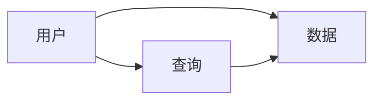

## 1.背景介绍
在当前的教育环境中，成绩查询系统已经成为了一种必备的工具。它不仅可以帮助学生及时了解自己的学习情况，而且还可以让教师更方便的管理学生的学习数据。然而，大部分的成绩查询系统都是针对特定的学校或者课程设计的，缺乏通用性。因此，本文将详细介绍一个通用的成绩查询系统的设计和代码实现。

## 2.核心概念与联系
成绩查询系统主要涉及到三个核心概念：用户、数据和查询。

- 用户：包括学生和教师两种角色，他们可以通过系统进行成绩的查询和管理。
- 数据：主要包括学生的基本信息和成绩信息，这些数据需要存储在数据库中。
- 查询：用户可以通过输入查询条件，获取到满足条件的成绩信息。

这三个核心概念之间的联系如下图所示：



## 3.核心算法原理具体操作步骤
成绩查询系统的核心算法主要包括数据的存储和查询两部分。

- 数据存储：我们选择使用关系型数据库来存储数据，因为它可以有效地处理大量的数据，并且可以通过SQL语言进行方便的数据操作。
- 数据查询：我们使用SQL语言进行数据查询，通过编写合适的查询语句，可以快速地获取到满足条件的数据。

## 4.数学模型和公式详细讲解举例说明
在成绩查询系统中，我们需要使用一些数学模型和公式来处理数据。例如，我们可以使用平均数和标准差来描述成绩的分布情况。

- 平均数：表示所有数据的平均值，计算公式为$\bar{x} = \frac{1}{n}\sum_{i=1}^{n}x_i$，其中$x_i$表示每个数据，$n$表示数据的总数。
- 标准差：表示数据的离散程度，计算公式为$s = \sqrt{\frac{1}{n}\sum_{i=1}^{n}(x_i - \bar{x})^2}$，其中$\bar{x}$表示平均数。

## 5.项目实践：代码实例和详细解释说明
下面我们将通过一个简单的例子来展示如何实现成绩查询系统。

首先，我们需要创建一个数据库来存储数据。在MySQL中，我们可以使用下面的代码来创建一个名为`grades`的数据库，并在其中创建一个名为`students`的表格来存储学生的信息和成绩。

```sql
CREATE DATABASE grades;
USE grades;
CREATE TABLE students (
    id INT AUTO_INCREMENT,
    name VARCHAR(100),
    grade FLOAT,
    PRIMARY KEY (id)
);
```

然后，我们可以使用下面的代码来向数据库中添加数据。

```sql
INSERT INTO students (name, grade) VALUES ('张三', 90);
INSERT INTO students (name, grade) VALUES ('李四', 85);
```

最后，我们可以使用下面的代码来查询成绩大于85的学生。

```sql
SELECT * FROM students WHERE grade > 85;
```

## 6.实际应用场景
成绩查询系统可以广泛应用于各种教育场景中，例如学校、培训机构和在线教育平台等。通过成绩查询系统，学生可以及时了解自己的学习情况，而教师则可以更方便的管理学生的学习数据。

## 7.工具和资源推荐
如果你想要实现一个成绩查询系统，那么下面的工具和资源可能会对你有所帮助。

- MySQL：一个开源的关系型数据库，可以用来存储和查询数据。
- PHP：一个服务器端的脚本语言，可以用来处理用户的请求和数据库的操作。
- W3School：一个提供各种编程语言教程的网站，你可以在这里学习SQL和PHP的基础知识。

## 8.总结：未来发展趋势与挑战
随着教育技术的发展，成绩查询系统将会变得越来越智能和个性化。例如，系统可以通过分析学生的学习数据，提供个性化的学习建议和资源推荐。然而，这也将带来一些挑战，例如如何保护学生的隐私，以及如何处理大量的数据。

## 9.附录：常见问题与解答
Q: 如何保护学生的隐私？
A: 我们可以通过加密技术来保护数据的安全，同时也需要遵守相关的法律法规，确保不会泄露学生的隐私。

Q: 如何处理大量的数据？
A: 我们可以使用分布式数据库来处理大量的数据，同时也可以使用数据挖掘技术来提取有用的信息。

作者：禅与计算机程序设计艺术 / Zen and the Art of Computer Programming