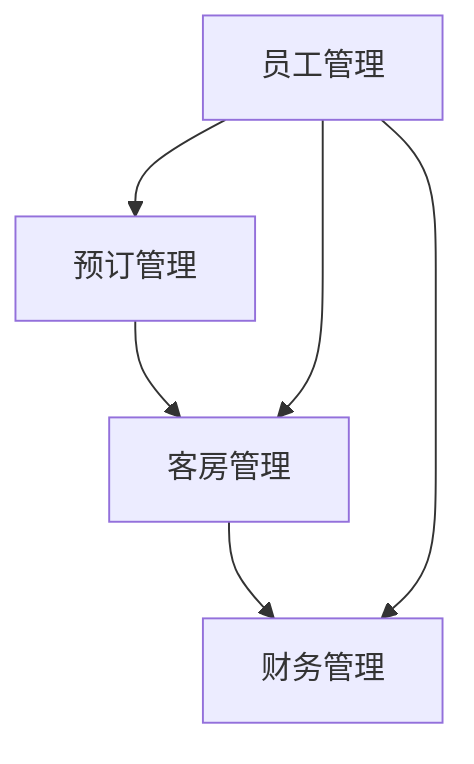

## 1.背景介绍

在当前的数字化时代，酒店行业也正在经历着深刻的变革。随着信息技术的发展，酒店管理系统已经成为了酒店行业的重要工具。本文将详细介绍酒店管理系统的设计与代码实现，帮助读者了解其背后的技术原理和实现方法。

## 2.核心概念与联系

酒店管理系统是一种自动化系统，主要用于处理酒店的日常运营任务，如预订管理、客房管理、员工管理、财务管理等。它的主要目标是提高酒店的运营效率，降低运营成本，提高客户满意度。

这种系统通常包括以下几个关键部分：

- **预订管理**：处理客户预订，包括在线预订、电话预订等。
- **客房管理**：管理酒店的客房状态，包括空房、已预订、已入住等。
- **员工管理**：管理酒店的员工信息，包括员工的工作安排、薪资等。
- **财务管理**：处理酒店的财务事务，包括收入、支出、税务等。

这些部分之间存在着紧密的联系。例如，当客户进行预订时，系统需要检查客房管理部分的数据，确认是否有空房。当客户入住或退房时，系统需要更新客房状态，并处理相关的财务事务。

下面是酒店管理系统的 Mermaid 流程图：



## 3.核心算法原理具体操作步骤

酒店管理系统的核心算法主要包括数据处理和业务逻辑处理两部分。

**数据处理**主要涉及到数据库的操作，包括数据的增删改查。这部分通常使用 SQL 语言进行操作。例如，查询空房的操作可以通过以下 SQL 语句实现：

```sql
SELECT * FROM rooms WHERE status = 'empty';
```

**业务逻辑处理**主要涉及到系统的业务规则，例如预订规则、入住规则、退房规则等。这部分通常使用编程语言（如 Java、Python 等）进行实现。例如，处理预订的业务逻辑可能包括以下步骤：

1. 接收客户的预订请求。
2. 检查请求的有效性。
3. 查询数据库，确认是否有空房。
4. 如果有空房，更新数据库，将房间状态改为已预订。
5. 返回预订结果给客户。

这两部分是酒店管理系统的核心，它们共同支持着系统的运行。

## 4.数学模型和公式详细讲解举例说明

酒店管理系统的设计和实现并不涉及复杂的数学模型和公式。但在系统的运营过程中，我们可以使用一些简单的数学模型和公式来分析和优化系统的性能。

例如，我们可以使用排队理论来分析客户的等待时间。假设每个客户的服务时间（如预订、入住、退房等）是一个随机变量，服从指数分布，其平均值为 $\mu$。假设每分钟到达的客户数也是一个随机变量，服从泊松分布，其平均值为 $\lambda$。那么，根据排队理论，客户的平均等待时间可以通过以下公式计算：

$$
W = \frac{1}{\mu - \lambda}
$$

通过这个公式，我们可以预测在不同的到达率和服务率下，客户的平均等待时间。如果等待时间过长，我们可以采取一些措施来优化，例如增加服务人员、优化服务流程等。

## 5.项目实践：代码实例和详细解释说明

酒店管理系统的实现需要涉及到前端和后端两部分。前端主要负责用户界面的设计和实现，后端主要负责业务逻辑和数据处理的实现。

这里以 Java 语言为例，给出一个简单的后端代码实例。这个例子实现了预订管理部分的一个基本功能：接收客户的预订请求，并返回预订结果。

```java
public class ReservationManager {
    private RoomManager roomManager;
    private Database database;

    public ReservationManager(RoomManager roomManager, Database database) {
        this.roomManager = roomManager;
        this.database = database;
    }

    public boolean makeReservation(ReservationRequest request) {
        // 检查请求的有效性
        if (!request.isValid()) {
            return false;
        }

        // 查询数据库，确认是否有空房
        if (!roomManager.hasEmptyRoom()) {
            return false;
        }

        // 更新数据库，将房间状态改为已预订
        database.updateRoomStatus(request.getRoomId(), "reserved");

        return true;
    }
}
```

这个例子使用了面向对象的设计方法，将酒店管理系统的各个部分封装成了不同的类。这种设计方法可以提高代码的可读性和可维护性。

## 6.实际应用场景

酒店管理系统广泛应用于酒店行业，包括小型的家庭旅馆、中型的商务酒店、大型的豪华酒店等。它可以帮助酒店提高运营效率，降低运营成本，提高客户满意度。

除了酒店行业，这种系统也可以应用于其他类似的场景，例如宿舍管理、医院管理等。

## 7.工具和资源推荐

在设计和实现酒店管理系统时，以下工具和资源可能会有所帮助：

- **编程语言**：Java、Python、C# 等都是不错的选择。
- **数据库管理系统**：MySQL、PostgreSQL、SQLite 等都是常用的数据库管理系统。
- **开发工具**：Eclipse、IntelliJ IDEA、PyCharm 等都是优秀的开发工具。
- **版本控制系统**：Git 是目前最流行的版本控制系统。
- **教程和文档**：网上有很多关于编程语言、数据库管理系统、开发工具等的教程和文档，可以帮助你学习和使用这些工具。

## 8.总结：未来发展趋势与挑战

随着信息技术的发展，酒店管理系统也将面临新的发展趋势和挑战。

一方面，智能化将是酒店管理系统的重要发展趋势。通过引入人工智能技术，例如机器学习、自然语言处理等，酒店管理系统可以提供更智能、更个性化的服务。

另一方面，安全性和隐私保护将是酒店管理系统的重要挑战。酒店管理系统需要处理大量的敏感信息，如客户的身份信息、信用卡信息等。如何保护这些信息的安全，防止数据泄露，将是一个重要的问题。

## 9.附录：常见问题与解答

1. **酒店管理系统的设计和实现需要什么样的技术基础？**

设计和实现酒店管理系统需要掌握编程语言（如 Java、Python 等）、数据库管理系统（如 MySQL、PostgreSQL 等）、软件工程的基本原理和方法等。

2. **酒店管理系统的前端可以使用什么技术实现？**

酒店管理系统的前端可以使用 HTML、CSS、JavaScript 等技术实现。也可以使用一些前端框架，如 React、Vue、Angular 等。

3. **酒店管理系统如何处理并发预订的问题？**

酒店管理系统可以使用数据库的事务机制来处理并发预订的问题。当多个客户同时预订同一间房间时，只有一个预订操作可以成功，其他的预订操作会失败。

作者：禅与计算机程序设计艺术 / Zen and the Art of Computer Programming