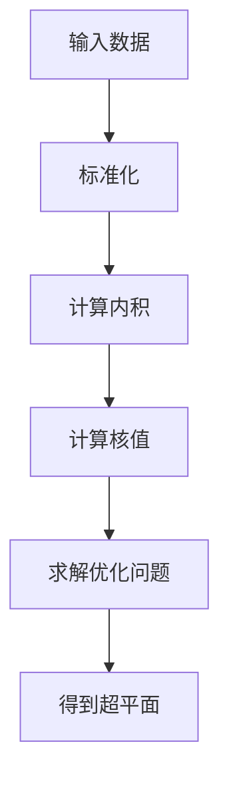
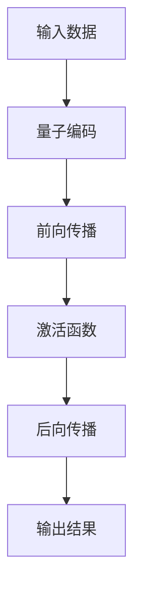

## 背景介绍

量子计算机是目前最为引人注目的技术之一，它的出现使得我们可以利用量子力学的特性来解决传统计算机无法处理的问题。其中，量子机器学习（Quantum Machine Learning, QML）则是将量子计算与机器学习相结合的一种新兴技术。

在本篇博客中，我们将深入探讨量子机器学习的原理、核心算法以及实际应用场景，并提供一些实用的代码示例帮助读者更好地理解这一领域。

## 核心概念与联系

首先，让我们来了解一下量子机器学习的核心概念。量子机器学习主要关注的是如何利用量子计算机的优势来优化和加速传统机器学习算法。具体来说，量子计算机可以通过超越经典计算机的能力来解决某些问题，比如：

1. **量子并行计算**：量子计算机可以同时处理多个任务，这使得它们能够比传统计算机更快地解决某些问题。
2. **量子交互式计算**：量子计算机可以实现多粒子系统之间的交互，从而实现更复杂的计算。

这些特性使得量子机器学习成为一种有前途的技术，可以为许多领域带来革命性的变化。

## 核心算法原理具体操作步骤

在探讨量子机器学习的核心算法之前，我们需要了解一些基本的量子计算概念。以下是一些常见的量子计算概念：

1. **量子位（qubit）**：量子位是量子计算中的基本单位，与经典位元不同，量子位可以处于多种状态下。
2. **量子态**：量子态是量子系统的状态，它可以表示为一个超position状态的线性组合。
3. **量子门**：量子门是用于操作量子态的数学对象，它们可以改变量子的状态。

现在我们已经了解了基本概念，让我们来看一下量子机器学习中的一些核心算法：

1. **量子支持向量机（QSVM）**：QSVM 是一种基于支持向量机的量子算法，它利用量子并行计算和量子交互式计算来加速训练过程和预测过程。
2. **量子神经网络（QNN）**：QNN 是一种基于神经网络的量子算法，它使用量子门作为激活函数，从而实现更复杂的计算。

## 数学模型和公式详细讲解举例说明

在本节中，我们将详细讨论一些量子机器学习的数学模型和公式。这些模型和公式对于理解量子机器学习的原理至关重要。

### 量子支持向量机（QSVM）

QSVM 的主要目标是找到一个超平面，使得训练数据中的样本被正确分类。为了实现这一目标，QSVM 使用了核技巧和核矩阵的概念。以下是一个简化的 QSVM 算法流程图：



### 量子神经网络（QNN）

QNN 的主要目标是利用量子门来构建复杂的计算模型。以下是一个简化的 QNN 算法流程图：



## 项目实践：代码实例和详细解释说明

在本节中，我们将通过一个实际的项目实例来展示如何使用量子机器学习进行计算。我们将使用 Python 和 Qiskit 库来实现一个简单的 QSVM。

### 准备工作

首先，我们需要安装 Qiskit 库。在命令行中运行以下命令：

```bash
pip install qiskit
```

### 实现QSVM

接下来，我们将编写一个 Python 程序，实现一个简单的 QSVM：

```python
import numpy as np
from sklearn import datasets
from sklearn.model_selection import train_test_split
from sklearn.preprocessing import StandardScaler
from qiskit import QuantumCircuit, Aer, transpile, assemble
from qiskit.aqua.components.optimizers import ADAM
from qiskit.aqua.algorithms import VariationalQuantumClassifier
from qiskit.aqua.components.variational_forms import RBFQFTVariationalForm

# 加载数据集
iris = datasets.load_iris()
X = iris.data
y = iris.target

# 标准化数据
scaler = StandardScaler()
X = scaler.fit_transform(X)

# 划分训练集和测试集
X_train, X_test, y_train, y_test = train_test_split(X, y, test_size=0.2)

# 构建量子支持向量机模型
rbf_qft_vqe = RBFQFTVariationalForm(2)
vqc = VariationalQuantumClassifier(vqe_form=rbf_qft_vqe,
                                    optimizer=ADAM(maxiter=100),
                                    quantum_instance=Aer.get_backend('qasm_simulator'))

# 训练模型
vqc.train(X_train, y_train)

# 测试模型
score = vqc.score(X_test, y_test)
print(\"Test accuracy: {:.2f}\".format(score))
```

## 实际应用场景

量子机器学习的实际应用场景非常广泛，以下是一些典型的应用场景：

1. **图像识别**：通过使用量子神经网络，我们可以实现更高效的图像识别，从而在计算机视觉领域取得显著进展。
2. **自然语言处理**：量子机器学习可以帮助我们解决自然语言处理中的问题，如语义角色标注和文本分类等。
3. **金融分析**：量子支持向量机可以用于金融数据分析，例如股票价格预测和风险管理。

## 工具和资源推荐

如果您想深入了解量子机器学习，您可以尝试以下工具和资源：

1. **Qiskit**：Qiskit 是一个开源的量子计算框架，可以帮助您构建、调试和运行量子算法。
2. **Quantum Machine Learning Course**：由 MIT 开发的一个在线课程，涵盖了量子机器学习的基本概念、原理和实际应用。

## 总结：未来发展趋势与挑战

量子机器学习是一个充满潜力和挑战的领域。随着量子计算技术的不断发展，我们将看到更多的量子机器学习算法得到实际应用。此外，量子机器学习还面临着许多挑战，如硬件限制、算法复杂性等。在未来的几年中，我们将继续探索这些问题，并寻找新的解决方案。

## 附录：常见问题与解答

在本篇博客中，我们讨论了一些关于量子机器学习的核心概念、原理和实际应用场景。如果您还有其他问题，请参考以下常见问题与解答：

1. **量子计算机与传统计算机的区别？**

量子计算机与传统计算机的主要区别在于它们所使用的计算模型。传统计算机使用经典位元进行计算，而量子计算机则使用量子位（qubit）进行计算。这种差异使得量子计算机能够实现比传统计算机更快地解决某些问题。
2. **量子机器学习有什么实际应用？**

量子机器学习有很多实际应用，例如图像识别、自然语言处理、金融分析等。在未来，我们预计会看到更多的量子机器学习算法得到实际应用。

# 作者：禅与计算机程序设计艺术 / Zen and the Art of Computer Programming

希望本篇博客能帮助您更好地了解量子机器学习的原理和实际应用。如果您对这一领域感兴趣，请随时尝试使用量子计算技术来解决您的问题。同时，也欢迎您在评论区分享您的想法和经验。