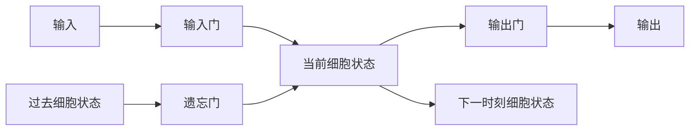

## 1.背景介绍

在处理序列数据时，我们经常遇到的一个问题是序列的长度不固定，而且序列中的元素之间存在着时间上的依赖关系。这就是我们通常说的时间序列问题。为了解决这个问题，人们发明了很多种方法，其中最具代表性的就是循环神经网络 (RNN)。然而，RNN存在一个问题，就是在处理长序列时，会出现梯度消失或梯度爆炸的问题。为了解决这个问题，长短时记忆网络 (Long Short-Term Memory, LSTM) 应运而生。

## 2.核心概念与联系

LSTM是一种特殊的RNN，它通过引入"门"的概念，来控制信息的流动，从而有效地解决了梯度消失和梯度爆炸的问题。LSTM的基本结构包括三个门：输入门、遗忘门和输出门，以及一个细胞状态。

- 输入门：决定我们将多少新输入信息存储到细胞状态中。
- 遗忘门：决定我们将多少过去的细胞状态保留下来。
- 输出门：决定将多少细胞状态输出到下一时刻。
- 细胞状态：是LSTM的"记忆"部分，它可以存储过去的信息，并用于计算当前的输出。

这四个部分共同决定了LSTM的状态更新和信息流动。


## 3.核心算法原理具体操作步骤

LSTM的运行可以分为以下四个步骤：

1. 计算遗忘门的值：使用sigmoid函数，将输入和过去的隐藏状态映射到0到1的范围内，得到每个细胞状态需要遗忘的程度。
2. 计算输入门的值：使用sigmoid函数，将输入和过去的隐藏状态映射到0到1的范围内，得到每个新输入信息需要存储的程度。
3. 更新细胞状态：将过去的细胞状态乘以遗忘门的值，加上新的输入信息乘以输入门的值，得到当前的细胞状态。
4. 计算输出门的值：使用sigmoid函数，将输入和当前的细胞状态映射到0到1的范围内，得到每个细胞状态需要输出的程度。
5. 计算输出：将当前的细胞状态乘以输出门的值，得到输出。

## 4.数学模型和公式详细讲解举例说明

我们可以用数学公式来详细描述LSTM的运行过程：

假设我们的输入是$x_t$，过去的隐藏状态是$h_{t-1}$，过去的细胞状态是$c_{t-1}$，那么：

1. 遗忘门的值：$f_t = \sigma(W_f \cdot [h_{t-1}, x_t] + b_f)$
2. 输入门的值：$i_t = \sigma(W_i \cdot [h_{t-1}, x_t] + b_i)$
3. 新的输入信息：$\tilde{c}_t = \tanh(W_c \cdot [h_{t-1}, x_t] + b_c)$
4. 更新细胞状态：$c_t = f_t \cdot c_{t-1} + i_t \cdot \tilde{c}_t$
5. 输出门的值：$o_t = \sigma(W_o \cdot [h_{t-1}, x_t] + b_o)$
6. 计算输出：$h_t = o_t \cdot \tanh(c_t)$

其中，$\sigma$是sigmoid函数，$\tanh$是双曲正切函数，$W_f, W_i, W_c, W_o$和$b_f, b_i, b_c, b_o$是需要学习的参数。

## 5.项目实践：代码实例和详细解释说明

下面我们来看一个简单的LSTM的Python实现：

```python
import numpy as np

def sigmoid(x):
    return 1 / (1 + np.exp(-x))

def lstm_cell_forward(xt, a_prev, c_prev, parameters):
    Wf = parameters["Wf"]
    bf = parameters["bf"]
    Wi = parameters["Wi"]
    bi = parameters["bi"]
    Wc = parameters["Wc"]
    bc = parameters["bc"]
    Wo = parameters["Wo"]
    bo = parameters["bo"]
    
    concat = np.concatenate((a_prev, xt), axis=1)
    
    ft = sigmoid(np.dot(Wf, concat) + bf)
    it = sigmoid(np.dot(Wi, concat) + bi)
    cct = np.tanh(np.dot(Wc, concat) + bc)
    c_next = ft * c_prev + it * cct
    ot = sigmoid(np.dot(Wo, concat) + bo)
    a_next = ot * np.tanh(c_next)
    
    return a_next, c_next
```

这段代码实现了一个LSTM单元的前向传播过程。它首先计算出遗忘门、输入门、新的输入信息和输出门的值，然后更新细胞状态和隐藏状态。

## 6.实际应用场景

LSTM在许多实际问题中都有应用，例如：

- 语音识别：LSTM可以用来模拟语音信号中的时间依赖关系，从而提高语音识别的准确度。
- 机器翻译：LSTM可以用来处理变长的输入和输出序列，从而实现机器翻译。
- 时间序列预测：LSTM可以用来模拟时间序列中的趋势和周期性，从而进行准确的预测。

## 7.工具和资源推荐

- TensorFlow：Google开源的深度学习框架，提供了LSTM的实现。
- PyTorch：Facebook开源的深度学习框架，提供了LSTM的实现。

## 8.总结：未来发展趋势与挑战

虽然LSTM在处理时间序列问题上取得了显著的成果，但是它也面临着一些挑战，例如计算复杂度高，需要大量的参数等。未来的研究可能会集中在如何优化LSTM的结构，以及如何将LSTM与其他模型结合，以提高性能。

## 9.附录：常见问题与解答

Q: LSTM和普通的RNN有什么区别？

A: LSTM是RNN的一种变体，它通过引入"门"的概念，来控制信息的流动，从而有效地解决了梯度消失和梯度爆炸的问题。

Q: LSTM的参数如何训练？

A: LSTM的参数通常通过反向传播算法和梯度下降法进行训练。

作者：禅与计算机程序设计艺术 / Zen and the Art of Computer Programming