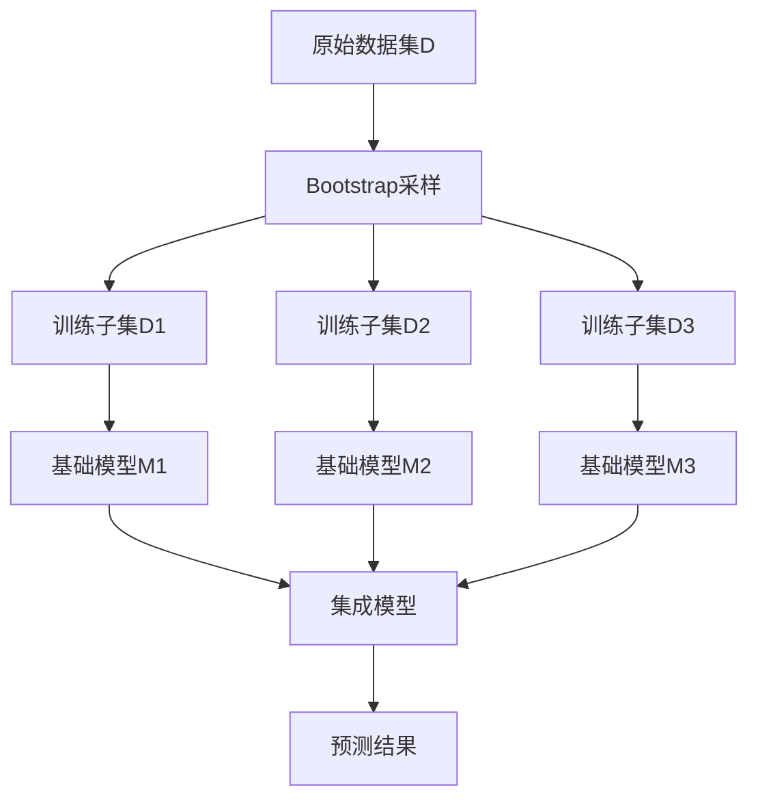
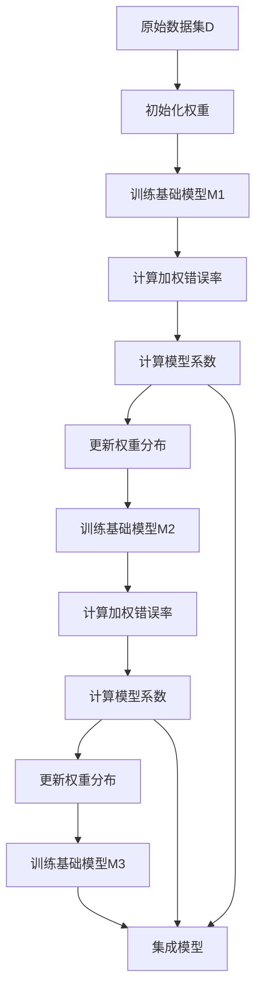

# 集成学习(Ensemble Learning)原理与代码实战案例讲解

## 1.背景介绍

在机器学习领域,单一模型的性能往往会受到数据集的局限性、算法偏差和方差等因素的影响,导致泛化能力不足。为了提高模型的预测精度和鲁棒性,集成学习(Ensemble Learning)应运而生。集成学习的核心思想是将多个基础模型(Base Learners)组合在一起,从而形成一个强大的综合模型,利用多个模型的"集体智慧"来提高整体性能。

## 2.核心概念与联系

### 2.1 集成学习的基本概念

集成学习可以分为两大类:

1. **个体学习器(Individual Learners)**:指基础模型,如决策树、神经网络等。
2. **组合策略(Combination Strategy)**:指将多个个体学习器组合的方式,如投票(Voting)、加权平均(Weighted Averaging)等。

根据个体学习器的生成方式,集成学习可以进一步分为:

1. **个体学习器独立生成**:个体学习器之间相互独立,如Bagging(Bootstrap Aggregating)。
2. **个体学习器依赖生成**:后一个个体学习器的生成依赖于前一个,如Boosting。

### 2.2 集成学习的优势

集成学习的优势主要体现在以下几个方面:

1. **降低方差(Variance Reduction)**:通过组合多个模型,可以减小单个模型的方差,提高预测的稳定性。
2. **降低偏差(Bias Reduction)**:组合多个不同偏差的模型,可以互相弥补,降低整体偏差。
3. **提高鲁棒性(Robustness)**:集成模型对异常数据和噪声数据的鲁棒性更强。
4. **扩展表达能力(Expressive Power)**:组合多种类型的模型,可以拓展整体模型的表达能力。

### 2.3 常见的集成学习算法

常见的集成学习算法包括:

1. **Bagging**:通过自助采样(Bootstrapping)生成多个数据子集,在每个子集上训练一个基础模型,然后将这些基础模型进行组合。代表算法有随机森林(Random Forest)。
2. **Boosting**:通过改变训练数据的权重分布,生成一系列基础模型,并将它们线性组合。代表算法有AdaBoost、Gradient Boosting等。
3. **Stacking**:将多个基础模型的预测结果作为新的特征输入到另一个模型(元模型)中进行整合。

## 3.核心算法原理具体操作步骤

### 3.1 Bagging算法原理

Bagging的核心思想是通过自助采样(Bootstrapping)从原始数据集中生成多个子集,每个子集都是通过有放回抽样获得的。然后,在每个子集上训练一个基础模型,最终将这些基础模型组合在一起,形成集成模型。

Bagging算法的具体步骤如下:

1. 从原始数据集D中,通过有放回抽样获得N个新的训练子集D1,D2,...,DN。
2. 在每个训练子集Di上,训练一个基础模型Mi。
3. 对于新的测试样本x,由各个基础模型Mi(x)独立作出预测,将这些预测结果进行组合(如投票或平均),得到最终的集成预测结果。



### 3.2 Boosting算法原理

Boosting算法的核心思想是通过改变训练数据的权重分布,生成一系列基础模型,并将它们线性组合。具体来说,Boosting算法会先训练一个初始的基础模型,然后根据该模型的预测结果调整训练数据的权重,使得被错误分类的样本权重增大。接下来,训练第二个基础模型时会更加关注这些权重较大的样本。重复这个过程,直到达到指定的迭代次数或满足其他停止条件。

以AdaBoost算法为例,其具体步骤如下:

1. 初始化训练数据的权重分布为均匀分布。
2. 对于第m次迭代:
    a. 根据当前的训练数据权重分布,训练一个基础模型。
    b. 计算该基础模型的加权错误率。
    c. 根据加权错误率计算该基础模型的系数。
    d. 更新训练数据的权重分布,提高被错误分类样本的权重。
3. 将所有基础模型线性组合,得到最终的集成模型。



## 4.数学模型和公式详细讲解举例说明

### 4.1 Bagging算法的数学模型

设有N个基础模型$M_1, M_2, \ldots, M_N$,对于新的测试样本$x$,Bagging算法的集成预测结果为:

$$
M_{ensemble}(x) = \frac{1}{N}\sum_{i=1}^{N}M_i(x) \quad \text{(回归问题)}
$$

$$
M_{ensemble}(x) = \text{majority vote} \{ M_1(x), M_2(x), \ldots, M_N(x) \} \quad \text{(分类问题)}
$$

其中,对于回归问题,Bagging算法采用基础模型预测值的平均值作为最终预测结果;对于分类问题,Bagging算法采用基础模型预测类别的多数投票结果作为最终预测结果。

### 4.2 Boosting算法的数学模型

以AdaBoost算法为例,设有N个基础模型$M_1, M_2, \ldots, M_N$,对于新的测试样本$x$,AdaBoost算法的集成预测结果为:

$$
M_{ensemble}(x) = \text{sign} \left( \sum_{i=1}^{N} \alpha_i M_i(x) \right)
$$

其中,$\alpha_i$为第$i$个基础模型的系数,计算公式为:

$$
\alpha_i = \frac{1}{2} \ln \left( \frac{1 - \epsilon_i}{\epsilon_i} \right)
$$

$\epsilon_i$为第$i$个基础模型在当前训练数据权重分布下的加权错误率。

可以看出,AdaBoost算法通过对基础模型的线性组合,并根据每个基础模型的加权错误率赋予不同的系数,从而得到最终的集成模型。

### 4.3 示例:使用Bagging和Boosting算法预测房价

以下是一个使用Bagging和Boosting算法预测房价的示例:

```python
from sklearn.ensemble import RandomForestRegressor, GradientBoostingRegressor
from sklearn.datasets import load_boston
from sklearn.model_selection import train_test_split
from sklearn.metrics import mean_squared_error

# 加载波士顿房价数据集
boston = load_boston()
X, y = boston.data, boston.target

# 划分训练集和测试集
X_train, X_test, y_train, y_test = train_test_split(X, y, test_size=0.2, random_state=42)

# 使用Bagging算法(随机森林)
rf = RandomForestRegressor(n_estimators=100, random_state=42)
rf.fit(X_train, y_train)
y_pred_rf = rf.predict(X_test)
mse_rf = mean_squared_error(y_test, y_pred_rf)
print(f"Random Forest MSE: {mse_rf:.2f}")

# 使用Boosting算法(梯度提升树)
gb = GradientBoostingRegressor(n_estimators=100, random_state=42)
gb.fit(X_train, y_train)
y_pred_gb = gb.predict(X_test)
mse_gb = mean_squared_error(y_test, y_pred_gb)
print(f"Gradient Boosting MSE: {mse_gb:.2f}")
```

在这个示例中,我们使用了scikit-learn库中的RandomForestRegressor和GradientBoostingRegressor类,分别对应Bagging算法(随机森林)和Boosting算法(梯度提升树)。我们在波士顿房价数据集上训练和评估了这两种集成模型,并计算了它们在测试集上的均方误差(MSE)。

通常,集成模型能够提供比单一模型更好的性能,但具体效果还取决于数据集的特征和模型的参数设置。

## 5.项目实践:代码实例和详细解释说明

在本节中,我们将通过一个实际项目案例,展示如何使用Python中的scikit-learn库实现Bagging和Boosting算法,并对比它们在分类和回归任务上的表现。

### 5.1 项目概述

我们将使用著名的iris数据集进行分类任务,以及boston房价数据集进行回归任务。对于每个任务,我们将训练以下模型:

- 单一决策树模型(作为基线)
- 使用Bagging算法的随机森林模型
- 使用Boosting算法的AdaBoost模型(分类任务)
- 使用Boosting算法的梯度提升树模型(回归任务)

我们将评估每个模型在测试集上的性能,并比较不同集成学习算法的优劣。

### 5.2 数据准备

首先,我们导入所需的库和数据集:

```python
from sklearn.datasets import load_iris, load_boston
from sklearn.model_selection import train_test_split

# 加载iris数据集
iris = load_iris()
X_iris, y_iris = iris.data, iris.target

# 加载boston房价数据集
boston = load_boston()
X_boston, y_boston = boston.data, boston.target

# 划分训练集和测试集
X_train_iris, X_test_iris, y_train_iris, y_test_iris = train_test_split(X_iris, y_iris, test_size=0.2, random_state=42)
X_train_boston, X_test_boston, y_train_boston, y_test_boston = train_test_split(X_boston, y_boston, test_size=0.2, random_state=42)
```

### 5.3 分类任务:iris数据集

对于iris数据集的分类任务,我们将训练以下模型:

- 单一决策树模型
- 随机森林模型(Bagging)
- AdaBoost模型(Boosting)

```python
from sklearn.tree import DecisionTreeClassifier
from sklearn.ensemble import RandomForestClassifier, AdaBoostClassifier
from sklearn.metrics import accuracy_score

# 单一决策树模型
dt = DecisionTreeClassifier(random_state=42)
dt.fit(X_train_iris, y_train_iris)
y_pred_dt = dt.predict(X_test_iris)
acc_dt = accuracy_score(y_test_iris, y_pred_dt)
print(f"Decision Tree Accuracy: {acc_dt:.2f}")

# 随机森林模型(Bagging)
rf = RandomForestClassifier(n_estimators=100, random_state=42)
rf.fit(X_train_iris, y_train_iris)
y_pred_rf = rf.predict(X_test_iris)
acc_rf = accuracy_score(y_test_iris, y_pred_rf)
print(f"Random Forest Accuracy: {acc_rf:.2f}")

# AdaBoost模型(Boosting)
ada = AdaBoostClassifier(n_estimators=100, random_state=42)
ada.fit(X_train_iris, y_train_iris)
y_pred_ada = ada.predict(X_test_iris)
acc_ada = accuracy_score(y_test_iris, y_pred_ada)
print(f"AdaBoost Accuracy: {acc_ada:.2f}")
```

### 5.4 回归任务:boston房价数据集

对于boston房价数据集的回归任务,我们将训练以下模型:

- 单一决策树模型
- 随机森林模型(Bagging)
- 梯度提升树模型(Boosting)

```python
from sklearn.tree import DecisionTreeRegressor
from sklearn.ensemble import RandomForestRegressor, GradientBoostingRegressor
from sklearn.metrics import mean_squared_error

# 单一决策树模型
dt = DecisionTreeRegressor(random_state=42)
dt.fit(X_train_boston, y_train_boston)
y_pred_dt = dt.predict(X_test_boston)
m