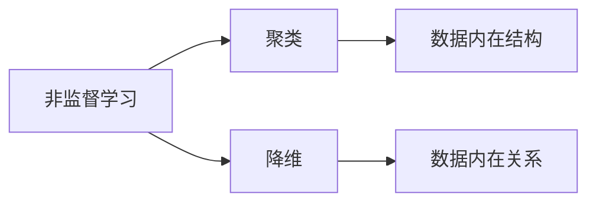

## 1.背景介绍

在机器学习领域，我们通常将学习任务归类为监督学习、非监督学习和强化学习三大类。而非监督学习，作为其中一种重要的学习方式，它的主要特点是在学习过程中并未给出明确的标签或反馈，而是通过学习数据本身的内在结构和关系，来进行模型的构建和预测。这种学习方式在许多实际问题中表现出了重要的价值，例如在数据预处理、特征提取、聚类分析等任务中，非监督学习都发挥着重要的作用。

## 2.核心概念与联系

非监督学习主要包括两大类任务：聚类和降维。聚类是通过学习数据的内在结构，将数据分为若干个不同的类别或者群组；而降维则是通过学习数据的内在关系，将高维度的数据映射到低维度的空间，同时尽可能保持数据的重要特性。这两种任务虽然看似不同，但它们都是通过学习数据的内在结构和关系，来揭示数据的本质特性。



## 3.核心算法原理具体操作步骤

接下来，我们将以K-means聚类算法和PCA降维算法为例，来具体介绍非监督学习的核心算法原理和操作步骤。

### 3.1 K-means聚类算法

K-means聚类算法是一种经典的非监督学习算法，其主要思想是通过迭代的方式，将数据分为K个不同的类别。算法的具体步骤如下：

1. 初始化：选择K个数据点作为初始的类别中心。
2. 迭代：将每个数据点分配到最近的类别中心，然后更新每个类别的中心为该类别所有数据点的均值。重复这个步骤，直到类别中心不再发生变化，或者达到预设的最大迭代次数。

### 3.2 PCA降维算法

PCA(Principal Component Analysis)是一种常用的降维算法，其主要思想是通过线性变换，将高维度的数据映射到低维度的空间，同时尽可能保持数据的重要特性。算法的具体步骤如下：

1. 计算数据的协方差矩阵。
2. 计算协方差矩阵的特征值和特征向量。
3. 选择前d个最大的特征值对应的特征向量，构成一个d维的新空间。
4. 将原始数据映射到这个新的空间，得到降维后的数据。

## 4.数学模型和公式详细讲解举例说明

### 4.1 K-means聚类算法的数学模型

在K-means聚类算法中，我们的目标是最小化所有数据点到其所属类别中心的距离之和，这可以用下面的公式来表示：

$$
J = \sum_{i=1}^{m}\sum_{j=1}^{k} w_{ij} ||x_i - u_j||^2
$$

其中，$m$是数据点的数量，$k$是类别的数量，$w_{ij}$是一个二值指示器，如果数据点$x_i$属于类别$j$，则$w_{ij}=1$，否则$w_{ij}=0$。$u_j$是类别$j$的中心，$||x_i - u_j||^2$是数据点$x_i$到类别$j$中心的欧氏距离。

### 4.2 PCA降维算法的数学模型

在PCA降维算法中，我们的目标是找到一个新的空间，使得数据在这个新的空间中的方差最大，这可以用下面的公式来表示：

$$
max_{w} \; w^T X^T X w \; s.t. \; w^T w = 1
$$

其中，$X$是数据矩阵，$w$是映射向量。这个优化问题的解就是协方差矩阵$X^T X$的特征向量。

## 5.项目实践：代码实例和详细解释说明

接下来，我们将通过一个具体的项目实践，来展示如何使用Python的sklearn库，来实现K-means聚类算法和PCA降维算法。

### 5.1 K-means聚类算法的代码实例

```python
from sklearn.cluster import KMeans
from sklearn.datasets import make_blobs

# 生成模拟数据
X, y = make_blobs(n_samples=300, centers=4, random_state=0)

# 使用KMeans进行聚类
kmeans = KMeans(n_clusters=4)
kmeans.fit(X)

# 输出聚类结果
print(kmeans.labels_)
```

### 5.2 PCA降维算法的代码实例

```python
from sklearn.decomposition import PCA
from sklearn.datasets import load_iris

# 加载iris数据集
iris = load_iris()
X = iris.data

# 使用PCA进行降维
pca = PCA(n_components=2)
X_pca = pca.fit_transform(X)

# 输出降维后的数据
print(X_pca)
```

## 6.实际应用场景

非监督学习在许多实际应用场景中都发挥着重要的作用。例如，我们可以使用K-means聚类算法，来进行客户分群，从而更好地理解客户的需求和行为；我们也可以使用PCA降维算法，来进行特征提取或者数据压缩，从而提高其他机器学习算法的效率和效果。

## 7.工具和资源推荐

在非监督学习的实践中，以下工具和资源可能会对你有所帮助：

- Python：一种广泛用于数据科学和机器学习的编程语言。
- sklearn：一个提供了大量机器学习算法的Python库，包括K-means聚类算法和PCA降维算法。
- numpy：一个提供了大量数值计算功能的Python库，例如数组操作、线性代数、统计等。

## 8.总结：未来发展趋势与挑战

非监督学习作为机器学习的重要分支，其在解决许多实际问题中显示出了强大的潜力。然而，非监督学习也面临着许多挑战，例如如何更好地理解和解释模型的结果，如何处理高维度和大规模的数据，如何将非监督学习与其他学习方式（如监督学习和强化学习）进行结合等。在未来，随着研究的深入和技术的发展，我们期待看到非监督学习在这些方面取得更多的突破和进展。

## 9.附录：常见问题与解答

Q1：非监督学习和监督学习有什么区别？

A1：监督学习是在有标签的数据上进行学习，其目标是通过学习数据的特征和标签之间的关系，来进行预测或分类；而非监督学习则是在无标签的数据上进行学习，其目标是通过学习数据的内在结构和关系，来进行模型的构建和预测。

Q2：K-means聚类算法的K值应该如何选择？

A2：K值的选择通常取决于具体的应用场景和数据特性。一种常用的方法是通过实验来确定K值，即对不同的K值进行尝试，然后选择使得聚类结果最好（例如聚类的紧密度最高或者分散度最低）的K值。

Q3：PCA降维算法能否用于非线性的数据？

A3：PCA是一种线性的降维算法，它假设数据的主要特性可以通过线性变换来捕捉。对于非线性的数据，PCA可能无法有效地进行降维。在这种情况下，我们可能需要使用其他的非线性降维算法，例如核PCA、t-SNE等。

作者：禅与计算机程序设计艺术 / Zen and the Art of Computer Programming