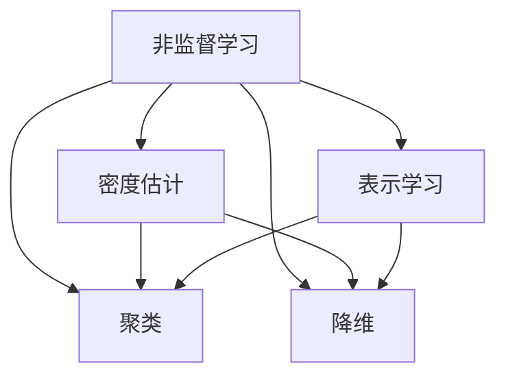

# 非监督学习原理与代码实例讲解

## 1. 背景介绍

### 1.1 什么是非监督学习？

非监督学习是机器学习的一个重要分支,与监督学习不同,非监督学习不需要标注数据。它的目标是在没有标签或最少人工干预的情况下,从数据中发现隐藏的结构和关系。非监督学习算法可以自动识别数据中的模式,将相似的数据点聚类在一起,或者将数据压缩成更低维度的表示。

### 1.2 非监督学习的应用场景

非监督学习在许多领域都有广泛的应用,例如:

- 客户细分:根据客户的购买行为、人口统计学特征等将客户划分为不同的群体,以便进行有针对性的营销。
- 异常检测:通过学习正常数据的模式,识别出异常或不寻常的数据点,如欺诈检测、设备故障诊断等。  
- 降维与可视化:将高维数据映射到低维空间,以便于可视化和分析。
- 推荐系统:通过挖掘用户行为数据中的模式,为用户推荐相关的商品或内容。
- 图像分割:将图像划分为不同的区域或对象,如医学图像分析、无人驾驶等。

### 1.3 常见的非监督学习算法

非监督学习算法主要分为聚类和降维两大类:

- 聚类算法:将相似的数据点划分到同一个簇中,常见的算法有K-means、层次聚类、DBSCAN等。
- 降维算法:将高维数据映射到低维空间,常见的算法有主成分分析(PCA)、t-SNE、自编码器等。

此外,还有一些其他类型的非监督学习算法,如关联规则挖掘、异常检测等。

## 2. 核心概念与联系

### 2.1 聚类(Clustering)

聚类是将数据集划分成多个组或簇,使得同一簇内的数据点相似度高,不同簇之间的数据点相似度低。聚类可以帮助我们发现数据内在的结构和关系。

### 2.2 降维(Dimensionality Reduction) 

降维是将高维数据映射到低维空间,同时保留数据的主要特征和结构。降维可以帮助我们消除数据中的噪声和冗余,提高算法的效率和可解释性。

### 2.3 密度估计(Density Estimation)

密度估计是估计数据的概率密度函数,即数据点在空间中的分布情况。密度估计可以帮助我们发现数据的模式和异常值。

### 2.4 表示学习(Representation Learning)

表示学习是自动学习数据的有效表示或特征,以便于后续的任务如分类、聚类等。深度学习中的自编码器就是一种表示学习方法。

### 2.5 概念之间的联系

聚类、降维、密度估计和表示学习之间有着密切的联系。聚类可以看作是一种离散的密度估计方法,即将数据空间划分为不同的区域。降维可以看作是一种连续的表示学习方法,即学习数据的低维表示。密度估计和表示学习都可以作为聚类和降维的前置步骤,帮助我们更好地理解数据的结构。

下图展示了这些概念之间的关系:



## 3. 核心算法原理与具体步骤

### 3.1 K-means聚类

K-means是一种常用的聚类算法,其目标是将数据集划分为K个簇,使得每个数据点到其所属簇的中心点的距离平方和最小。

算法步骤:
1. 随机选择K个点作为初始的簇中心。
2. 对于每个数据点,计算其到各个簇中心的距离,并将其分配到距离最近的簇。 
3. 对于每个簇,重新计算簇中心,即簇内所有点的均值。
4. 重复步骤2-3,直到簇中心不再变化或达到最大迭代次数。

### 3.2 主成分分析(PCA)

PCA是一种常用的线性降维算法,其目标是找到数据的主要变化方向,并将数据投影到这些方向上,从而实现降维。

算法步骤:
1. 将数据集中心化,即减去每个特征的均值。
2. 计算数据的协方差矩阵。
3. 对协方差矩阵进行特征值分解,得到特征值和特征向量。
4. 选择前k个最大特征值对应的特征向量,构成变换矩阵W。
5. 将数据乘以变换矩阵W,得到降维后的数据。

### 3.3 密度聚类(DBSCAN)

DBSCAN是一种基于密度的聚类算法,它将密度高的区域划分为簇,并将低密度区域中的点标记为噪声。

算法步骤:
1. 对于每个数据点,计算其ε-邻域内的点的数量。
2. 如果一个点的ε-邻域内的点的数量大于等于MinPts,则将其标记为核心点。
3. 对于每个核心点,找到其所有密度可达的点,并将它们分配到同一个簇中。
4. 重复步骤3,直到所有点都被分配到簇中或标记为噪声。

### 3.4 t-SNE

t-SNE是一种非线性降维算法,它通过最小化数据点在高维空间和低维空间中的相似度之间的KL散度来实现降维。

算法步骤:
1. 计算数据点在高维空间中的相似度矩阵P。
2. 随机初始化数据点在低维空间中的位置。
3. 计算数据点在低维空间中的相似度矩阵Q。
4. 最小化P和Q之间的KL散度,更新数据点在低维空间中的位置。
5. 重复步骤3-4,直到收敛或达到最大迭代次数。

## 4. 数学模型和公式详细讲解举例说明

### 4.1 K-means的目标函数

K-means的目标是最小化所有数据点到其所属簇中心的距离平方和,即:

$$J = \sum_{i=1}^n \sum_{j=1}^k w_{ij} ||x_i - \mu_j||^2$$

其中,$n$是数据点的数量,$k$是簇的数量,$w_{ij}$表示数据点$x_i$是否属于簇$j$,$\mu_j$是簇$j$的中心点。

在每次迭代中,我们首先固定簇中心,根据距离最近的原则更新$w_{ij}$:

$$w_{ij} = \begin{cases}
1, & \text{if } j = \arg\min_l ||x_i - \mu_l||^2 \\
0, & \text{otherwise}
\end{cases}$$

然后固定$w_{ij}$,更新簇中心$\mu_j$:

$$\mu_j = \frac{\sum_{i=1}^n w_{ij} x_i}{\sum_{i=1}^n w_{ij}}$$

通过不断迭代这两个步骤,我们可以得到最终的聚类结果。

### 4.2 PCA的数学推导

假设数据集$X$是一个$n \times d$的矩阵,其中$n$是数据点的数量,$d$是特征的维度。我们首先将数据中心化:

$$X_c = X - \frac{1}{n} \mathbf{1}_n \mathbf{1}_n^T X$$

其中,$\mathbf{1}_n$是全为1的$n$维向量。

然后我们计算数据的协方差矩阵:

$$C = \frac{1}{n-1} X_c^T X_c$$

对协方差矩阵进行特征值分解:

$$C = U \Lambda U^T$$

其中,$U$是特征向量构成的矩阵,$\Lambda$是特征值构成的对角矩阵。

我们选择前$k$个最大特征值对应的特征向量,构成变换矩阵$W$:

$$W = [u_1, u_2, \dots, u_k]$$

最后,将数据乘以变换矩阵$W$,得到降维后的数据:

$$Y = X_c W$$

### 4.3 t-SNE的相似度计算

在t-SNE中,我们首先计算数据点在高维空间中的相似度。对于数据点$x_i$和$x_j$,它们的相似度定义为:

$$p_{j|i} = \frac{\exp(-||x_i - x_j||^2 / 2\sigma_i^2)}{\sum_{k \neq i} \exp(-||x_i - x_k||^2 / 2\sigma_i^2)}$$

其中,$\sigma_i$是数据点$x_i$的带宽参数,通过二分搜索的方式确定。

然后我们将相似度矩阵对称化:

$$p_{ij} = \frac{p_{j|i} + p_{i|j}}{2n}$$

在低维空间中,我们使用学生t分布来计算相似度:

$$q_{ij} = \frac{(1 + ||y_i - y_j||^2)^{-1}}{\sum_{k \neq l} (1 + ||y_k - y_l||^2)^{-1}}$$

最后,我们最小化高维相似度$p_{ij}$和低维相似度$q_{ij}$之间的KL散度:

$$KL(P||Q) = \sum_{i \neq j} p_{ij} \log \frac{p_{ij}}{q_{ij}}$$

通过梯度下降法更新低维空间中的点的位置,直到收敛。

## 5. 项目实践:代码实例和详细解释说明

下面我们通过Python代码来实现这些非监督学习算法。

### 5.1 K-means聚类

```python
import numpy as np

class KMeans:
    def __init__(self, n_clusters, max_iter=300):
        self.n_clusters = n_clusters
        self.max_iter = max_iter
        self.centroids = None
        
    def fit(self, X):
        # 随机选择初始的簇中心
        idx = np.random.choice(X.shape[0], self.n_clusters, replace=False)
        self.centroids = X[idx]
        
        for _ in range(self.max_iter):
            # 计算每个点到簇中心的距离
            distances = self._calc_distances(X)
            
            # 将每个点分配到最近的簇
            labels = np.argmin(distances, axis=1)
            
            # 更新簇中心
            for i in range(self.n_clusters):
                self.centroids[i] = np.mean(X[labels == i], axis=0)
                
    def predict(self, X):
        distances = self._calc_distances(X)
        return np.argmin(distances, axis=1)
    
    def _calc_distances(self, X):
        distances = np.zeros((X.shape[0], self.n_clusters))
        for i in range(self.n_clusters):
            distances[:, i] = np.linalg.norm(X - self.centroids[i], axis=1)
        return distances
```

这里我们实现了一个简单的K-means聚类类。在`fit`方法中,我们首先随机选择初始的簇中心,然后在每次迭代中,计算每个点到簇中心的距离,将每个点分配到最近的簇,并更新簇中心。在`predict`方法中,我们根据学习到的簇中心,预测新数据点的簇标签。

### 5.2 PCA降维

```python
import numpy as np

class PCA:
    def __init__(self, n_components):
        self.n_components = n_components
        self.components = None
        self.mean = None
        
    def fit(self, X):
        # 数据中心化
        self.mean = np.mean(X, axis=0)
        X = X - self.mean
        
        # 计算协方差矩阵
        cov = np.cov(X, rowvar=False)
        
        # 特征值分解
        eigenvalues, eigenvectors = np.linalg.eigh(cov)
        
        # 选择前n_components个特征向量
        idx = np.argsort(eigenvalues)[::-1]
        self.components = eigenvectors[:, idx[:self.n_components]]
        
    def transform(self, X):
        X = X - self.mean
        return np.dot(X, self.components)
```

在PCA类中,我们首先在`fit`方法中对数据进行中心化,然后计算协方差矩阵,并对其进行特征值分解。我们选择前`n_components`个最大特征值对应的特征向量,构成变换矩阵。在`transform`方法中,我们将数据乘以变换矩阵,得到降维后的数据。

### 5.3 t-SNE可