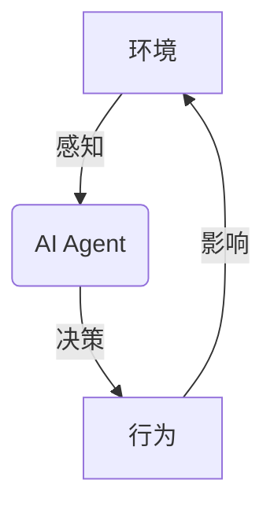
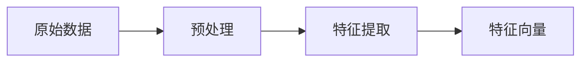
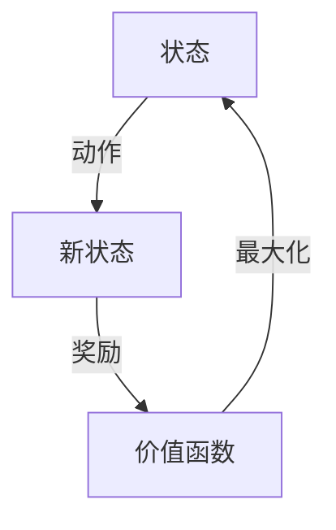
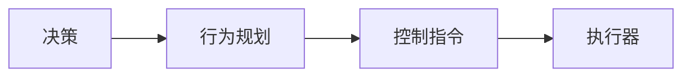

# AI Agent: AI的下一个风口 展望：安全、发展、边界和挑战

## 1.背景介绍

### 1.1 人工智能的崛起

人工智能(Artificial Intelligence,AI)作为一门富有前景的交叉学科,已经在科技、经济、社会等诸多领域展现出了巨大的潜力和影响力。近年来,AI技术的快速发展推动了智能系统和智能应用的不断创新,为我们的生活带来了前所未有的变革。

### 1.2 AI Agent的重要性

在这个由AI主导的时代,AI Agent(智能代理)无疑扮演着关键角色。AI Agent是一种具备自主性、交互性和反应性的智能实体,能够感知环境、处理信息、做出决策并采取行动。它们可以应用于广泛的领域,如机器人技术、游戏AI、智能助理、自动驾驶等,为人类提供高效、智能的服务和支持。

### 1.3 AI Agent的发展历程

AI Agent的概念可以追溯到20世纪60年代,当时它被视为一种理论模型,用于研究智能系统如何与环境进行交互。随着计算能力和算法的不断进步,AI Agent逐渐从理论走向实践,并在各个领域展现出了巨大的应用潜力。

## 2.核心概念与联系

### 2.1 智能代理的定义

AI Agent被定义为一种能够感知环境、处理信息、做出决策并采取行动的智能实体。它们通过传感器获取环境数据,并根据预定义的知识库和决策机制选择合适的行为。



### 2.2 智能代理的类型

根据不同的特征和功能,AI Agent可以分为以下几种类型:

1. **简单反射Agent**:基于当前感知信息做出反应,没有任何内部状态。
2. **基于模型的Agent**:维护一个内部状态,可以根据当前状态和感知信息做出决策。
3. **基于目标的Agent**:具有预定义的目标,决策旨在实现这些目标。
4. **基于效用的Agent**:根据一个效用函数评估每个可能行为的"效用",选择效用最大的行为。
5. **学习Agent**:能够从经验中学习,并不断优化其决策过程。

### 2.3 智能代理的关键技术

AI Agent的实现涉及多种技术,包括:

1. **机器学习**:使Agent能够从数据中学习,提高决策能力。
2. **知识表示与推理**:构建Agent的知识库,并进行逻辑推理。
3. **计算机视觉**:让Agent能够理解和解释视觉信息。
4. **自然语言处理**:实现Agent与人类的自然语言交互。
5. **多智能体系统**:协调多个Agent之间的行为和决策。

## 3.核心算法原理具体操作步骤

AI Agent的核心算法原理主要包括感知、学习、决策和行为四个主要步骤,下面将详细介绍每个步骤的具体操作。

### 3.1 感知(Perception)

感知是AI Agent获取环境信息的第一步,通常涉及以下操作:

1. **数据采集**:利用各种传感器(如摄像头、麦克风、雷达等)采集原始数据。
2. **数据预处理**:对原始数据进行噪声去除、标准化等预处理,以提高数据质量。
3. **特征提取**:从预处理后的数据中提取出对决策有用的特征,如边缘、纹理、关键词等。



### 3.2 学习(Learning)

AI Agent通过学习来优化其决策过程,主要包括以下步骤:

1. **构建模型**:根据任务需求选择合适的机器学习模型,如深度神经网络、决策树等。
2. **模型训练**:利用训练数据(包含特征向量和标签)训练模型的参数。
3. **模型评估**:在测试数据上评估模型的性能,如准确率、召回率等指标。
4. **模型优化**:根据评估结果调整模型结构或超参数,以提高模型性能。

$$
J(\theta) = \frac{1}{m}\sum_{i=1}^{m}L(y^{(i)}, h_\theta(x^{(i)})) + \lambda R(\theta)
$$

上式是一个典型的机器学习模型的损失函数,其中$J(\theta)$是需要最小化的损失,$L$是损失函数(如均方误差或交叉熵),$h_\theta(x)$是模型的预测输出,$R(\theta)$是正则化项(用于防止过拟合),而$\lambda$是正则化系数。

### 3.3 决策(Decision Making)

决策是AI Agent的核心环节,需要根据感知和学习的结果选择合适的行为。常见的决策算法包括:

1. **搜索算法**:系统地探索可能的解决方案,如A*、IDA*等。
2. **规划算法**:根据目标和约束生成行为序列,如层次任务网络(HTN)规划。
3. **马尔可夫决策过程**:建模决策过程为马尔可夫过程,求解最优策略。
4. **多智能体决策**:协调多个Agent之间的行为,如拍卖算法、博弈论等。



上图展示了一个典型的马尔可夫决策过程,Agent根据当前状态选择一个动作,转移到新状态并获得相应的奖励,目标是最大化长期累积奖励(价值函数)。

### 3.4 行为(Action)

经过决策后,AI Agent需要执行相应的行为,常见的行为执行方式包括:

1. **控制算法**:将决策转化为对机器人或执行器的控制指令。
2. **规划与调度**:为复杂任务生成可执行的行为序列。
3. **多Agent协作**:协调多个Agent执行分工协作的行为。



上图展示了一个典型的行为执行流程,决策模块的输出经过行为规划转化为可执行的控制指令,最终由执行器(如机器人手臂)执行相应的动作。

## 4.数学模型和公式详细讲解举例说明

AI Agent的实现涉及大量数学模型和公式,下面将详细讲解其中的一些核心内容。

### 4.1 马尔可夫决策过程(MDP)

马尔可夫决策过程是AI Agent决策的重要数学模型,可以形式化描述Agent与环境的交互过程。一个MDP可以用一个四元组$(S, A, P, R)$来表示:

- $S$是状态集合,表示Agent可能处于的所有状态。
- $A$是动作集合,表示Agent可以执行的所有动作。
- $P(s'|s,a)$是状态转移概率,表示在状态$s$执行动作$a$后,转移到状态$s'$的概率。
- $R(s,a,s')$是奖励函数,表示在状态$s$执行动作$a$并转移到状态$s'$时获得的即时奖励。

Agent的目标是找到一个策略$\pi: S \rightarrow A$,使得长期累积奖励最大化:

$$
V^\pi(s) = \mathbb{E}_\pi\left[\sum_{t=0}^\infty \gamma^t R(s_t, a_t, s_{t+1}) \big| s_0 = s\right]
$$

其中$V^\pi(s)$是在策略$\pi$下状态$s$的价值函数,表示从状态$s$开始执行策略$\pi$所能获得的期望累积奖励;$\gamma \in [0, 1)$是折现因子,用于权衡即时奖励和长期奖励的重要性。

### 4.2 Q-Learning算法

Q-Learning是一种强化学习算法,可以用于求解MDP的最优策略。它维护一个Q函数$Q(s,a)$,表示在状态$s$执行动作$a$后,可获得的期望累积奖励。Q函数的更新规则为:

$$
Q(s_t, a_t) \leftarrow Q(s_t, a_t) + \alpha \left[r_t + \gamma \max_{a'} Q(s_{t+1}, a') - Q(s_t, a_t)\right]
$$

其中$\alpha$是学习率,控制了新信息对Q函数的影响程度;$r_t$是立即奖励;$\gamma$是折现因子;$\max_{a'} Q(s_{t+1}, a')$是下一状态下可获得的最大期望累积奖励。

通过不断更新Q函数,算法最终会收敛到最优Q函数$Q^*(s,a)$,对应的贪婪策略$\pi^*(s) = \arg\max_a Q^*(s,a)$就是MDP的最优策略。

以下是一个简单的Q-Learning示例,用于训练一个Agent在格子世界(GridWorld)中找到终点:

```python
import numpy as np

# 初始化Q表
Q = np.zeros((6, 6, 4))  # 状态空间为6x6,动作空间为4(上下左右)

# 超参数
alpha = 0.1  # 学习率
gamma = 0.9  # 折现因子
epsilon = 0.1  # 探索率

# 训练循环
for episode in range(1000):
    state = ...  # 初始状态
    while not is_terminal(state):
        # 选择动作(探索或利用)
        if np.random.rand() < epsilon:
            action = np.random.randint(4)  # 探索
        else:
            action = np.argmax(Q[state])  # 利用

        next_state, reward = step(state, action)  # 执行动作,获取下一状态和奖励
        
        # 更新Q函数
        Q[state][action] += alpha * (reward + gamma * np.max(Q[next_state]) - Q[state][action])
        
        state = next_state

# 最终策略
policy = np.argmax(Q, axis=2)
```

上述代码展示了如何使用Q-Learning算法训练一个Agent,并最终得到一个近似最优的策略。

## 5.项目实践：代码实例和详细解释说明

为了更好地理解AI Agent的实现,我们将通过一个具体的项目实践来演示如何使用Python和相关库构建一个简单的AI Agent。

### 5.1 项目概述

在这个项目中,我们将构建一个基于Q-Learning的AI Agent,用于在一个简单的格子世界(GridWorld)环境中找到终点。Agent需要根据当前状态(位置)选择移动方向(上下左右),目标是以最短路径到达终点。

### 5.2 环境设置

首先,我们需要定义格子世界的环境,包括状态空间、动作空间、奖励函数和状态转移函数。

```python
import numpy as np

# 定义格子世界
WORLD = np.array([
    [0, 0, 0, 1],
    [0, None, 0, -1],
    [0, 0, 0, 0]
])

# 状态空间
state_space = []
for i in range(WORLD.shape[0]):
    for j in range(WORLD.shape[1]):
        if WORLD[i, j] is not None:
            state_space.append((i, j))

# 动作空间
action_space = ['U', 'D', 'L', 'R']

# 奖励函数
def reward(state, action, next_state):
    if WORLD[next_state] == -1:
        return -10
    elif WORLD[next_state] == 1:
        return 10
    else:
        return -1

# 状态转移函数
def step(state, action):
    i, j = state
    if action == 'U':
        next_state = (max(i - 1, 0), j)
    elif action == 'D':
        next_state = (min(i + 1, WORLD.shape[0] - 1), j)
    elif action == 'L':
        next_state = (i, max(j - 1, 0))
    elif action == 'R':
        next_state = (i, min(j + 1, WORLD.shape[1] - 1))
    else:
        raise ValueError('Invalid action')

    if WORLD[next_state] is None:
        next_state = state

    return next_state, reward(state, action, next_state)
```

上述代码定义了一个简单的3x4的格子世界,其中0表示可以通过的格子,1表示终点,None表示障碍物,-1表示陷阱(会受到惩罚)。