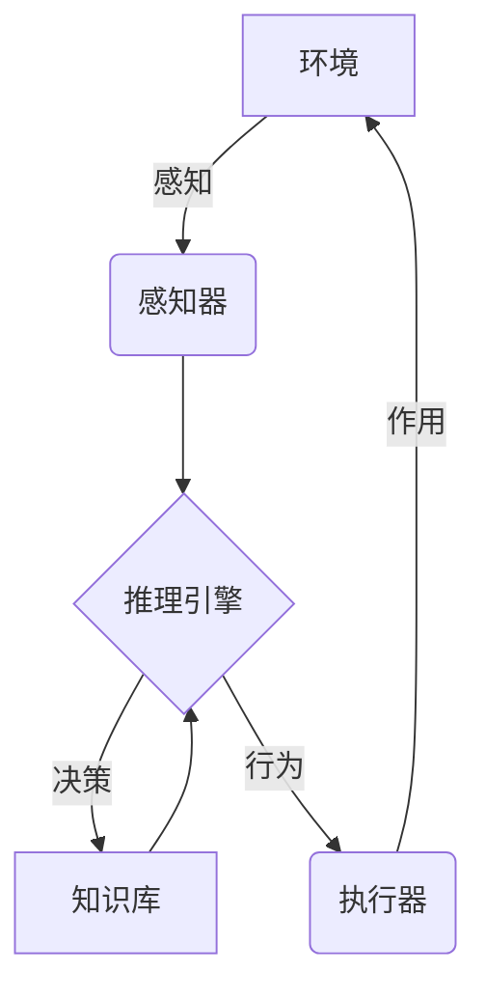
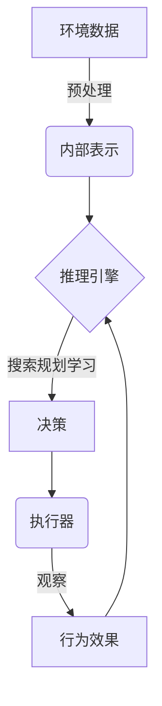

# AI Agent: AI的下一个风口 解决方案与研究方向

## 1.背景介绍

### 1.1 人工智能的发展历程

人工智能(Artificial Intelligence, AI)是当代科技发展的前沿领域,自20世纪50年代问世以来,已经经历了几个重要的发展阶段。早期的人工智能系统主要集中在专家系统、机器学习和自然语言处理等领域。随着计算能力和数据量的不断增长,人工智能进入了一个新的发展时期。

近年来,以深度学习(Deep Learning)为代表的人工智能技术取得了突破性进展,在计算机视觉、自然语言处理、语音识别等领域展现出了超人的能力。这些技术的发展使得人工智能系统能够更好地理解和处理复杂的数据,并做出更加准确的决策和预测。

### 1.2 AI Agent的兴起

在人工智能的发展过程中,AI Agent(智能代理)作为一种新兴的技术范式逐渐引起了广泛关注。AI Agent是一种具有自主性、交互性和智能性的软件实体,能够感知环境、处理信息、做出决策并执行相应的行为。

AI Agent的出现打破了传统人工智能系统的局限性,使得智能系统能够更加主动地与用户和环境进行交互,提供更加个性化和智能化的服务。AI Agent可以应用于各种领域,如智能助手、智能家居、自动驾驶、游戏AI等,为人类生活和工作带来了全新的体验。

### 1.3 AI Agent的挑战与机遇

尽管AI Agent技术前景广阔,但也面临着诸多挑战。例如,如何设计出更加人性化和可信赖的AI Agent;如何确保AI Agent的决策过程具有透明性和可解释性;如何保护用户隐私和数据安全等。同时,AI Agent的发展也带来了新的机遇,如提高生产效率、优化资源利用、改善人机交互体验等。

因此,深入探讨AI Agent的核心技术、解决方案和发展方向,对于推动人工智能的创新应用至关重要。本文将全面剖析AI Agent的本质,阐述其核心概念、算法原理和数学模型,分享实践经验和应用案例,并展望未来的发展趋势和挑战。

## 2.核心概念与联系

### 2.1 AI Agent的定义

AI Agent可以被定义为一种具有感知、思考和行动能力的自主实体,能够根据环境的变化做出合理的决策和行为。一个AI Agent通常包含以下几个核心组件:

- 感知器(Sensors):用于获取环境信息,如视觉、听觉、触觉等传感器数据。
- 执行器(Actuators):用于在环境中执行相应的行为,如机械臂、语音输出等。
- 知识库(Knowledge Base):存储Agent所掌握的领域知识和规则。
- 推理引擎(Inference Engine):基于知识库和感知信息,进行逻辑推理并做出决策。

### 2.2 AI Agent的特性

一个理想的AI Agent应该具备以下几个关键特性:

- 自主性(Autonomy):能够独立做出决策和行为,而不需要人工干预。
- 反应性(Reactivity):能够及时感知环境变化并作出相应反应。
- 主动性(Proactiveness):不仅被动响应环境,还能主动地制定目标并采取行动。
- 社会能力(Social Ability):能够与人类或其他Agent进行有效沟通和协作。

### 2.3 AI Agent的分类

根据不同的应用场景和设计目标,AI Agent可以分为以下几种类型:

- 基于目标的Agent(Goal-based Agent)
- 基于效用的Agent(Utility-based Agent)
- 学习型Agent(Learning Agent)
- 多Agent系统(Multi-Agent System)

其中,基于目标的Agent旨在实现特定的目标;基于效用的Agent则追求最大化某种效用函数;学习型Agent能够通过经验学习来优化自身的行为策略;多Agent系统则由多个Agent组成,通过协作完成复杂任务。

### 2.4 AI Agent与相关技术的关系

AI Agent与人工智能的其他技术领域存在密切联系,如机器学习、自然语言处理、计算机视觉、规划与决策等。这些技术为AI Agent提供了强大的支撑,使其能够更好地感知、理解和行动。同时,AI Agent也为这些技术的发展带来了新的需求和挑战。

例如,机器学习算法可以赋予AI Agent学习和优化决策的能力;自然语言处理技术则使AI Agent能够与人类进行自然语言交互;计算机视觉技术帮助AI Agent理解视觉信息;而规划与决策理论则为AI Agent的行为决策提供了理论基础。

## 3.核心算法原理具体操作步骤

### 3.1 AI Agent决策过程

AI Agent的核心任务是根据感知到的环境信息做出合理的决策和行为。这个过程可以概括为感知(Perception)、思考(Reasoning)和行动(Action)三个阶段:

1. **感知阶段**:Agent通过各种传感器获取环境数据,并对原始数据进行预处理和特征提取,将其转换为内部表示形式。

2. **思考阶段**:Agent基于知识库和推理引擎,对感知数据进行分析和推理,制定出行为决策。这个阶段涉及搜索、规划、学习等多种算法和技术。

3. **行动阶段**:Agent根据决策结果,通过执行器在环境中执行相应的行为,并观察行为的效果,为下一个决策循环提供反馈。

### 3.2 搜索算法

搜索算法是AI Agent进行决策的一种重要方法。常用的搜索算法包括:

- 盲目搜索算法:广度优先搜索、深度优先搜索、迭代加深搜索等。
- 启发式搜索算法:Best-First搜索、A*搜索、IDA*搜索等。
- 局部搜索算法:爬山算法、模拟退火算法、遗传算法等。
- 博弈树搜索算法:极小化极大搜索、Alpha-Beta剪枝等。

这些算法在时间和空间复杂度、完备性、最优性等方面各有特点,需要根据具体问题进行选择和优化。

### 3.3 规划算法

规划算法旨在为Agent生成一系列行动来实现目标。常见的规划算法有:

- 状态空间规划:通过构建状态空间图,搜索从初始状态到目标状态的路径。
- 层次任务网规划:将复杂任务分解为子任务,并安排子任务的执行顺序。
- 时序规划:考虑行动的时间约束,生成满足时间和资源限制的行动序列。
- 概率规划:处理具有不确定性的环境,生成具有容错能力的行动方案。

规划算法通常与搜索算法相结合,以提高规划的效率和质量。

### 3.4 学习算法

学习算法赋予AI Agent通过经验优化决策的能力,是构建智能系统的关键。常用的学习算法包括:

- 监督学习:从标注数据中学习映射函数,如分类、回归等。
- 无监督学习:在无标注数据的情况下发现数据的内在模式,如聚类、降维等。
- 强化学习:通过试错与环境交互,学习获取最大累积奖励的策略。
- 迁移学习:利用已学习的知识加速新任务的学习过程。
- 元学习:学习如何更好地学习,提高学习效率和泛化能力。

这些学习算法为AI Agent提供了持续优化和适应环境变化的能力,是实现通用人工智能的重要途径。

## 4.数学模型和公式详细讲解举例说明

### 4.1 马尔可夫决策过程

马尔可夫决策过程(Markov Decision Process, MDP)是描述AI Agent与环境交互的数学框架,广泛应用于规划、强化学习等领域。一个MDP可以用一个五元组$\langle S, A, P, R, \gamma \rangle$来表示:

- $S$是环境的状态集合
- $A$是Agent可执行的行动集合
- $P(s'|s,a)$是状态转移概率,表示在状态$s$执行行动$a$后,转移到状态$s'$的概率
- $R(s,a)$是在状态$s$执行行动$a$后获得的即时奖励
- $\gamma \in [0,1)$是折现因子,用于权衡即时奖励和长期累积奖励

Agent的目标是找到一个策略$\pi: S \rightarrow A$,使得期望的累积折现奖励最大化:

$$
\max_\pi \mathbb{E}\left[ \sum_{t=0}^\infty \gamma^t R(s_t, a_t) \right]
$$

其中$s_t$和$a_t$分别表示第$t$个时刻的状态和行动。

### 4.2 值函数和Bellman方程

在MDP中,我们可以定义状态值函数$V^\pi(s)$和行动值函数$Q^\pi(s,a)$来评估一个策略$\pi$的好坏:

$$
\begin{aligned}
V^\pi(s) &= \mathbb{E}_\pi\left[ \sum_{t=0}^\infty \gamma^t R(s_t, a_t) \mid s_0 = s \right] \\
Q^\pi(s,a) &= \mathbb{E}_\pi\left[ \sum_{t=0}^\infty \gamma^t R(s_t, a_t) \mid s_0 = s, a_0 = a \right]
\end{aligned}
$$

它们满足著名的Bellman方程:

$$
\begin{aligned}
V^\pi(s) &= \sum_{a \in A} \pi(a|s) \left( R(s,a) + \gamma \sum_{s' \in S} P(s'|s,a) V^\pi(s') \right) \\
Q^\pi(s,a) &= R(s,a) + \gamma \sum_{s' \in S} P(s'|s,a) \sum_{a' \in A} \pi(a'|s') Q^\pi(s',a')
\end{aligned}
$$

求解Bellman方程可以得到最优策略对应的值函数$V^*(s)$和$Q^*(s,a)$。

### 4.3 策略迭代与值迭代

策略迭代(Policy Iteration)和值迭代(Value Iteration)是求解MDP的两种经典算法:

**策略迭代**包含两个步骤:

1. 策略评估:对于给定的策略$\pi$,求解其对应的值函数$V^\pi$或$Q^\pi$。
2. 策略改进:基于当前的值函数,构造一个更优的策略$\pi'$。

重复上述两个步骤,直到收敛到最优策略$\pi^*$。

**值迭代**则直接迭代更新最优值函数$V^*$或$Q^*$,根据贝尔曼最优性方程:

$$
\begin{aligned}
V^*(s) &= \max_{a \in A} \left( R(s,a) + \gamma \sum_{s' \in S} P(s'|s,a) V^*(s') \right) \\
Q^*(s,a) &= R(s,a) + \gamma \sum_{s' \in S} P(s'|s,a) \max_{a' \in A} Q^*(s',a')
\end{aligned}
$$

值迭代通常更加简单高效,但需要足够的迭代次数才能收敛。

### 4.4 Q-Learning算法

Q-Learning是一种著名的基于模型无关的强化学习算法,用于在线学习最优行动值函数$Q^*(s,a)$。其核心更新规则为:

$$
Q(s_t,a_t) \leftarrow Q(s_t,a_t) + \alpha \left[ r_t + \gamma \max_{a'} Q(s_{t+1},a') - Q(s_t,a_t) \right]
$$

其中$\alpha$是学习率,用于控制新增信息对Q值的影响程度。

Q-Learning算法不需要事先了解环境的转移概率和奖励函数,只需通过与环境的互动来逐步更新Q值,最终收敛到最优策略。它广泛应用于游