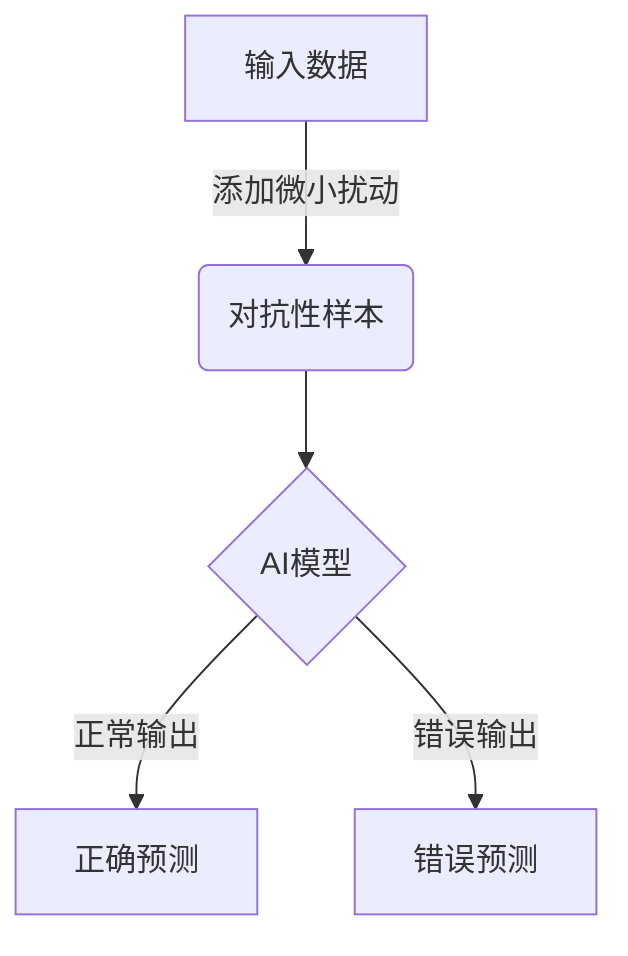
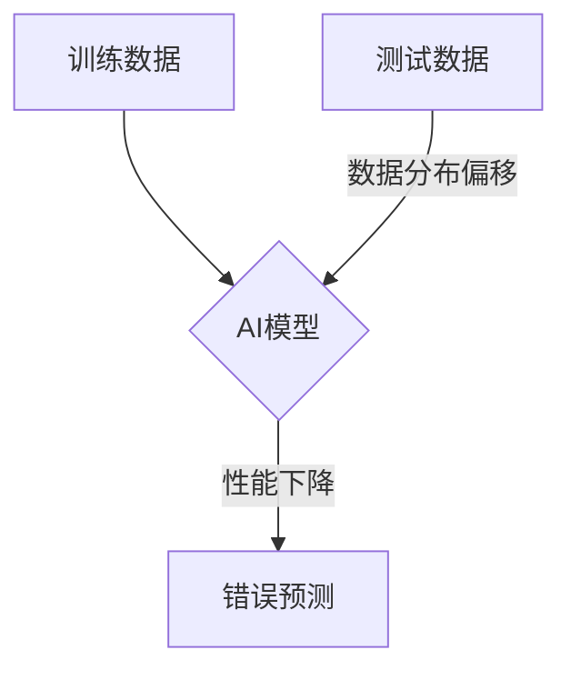
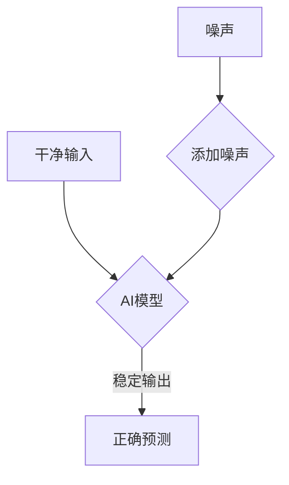
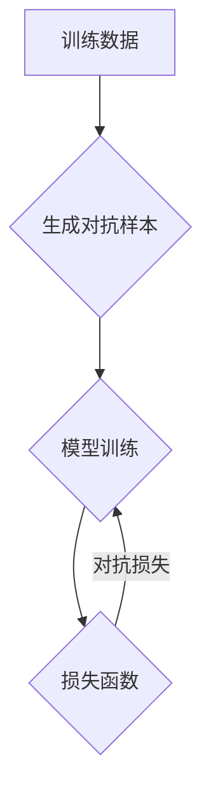

# AI Robustness原理与代码实例讲解

## 1.背景介绍

在现代人工智能系统的应用中,模型的鲁棒性(Robustness)是一个极其重要但又容易被忽视的问题。鲁棒性指的是人工智能模型在面对噪声、对抗性攻击、数据分布偏移等情况下,能够保持稳定的性能表现。缺乏鲁棒性会导致模型在遇到微小的输入扰动时,产生完全不同甚至是错误的输出,这对于安全敏感的领域(如自动驾驶、医疗诊断等)来说是致命的。

提高AI模型鲁棒性的重要性不言而喻。近年来,学术界和工业界都在积极开展AI鲁棒性的研究,已经提出了多种有效的方法和技术。本文将全面介绍AI鲁棒性的核心原理、算法实现以及实际应用,为读者提供全景式的解读。

## 2.核心概念与联系

### 2.1 对抗性攻击

对抗性攻击(Adversarial Attack)是指通过添加微小的针对性扰动,使AI模型产生错误的预测结果。这种扰动通常是人眼难以察觉的,但对模型来说却是致命的。对抗性攻击暴露了现有AI模型的脆弱性,是提高模型鲁棒性的一个重要驱动力。



### 2.2 数据分布偏移

数据分布偏移(Distribution Shift)指的是模型在训练和测试/应用阶段所面对的数据分布存在差异。这种差异会导致模型在新的数据分布上表现不佳。处理数据分布偏移是提高模型鲁棒性的另一个重要方面。



### 2.3 噪声鲁棒性

噪声鲁棒性(Noise Robustness)指的是AI模型在面对噪声干扰时,能够保持稳定的性能表现。噪声可能来自于数据采集、传输或处理过程中的各种因素。提高噪声鲁棒性有助于模型在实际应用中的可靠性。



上述三个核心概念互相关联,共同构成了AI鲁棒性的主要挑战。提高模型在这些方面的鲁棒性,是保证AI系统安全可靠运行的关键。

## 3.核心算法原理具体操作步骤

提高AI模型鲁棒性的核心算法原理主要包括对抗训练(Adversarial Training)、数据增广(Data Augmentation)和鲁棒优化(Robust Optimization)等。

### 3.1 对抗训练

对抗训练的基本思路是在训练过程中引入对抗性样本,使模型在学习过程中就能够提高对扰动的鲁棒性。具体操作步骤如下:

1. 生成对抗性样本:对训练数据添加针对性扰动,生成对抗性样本。常用方法包括快速梯度符号法(FGSM)、投影梯度下降法(PGD)等。

2. 模型训练:将对抗性样本与原始训练数据一同输入模型进行训练,使模型学习到对抗性扰动的鲁棒特征。

3. 损失函数:在损失函数中加入对抗性损失项,使模型在优化时能够同时最小化对抗性样本的损失。

4. 迭代训练:重复上述步骤,直到模型在对抗性攻击下的性能满足要求。



### 3.2 数据增广

数据增广是通过对原始训练数据进行一系列变换(如旋转、缩放、噪声添加等),生成新的训练样本,从而增加数据的多样性。这有助于提高模型对不同数据分布的泛化能力,进而提高鲁棒性。常用的数据增广方法包括:

- 几何变换:旋转、平移、缩放等
- 颜色变换:亮度、对比度、饱和度调整
- 噪声添加:高斯噪声、盐噪声等
- 混合数据:将多个样本按一定比例混合
- adversarial training生成的对抗样本

通过在训练过程中使用增广后的数据,模型能够学习到更加丰富的特征表示,从而提高鲁棒性。

### 3.3 鲁棒优化

鲁棒优化(Robust Optimization)是一种在优化过程中显式考虑不确定性的方法。在AI模型训练中,可以将对抗性扰动、噪声等视为不确定性,并在损失函数中加入鲁棒性项,使模型在优化时能够最小化这些不确定性带来的影响。

具体来说,鲁棒优化的目标函数可以表示为:

$$\min_{\theta} \mathbb{E}_{(x, y) \sim \mathcal{D}}\left[\max _{\delta \in \mathcal{S}} \mathcal{L}(f(x+\delta; \theta), y)\right]$$

其中,$\mathcal{D}$表示训练数据分布,$\mathcal{S}$表示允许的扰动集合,$\mathcal{L}$是损失函数,$f(x+\delta; \theta)$是模型在输入$x+\delta$时的预测输出。

这个目标函数的含义是:在整个训练数据分布上,最小化模型在最坏情况下(即最大扰动下)的损失。通过优化这个目标函数,模型能够学习到对抗性扰动和噪声的鲁棒特征表示。

在实践中,由于直接优化上述目标函数过于困难,通常会采用近似方法,例如:

- 替代扰动集$\mathcal{S}$为有限的扰动样本集
- 使用对抗训练生成的对抗样本代替$\max_{\delta \in \mathcal{S}}$项
- 采用替代损失函数,如虚拟对抗损失(Virtual Adversarial Loss)等

通过上述核心算法,AI模型能够在训练阶段就获得较好的鲁棒性,从而在面对对抗性攻击、数据分布偏移和噪声干扰时,保持稳定的性能表现。

## 4.数学模型和公式详细讲解举例说明

在第3节中,我们介绍了鲁棒优化的基本思想和目标函数形式。现在让我们进一步详细解释其中的数学模型和公式。

### 4.1 对抗性扰动集

对抗性扰动集$\mathcal{S}$定义了允许的扰动范围,它决定了对抗样本的强度。常见的对抗性扰动集包括:

1. $l_\infty$球:$\mathcal{S}=\{\delta:\|\delta\|_\infty\leq\epsilon\}$,其中$\|\cdot\|_\infty$表示最大范数,$\epsilon$控制扰动强度。

2. $l_2$球:$\mathcal{S}=\{\delta:\|\delta\|_2\leq\epsilon\}$,其中$\|\cdot\|_2$表示欧几里得范数。

3. $l_1$球:$\mathcal{S}=\{\delta:\|\delta\|_1\leq\epsilon\}$,其中$\|\cdot\|_1$表示绝对值范数。

不同的扰动集对应不同的扰动特征,需要根据具体任务进行选择。一般来说,$l_\infty$球对应稀疏扰动,$l_2$球对应高斯噪声,$l_1$球对应中等稀疏扰动。

### 4.2 对抗样本生成

生成对抗样本是对抗训练和鲁棒优化的关键步骤。常用的对抗样本生成方法包括:

1. **快速梯度符号法(FGSM)**:

$$x^{adv}=x+\epsilon\cdot\text{sign}(\nabla_x\mathcal{L}(f(x;\theta),y))$$

其中,$x$是原始样本,$y$是标签,$\mathcal{L}$是损失函数,$f(x;\theta)$是模型输出,$\epsilon$控制扰动强度。FGSM是一种高效的一次性攻击方法。

2. **投影梯度下降法(PGD)**:

$$x_0^{adv}=x$$
$$x_{t+1}^{adv}=\Pi_\mathcal{S}\left(x_t^{adv}+\alpha\cdot\text{sign}(\nabla_x\mathcal{L}(f(x_t^{adv};\theta),y))\right)$$

PGD通过多次迭代来生成对抗样本,其中$\Pi_\mathcal{S}$是对扰动集$\mathcal{S}$的投影操作,$\alpha$是步长。PGD攻击更加强大,但计算开销也更大。

除此之外,还有基于优化的方法(C&W攻击)、基于生成模型的方法等,可以根据需求进行选择。

### 4.3 虚拟对抗训练

虚拟对抗训练(Virtual Adversarial Training, VAT)是一种不需要生成对抗样本的鲁棒优化方法。它的基本思想是:在当前数据分布附近寻找一个最难的扰动方向,并在该方向上增加一个正则化项,使模型在该方向上的输出保持平滑。

具体来说,VAT的正则化项定义为:

$$\mathcal{R}_{vat}(\theta)=\max_{\|\delta\|_2\leq\epsilon}\mathcal{L}(f(x+\delta;\theta),y)$$

其中,$\delta$是虚拟对抗扰动,通过以下公式近似计算:

$$\delta\approx\epsilon\frac{g}{\|g\|_2},\quad g=\nabla_\delta\mathcal{L}(f(x+\delta;\theta),y)|_{\delta=0}$$

将$\mathcal{R}_{vat}$加入损失函数中,模型在优化时就能够学习到对虚拟扰动的鲁棒特征。VAT的优点是高效且无需生成对抗样本,但其鲁棒性可能不如基于对抗样本的方法。

通过上述数学模型和公式,我们对鲁棒优化的核心思想有了更深入的理解。在实际应用中,需要根据具体任务和要求,选择合适的扰动集、对抗样本生成方法和正则化策略,以获得最佳的鲁棒性效果。

## 5.项目实践:代码实例和详细解释说明

为了帮助读者更好地理解AI鲁棒性的原理和实现,我们将提供一个基于PyTorch的代码实例,实现对MNIST手写数字识别任务的对抗训练。

### 5.1 导入库和定义函数

```python
import torch
import torch.nn as nn
import torch.optim as optim
import torchvision
import torchvision.transforms as transforms

# 定义对抗样本生成函数(FGSM)
def fgsm_attack(model, images, labels, epsilon):
    images = images.clone().detach().requires_grad_(True)
    outputs = model(images)
    
    model.zero_grad()
    loss = nn.CrossEntropyLoss()(outputs, labels)
    loss.backward()
    
    data_grad = images.grad.data
    adv_images = images + epsilon * data_grad.sign()
    adv_images = torch.clamp(adv_images, 0, 1)
    
    return adv_images
```

上述代码定义了一个`fgsm_attack`函数,用于生成FGSM对抗样本。它首先将输入图像`images`设置为可求导的张量,然后通过模型进行前向传播计算损失。接着,它计算损失相对于输入图像的梯度,并根据FGSM公式生成对抗样本`adv_images`。最后,将对抗样本的像素值裁剪到[0, 1]范围内,以确保其合法性。

### 5.2 定义模型和数据加载

```python
# 定义CNN模型
class Net(nn.Module):
    def __init__(self):
        super(Net, self).__init__()
        self