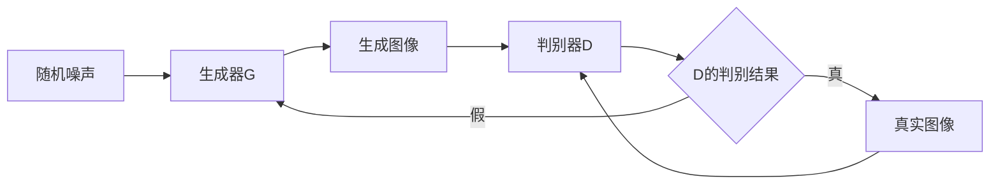
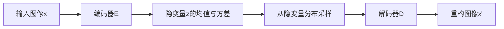

# AIGC从入门到实战：AIGC 在工业领域的创新场景—合成数据集，助力机器人产品研发

## 1. 背景介绍
### 1.1 AIGC概述
AIGC(AI-Generated Content)，即人工智能生成内容，是指利用人工智能技术自动生成各种形式的内容，如文本、图像、音频、视频等。AIGC技术的快速发展，为内容生产提供了新的途径和可能性，在各行各业都有广泛的应用前景。

### 1.2 AIGC在工业领域的应用价值
在工业领域，AIGC技术正在悄然兴起，为传统的工业生产和研发注入新的活力。特别是在机器人产品研发过程中，AIGC可以通过生成大量真实可用的合成数据，来弥补真实数据获取难、成本高、标注工作量大等痛点，从而加速机器人视觉、导航、操控等算法模型的训练和迭代。

### 1.3 本文的目标与贡献
本文将重点探讨AIGC技术在机器人领域的一个创新应用场景—合成数据生成，介绍其实现原理、关键技术、开发流程和实践案例，展现其如何助力机器人相关算法的开发和落地。希望抛砖引玉，为更多的工业企业应用AIGC赋能产品创新提供参考。

## 2. 核心概念与联系
### 2.1 合成数据的定义与价值
合成数据(Synthetic Data)是指通过算法生成的、与真实场景高度相似的数据。相比于传统的真实数据采集，合成数据具有几大优势：
- 生成速度快、成本低、可扩展性强
- 可控性高，能灵活设置各种参数
- 规避了隐私和版权问题
- 可以生成真实环境难以获取的异常场景数据

### 2.2 AIGC与合成数据的关系
AIGC是实现合成数据自动生成的关键技术手段。通过应用生成对抗网络(GAN)、变分自编码器(VAE)、扩散模型等AIGC算法，可以从随机噪声中生成逼真的图像、视频等数据，再通过算法进行标注，即可得到大规模的训练数据集。

### 2.3 机器人视觉中的数据需求
机器人视觉是赋予机器人感知和理解环境的基础能力，需要海量的图像数据进行算法训练。但在实际的机器人应用场景中，往往存在难以获取真实环境数据、人工标注工作量巨大等挑战。因此，利用AIGC生成合成数据，是突破这一瓶颈的重要手段。

## 3. 核心算法原理与操作步骤
### 3.1 基于GAN的图像生成
GAN(Generative Adversarial Network)由生成器和判别器两部分组成，通过两者的博弈学习，最终使生成器能够生成接近真实的图像数据。其基本原理如下：



训练过程可分为以下步骤：
1. 从真实图像集中抽取一批图像样本，输入判别器D，计算其输出与真实标签"1"的差异loss_real
2. 从随机噪声中抽取一批噪声样本，输入生成器G，生成一批图像
3. 将生成图像输入判别器D，计算其输出与虚假标签"0"的差异loss_fake 
4. 将loss_real和loss_fake相加作为判别器D的损失，并进行梯度下降更新判别器D的参数
5. 从随机噪声中抽取一批噪声样本，输入生成器G，生成一批图像
6. 将生成图像输入判别器D，计算其输出与真实标签"1"的差异作为生成器G的损失，并进行梯度下降更新生成器G的参数
7. 重复步骤1-6，直到模型收敛，生成效果理想

### 3.2 基于VAE的图像生成
VAE(Variational Auto-Encoder)通过将输入图像映射到隐空间的概率分布，再从分布中采样生成图像，从而实现新图像的生成。其结构如下图所示：



VAE的训练过程如下：
1. 将输入图像x通过编码器E映射到隐空间的均值和方差
2. 根据均值和方差，从隐空间的先验分布(通常为标准正态分布)中采样得到隐变量z
3. 将隐变量z通过解码器D映射为重构图像x'
4. 计算重构图像x'与原始图像x的重构误差，以及隐变量分布与先验分布的KL散度，作为VAE的损失函数
5. 通过梯度下降算法最小化损失函数，更新VAE的参数
6. 重复步骤1-5直到模型收敛
7. 测试时，从先验分布随机采样隐变量z，并通过解码器D生成新的图像

### 3.3 数据标注与增强
合成数据生成后，还需要进行必要的标注和增强，才能最终形成可用的训练数据集。常用的方法包括：
- 利用3D建模软件中的信息进行自动标注，如物体的类别、位姿、语义分割等
- 通过数据增强算法(如几何/颜色变换、添加噪声)来扩充数据的多样性
- 将合成数据与少量真实数据混合，构建更加鲁棒的数据集

## 4. 数学模型与公式详解
### 4.1 GAN的数学模型
GAN的生成器G和判别器D通常都是以深度神经网络的形式构建。假设G的参数为$\theta_g$，D的参数为$\theta_d$，真实数据分布为$p_{data}(x)$，噪声先验分布为$p_z(z)$，则GAN的目标函数可表示为：

$$
\min_G \max_D V(D,G) = \mathbb{E}_{x \sim p_{data}(x)}[\log D(x)] + \mathbb{E}_{z \sim p_z(z)}[\log (1-D(G(z)))]
$$

其中，生成器G试图最小化目标函数，而判别器D试图最大化目标函数。两者不断博弈，最终达到纳什均衡，生成的数据分布与真实数据分布一致。

### 4.2 VAE的数学模型 
VAE通过最大化如下的变分下界(ELBO)来训练：

$$
\log p(x) \geq \mathbb{E}_{q_{\phi}(z|x)}[\log p_{\theta}(x|z)] - D_{KL}(q_{\phi}(z|x)||p(z))
$$

其中，$q_{\phi}(z|x)$为编码器(inference model)，将输入数据x映射为隐变量z的后验分布，通常假设为各向同性的高斯分布，并用神经网络拟合其均值和方差。$p_{\theta}(x|z)$为解码器(generative model)，将隐变量z映射为生成数据x的条件概率分布。$p(z)$为隐变量的先验分布，通常选择标准正态分布。

VAE的目标是最大化ELBO，即最小化重构误差和后验分布与先验分布的KL散度。重构误差可以用MSE等度量，而KL散度可以表示为：

$$
D_{KL}(q_{\phi}(z|x)||p(z)) = \frac{1}{2}\sum_{j=1}^J (1+\log(\sigma_j^2)-\mu_j^2-\sigma_j^2)
$$

其中，$\mu_j$和$\sigma_j^2$分别表示第$j$维隐变量的均值和方差。最终，VAE的损失函数为：

$$
L(\theta,\phi) = \frac{1}{N}\sum_{i=1}^N (\log p_{\theta}(x^{(i)}|z^{(i)})-D_{KL}(q_{\phi}(z^{(i)}|x^{(i)})||p(z)) )
$$

### 4.3 合成数据示例
下面展示一些机器人视觉常见场景的合成数据示例。

场景1：室内导航。利用3D建模软件构建逼真的室内场景，并通过GAN算法生成不同视角、光照下的导航图像，再自动标注场景深度、物体检测等信息。

场景2：物体抓取。利用物理引擎模拟各种物体的运动状态，通过VAE算法生成不同形状、材质、姿态的物体图像，并自动标注抓取点、夹爪姿态等信息。

场景3：缺陷检测。利用GAN算法学习工业产品的正常外观，并通过修改隐空间向量来生成各种缺陷(如划痕、变形)图像，用于训练缺陷检测模型。

## 5. 项目实践：代码实例与详解
下面以PyTorch为例，展示GAN和VAE的核心代码实现。

### 5.1 GAN的代码实现

```python
import torch
import torch.nn as nn

class Generator(nn.Module):
    def __init__(self):
        super(Generator, self).__init__()
        self.main = nn.Sequential(
            nn.ConvTranspose2d(100, 256, 4, 1, 0, bias=False),
            nn.BatchNorm2d(256),
            nn.ReLU(True),
            nn.ConvTranspose2d(256, 128, 4, 2, 1, bias=False),
            nn.BatchNorm2d(128),
            nn.ReLU(True),
            nn.ConvTranspose2d(128, 64, 4, 2, 1, bias=False),
            nn.BatchNorm2d(64),
            nn.ReLU(True),
            nn.ConvTranspose2d(64, 3, 4, 2, 1, bias=False),
            nn.Tanh()
        )

    def forward(self, x):
        return self.main(x)

class Discriminator(nn.Module):
    def __init__(self):
        super(Discriminator, self).__init__()
        self.main = nn.Sequential(
            nn.Conv2d(3, 64, 4, 2, 1, bias=False),
            nn.LeakyReLU(0.2, inplace=True),
            nn.Conv2d(64, 128, 4, 2, 1, bias=False),
            nn.BatchNorm2d(128),
            nn.LeakyReLU(0.2, inplace=True),
            nn.Conv2d(128, 256, 4, 2, 1, bias=False),
            nn.BatchNorm2d(256),
            nn.LeakyReLU(0.2, inplace=True),
            nn.Conv2d(256, 1, 4, 1, 0, bias=False),
            nn.Sigmoid()
        )

    def forward(self, x):
        return self.main(x)

# 初始化生成器和判别器
generator = Generator()
discriminator = Discriminator()

# 定义损失函数和优化器
criterion = nn.BCELoss()
optimizer_G = torch.optim.Adam(generator.parameters(), lr=0.0002, betas=(0.5, 0.999))  
optimizer_D = torch.optim.Adam(discriminator.parameters(), lr=0.0002, betas=(0.5, 0.999))

# 训练循环
for epoch in range(num_epochs):
    for i, (imgs, _) in enumerate(dataloader):
        
        # 训练判别器
        discriminator.zero_grad()
        real_imgs = imgs.to(device) 
        real_label = torch.ones((imgs.size(0), 1)).to(device)
        real_loss = criterion(discriminator(real_imgs), real_label)
        
        noise = torch.randn(imgs.shape[0], 100, 1, 1).to(device)
        fake_imgs = generator(noise)
        fake_label = torch.zeros((imgs.size(0), 1)).to(device)  
        fake_loss = criterion(discriminator(fake_imgs.detach()), fake_label)
        
        d_loss = real_loss + fake_loss
        d_loss.backward()
        optimizer_D.step()

        # 训练生成器
        generator.zero_grad()
        fake_imgs = generator(noise)
        g_loss = criterion(discriminator(fake_imgs), real_label)
        g_loss.backward()
        optimizer_G.step()
```

### 5.2 VAE的代码实现

```python
import torch
import torch.nn as nn
import torch.nn.functional as F

class VAE(nn.Module):
    def __init__(self):
        super(VAE, self).__init__()
        
        # 编码器
        self.encoder = nn.Sequential(
            nn.Conv2d(3, 32, 4, 2, 1),
            nn.ReLU(),
            nn.Conv2d(32, 64, 4, 2