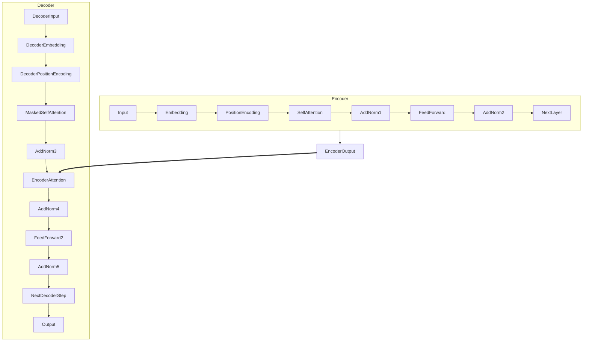

# AIGC从入门到实战：ChatGPT 日均算力运营成本的推算

## 1.背景介绍

### 1.1 人工智能大模型的兴起

近年来,人工智能(AI)和大模型(Large Model)的发展突飞猛进,尤其是自然语言处理(NLP)领域的变革更是翻天覆地。传统的NLP模型主要基于规则或统计方法,性能有限且难以扩展。而现代NLP大模型则通过深度学习技术在大规模语料库上进行预训练,学习丰富的语义和上下文知识,从而在下游任务上展现出超越人类的能力。

代表性的NLP大模型有GPT-3、BERT、XLNet等,其中以OpenAI开发的GPT-3(Generative Pre-trained Transformer 3)最为人所熟知。GPT-3凭借高达1750亿个参数的庞大规模,在自然语言生成、问答、代码生成等多项任务上取得了突破性的进展,引发了全球的关注热潮。

### 1.2 ChatGPT的崛起

2022年11月,OpenAI基于GPT-3.5推出了ChatGPT,这款对话式AI助手迅速在全球范围内走红。ChatGPT不仅能像传统搜索引擎那样回答查询,更能像人类一样主动提问、持续对话,通过上下文理解进行交互式的问答。它涵盖了包括编程、写作、数学、科学等多个领域的知识,可以为用户提供优质的解决方案和创意灵感。

ChatGPT的出现被认为是人工智能发展的一个重要里程碑,标志着大模型时代的到来。它的强大能力也引发了人们对AI可能带来的机遇和挑战的热烈讨论。作为首个真正走进大众视野的AI助手,ChatGPT让普通用户第一次亲身体验到了人工智能的魅力,也让企业和开发者们看到了将AI融入产品和服务的巨大潜力。

### 1.3 AIGC时代的到来

ChatGPT的成功也加速了人工智能生成内容(AIGC)时代的到来。AIGC技术可以利用大模型快速生成高质量的文字、图像、视频、音频等多种形式的内容,在内容创作、营销、教育、娱乐等多个领域拥有广阔的应用前景。

与此同时,AIGC带来的挑战也不容忽视。如何评估和保证生成内容的准确性、客观性和安全性?如何防止AIGC被滥用于生成虚假信息、色情低俗内容等?如何保护个人隐私和知识产权?这些都是亟待解决的重大课题。

总的来说,AIGC正在以前所未有的方式重塑着人类的工作和生活方式。我们正身处这场AI革命的风口浪尖,有必要对其中的机遇与挑战有一个全面深入的认识。

## 2.核心概念与联系

### 2.1 大模型与AIGC

AIGC(AI-Generated Content)即人工智能生成内容,是指利用人工智能算法和模型自动生成文本、图像、音频、视频等形式的内容。AIGC技术主要依赖于大模型(Large Model)的强大生成能力。

大模型是指参数量极为庞大(通常超过10亿个参数)的深度学习模型。这些大模型通过在海量数据上预训练,学习到了丰富的知识和上下文信息,从而具备出色的理解和生成能力。

常见的大模型包括:

- GPT-3(Generative Pre-trained Transformer 3):OpenAI开发的著名语言模型,参数量高达1750亿,擅长自然语言生成。
- BERT(Bidirectional Encoder Representations from Transformers):谷歌发布的预训练语言模型,在自然语言理解任务上表现出色。
- DALL-E:OpenAI推出的图像生成模型,可根据自然语言描述生成逼真的图像。
- Stable Diffusion:一种高性能的开源文本到图像生成模型。

这些大模型在NLP、计算机视觉等领域展现出了强大的生成和理解能力,为AIGC技术的发展奠定了基础。

### 2.2 AIGC的应用场景

AIGC技术的应用场景广泛且不断扩展,主要包括:

- **内容创作**:利用AIGC生成高质量的文字、图像、视频等创意内容,可大幅提高创作效率。
- **营销广告**:AIGC可根据用户画像和场景自动生成个性化的广告文案和创意。
- **客户服务**:基于AIGC的智能客服系统可以自动解答常见问题,提高服务效率。
- **教育培训**:AIGC可生成个性化的学习资料和练习,提高教学质量。
- **娱乐媒体**:AIGC可用于生成虚拟主播、游戏剧情等丰富的娱乐内容。
- **辅助创作**:AIGC可为作家、设计师等创作者提供灵感和辅助工具。

总的来说,AIGC有望在各行各业发挥重要作用,提高生产效率,优化用户体验。

### 2.3 AIGC的挑战

尽管AIGC前景广阔,但也面临着一些重大挑战:

1. **真实性和准确性**:如何确保AIGC生成内容的真实性和准确性,避免误导用户?
2. **知识产权和隐私**:AIGC模型训练所用的数据可能涉及版权和隐私问题,如何规避风险?
3. **算力需求**:大模型训练和推理对算力需求极高,成本可能难以承受。
4. **伦理和安全**:AIGC可能被滥用于生成虚假信息、色情低俗内容等,如何加以约束?
5. **可解释性**:大模型的"黑箱"特性使其决策过程缺乏透明度,如何提高可解释性?

只有妥善应对上述挑战,AIGC才能真正释放其巨大潜能,为人类社会带来实实在在的价值。

## 3.核心算法原理具体操作步骤

### 3.1 Transformer模型

AIGC的核心算法是Transformer,这是一种全新的基于注意力机制(Attention Mechanism)的序列到序列(Seq2Seq)模型。相比传统的RNN和CNN,Transformer具有并行计算能力更强、长期依赖建模更好等优势,尤其适用于处理长序列数据。

Transformer的主要组成部分包括:

1. **Embedding层**:将输入的词元(Token)映射为向量表示
2. **Encoder**:对输入序列进行编码,生成记忆向量
3. **Decoder**:根据记忆向量和前一步生成的输出,预测下一个词元
4. **Multi-Head Attention**:并行计算多个注意力向量的加权和
5. **前馈神经网络(FFN)**:对注意力输出进行非线性映射

Transformer的核心是Self-Attention机制,它可以直接学习输入序列中任意两个位置的关系,避免了RNN的递归计算。Multi-Head Attention则通过多个注意力头共同作用,有助于捕获不同位置的关系。

此外,Transformer还引入了残差连接(Residual Connection)和层归一化(Layer Normalization)等技术,有效缓解了深度网络的梯度消失和梯度爆炸问题。

### 3.2 Transformer运作步骤

以文本生成任务为例,Transformer的运作步骤如下:

1. **输入编码**:将输入文本序列通过Embedding层映射为向量表示,并注入位置编码信息。
2. **Encoder运算**:输入向量经过多层Encoder,每层包含Multi-Head Self-Attention和FFN子层,生成记忆向量。
3. **Decoder运算**:
    - 将目标起始符<start>作为第一个输入传入Decoder
    - 在每一步,Decoder会执行Masked Self-Attention、Multi-Head Attention和FFN计算
    - Masked Self-Attention只允许每个位置关注之前的输出
    - Multi-Head Attention则关注Encoder的记忆向量
    - 经过FFN后,输出当前位置的概率分布
    - 根据概率分布采样得到当前输出词元
    - 将当前输出作为下一步的输入,重复上述过程
4. **输出生成**:当生成终止符<end>或达到最大长度时,输出最终生成序列。

通过上述Encoder-Decoder架构和Self-Attention机制,Transformer能够高效地捕获输入和输出序列的长期依赖关系,实现强大的生成能力。

### 3.3 Transformer模型示意图

上图展示了Transformer的基本架构,包括Encoder和Decoder两个主要部分:

- Encoder将输入序列编码为记忆向量,通过Self-Attention、FFN和残差连接等运算。
- Decoder在每一步通过Masked Self-Attention关注前面的输出,Multi-Head Attention关注Encoder输出,并通过FFN预测当前位置的输出概率分布。

通过这种Encoder-Decoder结构和注意力机制,Transformer可以高效地建模输入和输出序列之间的长期依赖关系,实现强大的序列到序列的生成能力。

## 4.数学模型和公式详细讲解举例说明

### 4.1 Transformer中的注意力机制(Attention)

注意力机制是Transformer的核心,它使用加权求和的方式捕获序列中任意两个位置之间的关系。数学上,注意力机制可以表示为:

$$Attention(Q, K, V) = \text{softmax}(\frac{QK^T}{\sqrt{d_k}})V$$

其中:

- $Q$是查询向量(Query)
- $K$是键向量(Key)
- $V$是值向量(Value)
- $d_k$是缩放因子,用于防止内积过大导致梯度消失

具体来说,注意力机制首先计算查询$Q$与所有键$K$的点积,得到未缩放的分数向量。然后对分数向量进行缩放(除以$\sqrt{d_k}$)并应用softmax函数,得到注意力权重向量。最后,将注意力权重与值向量$V$相乘并求和,即得到加权后的注意力表示。

这种注意力机制赋予了模型可解释性,因为我们可以分析权重向量,了解模型对输入的哪些位置更加关注。

### 4.2 Multi-Head Attention

单一的注意力机制可能难以捕获序列中的所有重要关系,因此Transformer采用了Multi-Head Attention,它将注意力分成多个"头部"(Head),每个头部关注输入的不同子空间表示。

具体来说,对于给定的查询$Q$、键$K$和值$V$,我们首先通过线性变换将它们投影到$h$个子空间:

$$\begin{aligned}
Q_i &= QW_Q^i \\
K_i &= KW_K^i \\
V_i &= VW_V^i
\end{aligned}$$

其中,$W_Q^i$、$W_K^i$和$W_V^i$分别是第$i$个头部的查询、键和值的线性变换矩阵。

然后,对每个子空间应用注意力机制:

$$\text{head}_i = \text{Attention}(Q_i, K_i, V_i)$$

最后,将所有头部的输出进行拼接并经过另一个线性变换$W_O$,得到Multi-Head Attention的最终输出:

$$\text{MultiHead}(Q, K, V) = \text{Concat}(\text{head}_1, \dots, \text{head}_h)W_O$$

通过Multi-Head Attention,模型可以关注输入序列的不同子空间表示,从而更好地捕获序列中的长期依赖关系。

### 4.3 Self-Attention中的掩码(Mask)

在Transformer的Decoder中,Self-Attention需要使用掩码来保证每个位置只能关注之前的输出,而不能关注之后的输出。这