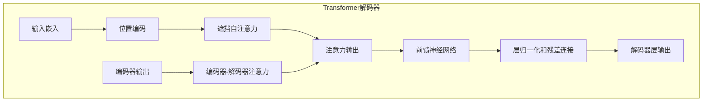

# AIGC从入门到实战：不识庐山真面目：GPT 模型为什么能生成有意义的文本？

## 1.背景介绍

### 1.1 人工智能的崛起

人工智能(Artificial Intelligence, AI)是当代科技发展的重要驱动力,已经渗透到我们生活的方方面面。从语音助手到自动驾驶汽车,从医疗诊断到金融风险评估,AI无处不在。近年来,AI的一个分支——大型语言模型(Large Language Model, LLM)取得了令人瞩目的进展,尤其是GPT(Generative Pre-trained Transformer)模型在自然语言处理领域的出色表现,引发了广泛关注。

### 1.2 GPT模型的重要性

GPT模型是一种基于transformer架构的大型语言模型,能够生成看似人类写作的连贯、流畅的文本。这种生成式语言模型的出现,不仅推动了自然语言处理技术的发展,也为人机交互、内容创作、知识提取等领域带来了新的可能性。GPT模型的核心能力在于捕捉文本中的语义和上下文关系,并基于此生成新的、有意义的文本。

### 1.3 GPT模型的应用前景

GPT模型在多个领域展现出巨大的应用潜力,如:

- 对话系统:GPT可用于构建自然语言对话代理,提供更人性化的用户体验。
- 内容创作:GPT可辅助创作诗歌、小说、新闻报道等内容。
- 问答系统:GPT能够根据上下文生成相关的问答,为智能问答系统提供支持。
- 文本摘要:GPT可自动生成文本摘要,提高信息获取效率。
- ...

然而,GPT模型的工作原理并不简单,其能够生成有意义文本的奥秘值得我们深入探讨。

## 2.核心概念与联系

### 2.1 自然语言处理(NLP)

自然语言处理是人工智能的一个重要分支,旨在使计算机能够理解和生成人类可理解的语言。NLP技术广泛应用于机器翻译、信息检索、问答系统、文本摘要等领域。传统的NLP方法主要依赖规则和统计模型,但在处理复杂语言现象时往往效果有限。

### 2.2 神经网络语言模型

近年来,基于深度学习的神经网络语言模型(Neural Network Language Model, NNLM)展现出强大的语言建模能力。NNLM能够自动从大量语料中学习语言的统计规律,捕捉文本的语义和上下文信息。这种数据驱动的方法显著提高了语言模型的性能,为复杂的NLP任务提供了有力支持。

### 2.3 Transformer架构

Transformer是一种全新的基于注意力机制(Attention Mechanism)的神经网络架构,最初被提出用于机器翻译任务。与传统的循环神经网络(RNN)不同,Transformer完全基于注意力机制,能够有效捕捉输入序列中任意两个位置之间的依赖关系,同时支持并行计算,大大提高了训练效率。

Transformer架构的出现为NLP领域注入了新的活力,成为构建大型语言模型的主流选择。GPT模型正是基于Transformer架构,通过预训练的方式学习语言的通用知识,再针对特定任务进行微调,取得了卓越的表现。

### 2.4 GPT模型家族

GPT模型家族包括GPT、GPT-2、GPT-3等,每一代模型规模都比前一代大得多。以GPT-3为例,它拥有1750亿个参数,是目前最大的语言模型之一。大规模参数量使得GPT-3能够学习到更丰富、更复杂的语言知识,生成质量更高的文本。

GPT模型的核心思想是:通过在大量无监督文本数据上进行预训练,让模型自主学习语言的统计规律;然后在有监督的特定任务上进行微调,使模型能够生成符合特定需求的文本输出。这种通用预训练加特定微调的范式,大大提高了模型的泛化能力和性能表现。

## 3.核心算法原理具体操作步骤

### 3.1 Transformer编码器

Transformer编码器的主要作用是将输入文本序列编码为一系列向量表示,捕捉输入序列中元素之间的依赖关系。编码器的核心组件包括:

1. **词嵌入层(Word Embedding)**:将每个词映射为一个固定长度的向量表示。

2. **位置编码(Positional Encoding)**:因为Transformer没有递归或卷积结构,无法直接获取序列的位置信息,因此需要显式地添加位置编码,赋予每个位置一个唯一的向量表示。

3. **多头注意力机制(Multi-Head Attention)**:注意力机制是Transformer的核心,它允许模型在计算目标元素的表示时,关注输入序列中的不同位置,捕捉长距离依赖关系。多头注意力机制可以从不同的子空间获取不同的注意力信息,提高模型的表现力。

4. **前馈神经网络(Feed-Forward Network)**:对每个位置的向量表示进行进一步的非线性变换,提取更高阶的特征。

5. **层归一化(Layer Normalization)**和**残差连接(Residual Connection)**:用于加速训练收敛并缓解梯度消失问题。

编码器通过多个相同的编码器层堆叠而成,每一层的输出就是该层位置的上下文向量表示,包含了输入序列中该位置元素与其他元素之间的依赖关系信息。

### 3.2 Transformer解码器

Transformer解码器的作用是根据编码器的输出和前一步的预测结果,生成下一个词的概率分布,从而实现自回归(Auto-Regressive)的文本生成过程。解码器的主要组件包括:

1. **遮挡注意力机制(Masked Self-Attention)**:在计算注意力时,对于当前位置的词,遮挡掉其后面位置的信息,确保模型只能基于之前的输出来预测当前词。

2. **编码器-解码器注意力(Encoder-Decoder Attention)**:将解码器的输出与编码器的输出进行注意力计算,使解码器能够关注输入序列中的不同位置,获取必要的上下文信息。

3. **前馈神经网络(Feed-Forward Network)**、**层归一化(Layer Normalization)**和**残差连接(Residual Connection)**:与编码器中的组件类似,用于提取高阶特征和加速训练。

解码器通过多个相同的解码器层堆叠而成。在每一步的生成过程中,解码器会根据输入序列的编码表示、已生成的词序列以及当前位置的词嵌入,计算出下一个词的概率分布,然后根据该分布采样或选取概率最大的词作为输出。

### 3.3 生成式预训练(Generative Pre-training)

GPT模型采用了生成式预训练的策略,即在大量无监督文本数据上进行预训练,让模型学习语言的通用知识和规律。预训练的目标是最大化模型在给定上文的情况下,正确预测下一个词的概率。

具体来说,预训练过程包括以下步骤:

1. **语料准备**:收集大量高质量的文本数据,如书籍、网页、维基百科等,构建训练语料库。

2. **数据预处理**:对原始文本进行标记化(Tokenization)、词嵌入等预处理操作。

3. **掩码语言模型(Masked Language Modeling)**:在输入序列中随机掩码一部分词,要求模型基于上下文预测被掩码的词。这种策略迫使模型学习双向语义信息。

4. **下一句预测(Next Sentence Prediction)**:给定两个句子,要求模型判断第二个句子是否为第一个句子的下一句。这有助于模型捕捉句子之间的逻辑关系。

5. **模型更新**:根据预测的结果和真实标签,计算损失函数,并通过梯度下降算法更新模型参数。

通过在大规模语料上进行预训练,GPT模型能够学习到丰富的语言知识,包括词汇、语法、语义和上下文信息,为后续的任务微调奠定基础。

### 3.4 任务微调(Task-specific Fine-tuning)

预训练完成后,GPT模型还需要针对特定的自然语言处理任务进行微调,以获得更好的性能表现。微调的过程如下:

1. **任务数据准备**:收集与目标任务相关的标注数据集,如机器翻译的平行语料、文本摘要的文章-摘要对等。

2. **数据预处理**:对任务数据进行必要的预处理,如标记化、填充等,使其与预训练时的数据格式保持一致。

3. **模型初始化**:将预训练好的GPT模型参数作为初始值加载到新的模型中。

4. **模型微调**:在任务数据集上对模型进行supervised训练,根据任务的损失函数更新模型参数。由于已经在预训练阶段学习了通用的语言知识,微调往往只需少量的标注数据和较少的训练步数即可取得良好效果。

5. **模型评估**:在任务的测试集上评估微调后模型的性能,根据指标(如BLEU分数、ROUGE分数等)判断模型的效果。

通过预训练+微调的策略,GPT模型能够在保留通用语言知识的同时,针对特定任务进行专门的优化,发挥出更强的性能表现。

## 4.数学模型和公式详细讲解举例说明

### 4.1 Transformer的注意力机制

注意力机制(Attention Mechanism)是Transformer架构的核心,它允许模型在计算目标元素的表示时,关注输入序列中的不同位置,捕捉长距离依赖关系。具体来说,给定一个查询向量(Query) $q$、一组键向量(Keys) $K=\{k_1, k_2, \dots, k_n\}$和一组值向量(Values) $V=\{v_1, v_2, \dots, v_n\}$,注意力机制的计算过程如下:

1. 计算查询向量与每个键向量之间的相似性分数:

$$\text{Score}(q, k_i) = q \cdot k_i^T$$

其中 $\cdot$ 表示向量点积操作。

2. 对相似性分数进行软最大化(Softmax),得到注意力权重:

$$\alpha_i = \text{Softmax}(\text{Score}(q, k_i)) = \frac{e^{\text{Score}(q, k_i)}}{\sum_{j=1}^n e^{\text{Score}(q, k_j)}}$$

3. 根据注意力权重对值向量进行加权求和,得到注意力输出:

$$\text{Attention}(q, K, V) = \sum_{i=1}^n \alpha_i v_i$$

注意力机制能够自动分配不同位置的权重,使模型在生成目标元素时,更多地关注与之相关的输入元素。这种灵活的加权机制,赋予了Transformer强大的建模能力。

在实际应用中,Transformer通常采用多头注意力机制(Multi-Head Attention),即将查询、键、值向量先经过不同的线性变换,分别计算多个注意力输出,再将它们拼接起来,从而捕捉不同子空间的注意力信息。具体计算公式如下:

$$\{"msg_type":"generate_answer_finish","data":"","from_module":null,"from_unit":null}