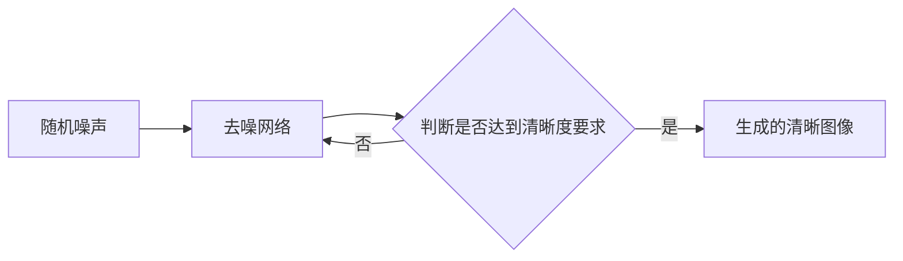
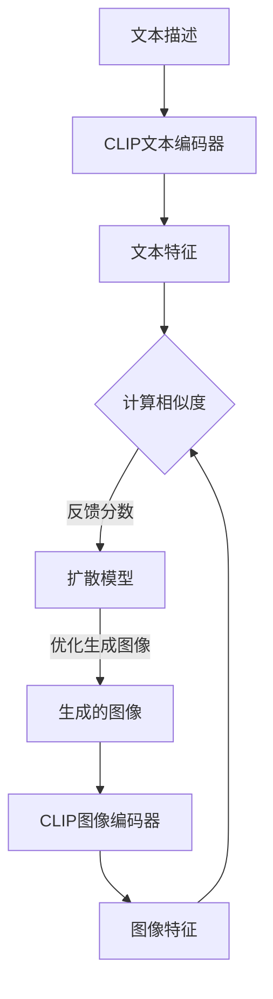

# AIGC从入门到实战：多快好省搞定各种风格的 logo 设计

## 1. 背景介绍

### 1.1 AIGC的兴起与发展
近年来,人工智能生成内容(AIGC)技术迅猛发展,在图像、视频、音频、文本等领域取得了令人瞩目的成就。尤其是在图像生成方面,以DALL-E、Midjourney、Stable Diffusion等为代表的AI绘画模型,能够根据文本描述生成逼真、多样、富有创意的图像,为设计行业带来了革命性的变革。

### 1.2 AIGC在logo设计中的应用前景
logo设计是商业活动中至关重要的一环,优秀的logo能够塑造品牌形象,传递品牌理念,吸引目标客户。传统的logo设计流程需要专业设计师投入大量时间和精力,成本较高,周期较长。将AIGC技术应用于logo设计,有望大幅提升设计效率,降低设计成本,同时激发更多创意灵感,助力品牌快速迭代升级。

### 1.3 本文的目标与价值
本文将系统介绍AIGC在logo设计中的应用,包括核心概念、关键技术、实战案例等,帮助读者快速掌握利用AIGC进行logo设计的实用技能。通过本文,读者可以了解AIGC的基本原理,学会使用主流的AI设计工具,参考优秀案例,避免常见问题,从而高效、低成本、高质量地完成各种风格的logo设计。

## 2. 核心概念与联系

### 2.1 AIGC的定义与分类
AIGC是指利用人工智能算法自动生成内容的技术,可分为文本生成、图像生成、音频生成、视频生成等类型。其中,图像生成是AIGC最成熟、应用最广泛的方向之一。

### 2.2 生成对抗网络(GAN)
GAN由生成器和判别器两部分组成,通过二者的博弈学习,生成器可生成越来越逼真的图像,判别器可判断图像是否为真实样本。GAN是图像生成领域的关键技术之一。

### 2.3 扩散模型(Diffusion Model) 
扩散模型通过迭代去噪过程,逐步将随机噪声转化为清晰图像。相比GAN,扩散模型训练更稳定,生成图像质量更高,是当前图像生成的主流范式。

### 2.4 CLIP模型
CLIP是OpenAI提出的多模态模型,可以衡量图像和文本的语义相似度。将CLIP作为图像生成模型的评价器,可以指导模型生成与文本描述更吻合的图像。

### 2.5 Stable Diffusion与Midjourney
Stable Diffusion和Midjourney是基于扩散模型的两个著名开源AIGC项目,支持文本到图像的生成。在logo设计等应用中表现出色,是设计师们的得力助手。

## 3. 核心算法原理具体操作步骤

### 3.1 基于扩散模型的图像生成步骤



1. 从高斯分布采样随机噪声作为初始输入
2. 将噪声图像输入预训练的去噪网络,网络通过估计噪声分布,预测去除部分噪声后的图像
3. 判断图像是否达到清晰度要求,如果没有达到,则重复步骤2,继续去噪
4. 当图像足够清晰时,输出最终生成的高质量图像

### 3.2 CLIP引导的图像生成步骤



1. 将logo的文本描述输入CLIP的文本编码器,得到文本特征向量
2. 利用扩散模型生成候选的logo图像
3. 将生成图像输入CLIP的图像编码器,得到图像特征向量 
4. 计算文本特征和图像特征的余弦相似度,作为生成图像与文本描述匹配程度的分数
5. 将相似度分数反馈给扩散模型,引导其朝着与文本描述更匹配的方向优化
6. 重复步骤2-5,不断迭代优化,直到生成足够匹配文本描述的高质量logo图像

## 4. 数学模型和公式详细讲解举例说明

### 4.1 扩散模型的数学描述
扩散模型的前向过程可以表示为一个马尔可夫链:

$q(x_t|x_{t-1}) = \mathcal{N}(x_t; \sqrt{1-\beta_t} x_{t-1}, \beta_t \mathbf{I})$

其中$x_t$为$t$时刻的图像,$\beta_t$为噪声强度,服从Beta分布。不断向图像中添加高斯噪声,最终得到完全被破坏的图像$x_T$。

扩散模型的后向过程(即生成过程)可以表示为:

$p_\theta(x_{t-1}|x_t) = \mathcal{N}(x_{t-1}; \mu_\theta(x_t, t), \Sigma_\theta(x_t, t))$

其中$\mu_\theta$和$\Sigma_\theta$为可学习的均值和方差函数,通过神经网络拟合。给定$x_T$,反复使用后向过程,最终可以生成干净的图像$x_0$。

训练扩散模型的目标是最小化负对数似然函数:

$L_{DM} = -\mathbb{E}_{q(x_{0:T})}[\log p_\theta(x_{0:T})]$

通过最小化该损失函数,可以学习到最优的后向转移概率分布$p_\theta(x_{t-1}|x_t)$。

### 4.2 CLIP指导生成的数学描述
记文本描述为$c$,生成的图像为$\hat{x}$,CLIP的文本编码器为$f_t$,图像编码器为$f_i$,则文本特征$v_t$和图像特征$v_i$分别为:

$v_t=f_t(c)$

$v_i=f_i(\hat{x})$

二者的余弦相似度可以表示为: 

$s(c,\hat{x}) = \frac{v_t \cdot v_i}{||v_t|| \cdot ||v_i||}$

CLIP引导生成的目标是最大化该相似度,因此损失函数可以定义为:

$L_{CLIP} = -s(c,\hat{x})$

将$L_{CLIP}$作为扩散模型的附加loss,联合优化两个目标:

$L = L_{DM} + \lambda L_{CLIP}$

其中$\lambda$为平衡两个loss的权重系数。最小化该联合损失函数,可以得到与文本描述相符合的高质量logo图像。

## 5. 项目实践：代码实例和详细解释说明

接下来以Stable Diffusion为例,演示如何用Python代码实现文本指导的logo图像生成。

### 5.1 安装依赖包

```python
!pip install torch diffusers transformers accelerate scipy ftfy
```

首先安装必要的Python包,包括PyTorch、Hugging Face的diffusers和transformers等。

### 5.2 加载预训练模型

```python
from diffusers import StableDiffusionPipeline

model_id = "CompVis/stable-diffusion-v1-4"
pipe = StableDiffusionPipeline.from_pretrained(model_id, torch_dtype=torch.float16)  
pipe = pipe.to("cuda")
```

从Hugging Face Hub加载预训练的Stable Diffusion模型,并将其移动到GPU上。

### 5.3 定义CLIP引导函数

```python
import torch
import clip

def clip_loss(text, image):
    # 加载CLIP模型
    clip_model, preprocess = clip.load("ViT-B/32", device="cuda")
    
    # 将图像预处理为CLIP需要的格式
    image = preprocess(image).unsqueeze(0).to("cuda")
    
    # 计算图像特征
    with torch.no_grad():
        image_features = clip_model.encode_image(image)
        
    # 计算文本特征    
    text_input = clip.tokenize([text]).to("cuda")
    with torch.no_grad():
        text_features = clip_model.encode_text(text_input)
        
    # 计算余弦相似度
    return 1 - torch.cosine_similarity(image_features, text_features).item()
```

定义CLIP引导的损失函数,输入文本描述和生成图像,计算二者的特征向量,返回余弦相似度作为loss。

### 5.4 生成logo图像

```python
prompt = "A cyberpunk style logo for a tech company named Neurolink, blue and purple color, minimalist design"

image = pipe(prompt, num_inference_steps=50, guidance_scale=7.5, clip_guidance_scale=100, 
             clip_prompt=prompt, clip_guidance=True, clip_loss=clip_loss).images[0]

image.save("logo.png")
```

定义logo的文本描述prompt,调用Stable Diffusion的pipeline接口生成图像,通过设置clip_guidance=True和clip_loss参数启用CLIP引导。最后将生成的logo图像保存到本地文件。

## 6. 实际应用场景

AIGC技术在logo设计领域有广泛的应用前景,主要场景包括:

### 6.1 快速生成logo创意
设计师可以输入简单的文本描述,如"科技感的蓝色地球logo",AIGC模型可以快速生成多个不同风格的候选logo创意,为设计师提供灵感参考,加速设计流程。

### 6.2 个性化定制logo
客户可以直接输入对logo的详细要求,如配色、元素、行业属性等,AIGC模型可以根据需求"量身定做"个性化的logo,满足不同客户的差异化需求。

### 6.3 自动优化和微调
设计师可以用AIGC模型对已有的logo进行自动完善,如提高分辨率、调整布局、更换配色等。通过简单的文本编辑指令,即可快速得到多个优化方案,大大降低了手工修改的工作量。

### 6.4 多场景自适应
基于AIGC生成的logo可以方便地适配不同的使用场景,如将方形logo自动转换为圆形,或者根据投放的媒介(名片、网站、app等)自动调整尺寸和布局,提高logo的灵活性和适用性。

## 7. 工具和资源推荐

### 7.1 AIGC平台
- [Midjourney](https://www.midjourney.com/): 拥有独特艺术风格的AI绘画工具,适合生成创意logo
- [Stable Diffusion](https://stability.ai/): 开源的图像生成模型,支持本地部署,灵活性高
- [DALL·E 2](https://openai.com/dall-e-2/): OpenAI推出的图像生成平台,操作简单,支持语言引导编辑
- [文心一格](https://yige.baidu.com/): 百度推出的AIGC平台,支持logo生成等多种能力

### 7.2 设计素材库
- [Noun Project](https://thenounproject.com/): 拥有海量的logo图标素材,可用于拼接组合
- [Freepik](https://www.freepik.com/): 免费的矢量图、插图、图标等设计资源库
- [花瓣](https://huaban.com/): 国内知名的设计素材分享网站,拥有大量logo参考

### 7.3 设计工具
- [Adobe Illustrator](https://www.adobe.com/products/illustrator.html): 矢量图形设计软件,可用于创建和编辑logo
- [Sketch](https://www.sketch.com/): 专为UI设计而生的矢量绘图工具,简单易用
- [Figma](https://www.figma.com/): 云端协作的UI设计工具,支持多人同时编辑

## 8. 总结：未来发展趋势与挑战

### 8.1 个性化与智能化并重
未来AIGC技术在logo设计中将向个性化和智能化两个方向发展。一方面,AIGC可以根据客户的独特需求,生成差异化的定制logo;另一方面,AIGC将变得更加智能,能够理解logo设计的基本原则,自动优化生成结果,提供专业的设计建议。

### 8.2 多模态交互
AIGC平台将支持多种输入方式,如文本、语音、图像等,设计师可以