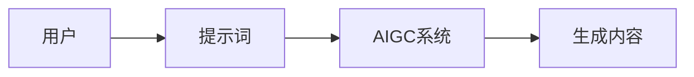
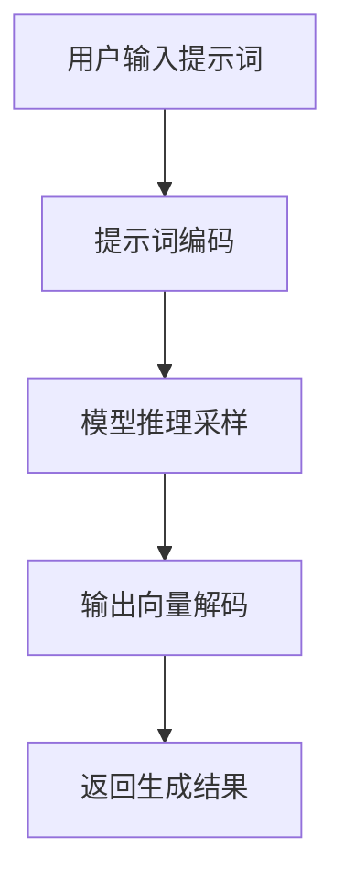

# AIGC从入门到实战：提示词写作技巧

## 1.背景介绍
### 1.1 AIGC的兴起与发展
近年来,人工智能生成内容(AIGC)技术得到了飞速发展。从OpenAI的GPT系列语言模型,到Midjourney、Stable Diffusion等图像生成模型,再到Meta的AudioLM语音模型,AIGC正在深刻改变内容创作的方式。作为普通用户,我们已经能够利用这些强大的AI工具,生成有趣、有用的各类内容。

### 1.2 提示词的重要性
要驾驭AIGC工具创作内容,提示词(Prompt)起着至关重要的作用。优秀的提示词写作能力,可以帮助我们更好地引导AI,使其生成我们期望的高质量内容。反之,糟糕的提示词则可能导致AI生成离题、错误、甚至有害的内容。因此,掌握提示词写作的技巧,是每一个AIGC使用者的必修课。

### 1.3 本文的主要内容
本文将重点介绍AIGC领域的提示词写作技巧。我们将从基本概念出发,探讨提示词的原理,提供系统的写作步骤和丰富的优化技巧,并给出大量实战案例。通过本文的学习,你将掌握AIGC提示词写作的核心要领,成为一名出色的提示词工程师。

## 2.核心概念与联系
### 2.1 提示词的定义与分类
提示词是指我们输入给AIGC系统的文本指令,用于指导AI生成特定的内容。从功能上看,提示词可分为以下几类:

- 任务描述类:说明我们希望AI完成的具体任务,如"请写一篇关于春天的诗"。  
- 背景设定类:交代生成内容的背景信息,如"我们处在一个蒸汽朋克的未来世界"。
- 形式要求类:对生成内容的形式提出要求,如"以新闻稿的格式输出"。
- 质量约束类:对生成内容的质量进行约束,如"语言要生动幽默,切忌生涩晦涩"。

### 2.2 提示词与AIGC系统的关系
提示词是连接用户和AIGC系统的桥梁。一方面,它将用户的需求传递给AI;另一方面,它影响并引导着AI的生成过程。可以说,提示词在很大程度上决定了AIGC的输出质量。



### 2.3 提示词的核心要素
一个优秀的提示词需要具备以下核心要素:

- 明确性:清晰表达任务需求,避免歧义。
- 完整性:提供足够的信息和约束条件。  
- 简洁性:尽量使用精炼的语言,去除冗余。
- 可操作性:符合AIGC系统的能力边界。

只有同时满足这些要素,提示词才能发挥最佳效力,帮助我们实现内容创作的目标。

## 3.核心算法原理与操作步骤
### 3.1 AIGC的生成原理简介
主流的AIGC系统大多基于Transformer等语言模型架构。这些模型通过海量数据的预训练,习得了强大的自然语言理解和生成能力。当我们输入提示词时,模型会根据提示词的内容,在其认知空间中进行探索和采样,生成与之相关的连贯文本。

### 3.2 提示词的执行流程
从用户输入提示词到AI输出结果,主要经历以下步骤:

1. 用户输入提示词。
2. AIGC系统对提示词进行编码,将其转化为模型可理解的数字向量。
3. 模型根据提示词向量在其参数空间进行推理采样,生成输出向量。
4. 输出向量被解码为人类可读的自然语言文本。
5. 将生成结果返回给用户。



### 3.3 提示词写作的基本步骤
基于以上原理,我们可以总结出提示词写作的基本步骤:

1. 明确任务目标:我们要生成什么内容?
2. 设定背景条件:生成内容的背景是什么?
3. 提出形式要求:对生成内容的格式、体裁等有何要求?
4. 添加质量约束:如何保证生成内容的质量?
5. 优化提示词:精简语言,突出关键信息。
6. 测试反馈迭代:实际测试提示词,根据生成结果进行改进。

遵循这一步骤,我们就能写出高质量的提示词,有效指导AIGC系统进行内容生成。

## 4.数学模型和公式详细讲解
### 4.1 Transformer的核心公式
Transformer是当前AIGC系统的主流模型架构。其核心是自注意力机制(Self-Attention),可以捕捉文本中的长距离依赖关系。具体来说,自注意力分三步计算:

1. 根据输入向量$X$,计算Query矩阵$Q$、Key矩阵$K$、Value矩阵$V$:

$$
\begin{aligned}
Q &= XW^Q \\
K &= XW^K \\
V &= XW^V
\end{aligned}
$$

其中$W^Q$、$W^K$、$W^V$是可学习的参数矩阵。

2. 计算注意力权重$A$:

$$
A = \text{softmax}(\frac{QK^T}{\sqrt{d_k}})
$$

其中$d_k$是$K$矩阵的维度,用于缩放点积结果。

3. 根据注意力权重$A$对$V$进行加权求和,得到输出$Z$:

$$
Z = AV
$$

通过自注意力机制,Transformer能够充分挖掘文本的内在联系,进而更好地理解和生成自然语言。

### 4.2 AIGC损失函数与优化目标
AIGC模型的训练本质上是一个极小化损失函数的过程。常见的损失函数包括交叉熵损失:

$$
L = -\sum_{i=1}^{n} y_i \log(\hat{y}_i)
$$

其中$y_i$是真实标签,$\hat{y}_i$是模型预测值。

还有感知损失(Perceptual Loss),即基于预训练网络的特征相似度:

$$
L = \sum_{i=1}^{n} || f(x_i) - f(\hat{x}_i) ||^2
$$

其中$f$是预训练网络的特征提取器,$x_i$是真实样本,$\hat{x}_i$是生成样本。

优化这些损失函数,就能让AIGC模型学会生成高质量、接近真实的内容。而提示词则进一步引导模型朝着用户期望的方向优化,起到画龙点睛的作用。

## 5.项目实践:代码实例与详解
下面我们通过一个简单的代码实例,演示如何使用OpenAI的API接口,利用提示词控制AI生成内容。

```python
import openai

openai.api_key = "your_api_key"  # 替换为你的API Key

prompt = "请以《我用AI写诗》为题,创作一首七言绝句。要求字字珠玑,意境高远。"

response = openai.Completion.create(
    engine="text-davinci-003",   # 选择模型引擎
    prompt=prompt,               # 输入提示词  
    max_tokens=1024,             # 限定最大生成长度
    n=1,                         # 生成结果数量
    stop=None,                   # 停止条件
    temperature=0.7,             # 控制生成的多样性
)

print(response.choices[0].text)  # 打印生成结果
```

在这个例子中,我们:

1. 首先配置OpenAI的API Key。 
2. 然后定义提示词prompt,要求AI创作一首以"我用AI写诗"为题的七言绝句。
3. 接着调用openai.Completion.create()方法,选择模型引擎,传入提示词等参数。
4. 最后打印出AI生成的诗歌内容。

通过调整提示词的内容,我们可以控制AI生成不同风格、主题的诗歌。这充分展现了提示词的威力:简单的文本指令,就能驱动AI进行复杂的创作任务。

当然,实际应用中的提示词设计要复杂得多。我们需要精心组织语言,设置恰当的约束条件,并不断根据生成结果进行优化。这需要大量的实践和经验积累。

## 6.实际应用场景
AIGC提示词写作可以应用于各种内容创作场景,为我们的工作和生活带来便利。下面列举几个典型应用方向:

### 6.1 文案撰写
利用AIGC工具,我们可以快速生成各类文案,如广告语、产品描述、新闻稿等。优质的提示词可以确保生成文案的质量和风格,大大提升写作效率。

### 6.2 故事创作
AIGC为故事创作提供了新的可能。我们可以通过提示词设定故事背景、人物、情节走向等要素,让AI为我们自动生成有趣的故事情节。这对于小说、剧本创作等领域有重要参考价值。

### 6.3 问答系统
基于AIGC技术,我们可以搭建智能问答系统。提示词在其中扮演着至关重要的角色,它引导AI理解用户问题并给出恰当回答。优秀的提示词设计可以大幅提升问答系统的用户体验。

### 6.4 个性化推荐
AIGC还可用于个性化推荐场景,如商品推荐、内容推荐等。通过提示词输入用户画像信息,AI可以生成符合用户喜好的个性化推荐内容,提升推荐的精准度和转化率。

总之,AIGC提示词写作在内容创作的各个领域大有可为。掌握这一技能,我们就能更好地应对未来的内容生产挑战,用AI赋能创作,提升生产力。

## 7.工具和资源推荐
### 7.1 AIGC平台
- OpenAI:提供强大的自然语言处理API,支持对话、写作、代码等多种任务。
- Midjourney:一个优秀的文本到图像生成平台,可用于创意设计等场景。  
- Copy.ai:专注于营销文案生成的AIGC工具,支持多种文案类型。

### 7.2 提示词资源库
- Awesome Prompts:提示词写作技巧与案例合集。
- FlowGPT:一个开源的提示词工程工具,支持多种优化技巧。
- PromptBase:提示词分享与交易平台。

### 7.3 AIGC社区
- AIGC Club:专注于AIGC技术交流的社区,有许多优秀的教程和实践案例。  
- Prompt Engineering Forum:提示词工程主题的论坛,汇聚了众多领域专家。

这些工具和资源可以帮助我们更好地学习和应用AIGC提示词写作,建议大家充分利用,共同探索AIGC的无限可能。

## 8.总结:未来发展趋势与挑战
### 8.1 AIGC的发展趋势
未来,AIGC技术必将持续快速发展。以下是几个值得关注的趋势:

- 多模态融合:AIGC将进一步实现文本、图像、语音等多种模态的融合生成,创作形式更加丰富多元。
- 个性化定制:AIGC将根据用户特征生成更加个性化、定制化的内容,满足不同用户的独特需求。  
- 人机协作:AIGC将更好地与人工创作相结合,形成人机协作的新型创作模式,发挥各自所长。

### 8.2 AIGC面临的挑战
同时,AIGC的发展也面临诸多挑战,例如:

- 伦理与安全:如何规避AIGC生成有害、虚假内容的风险,确保内容的伦理和安全性。
- 知识产权:如何界定AIGC生成内容的知识产权归属,建立合理的利益分配机制。
- 人才培养:如何培养既懂AIGC技术又懂内容创作的复合型人才,推动AIGC产业发展。

这些趋势和挑战为AIGC领域的研究和应用指明了方向。作为AIGC从业者,我们要积极把