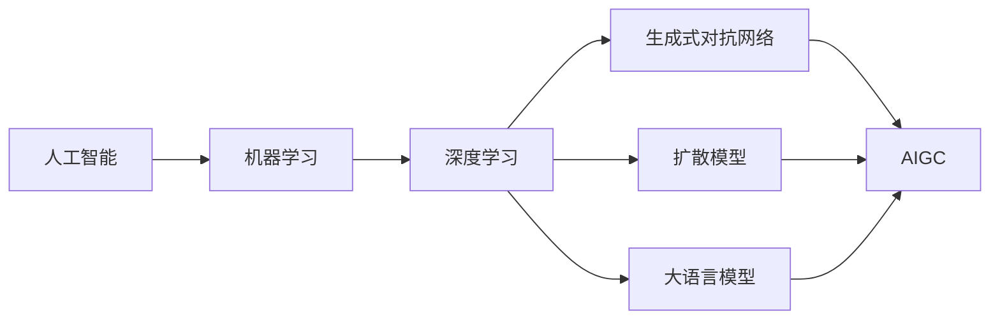

# AIGC从入门到实战：落霞与孤鹜齐飞：AIGC 汹涌而来

## 1. 背景介绍

### 1.1 AIGC的兴起

人工智能生成内容(AIGC)技术近年来发展迅速,正在深刻影响着各行各业。从自然语言处理到计算机视觉,AIGC正在重塑内容生产和创意产业的格局。

### 1.2 AIGC的潜力

AIGC技术具有巨大的潜力,可以极大提升内容生产效率,降低创作门槛,催生出新的商业模式和应用场景。但同时,AIGC也带来了版权、伦理等方面的新挑战。

### 1.3 AIGC的发展现状

目前,AIGC技术已经在文本、图像、音频、视频等领域取得了显著进展。ChatGPT、Midjourney、Stable Diffusion等产品让更多人感受到了AIGC的魅力。但AIGC的发展之路才刚刚开始,未来还有很长的路要走。

## 2. 核心概念与联系

### 2.1 人工智能(AI)

人工智能是研究、开发用于模拟、延伸和扩展人的智能的理论、方法、技术及应用系统的一门新的技术科学。它试图了解智能的实质,并生产出一种新的能以人类智能相似的方式做出反应的智能机器。

### 2.2 机器学习(ML)

机器学习是人工智能的一个分支,它通过算法来分析和学习数据,使得机器能够在没有明确编程的情况下学习和进化。机器学习算法通过训练数据来学习规律和模式,并对新数据做出预测。

### 2.3 深度学习(DL)

深度学习是机器学习的一个子集,它模仿人脑的神经网络结构,使用多层次的人工神经网络来学习和表征数据。深度学习在图像识别、语音识别、自然语言处理等领域取得了突破性进展。

### 2.4 生成式对抗网络(GAN)

生成式对抗网络由生成器和判别器两个神经网络组成,通过两者的对抗学习,生成器可以生成以假乱真的样本数据。GAN在图像生成、风格迁移、超分辨率等任务中表现出色。

### 2.5 扩散模型(Diffusion Model)

扩散模型是一种生成模型,它通过迭代去噪过程从高斯噪声中生成高质量的图像。扩散模型在图像生成领域展现了巨大的潜力,代表作包括DALL-E、Stable Diffusion等。

### 2.6 大语言模型(LLM)

大语言模型是基于海量文本数据训练的神经网络模型,可以生成连贯、通顺的文本。GPT-3、PaLM、BLOOM等大语言模型展示了惊人的语言理解和生成能力,在问答、写作、编程等任务上表现优异。

### 2.7 AIGC

AIGC即AI Generated Content,是利用人工智能技术自动或半自动生成的内容,包括文本、图像、音频、视频等多种形式。AIGC技术融合了机器学习、深度学习、自然语言处理、计算机视觉等多个AI分支领域的最新进展。



## 3. 核心算法原理与操作步骤

### 3.1 文本生成

#### 3.1.1 基于Transformer的语言模型

Transformer结构引入了自注意力机制,可以有效捕捉文本中的长距离依赖关系。基于Transformer的语言模型如GPT系列,通过自回归的方式生成连贯、通顺的文本。

主要步骤:
1. 对输入文本进行tokenization,转化为模型可以处理的token序列
2. 将token序列输入Transformer编码器,提取上下文信息
3. 基于编码器输出,使用解码器自回归生成后续token
4. 重复步骤3,直到生成结束标记或达到最大长度

#### 3.1.2 基于提示学习的文本生成

提示学习(Prompt Learning)通过设计精巧的提示模板,引导预训练语言模型生成定制化的文本。通过在提示中加入任务描述、示例、角色等信息,可以实现更可控的文本生成。

主要步骤:
1. 设计提示模板,可以包含任务描述、输入输出示例、角色扮演等元信息
2. 将提示文本和输入文本拼接,送入预训练语言模型
3. 语言模型根据提示生成目标文本
4. 对生成文本进行后处理,如去除多余文本、调整格式等

### 3.2 图像生成

#### 3.2.1 基于GAN的图像生成

GAN通过生成器和判别器的对抗学习,可以生成逼真的图像。生成器试图生成以假乱真的图像,判别器则试图判别图像的真伪,两者互相博弈,最终生成高质量图像。

主要步骤:
1. 随机采样隐空间向量z作为生成器G的输入
2. 生成器G将z映射到图像空间,生成图像G(z) 
3. 判别器D对真实图像x和生成图像G(z)进行真假判别
4. 计算生成器和判别器的损失函数,并进行梯度反向传播和参数更新
5. 重复步骤1-4,直到模型收敛

#### 3.2.2 基于扩散模型的图像生成

扩散模型通过迭代去噪的方式生成高质量图像。先将图像逐步添加高斯噪声直至完全破坏,然后再通过逐步去噪恢复原图像。通过这个过程,扩散模型可以学习图像的数据分布。

主要步骤:
1. 将原始图像x_0逐步添加高斯噪声,得到一系列噪声图像x_1, x_2, ..., x_T
2. 训练去噪自编码器,学习从x_t恢复x_{t-1}的逆扩散过程
3. 在生成阶段,从高斯噪声x_T开始,迭代进行去噪,最终恢复生成图像x_0
4. 可以在去噪过程中引入条件信息(如文本描述),实现条件图像生成

### 3.3 语音合成

#### 3.3.1 基于Tacotron2的语音合成

Tacotron2是一种端到端的语音合成模型,可以将文本直接转化为频谱图,再通过WaveNet等声码器转化为波形。

主要步骤:
1. 将输入文本转化为字符序列,送入Tacotron2的编码器
2. 编码器提取文本的语义信息,得到隐向量序列
3. 解码器根据隐向量序列生成梅尔频谱图
4. 后处理网络将梅尔频谱图转化为线性频谱图
5. WaveNet声码器将频谱图转化为音频波形

#### 3.3.2 基于FastSpeech2的语音合成

FastSpeech2是一种并行的语音合成模型,通过显式建模音素持续时间和基频,大幅提升了合成速度和韵律控制能力。

主要步骤:
1. 将输入文本转化为音素序列,送入音素编码器
2. 音素编码器提取音素的语义信息,得到隐向量序列
3. 持续时间预测器预测每个音素的持续时间
4. 基于预测的持续时间,对隐向量序列进行长度调整  
5. 基频预测器预测每个音素的基频
6. 解码器结合隐向量、持续时间和基频信息,生成梅尔频谱图
7. WaveNet声码器将频谱图转化为音频波形

## 4. 数学模型和公式详解

### 4.1 注意力机制

注意力机制可以看作一个对齐函数,用于计算Query和Key的相似度,并对Value进行加权求和。常见的注意力函数如点积注意力、加性注意力等。

点积注意力:

$$
Attention(Q,K,V) = softmax(\frac{QK^T}{\sqrt{d_k}})V
$$

其中Q是查询向量,K和V分别是键向量和值向量,$d_k$为K的维度。

加性注意力:
$$
f(Q,K) = v^T tanh(WQ+UK)
$$
$$
Attention(Q,K,V) = softmax(f(Q,K))V  
$$

其中$W$和$U$是可学习的权重矩阵,$v$是可学习的权重向量。

### 4.2 自回归语言模型

自回归语言模型通过最大化下一个token的条件概率来生成文本。给定前面的token序列$x_1, x_2, ..., x_t$,模型的目标是预测下一个token $x_{t+1}$:

$$
P(x_{t+1}|x_1, x_2, ..., x_t) = softmax(Wx_t + b)
$$

其中$W$和$b$是模型的可学习参数。模型通过最大化条件概率的对数似然来学习:

$$
L = -\sum_{t=1}^{T-1} logP(x_{t+1}|x_1, x_2, ..., x_t)
$$

### 4.3 GAN的损失函数

GAN的生成器G和判别器D通过minimax博弈来优化:

$$
min_G max_D V(D,G) = E_{x \sim p_{data}(x)}[logD(x)] + E_{z \sim p_z(z)}[log(1-D(G(z)))]
$$

其中$p_{data}$是真实数据的分布,$p_z$是隐空间的先验分布。生成器G试图最小化目标函数,而判别器D试图最大化目标函数。

### 4.4 扩散模型的前向和逆向过程

扩散模型的前向过程通过逐步添加高斯噪声来破坏数据:

$$
q(x_t|x_{t-1}) = N(x_t; \sqrt{1-\beta_t}x_{t-1}, \beta_tI) 
$$

其中$\beta_t$是噪声系数,$I$是单位矩阵。

逆向过程通过逐步去噪来恢复数据:

$$
p_\theta(x_{t-1}|x_t) = N(x_{t-1}; \mu_\theta(x_t, t), \Sigma_\theta(x_t, t))
$$

其中$\mu_\theta$和$\Sigma_\theta$是可学习的均值和方差函数。模型通过最小化变分下界来学习逆向过程的参数$\theta$:

$$
L_{vlb} = E_{q(x_{0:T})}[log p_\theta(x_0) - \sum_{t=1}^T D_{KL}(q(x_{t-1}|x_t,x_0)||p_\theta(x_{t-1}|x_t))]
$$

## 5. 项目实践：代码实例与详解

### 5.1 基于GPT-2的文本生成

```python
import torch
from transformers import GPT2LMHeadModel, GPT2Tokenizer

# 加载预训练的GPT-2模型和tokenizer
model = GPT2LMHeadModel.from_pretrained('gpt2')
tokenizer = GPT2Tokenizer.from_pretrained('gpt2')

# 设置生成参数
max_length = 100  # 生成文本的最大长度
num_return_sequences = 3  # 生成文本的数量
temperature = 0.7  # 控制生成文本的多样性

# 输入文本
prompt = "Once upon a time"

# 对输入文本进行编码
input_ids = tokenizer.encode(prompt, return_tensors='pt')

# 使用模型生成文本
output = model.generate(input_ids, 
                        max_length=max_length,
                        num_return_sequences=num_return_sequences, 
                        temperature=temperature)

# 解码生成的文本
generated_texts = []
for i in range(num_return_sequences):
    generated_text = tokenizer.decode(output[i], skip_special_tokens=True)
    generated_texts.append(generated_text)

# 打印生成的文本
for i, text in enumerate(generated_texts):
    print(f"Generated text {i+1}: {text}")
```

这个例子展示了如何使用预训练的GPT-2模型来生成文本。首先加载预训练的模型和tokenizer,然后设置生成参数如最大长度、生成数量和temperature。接着将输入文本编码为模型可以处理的形式,然后调用generate方法生成文本。最后,将生成的token解码为可读的文本并打印出来。

### 5.2 基于Stable