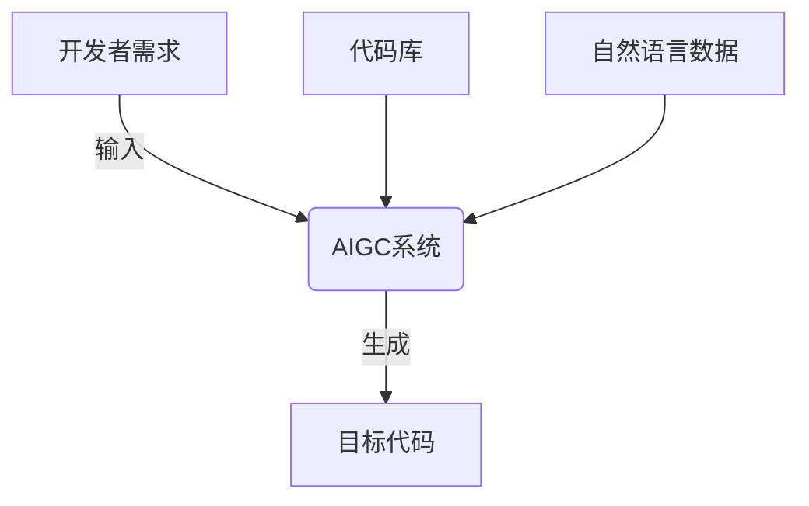
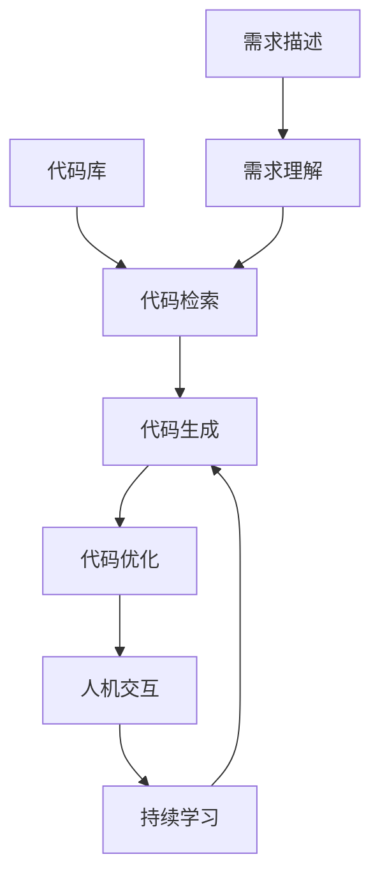

# AIGC代码生成：让AI成为你的编程助手

## 1.背景介绍

随着人工智能技术的不断发展,AI已经渗透到我们生活的方方面面。在软件开发领域,AI也正在发挥着越来越重要的作用。传统的编程方式需要程序员手动编写每一行代码,这种方式不仅耗时耗力,而且容易出错。而AI辅助代码生成(AIGC)技术的出现,为程序员提供了一种全新的编程体验。

AIGC技术可以根据开发者的需求和上下文,自动生成代码片段或完整的程序。这不仅大大提高了开发效率,还能减少人为错误,从而提升代码质量。AIGC技术的核心是基于大型语言模型(LLM)和程序合成技术,通过学习海量的代码库和自然语言数据,AI系统可以理解开发者的意图,并生成相应的代码。

### Mermaid流程图



## 2.核心概念与联系

AIGC技术涉及多个核心概念,包括:

1. **大型语言模型(LLM)**:LLM是一种基于深度学习的自然语言处理模型,可以学习大量文本数据,理解和生成自然语言。常见的LLM包括GPT、BERT等。

2. **程序合成**:将高级需求描述转化为可执行代码的过程。主要包括意图理解、代码生成和代码优化等步骤。

3. **代码理解**:AI系统需要理解代码的语义和上下文,才能生成正确的代码。这需要对编程语言的语法和语义有深入的理解。

4. **多模态学习**:AIGC系统需要同时处理自然语言和代码等多种模态数据,因此需要采用多模态学习技术。

5. **人机协作**:AIGC技术并非完全取代人工编程,而是作为辅助工具,需要与开发者紧密协作。

这些概念相互关联、相辅相成,共同推动了AIGC技术的发展。

## 3.核心算法原理具体操作步骤

AIGC系统的核心算法原理可以概括为以下几个步骤:

1. **需求理解**:首先,AIGC系统需要理解开发者的需求描述。这通常需要将自然语言输入转换为结构化的表示形式,如抽象语法树(AST)等。

2. **代码检索**:在理解需求后,AIGC系统会从海量代码库中检索相关的代码片段,作为生成目标代码的基础。

3. **代码生成**:基于需求表示和检索到的代码片段,AIGC系统会使用LLM和程序合成技术生成初步的目标代码。

4. **代码优化**:生成的初步代码可能存在缺陷或不完整,因此需要进行优化,包括修复bug、完善功能等。

5. **人机交互**:AIGC系统会与开发者进行交互,获取反馈并进一步优化代码,直到满足需求。

6. **持续学习**:AIGC系统会不断从开发者的反馈和新的代码数据中学习,以提高未来的代码生成质量。

### Mermaid流程图



## 4.数学模型和公式详细讲解举例说明

AIGC系统中使用了多种数学模型和公式,其中一些核心模型包括:

1. **Transformer模型**:Transformer是一种常用的序列到序列(Seq2Seq)模型,广泛应用于自然语言处理和代码生成等任务。它采用了自注意力机制,能够更好地捕捉长距离依赖关系。Transformer的核心公式如下:

$$\mathrm{Attention}(Q, K, V) = \mathrm{softmax}(\frac{QK^T}{\sqrt{d_k}})V$$

其中$Q$、$K$、$V$分别表示查询(Query)、键(Key)和值(Value)。$d_k$是缩放因子,用于防止点积过大导致梯度消失。

2. **序列到序列模型**:AIGC系统通常将代码生成任务建模为一个序列到序列的问题,即将需求描述(源序列)转换为目标代码(目标序列)。常用的损失函数是交叉熵损失:

$$\mathcal{L}(\theta) = -\frac{1}{N}\sum_{n=1}^{N}\sum_{t=1}^{T_n}\log P(y_t^n|y_1^{n-1}, x^n; \theta)$$

其中$N$是样本数,$T_n$是第$n$个样本的目标序列长度,$x^n$和$y^n$分别是源序列和目标序列,$\theta$是模型参数。

3. **图神经网络**:为了更好地理解和生成代码,一些AIGC系统采用了图神经网络(GNN)来建模代码的结构信息。GNN在每一层的传播规则如下:

$$h_v^{(k)} = \gamma^{(k)}\left(h_v^{(k-1)}, \square_{u\in\mathcal{N}(v)}\phi^{(k)}(h_v^{(k-1)}, h_u^{(k-1)}, e_{v,u})\right)$$

其中$h_v^{(k)}$是节点$v$在第$k$层的表示,$\mathcal{N}(v)$是$v$的邻居节点集合,$e_{v,u}$是边的特征向量,$\gamma$和$\phi$是可学习的函数。

以上只是AIGC系统中使用的一些典型数学模型和公式,实际应用中还有许多其他模型和技术,如注意力机制、指针网络、树递归神经网络等,用于解决不同的子问题。

## 5.项目实践:代码实例和详细解释说明

为了更好地理解AIGC技术,我们来看一个实际的代码生成示例。假设我们需要开发一个Python函数,用于计算两个日期之间的工作日天数(不包括周末和法定节假日)。我们可以向AIGC系统提供如下需求描述:

```
计算两个给定日期之间的工作日天数,不包括周末和法定节假日。函数接受两个日期字符串作为输入,返回工作日天数。
```

AIGC系统会首先理解这个需求,检索相关的代码片段,然后生成初步代码:

```python
import datetime

def workdays_between(start_date_str, end_date_str):
    start_date = datetime.datetime.strptime(start_date_str, "%Y-%m-%d")
    end_date = datetime.datetime.strptime(end_date_str, "%Y-%m-%d")
    
    # 假设法定节假日列表
    holidays = ['2023-01-01', '2023-05-01', '2023-10-01']
    
    workdays = 0
    current_date = start_date
    while current_date <= end_date:
        if current_date.weekday() < 5 and str(current_date.date()) not in holidays:
            workdays += 1
        current_date += datetime.timedelta(days=1)
    
    return workdays
```

这个初步代码已经实现了基本功能,但可能存在一些缺陷,如:

1. 法定节假日列表是硬编码的,不够灵活。
2. 代码只考虑了当年的节假日,跨年情况下会出错。
3. 代码效率可能不高,特别是对于相距较远的两个日期。

AIGC系统会继续优化代码,直到满足需求:

```python
import datetime
import holidays

def workdays_between(start_date_str, end_date_str):
    start_date = datetime.datetime.strptime(start_date_str, "%Y-%m-%d")
    end_date = datetime.datetime.strptime(end_date_str, "%Y-%m-%d")
    
    # 获取法定节假日列表
    country_holidays = holidays.CountryHolidayCalendar('CN')
    
    workdays = 0
    current_date = start_date
    while current_date <= end_date:
        if current_date.weekday() < 5 and current_date not in country_holidays.holidays(start_date.year, end_date.year):
            workdays += 1
        current_date += datetime.timedelta(days=1)
    
    return workdays
```

优化后的代码:

1. 使用`holidays`库获取法定节假日列表,支持跨年情况。
2. 使用`datetime`和`holidays`库的内置函数,提高代码效率。
3. 代码更加简洁、可读性更好。

通过这个示例,我们可以看到AIGC系统如何与开发者协作,生成高质量的代码。AIGC技术不仅提高了开发效率,还能提升代码质量,减少人为错误。

## 6.实际应用场景

AIGC技术在软件开发领域有着广泛的应用前景,包括但不限于:

1. **代码补全和代码生成**:AIGC系统可以根据开发者的需求和上下文,自动生成代码片段或完整的程序,大大提高开发效率。

2. **代码翻译和迁移**:AIGC技术可以帮助将代码从一种编程语言翻译或迁移到另一种语言,简化代码迁移的过程。

3. **代码优化和重构**:AIGC系统可以分析现有代码,提出优化建议,自动重构代码,提升代码质量和可维护性。

4. **代码文档生成**:基于代码和注释,AIGC系统可以自动生成高质量的代码文档,降低维护成本。

5. **代码搜索和推荐**:AIGC技术可以帮助开发者快速查找和推荐相关的代码片段,提高代码复用率。

6. **智能编程助手**:AIGC系统可以作为智能编程助手,与开发者进行自然语言交互,提供编码建议和解决方案。

7. **教育和培训**:AIGC技术可以用于编程教育和培训,自动生成编程练习和测试用例,提高学习效率。

总的来说,AIGC技术有望彻底改变软件开发的方式,提升开发效率和代码质量,释放程序员的创造力,推动软件行业的创新和发展。

## 7.工具和资源推荐

目前,已经有一些优秀的AIGC工具和资源可供使用,包括:

1. **GitHub Copilot**:由GitHub和OpenAI合作开发的代码生成工具,可以在多种编程语言和IDE中使用。

2. **Tabnine**:一款基于AI的智能代码补全工具,支持多种编程语言和IDE。

3. **Kite**:提供代码补全、代码搜索和文档生成等功能的AI编程助手。

4. **Codex**:OpenAI推出的专门用于代码生成的语言模型,可以生成多种编程语言的代码。

5. **Polycoder**:一个开源的AI编程助手,可以根据自然语言描述生成代码。

6. **DeepCode**:一款基于AI的代码分析和优化工具,可以检测和修复代码缺陷。

7. **Awesome AI Code Generation**:一个关于AIGC工具和资源的精选列表,由开源社区维护。

除了上述工具,还有一些优秀的开源框架和库可用于构建自己的AIGC系统,如Hugging Face的Transformers、OpenAI的GPT-3、Google的T5等。同时,一些公司和研究机构也在积极探索AIGC技术的应用,如Amazon的CodeWhisperer、微软的GPT-InstructTuning等。

## 8.总结:未来发展趋势与挑战

AIGC技术正在快速发展,未来可期的发展趋势包括:

1. **模型能力提升**:随着计算能力和数据量的增加,AIGC模型的性能将不断提高,能够生成更加复杂和高质量的代码。

2. **多模态融合**:AIGC系统将融合自然语言、代码、图像等多种模态数据,实现更加自然和智能的人机交互。

3. **领域适应性增强**:AIGC技术将更好地适应不同的编程语言和应用领域,提供更加专业化的代码生成和优化服务。

4. **安全性和可解释性提高**:AIGC系统将更加注重安全性和可解释性,确保生成的代码安全可靠,并能够解释其决策过程。

5. **人机协作优化**:AIGC技术将与人工智能辅助设计、智能测试等技术{"msg_type":"generate_answer_finish","data":"","from_module":null,"from_unit":null}