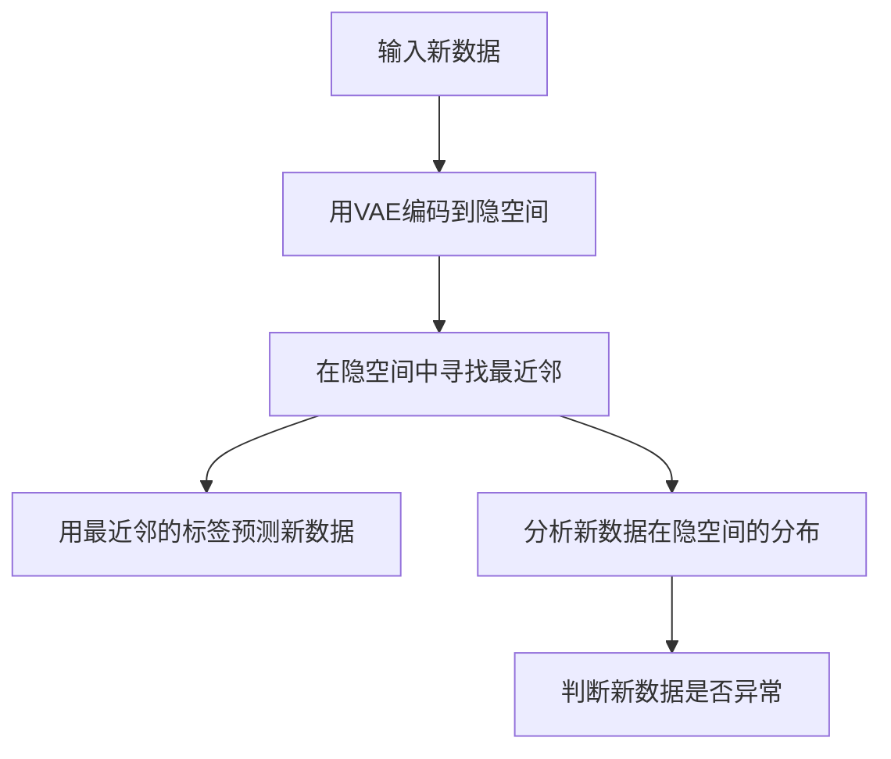

# AI人工智能 Agent：使用无监督学习进行预测

## 1.背景介绍
人工智能(Artificial Intelligence,AI)是计算机科学的一个重要分支,它致力于研究如何让计算机模拟甚至超越人类的智能。而Agent则是人工智能领域的一个重要概念,它指的是能够感知环境并根据环境做出行动的实体。近年来,随着机器学习尤其是深度学习技术的快速发展,使用无监督学习方法来训练智能Agent进行预测的研究越来越受到关注。本文将深入探讨如何利用无监督学习技术来构建预测型AI Agent,分析其核心原理,给出具体算法步骤,并结合代码实例进行详细讲解。

## 2.核心概念与联系
要理解如何构建基于无监督学习的预测型AI Agent,首先需要了解几个核心概念:
### 2.1 AI与Agent
- AI是人工智能的简称,它是计算机科学的一个分支,旨在研究如何让机器表现出智能行为。
- Agent指能够感知环境并根据环境采取行动的实体,可以是机器人、软件程序等。
- AI Agent即具有人工智能能力的Agent,能够利用AI技术感知环境、分析数据、做出决策并采取相应行动。

### 2.2 有监督学习与无监督学习  
- 有监督学习是指使用带标签的训练数据来训练模型,让模型学会对新数据进行分类或预测。如分类、回归等任务。
- 无监督学习是指使用没有标签的数据来训练模型,让模型自己去发现数据中的模式和规律。如聚类、降维、异常检测等。
- 相比有监督学习,无监督学习不需要人工标注数据,因此成本更低,应用范围更广。但训练难度更大,效果也不如有监督学习稳定。

### 2.3 预测与决策
- 预测是指根据历史数据和当前环境,对未来可能发生的情况进行估计和判断的过程。
- 决策是指根据预测结果,权衡利弊得出行动方案的过程。
- 预测是决策的基础,没有准确的预测就无法做出正确的决策。反之,预测结果也需要经过决策推理才能转化为具体行动。

综上,使用无监督学习进行预测的AI Agent,指的是一种能够在没有人工标注数据的情况下,通过分析原始数据获得洞见,对未来情况做出预判,并据此规划行动的智能体。它集成了对环境的感知、对数据的理解、对未来的预判以及对行动的规划等多项AI能力。

## 3.核心算法原理和步骤
基于无监督学习的预测型AI Agent的核心是使用无监督学习算法从数据中自动提取特征和模式,构建预测模型。下面我们以一个具体的算法 - 变分自编码器(Variational Autoencoder,VAE)为例,讲解其原理和步骤。

### 3.1 变分自编码器 VAE 原理
VAE是一种基于深度学习的无监督学习算法,它由编码器(Encoder)和解码器(Decoder)两部分组成:
- 编码器将输入数据 x 映射到一个隐变量 z 的概率分布 q(z|x) 
- 解码器从隐变量分布 p(z) 中采样,并将采样出的隐变量 z 映射为输出数据的概率分布 p(x|z)
- VAE 的目标是最小化输入数据 x 与重构数据 x' 的差异,以及隐变量分布 q(z|x) 与先验分布 p(z) 的KL散度

通过这种编码-解码机制,VAE 可以学习到数据的高维特征,挖掘数据内在的规律性,从而实现数据的降维、去噪、生成等功能。同时,VAE学到的隐空间表征,可以用于对未知数据进行预测。

### 3.2 VAE的训练步骤
VAE的训练主要分为以下几个步骤:
1. 构建编码器和解码器网络。编码器和解码器一般采用对称的结构,如多层感知机或卷积网络。
2. 定义损失函数。VAE的损失函数由两部分组成:重构误差和KL散度。
$$L = -E_{z~q(z|x)}[log p(x|z)] + KL(q(z|x)||p(z))$$
3. 训练模型。使用随机梯度下降等优化算法,最小化损失函数,迭代更新编码器和解码器的参数。
4. 预测推理。使用训练好的编码器将新数据编码到隐空间,再使用解码器将隐变量解码为输出。比较输入和输出的相似度,或者对隐变量进行分析,即可实现对新数据的预测。

### 3.3 基于VAE的预测流程
有了VAE模型,就可以用它来对数据进行预测。基于VAE的预测一般分为以下几个步骤:
1. 使用训练好的VAE模型对新数据进行编码,将其映射到隐空间。
2. 在隐空间中寻找与新数据编码最相似的数据点,作为最近邻数据。
3. 使用最近邻数据的标签或属性,对新数据的标签或属性进行预测。
4. 或者对隐变量的分布进行分析,判断新数据是否异常。

整个预测过程可以用下面的流程图表示:



## 4.数学模型和公式详解
上面介绍了VAE的原理和预测步骤,这里我们再详细推导一下VAE的数学模型和核心公式。

### 4.1 VAE的数学建模
首先我们定义如下符号:
- $X$ 表示 $N$ 个 $D$ 维的数据样本 $\{x^{(1)},\dots,x^{(N)}\}$
- $Z$ 表示隐变量,是 $M$ 维的连续随机变量,服从先验分布 $p(z)$,一般取高斯分布。
- $\theta$ 和 $\phi$ 分别表示编码器 $q_{\phi}(z|x)$ 和解码器 $p_{\theta}(x|z)$ 的参数

VAE假设数据由隐变量生成,并通过以下过程估计隐变量分布和生成模型:
1. 从先验分布 $p(z)$ 中采样隐变量 $z$  
2. 根据 $z$ 和解码器参数 $\theta$,从条件分布 $p_{\theta}(x|z)$ 中采样生成数据 $x$
3. 根据生成的数据 $x$ 和编码器参数 $\phi$,计算后验分布 $q_{\phi}(z|x)$ 
4. 最大化边缘对数似然 $\log p(X)=\sum_{i=1}^N \log p(x^{(i)})$,其中
$$\log p(x^{(i)})=KL(q_{\phi}(z|x^{(i)})||p(z))+\mathcal{L}(\theta,\phi;x^{(i)})$$
5. 由于 $KL$ 项不依赖于 $\theta$,因此最大化 $\log p(X)$ 等价于最大化 $\mathcal{L}$ 

其中, $\mathcal{L}$ 称为变分下界(variational lower bound),由重构误差和KL散度组成:

$$\mathcal{L}(\theta,\phi;x)= \underbrace{-KL(q_{\phi}(z|x)||p(z))}_{\text{KL divergence}} + \underbrace{E_{z \sim q_{\phi}(z|x)} [\log p_{\theta}(x|z)]}_{\text{Reconstruction}}$$

直观地理解,重构项使得解码后的数据接近原始数据,KL散度项使得后验分布接近先验分布,两项的权衡使得模型学习到有意义的隐空间表示。

### 4.2 重参数技巧
为了优化 $\mathcal{L}$,我们需要对编码器 $q_{\phi}(z|x)$ 求梯度。但由于 $z$ 的采样过程不可导,导致梯度无法直接传播。变分自编码器使用了重参数技巧(reparameterization trick)来解决这一问题。

具体做法是,将隐变量 $z$ 表示为确定性函数 $g_{\phi}(\epsilon,x)$ 和噪声变量 $\epsilon$ 的组合:
$$z=g_{\phi}(\epsilon,x)=\mu_{\phi}(x)+\epsilon \odot \sigma_{\phi}(x)$$
其中 $\epsilon \sim \mathcal{N}(0,I), \odot$ 表示点乘。$\mu_{\phi}(x)$ 和 $\sigma_{\phi}(x)$ 是编码网络的输出,分别表示均值和标准差。

这样一来,采样过程 $z \sim q_{\phi}(z|x)$ 可以等价地表示为 $\epsilon \sim p(\epsilon), z=g_{\phi}(\epsilon,x)$。梯度就可以通过 $\epsilon$ 直接传播到 $\phi$ 了。

## 5.代码实践
下面我们用PyTorch实现一个简单的VAE模型,并应用于MNIST手写数字数据集的预测任务。

### 5.1 VAE模型实现

```python
import torch
import torch.nn as nn
import torch.nn.functional as F

class VAE(nn.Module):
    def __init__(self, input_dim, hidden_dim, latent_dim):
        super(VAE, self).__init__()
        
        # 编码器
        self.fc1 = nn.Linear(input_dim, hidden_dim)
        self.fc2_mean = nn.Linear(hidden_dim, latent_dim) 
        self.fc2_logvar = nn.Linear(hidden_dim, latent_dim)
        
        # 解码器
        self.fc3 = nn.Linear(latent_dim, hidden_dim)
        self.fc4 = nn.Linear(hidden_dim, input_dim)
        
    def encode(self, x):
        h = F.relu(self.fc1(x))
        mean = self.fc2_mean(h)
        logvar = self.fc2_logvar(h)
        return mean, logvar
    
    def decode(self, z):
        h = F.relu(self.fc3(z))
        x_recon = torch.sigmoid(self.fc4(h))
        return x_recon
    
    def reparameterize(self, mean, logvar):
        std = torch.exp(0.5*logvar)
        eps = torch.randn_like(std)
        z = mean + eps*std
        return z
        
    def forward(self, x):
        mean, logvar = self.encode(x)
        z = self.reparameterize(mean, logvar)
        x_recon = self.decode(z)
        return x_recon, mean, logvar
```

### 5.2 训练代码

```python
from torchvision import datasets, transforms
from torch.utils.data import DataLoader

# 加载MNIST数据集
train_dataset = datasets.MNIST(root='./data', train=True, transform=transforms.ToTensor(), download=True)
test_dataset = datasets.MNIST(root='./data', train=False, transform=transforms.ToTensor(), download=True)

train_loader = DataLoader(dataset=train_dataset, batch_size=64, shuffle=True)
test_loader = DataLoader(dataset=test_dataset, batch_size=64, shuffle=False)

# 定义损失函数和优化器
def loss_function(x_recon, x, mean, logvar):
    BCE = F.binary_cross_entropy(x_recon, x, reduction='sum')
    KLD = -0.5 * torch.sum(1 + logvar - mean.pow(2) - logvar.exp())
    return BCE + KLD

optimizer = torch.optim.Adam(model.parameters(), lr=1e-3)

# 训练模型
num_epochs = 50
for epoch in range(num_epochs):
    for i, (x, _) in enumerate(train_loader):
        x = x.view(-1, 28*28)
        x_recon, mean, logvar = model(x)
        loss = loss_function(x_recon, x, mean, logvar)
        
        optimizer.zero_grad()
        loss.backward()
        optimizer.step()
        
    print(f'Epoch [{epoch+1}/{num_epochs}], Loss: {loss.item():.4f}')
```

### 5.3 预测代码

```python
def predict(model, x, num_samples=10):
    with torch.no_grad():
        x = x.view(-1, 28*28)
        mean, logvar = model.encode(x)
        z = model.reparameterize(mean, logvar)
        
        z_samples = z.repeat(num_samples, 1)
        x_samples = model.decode(z_samples)
        
        return x_samples.view(-1, 1, 28, 28)

# 随机选取一些测试样本
indices = torch.randperm(len(test_dataset))[:8]