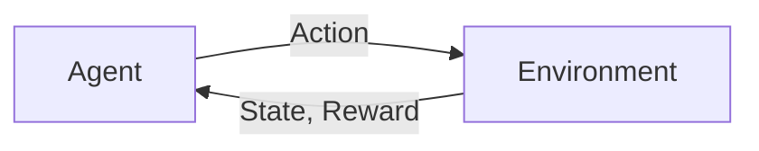

## 1.背景介绍

强化学习作为机器学习的一个重要分支，已经在各种领域取得了显著的成果。从成功击败围棋世界冠军的AlphaGo，到自动驾驶、推荐系统、资源调度等领域的实际应用，强化学习都展现出了其强大的潜力。在这篇文章中，我们将以“AI人工智能Agent：利用强化学习进行决策优化”为主题，深入探讨强化学习的核心原理、算法及其在决策优化中的应用。

## 2.核心概念与联系

强化学习的核心概念包括Agent（智能体）、Environment（环境）、State（状态）、Action（动作）、Reward（奖励）等。Agent通过与Environment进行交互，不断地从Environment获取State和Reward，根据这些信息选择Action，以达到最大化累积Reward的目标。这个过程可以用下图来表示：



在这个过程中，强化学习的目标是找到一种策略（Policy），使得Agent能够在任何State下选择最优的Action，从而最大化累积Reward。这种策略可以用数学公式表示为：$ \pi^*(a|s) = \arg\max_a Q^*(s, a) $，其中$Q^*(s, a)$表示在状态$s$下采取动作$a$能够获得的最大期望回报。

## 3.核心算法原理具体操作步骤

强化学习的核心算法包括Q-Learning、Sarsa、Actor-Critic等。这里我们以Q-Learning为例，介绍其具体的操作步骤。

Q-Learning的核心思想是通过迭代更新Q值（即状态-动作值函数$Q(s, a)$），最终得到最优的Q值，从而得到最优的策略。具体的操作步骤如下：

1. 初始化Q值：对于所有的状态$s$和动作$a$，设置$Q(s, a) = 0$。
2. 对于每一轮迭代：
   1. 选择并执行动作：根据当前的Q值和策略（如ε-greedy策略），选择并执行动作$a$。
   2. 观察结果：观察新的状态$s'$和奖励$r$。
   3. 更新Q值：根据下式更新Q值：
      $ Q(s, a) = Q(s, a) + \alpha [r + \gamma \max_{a'} Q(s', a') - Q(s, a)] $，
      其中，$\alpha$是学习率，$\gamma$是折扣因子。
3. 重复步骤2，直到Q值收敛。

## 4.数学模型和公式详细讲解举例说明

在强化学习中，我们经常使用马尔科夫决策过程（MDP）来描述问题。MDP是一个五元组$(S, A, P, R, \gamma)$，其中：

- $S$是状态空间；
- $A$是动作空间；
- $P$是状态转移概率，$P(s'|s, a)$表示在状态$s$下执行动作$a$后转移到状态$s'$的概率；
- $R$是奖励函数，$R(s, a, s')$表示在状态$s$下执行动作$a$后转移到状态$s'$所获得的奖励；
- $\gamma$是折扣因子，表示未来奖励的折扣程度。

在MDP中，我们的目标是找到一个策略$\pi$，使得从任何初始状态$s$出发，按照策略$\pi$执行动作，能够获得的累积折扣奖励最大。这个目标可以用数学公式表示为：

$$ \max_\pi E_\pi[\sum_{t=0}^{\infty} \gamma^t R(s_t, a_t, s_{t+1}) | s_0 = s] $$

其中，$E_\pi$表示在策略$\pi$下的期望。

## 5.项目实践：代码实例和详细解释说明

在Python中，我们可以使用强化学习库gym来实现Q-Learning。下面是一个简单的例子：

```python
import numpy as np
import gym

# 创建环境
env = gym.make('FrozenLake-v0')

# 初始化Q值
Q = np.zeros([env.observation_space.n, env.action_space.n])

# 设置参数
alpha = 0.5
gamma = 0.95
epsilon = 0.1
n_episodes = 5000

# Q-Learning
for i_episode in range(n_episodes):
    # 初始化状态
    state = env.reset()

    for t in range(100):
        # 选择动作
        if np.random.uniform(0, 1) < epsilon:
            action = env.action_space.sample()
        else:
            action = np.argmax(Q[state, :])

        # 执行动作
        next_state, reward, done, info = env.step(action)

        # 更新Q值
        Q[state, action] = (1 - alpha) * Q[state, action] + \
                            alpha * (reward + gamma * np.max(Q[next_state, :]))

        # 更新状态
        state = next_state

        if done:
            break

# 输出最优策略
print(np.argmax(Q, axis=1))
```

在这段代码中，我们首先创建了一个FrozenLake环境，然后初始化了Q值。在每一轮迭代中，我们根据当前的Q值和ε-greedy策略选择动作，执行动作后观察新的状态和奖励，然后根据Q-Learning的更新公式更新Q值。最后，我们输出了最优的策略，即在每个状态下应选择的动作。

## 6.实际应用场景

强化学习在很多实际应用场景中都有着广泛的应用。例如，在自动驾驶中，我们可以使用强化学习来训练驾驶策略，使得汽车能够在复杂的交通环境中自动驾驶。在推荐系统中，我们可以使用强化学习来优化推荐策略，使得用户能够获得更满意的推荐结果。在资源调度中，我们可以使用强化学习来优化调度策略，使得资源利用率最大化。

## 7.工具和资源推荐

在强化学习的学习和研究中，下面的工具和资源可能会对你有所帮助：

- 强化学习库：gym、Stable Baselines、Ray Rllib等。
- 教材：《强化学习》（Richard S. Sutton和Andrew G. Barto著）。
- 在线课程：Coursera的“强化学习专项课程”、Udacity的“深度学习纳米学位”等。

## 8.总结：未来发展趋势与挑战

强化学习作为人工智能的重要研究方向，其在未来的发展趋势和挑战主要包括以下几点：

- 算法的提升：当前的强化学习算法还存在许多问题，如样本效率低、稳定性差等。如何提升算法的性能将是未来的重要研究方向。
- 实际应用的扩展：虽然强化学习在一些领域已经取得了显著的成果，但在许多实际应用中还面临着许多挑战，如环境建模困难、奖励设计复杂等。如何将强化学习应用到更多的实际问题中，将是未来的重要研究方向。
- 理论的深化：虽然强化学习已经有了一套完备的理论框架，但在许多问题上还存在许多未知的地方，如如何理解和设计深度强化学习的内部机制等。深化理论研究将是未来的重要研究方向。

## 9.附录：常见问题与解答

1. 问题：强化学习和监督学习有什么区别？
   答：强化学习和监督学习的主要区别在于，强化学习是通过与环境的交互来学习最优策略，而监督学习是通过学习输入和输出的对应关系来进行预测。

2. 问题：强化学习的主要挑战是什么？
   答：强化学习的主要挑战包括样本效率低、稳定性差、奖励设计困难、环境建模复杂等。

3. 问题：如何选择强化学习的算法？
   答：选择强化学习的算法需要考虑问题的特性，如状态和动作的维度、环境的确定性和连续性、奖励的稀疏性等。同时，也需要考虑算法的性能，如样本效率、稳定性、易用性等。

作者：禅与计算机程序设计艺术 / Zen and the Art of Computer Programming