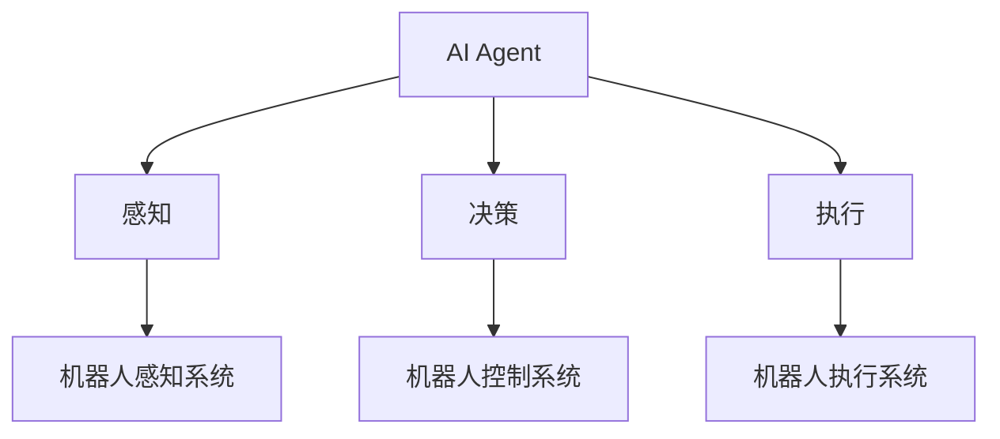

# AI人工智能 Agent：在机器人领域的应用

## 1. 背景介绍

人工智能（Artificial Intelligence，AI）是计算机科学的一个重要分支，旨在研究和开发能够模拟、延伸和扩展人类智能的理论、方法、技术及应用系统。AI Agent 作为人工智能的一个重要概念，在机器人领域有着广泛的应用前景。

### 1.1 人工智能的发展历程

#### 1.1.1 人工智能的起源与发展
人工智能的概念最早由约翰·麦卡锡（John McCarthy）等科学家在1956年的达特茅斯会议上提出。此后，人工智能经历了几次起起伏伏的发展历程，包括早期的符号主义、专家系统，以及近年来的机器学习和深度学习。

#### 1.1.2 人工智能的主要分支
人工智能主要包括机器学习、自然语言处理、计算机视觉、语音识别、知识表示与推理等分支。其中，机器学习是实现人工智能的核心技术，它使计算机能够从数据中自动学习和改进，而无需显式编程。

### 1.2 AI Agent 的概念与特点

#### 1.2.1 AI Agent 的定义
AI Agent 是一种能够感知环境并采取行动以实现特定目标的自主实体。它可以是软件程序，也可以是具有物理实体的机器人。AI Agent 具有感知、推理、决策和执行的能力。

#### 1.2.2 AI Agent 的特点
- 自主性：能够独立地感知环境并做出决策和行动。
- 交互性：能够与环境、人类或其他 Agent 进行交互。
- 适应性：能够根据环境的变化调整自己的行为。
- 目标导向：具有明确的目标，并能够采取行动以实现目标。

### 1.3 机器人领域的发展现状

#### 1.3.1 机器人的分类与应用
机器人可分为工业机器人、服务机器人、特种机器人等类型。它们在制造业、医疗、家庭服务、军事、航天等领域有着广泛的应用。

#### 1.3.2 机器人与人工智能的结合
随着人工智能技术的发展，特别是机器学习和深度学习的进步，机器人正变得越来越智能。将人工智能与机器人结合，可以使机器人具备更强的感知、决策和执行能力，从而更好地完成复杂任务。

## 2. 核心概念与联系

### 2.1 AI Agent 的组成要素

#### 2.1.1 感知模块
感知模块使 Agent 能够获取环境信息，包括视觉、听觉、触觉等感知信息。在机器人中，常见的感知设备有摄像头、麦克风、激光雷达、力传感器等。

#### 2.1.2 决策模块
决策模块是 Agent 的"大脑"，负责根据感知信息和既定目标做出决策。常用的决策方法包括基于规则的推理、搜索算法、强化学习等。

#### 2.1.3 执行模块
执行模块负责将决策转化为具体的行动。在机器人中，执行模块通常包括电机、驱动器、机械臂等执行器件。

### 2.2 机器人系统的架构

#### 2.2.1 分层架构
分层架构将机器人系统分为感知、规划、执行等不同的层次，每个层次负责不同的功能。这种架构的优点是模块化程度高，易于开发和维护。

#### 2.2.2 混合架构
混合架构结合了反应式和审议式两种模式。反应式模式能够快速响应环境变化，而审议式模式则能够进行长期规划和推理。混合架构兼具了两者的优点。

### 2.3 AI Agent 与机器人的关系



AI Agent 是机器人的"大脑"，负责感知、决策和执行。机器人则是 AI Agent 的"身体"，提供感知、执行等物理能力。两者相互依存，共同构成了智能机器人系统。

## 3. 核心算法原理具体操作步骤

### 3.1 基于规则的推理

#### 3.1.1 规则表示
规则通常以"IF-THEN"的形式表示，例如"IF 前方有障碍物 THEN 避障"。规则可以手工编写，也可以通过机器学习自动获取。

#### 3.1.2 推理过程
推理过程是将规则应用于当前状态，得出相应的结论或行动。常见的推理方法有正向推理和反向推理。

### 3.2 搜索算法

#### 3.2.1 状态空间搜索
状态空间搜索将问题表示为一个状态空间，然后在状态空间中搜索从初始状态到目标状态的路径。常用的搜索算法有广度优先搜索、深度优先搜索、A*搜索等。

#### 3.2.2 启发式搜索
启发式搜索引入了启发函数，用于评估每个状态到目标状态的距离，从而指导搜索朝着更有希望的方向进行。这可以提高搜索效率。

### 3.3 强化学习

#### 3.3.1 马尔可夫决策过程
强化学习问题通常被建模为马尔可夫决策过程（MDP），包括状态、行动、转移概率和奖励函数。目标是学习一个最优策略，使累积奖励最大化。

#### 3.3.2 Q-learning
Q-learning 是一种常用的强化学习算法，它通过更新状态-行动值函数（Q函数）来学习最优策略。Q函数表示在某个状态下采取某个行动的长期累积奖励。

#### 3.3.3 深度强化学习
深度强化学习将深度学习与强化学习相结合，使用深度神经网络来近似Q函数或策略函数。这使得强化学习能够处理高维、连续的状态和行动空间。

## 4. 数学模型和公式详细讲解举例说明

### 4.1 马尔可夫决策过程

马尔可夫决策过程可以用一个五元组 $\langle S, A, P, R, \gamma \rangle$ 来表示：

- $S$：状态集合
- $A$：行动集合
- $P$：转移概率，$P(s'|s,a)$ 表示在状态 $s$ 下采取行动 $a$ 后转移到状态 $s'$ 的概率
- $R$：奖励函数，$R(s,a)$ 表示在状态 $s$ 下采取行动 $a$ 获得的即时奖励
- $\gamma$：折扣因子，$\gamma \in [0,1]$，用于衡量未来奖励的重要性

求解MDP的目标是找到一个最优策略 $\pi^*$，使得从任意初始状态出发，采取该策略能够获得最大的期望累积奖励：

$$\pi^* = \arg\max_\pi \mathbb{E}\left[\sum_{t=0}^{\infty} \gamma^t R(s_t,\pi(s_t))\right]$$

其中，$s_t$ 表示在时刻 $t$ 的状态，$\pi(s_t)$ 表示在状态 $s_t$ 下采取的行动。

### 4.2 Q-learning

Q-learning 的核心是状态-行动值函数（Q函数），定义为：

$$Q(s,a) = \mathbb{E}\left[\sum_{t=0}^{\infty} \gamma^t R(s_t,a_t) | s_0=s, a_0=a\right]$$

Q函数表示在状态 $s$ 下采取行动 $a$，然后遵循最优策略所获得的期望累积奖励。

Q-learning 通过以下迭代更新规则来学习Q函数：

$$Q(s,a) \leftarrow Q(s,a) + \alpha \left[R(s,a) + \gamma \max_{a'} Q(s',a') - Q(s,a)\right]$$

其中，$\alpha$ 是学习率，$s'$ 是在状态 $s$ 下采取行动 $a$ 后转移到的新状态。

一旦学习到最优的Q函数 $Q^*$，最优策略可以通过在每个状态下选择具有最大Q值的行动来获得：

$$\pi^*(s) = \arg\max_a Q^*(s,a)$$

### 4.3 深度Q网络（DQN）

在状态和行动空间较大时，直接存储Q函数表变得不现实。深度Q网络（DQN）使用深度神经网络 $Q(s,a;\theta)$ 来近似Q函数，其中 $\theta$ 是网络的参数。

DQN的损失函数定义为：

$$L(\theta) = \mathbb{E}_{s,a,r,s'}\left[\left(r + \gamma \max_{a'} Q(s',a';\theta^-) - Q(s,a;\theta)\right)^2\right]$$

其中，$\theta^-$ 是目标网络的参数，用于计算目标Q值，以提高训练稳定性。

DQN的训练过程通常使用经验回放（Experience Replay）和ε-贪心探索（ε-Greedy Exploration）来进行。经验回放将转移样本 $(s,a,r,s')$ 存储在回放缓冲区中，并从中随机抽取小批量样本进行训练，以打破样本之间的相关性。ε-贪心探索则在探索和利用之间进行权衡，以避免过早收敛到次优策略。

## 5. 项目实践：代码实例和详细解释说明

下面是一个使用PyTorch实现DQN的简单示例，用于解决经典的CartPole问题：

```python
import gym
import math
import random
import numpy as np
import matplotlib.pyplot as plt
from collections import namedtuple, deque

import torch
import torch.nn as nn
import torch.optim as optim
import torch.nn.functional as F

# 超参数
BATCH_SIZE = 128
GAMMA = 0.99
EPS_START = 0.9
EPS_END = 0.05
EPS_DECAY = 200
TARGET_UPDATE = 10

# 定义转移元组和回放缓冲区
Transition = namedtuple('Transition', ('state', 'action', 'next_state', 'reward'))

class ReplayMemory(object):
    def __init__(self, capacity):
        self.memory = deque([], maxlen=capacity)

    def push(self, *args):
        self.memory.append(Transition(*args))

    def sample(self, batch_size):
        return random.sample(self.memory, batch_size)

    def __len__(self):
        return len(self.memory)

# 定义DQN网络
class DQN(nn.Module):
    def __init__(self, h, w, outputs):
        super(DQN, self).__init__()
        self.conv1 = nn.Conv2d(3, 16, kernel_size=5, stride=2)
        self.bn1 = nn.BatchNorm2d(16)
        self.conv2 = nn.Conv2d(16, 32, kernel_size=5, stride=2)
        self.bn2 = nn.BatchNorm2d(32)
        self.conv3 = nn.Conv2d(32, 32, kernel_size=5, stride=2)
        self.bn3 = nn.BatchNorm2d(32)

        def conv2d_size_out(size, kernel_size = 5, stride = 2):
            return (size - (kernel_size - 1) - 1) // stride + 1
        convw = conv2d_size_out(conv2d_size_out(conv2d_size_out(w)))
        convh = conv2d_size_out(conv2d_size_out(conv2d_size_out(h)))
        linear_input_size = convw * convh * 32
        self.head = nn.Linear(linear_input_size, outputs)

    def forward(self, x):
        x = x.to(device)
        x = F.relu(self.bn1(self.conv1(x)))
        x = F.relu(self.bn2(self.conv2(x)))
        x = F.relu(self.bn3(self.conv3(x)))
        return self.head(x.view(x.size(0), -1))

# 训练函数
def optimize_model():
    if len(memory) < BATCH_SIZE:
        return
    transitions = memory.sample(BATCH_SIZE)
    batch = Transition(*zip(*transitions))

    non_final_mask = torch.tensor(tuple(map(lambda s: s is not None, batch.next_state)), device=device, dtype=torch.bool)
    non_final_next_states = torch.cat([s for s in batch.next_state if s is not None])

    state_batch = torch.cat(batch.state)
    action_batch = torch.cat(batch.action)
    reward_batch = torch.cat(batch.reward)

    state_action_values = policy_net(state_batch).gather(1, action_batch)

    next_state_values = torch.zeros(BATCH_SIZE, device=device)
    next_state_values[non_final_mask] =