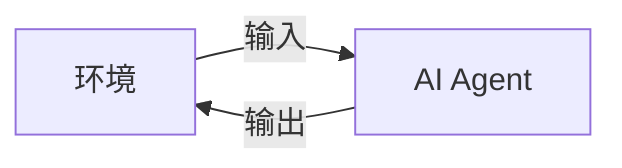
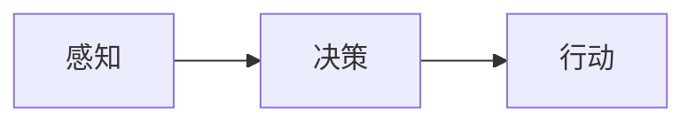

## 1.背景介绍

在21世纪的今天，人工智能(AI)已经成为我们生活中无处不在的一部分。从智能手机，自动驾驶汽车，到智能家居系统，AI的应用已经深入到我们生活的各个领域。而在这个大背景下，AI Agent作为AI的重要组成部分，其对人类思维方式的影响也越来越明显。

## 2.核心概念与联系

AI Agent，即人工智能代理，是一个能够感知环境并采取行动以实现某种目标的系统。在这个系统中，AI Agent通过接收环境的输入，然后通过内部的决策机制产生输出，以此来影响环境。



这个过程可以看作是一个决策过程，AI Agent需要根据当前的环境状态和自身的目标，来决定采取何种行动。这个过程在很大程度上模拟了人类的思维过程，人们也常常把AI Agent看作是一种模拟人类思维的工具。

## 3.核心算法原理具体操作步骤

AI Agent的核心算法原理主要包括感知-决策-行动这三个步骤：

1. 感知：AI Agent通过感知器接收环境的输入，这些输入可以是图像、声音、文本等各种形式的数据。
2. 决策：AI Agent通过内部的决策机制，根据当前的环境状态和自身的目标，来决定采取何种行动。这个决策机制通常是基于一些机器学习算法，如深度学习、强化学习等。
3. 行动：AI Agent通过执行器执行决定的行动，这些行动会影响到环境，从而实现AI Agent的目标。



## 4.数学模型和公式详细讲解举例说明

在AI Agent的决策过程中，通常会用到一些数学模型和公式。例如，在强化学习中，我们常常使用Q-learning算法来让AI Agent学习如何做出决策。Q-learning算法的核心就是一个叫做Q值的概念，这个Q值表示AI Agent在某个状态下采取某个行动的预期回报。

Q值的更新公式如下：

$$
Q(s,a) \leftarrow Q(s,a) + \alpha [r + \gamma \max_{a'} Q(s',a') - Q(s,a)]
$$

其中，$s$表示当前状态，$a$表示当前行动，$r$表示当前回报，$s'$表示下一个状态，$a'$表示下一个行动，$\alpha$是学习率，$\gamma$是折扣因子。

## 5.项目实践：代码实例和详细解释说明

下面我们来看一个简单的例子，这个例子中我们将使用Q-learning算法来训练一个AI Agent玩Flappy Bird游戏。

首先，我们需要定义AI Agent的状态和行动。在这个例子中，我们可以把AI Agent的状态定义为当前的游戏画面，行动则可以定义为跳跃或者不跳跃。

然后，我们可以使用以下的代码来实现Q-learning算法：

```python
class QLearningAgent:
    def __init__(self, alpha=0.5, gamma=0.9, action_space=None):
        self.alpha = alpha
        self.gamma = gamma
        self.action_space = action_space
        self.Q = {}

    def get_Q(self, state, action):
        return self.Q.get((state, action), 0.0)

    def update_Q(self, state, action, reward, next_state):
        max_q_next = max([self.get_Q(next_state, a) for a in self.action_space])
        self.Q[(state, action)] = self.get_Q(state, action) + \
            self.alpha * (reward + self.gamma * max_q_next - self.get_Q(state, action))

    def choose_action(self, state):
        if np.random.uniform(0, 1) < self.epsilon:
            return np.random.choice(self.action_space)
        else:
            return max([(self.get_Q(state, action), action) for action in self.action_space])[1]
```

在这个代码中，`get_Q`函数用于获取Q值，`update_Q`函数用于更新Q值，`choose_action`函数用于选择行动。

## 6.实际应用场景

AI Agent的应用场景非常广泛，从游戏，自动驾驶，到智能家居，都可以看到AI Agent的身影。而且，随着AI技术的发展，AI Agent的应用场景还在不断扩大。

## 7.工具和资源推荐

如果你对AI Agent感兴趣，下面这些工具和资源可能会对你有所帮助：

- OpenAI Gym：一个用于开发和比较强化学习算法的工具包。
- TensorFlow：一个用于机器学习和深度学习的开源库。
- PyTorch：另一个用于机器学习和深度学习的开源库。

## 8.总结：未来发展趋势与挑战

AI Agent作为AI的重要组成部分，其在未来的发展趋势非常明显。随着AI技术的发展，AI Agent的能力也在不断提升，它们能够处理的任务也越来越复杂。然而，这也带来了一些挑战，如如何保证AI Agent的行为符合人类的价值观，如何避免AI Agent的误操作等。

## 9.附录：常见问题与解答

Q: AI Agent和人工智能有什么区别？

A: AI Agent是人工智能的一部分，它是一个能够感知环境并采取行动以实现某种目标的系统。

Q: AI Agent如何做决策？

A: AI Agent的决策通常是基于一些机器学习算法，如深度学习、强化学习等。

Q: AI Agent有哪些应用场景？

A: AI Agent的应用场景非常广泛，从游戏，自动驾驶，到智能家居，都可以看到AI Agent的身影。

Q: AI Agent的未来发展趋势是什么？

A: 随着AI技术的发展，AI Agent的能力也在不断提升，它们能够处理的任务也越来越复杂。

作者：禅与计算机程序设计艺术 / Zen and the Art of Computer Programming