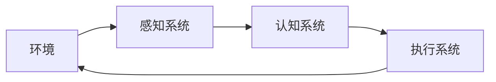

# AI人工智能 Agent：对国家安全的影响

## 1.背景介绍

### 1.1 人工智能发展概况

人工智能(Artificial Intelligence,AI)是当代科技发展的前沿领域,近年来取得了长足进步。AI系统通过机器学习算法从大量数据中自主学习,能够模拟人类的认知功能,进行推理、规划、决策等高级任务。AI技术广泛应用于计算机视觉、自然语言处理、决策支持等领域,为各行业带来了革命性变革。

### 1.2 AI Agent概念

AI Agent是具备一定自主性的智能体系统,能够感知环境、分析信息、制定计划并采取行动以实现既定目标。AI Agent通常由感知系统、认知系统和执行系统组成,可根据环境变化做出合理反应。常见的AI Agent包括智能助理、机器人、游戏AI等。

### 1.3 国家安全与AI

国家安全是一个国家维护其主权、统一、领土完整和政治制度安全的能力。AI技术的快速发展对国家安全构成了新的挑战和机遇。一方面,AI可被用于制造高精尖武器、发动网络攻击等,威胁国家安全;另一方面,AI也可应用于情报分析、监控预警等领域,增强国防实力。

## 2.核心概念与联系  

### 2.1 AI Agent架构

AI Agent通常由以下三个核心部分组成:

1. **感知系统(Sensors)**: 用于获取环境信息,如视觉、听觉、触觉等传感器。

2. **认知系统(Mind)**: 包括知识库、推理引擎等,用于分析感知数据、制定计划。

3. **执行系统(Actuators)**: 根据认知系统的决策,通过执行器(如机械臂)对环境产生影响。



### 2.2 AI Agent与国家安全

AI Agent可在以下领域影响国家安全:

- **军事领域**: 智能无人机、自主武器系统等,提高战争效率但也带来新威胁。
- **网络安全**: AI可用于发现漏洞、检测入侵,但也可发动智能网络攻击。  
- **情报分析**: AI辅助分析大数据,提高情报分析和预测的准确性。
- **基础设施**: AI可优化基础设施运营,但也可被攻击者利用破坏系统。

## 3.核心算法原理具体操作步骤

### 3.1 机器学习算法

AI Agent的认知系统通常基于机器学习算法,从数据中自主学习知识模型。常用算法包括:

1. **监督学习**: 利用标注数据训练模型,如分类、回归等。
2. **无监督学习**: 在无标注数据的情况下发现数据内在模式,如聚类分析。
3. **强化学习**: 通过与环境交互并获得反馈,不断优化决策策略。
4. **迁移学习**: 将已学习的知识应用于新的相关任务,提高学习效率。

### 3.2 规划算法

AI Agent需要制定行动计划以实现目标,常用的规划算法包括:

1. **启发式搜索算法**: 如A*算法,通过评估函数有针对性地搜索解空间。

2. **时序规划算法**: 如STRIPS算法,生成满足约束条件和目标的行动序列。

3. **层次化任务网络规划**: 将复杂任务分解为子任务,分层次规划和执行。

### 3.3 决策算法

AI Agent需要根据环境状态和目标做出决策,主要算法有:

1. **期望最大化**: 计算各行为的期望回报,选择最优行为。
2. **多臂老虎机算法**: 在探索(尝试新行为)和利用(选择已知最优行为)之间权衡。  
3. **马尔可夫决策过程**: 建模环境转移概率,求解最优决策序列。

## 4.数学模型和公式详细讲解举例说明

### 4.1 马尔可夫决策过程(MDP)

马尔可夫决策过程是AI Agent决策的重要数学模型,由以下5个要素组成:

- $\mathcal{S}$: 有限状态集合
- $\mathcal{A}$: 有限行为集合 
- $P(s'|s,a)$: 转移概率,表示在状态$s$执行行为$a$后,转移到状态$s'$的概率
- $R(s,a)$: 即时奖励函数,表示在状态$s$执行行为$a$获得的奖励
- $\gamma \in [0,1]$: 折现因子,权衡即时奖励和长期收益

MDP的目标是找到一个策略$\pi: \mathcal{S} \rightarrow \mathcal{A}$,使得期望总奖励最大:

$$\max_\pi \mathbb{E}\left[\sum_{t=0}^\infty \gamma^t R(s_t, \pi(s_t))\right]$$

可以通过价值迭代等算法求解最优策略。

### 4.2 Q-Learning算法

Q-Learning是一种常用的基于强化学习的MDP求解算法,不需要事先知道MDP的转移概率和奖励函数。

算法维护一个Q函数$Q(s,a)$,表示在状态$s$执行行为$a$后的期望总奖励。每次与环境交互后,更新Q函数:

$$Q(s_t,a_t) \leftarrow Q(s_t,a_t) + \alpha \left[r_t + \gamma \max_{a'}Q(s_{t+1},a') - Q(s_t,a_t)\right]$$

其中$\alpha$是学习率。通过不断探索和利用,Q函数将收敛到最优值函数。

Q-Learning广泛应用于机器人控制、游戏AI等领域。通过调整奖励函数,可将AI Agent引导至期望的行为策略。

## 5.项目实践:代码实例和详细解释说明  

下面是一个简单的Q-Learning算法实现,用于训练一个AI Agent在格子世界(GridWorld)环境中找到目标位置。

```python
import numpy as np

# 格子世界环境
class GridWorld:
    def __init__(self, grid):
        self.grid = grid
        self.agent = (0, 0)  # 初始位置
        self.target = (3, 3) # 目标位置
        
    def step(self, action):
        # 执行动作,返回新状态、奖励、是否终止
        ...

# Q-Learning算法        
class QLearner:
    def __init__(self, env, lr, gamma, epsilon):
        self.env = env
        self.q = {}  # Q函数,key为(状态,行为)对
        self.lr = lr # 学习率
        self.gamma = gamma # 折现因子
        self.epsilon = epsilon # 探索率
        
    def get_action(self, state):
        # 根据当前Q函数,选择行为
        ...
        
    def learn(self, epochs):
        for epoch in range(epochs):
            state = self.env.reset()
            done = False
            while not done:
                action = self.get_action(state)
                next_state, reward, done = self.env.step(action)
                # 更新Q函数
                key = (state, action)
                next_max_q = max([self.q.get((next_state, a), 0) for a in self.env.actions])
                self.q[key] = self.q.get(key, 0) + self.lr * (reward + self.gamma * next_max_q - self.q.get(key, 0))
                state = next_state
                
# 创建环境和Q-Learning Agent
grid = np.array([[0, 0, 0, 0],
                 [0, 1, 1, 0], 
                 [0, 1, 0, 0],
                 [0, 0, 0, 0]])
env = GridWorld(grid)
agent = QLearner(env, lr=0.1, gamma=0.9, epsilon=0.1)

# 训练Agent
agent.learn(epochs=1000)

# 查看最终策略
for state in env.states:
    actions = [agent.q.get((state, a), 0) for a in env.actions]
    print(f"{state}: {[round(q, 2) for q in actions]}")
```

上述代码首先定义了GridWorld环境类,其中包含一个二维网格,代表Agent的初始位置和目标位置。step()方法用于执行动作并返回下一个状态、奖励和是否终止的信息。

QLearner类实现了Q-Learning算法,包括:

1. get_action(): 根据当前Q函数和探索策略选择行为。
2. learn(): 进行训练,通过与环境交互并更新Q函数。

经过一定次数的训练后,Agent将学习到一个近似最优的Q函数,可用于指导在任意状态下选择最佳行为。

## 6.实际应用场景

AI Agent技术在诸多领域有着广泛的应用前景:

1. **军事领域**: 无人机、自主武器系统等,提高作战效率、保护人员生命。
2. **网络安全**: 入侵检测、漏洞扫描、蜜罐等,提高网络防御能力。
3. **智能交通**: 自动驾驶、交通管控等,提高交通效率、减少事故。
4. **智能制造**: 机器人控制、工艺优化等,提高生产效率和质量。
5. **智能家居**: 智能助理、家电控制等,提供个性化服务。
6. **医疗健康**: 诊断辅助、药物研发等,提高医疗水平。
7. **游戏AI**: 提供更有挑战性的对手,增强游戏体验。

## 7.工具和资源推荐

AI Agent开发需要综合运用多种工具和资源:

1. **AI开发框架**: TensorFlow、PyTorch、Scikit-Learn等主流框架。
2. **规划工具**: PDDL、FastDownward等经典规划工具。
3. **模拟器**: Gazebo、AirSim等机器人模拟环境。
4. **游戏环境**: OpenAI Gym、Malmo等游戏AI开发平台。
5. **数据集**: ImageNet、SQuAD等公开数据集。
6. **云平台**: AWS、Azure等提供GPU加速的云计算资源。
7. **开源项目**: ROS、OpenCV等知名开源项目。

## 8.总结:未来发展趋势与挑战

### 8.1 发展趋势

AI Agent技术仍在快速发展中,未来可期的趋势包括:

1. **更强大的学习能力**: 利用更大规模的数据和算力,训练出更强大的AI模型。
2. **多模态交互**: 融合视觉、语音等多种模态,实现自然的人机交互。
3. **自主学习**: AI系统能够自主获取数据并持续学习,不断提升能力。
4. **可解释AI**: 提高AI系统决策的透明度和可解释性。
5. **AI安全**: 加强AI系统的鲁棒性,防范对抗性攻击。

### 8.2 挑战与风险

与此同时,AI Agent技术也面临一些重大挑战和潜在风险:

1. **技术鸿沟**: AI能力的快速提升可能加剧不同国家、地区的技术差距。
2. **就业影响**: AI自动化可能导致部分工种被替代,引发就业结构变革。
3. **算力需求**: 训练大型AI模型需要巨大的算力和能耗,对环境造成压力。
4. **隐私与伦理**: AI系统可能侵犯个人隐私,存在潜在的伦理风险。
5. **技术垄断**: AI技术可能被少数大公司和国家垄断,威胁公平竞争。
6. **安全风险**: AI武器等可能被滥用,危及国家安全和人类生存。

## 9.附录:常见问题与解答

1. **AI Agent如何确保行为符合伦理道德?**

   可以在AI Agent的奖励函数中融入伦理价值观,引导其做出符合道德的决策。同时应加强对AI系统的监管,防止被滥用。

2. **AI系统如何防范对抗性攻击?**

   可以采用对抗性训练、数据增广等方法提高AI系统的鲁棒性。同时需要加强AI系统安全性,防止被黑客入侵控制。

3. **AI技术会不会导致大规模失业?**

   AI自动化确实可能导致部分工种被替代,但同时也会催生新的就业机会。关键是要加强职业培训,帮助劳动者顺利转型。

4. **如何防止AI技术被垄断?**

   应加强国际合作,推动AI技术的开放共享。同时要加大反垄断执法力度,防止出现AI技术垄断。

5. **AI武器会不会失控危及人类?**

   AI武器系{"msg_type":"generate_answer_finish","data":"","from_module":null,"from_unit":null}